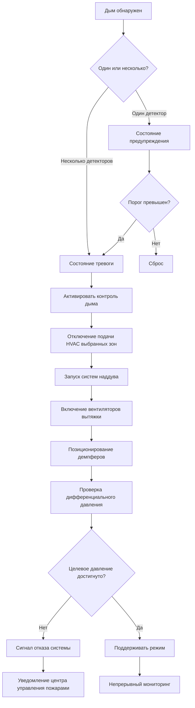
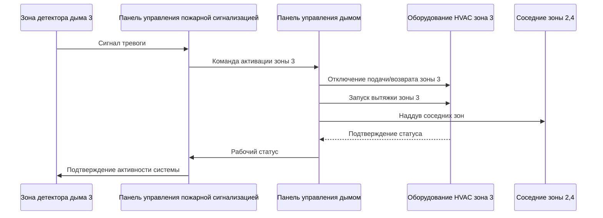

## Интеграция системы обнаружения

Активация системы контроля дыма зависит от быстрого и надежного обнаружения, интегрированного с пожарной сигнализацией и системами управления зданием. Устройства обнаружения должны соответствовать требованиям NFPA 72 и обеспечивать информацию, специфичную для зоны, чтобы обеспечить надлежащие реакции контроля дыма в соответствии с NFPA 92.

### Технологии обнаружения

**Точечные дымовые детекторы:**
- Фотоэлектрические или ионизационные датчики
- Расстояние: 9 м (30 ft) типовое в соответствии с NFPA 72
- Время отклика: 20-60 секунд при 4% затемнения/м
- Применение: Стандартные высоты потолков до 9 м (30 ft)

**Линейные детекторы инфракрасного луча:**
- Обнаружение прерывания инфракрасного луча
- Расстояние: До 30 м (100 ft) длина луча
- Время отклика: 10-30 секунд при 1,5-3% затемнения/м
- Применение: Высокие потолки, атриумы, склады
- Монтаж: Стены или колонны с чистой линией видимости

**Аспирационное обнаружение дыма (ASD):**
- Непрерывное отбор проб воздуха через сеть труб
- Чувствительность: 0,005-2% затемнения/м
- Время отклика: 15-120 секунд в зависимости от времени транспортировки
- Применение: Критические зоны, требующие раннего предупреждения
- Охват: 186-372 м² на точку отбора

Время транспортировки воздуха в аспирационных системах влияет на общий отклик:

$$
t_{total} = t_{detect} + t_{transport} = t_{detect} + \frac{L \cdot A}{Q}
$$

Где:
- $t_{total}$ = общее время отклика (с)
- $t_{detect}$ = время отклика элемента детектора (с)
- $t_{transport}$ = время транспортировки воздуха через трубу отбора проб (с)
- $L$ = длина трубы от точки отбора к детектору (м)
- $A$ = площадь поперечного сечения трубы (м²)
- $Q$ = скорость отбора воздуха (м³/ч)

## Проектирование последовательности активации

### Многоступенчатая логика активации

Системы контроля дыма применяют поэтапную активацию для предотвращения ложных тревог при обеспечении быстрого отклика:

| Этап | Триггер | Действие | Время |
|------|---------|---------|-------|
| Предупреждение | Один детектор 50% порога | Уведомление мониторинга | Немедленно |
| Тревога | Один детектор 100% или два детектора 50% | Инициирование последовательности контроля дыма | <10 секунд |
| Полная активация | Подтвержденный пожар или ручная активация | Все режимы контроля дыма активны | <30 секунд |
| После подавления | После срабатывания спринклера или ручной | Усиленный режим вытяжки | Постоянный |

### Диаграмма потока последовательности

### Требования к времени активации

Общее время активации системы от обнаружения до полного рабочего режима должно соответствовать задачам производительности NFPA 92:

$$
t_{activation} = t_{detect} + t_{processing} + t_{equipment}
$$

Где:
- $t_{detect}$ = время отклика обнаружения дыма (обычно 20-60 с)
- $t_{processing}$ = обработка логики управления и передача сигнала (обычно 3-10 с)
- $t_{equipment}$ = запуск механического оборудования и позиционирование (обычно 15-45 с)

Целевое общее время активации: максимум 60-90 секунд для полной рабочей мощности.

### Стратегия зонированной активации

## Интеграция с системой пожарной сигнализации

### Требования интерфейса

Система контроля дыма должна получать дискретные сигналы от панели управления пожарной сигнализацией (FACP) в соответствии с NFPA 72:

- **Идентификация зоны:** Уникальный сигнал для каждой зоны дыма
- **Тип детектора:** Различение между дымом, теплом и ручными станциями
- **Надежность сигнала:** Контролируемые цепи с концевыми резисторами
- **Источник питания:** Вторичный источник питания для минимум 24-часовой работы
- **Двусторонняя связь:** Обратная связь статуса от контроля дыма к FACP

### Архитектура панели управления

| Компонент | Функция | Избыточность |
|-----------|---------|--------------|
| Первичный контроллер | Выполнение логики контроля дыма | Горячее резервное копирование |
| Модули входа зоны | Получение сигналов FACP | Двойные входные цепи |
| Модули выхода оборудования | Управление вентиляторами, демпферами | Отказоустойчивое позиционирование |
| Датчики дифференциального давления | Мониторинг производительности | Несколько на зону |
| Панель индикации | Отображение статуса системы | Резервные дисплеи |

## Принципы отказоустойчивого проектирования

### Анализ режимов отказа

Все компоненты должны переходить в безопасное положение при отключении питания или отказе управления:

**Демпферы:**
- Демпферы вытяжки дыма: Отказ ОТКРЫТ
- Демпферы подачи воздуха в зону пожара: Отказ ЗАКРЫТ
- Демпферы подачи наддува: Отказ ОТКРЫТ (если обслуживают зоны убежища)
- Демпферы возврата воздуха из зоны пожара: Отказ ЗАКРЫТ

**Вентиляторы:**
- Вентиляторы вытяжки: Отказ ВКЛЮЧЕН (с аварийным питанием)
- Вентиляторы подачи в зону пожара: Отказ ВЫКЛЮЧЕН
- Вентиляторы наддува: Отказ ВКЛЮЧЕН (с аварийным питанием)

**Питание управления:**
- Резервное питание UPS: Минимум 4 часа для цепей управления
- Аварийный генератор: Питание оборудования жизнеобеспечения в течение 10 секунд
- Резервное батарейное питание: Индивидуальные приводы демпферов поддерживают положение в течение 4 часов

### Мониторинг и надзор системы

Непрерывный мониторинг в соответствии с NFPA 72 глава 10:

- Мониторинг целостности цепи (разомкнутые цепи, короткие замыкания, заземление)
- Проверка статуса оборудования (включено/выключено, обратная связь положения)
- Мониторинг потока воздуха и давления (дифференциальное давление через барьеры)
- Мониторинг источника питания (первичное, вторичное, напряжение батареи)
- Мониторинг пути связи (целостность сети)

Условия неисправности должны издавать звуковой сигнал в центре управления пожарами и передаваться на станцию мониторинга в течение 200 секунд в соответствии с NFPA 72.

### Ручная активация и переопределение

**Ручная активация:**
- Ручные станции срабатывания инициируют полную активацию контроля дыма
- Станции управления дымом пожарных в центре управления пожарами
- Возможность активации отдельной зоны для тестирования и переопределения

**Ограничения ручного переопределения:**
- Только авторизованный персонал может переопределять автоматическую работу
- Действия переопределения регистрируются с временной меткой и идентификацией пользователя
- Автоматический возврат к управлению пожарной сигнализацией при получении новой тревоги

## Тестирование и наладка

Проверка последовательности активации требует:

1. **Тестирование отклика детектора:** Проверка каждого детектора инициирует правильную активацию зоны
2. **Синхронизация последовательности:** Измерение общего времени активации от обнаружения до полной работы
3. **Отклик оборудования:** Подтверждение всех вентиляторов, демпферов отвечают в установленные сроки
4. **Проверка давления:** Измерение дифференциальных давлений соответствуют целевым значениям
5. **Тестирование отказоустойчивости:** Имитация отключения питания и проверка безопасного позиционирования
6. **Тестирование интерфейса:** Подтверждение надлежащей связи между пожарной сигнализацией и контролем дыма

Требования к документации в соответствии с NFPA 92:
- Диаграммы последовательности активации
- Времена отклика оборудования
- Измеренные дифференциальные давления
- Расположение детекторов и охват
- Записи обучения персонала объекта

## Проверка производительности

Установленная система обнаружения и активации должна продемонстрировать:

- Обнаружение дыма в течение 60 секунд в условиях испытания дымом
- Полная активация системы в течение 90 секунд с момента обнаружения
- Целевые дифференциальные давления достигнуты в течение 30 секунд после запуска вентилятора
- Поддерживаемый наддув минимум на 20-минутную продолжительность
- Надлежащая работа отказоустойчивости при всех режимах имитации отказов

Регулярное ежегодное тестирование поддерживает надежность системы и безопасность жильцов в соответствии с NFPA 92 раздел 8.5.
