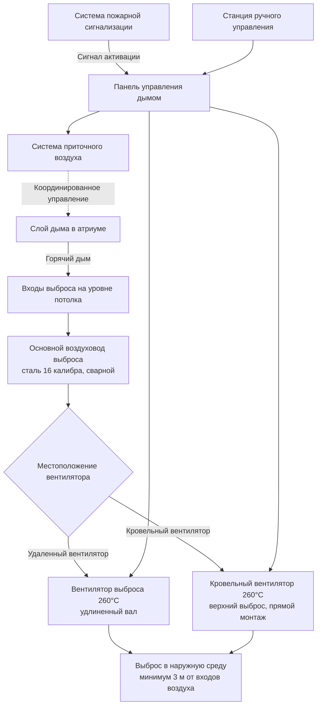

Системы дымоудаления обеспечивают активное удаление дыма из больших объемов помещений во время пожара, поддерживая приемлемые условия для эвакуации людей и проведения пожаротушения. Эти системы должны надежно работать при повышенных температурах, удаляя достаточное количество дымовой массы, чтобы предотвратить снижение слоя дыма ниже критической высоты.

## Выделенные и общие конфигурации выброса

### Выделенные системы дымоудаления

Выделенные системы дымоудаления работают исключительно для целей дымоудаления. Эти конфигурации обеспечивают наивысшую надежность, так как отсутствуют конфликты с нормальными операциями HVAC.

**Преимущества:**
- Отсутствие помех от последовательностей управления HVAC
- Упрощенная логика управления и процедуры тестирования
- Оборудование подобрано специально для нагрузок дымоудаления
- Отсутствие загрязнения HVAC здания при тестировании
- Четкое разделение ответственности за обслуживание

**Рекомендации по проектированию:**
- Более высокие первоначальные затраты из-за отдельного оборудования
- Дополнительные требования к пространству для выделенных вентиляторов и воздуховодов
- Периодическое тестирование для проверки готовности к работе
- Потенциальное изнашивание оборудования во время длительных периодов простоя

### Общие системы HVAC/дымоудаления

Общие системы используют существующее оборудование HVAC для дымоудаления путем переключения режимов работы во время пожара. Этот подход снижает первоначальные затраты, но вводит сложность управления.

**Требования для общих систем:**
- Все компоненты в пути дыма рассчитаны на повышенные температуры
- Органы управления переопределением для отключения экономайзера и нормальных последовательностей
- Блокировки для предотвращения конфликтующих положений заслонок
- Отдельное электроснабжение или аварийное питание для режима дымоудаления
- Ежеквартальное функциональное тестирование для проверки переключения режимов

Общий подход применяется в основном к приточно-вытяжным установкам, обслуживающим атриумы, где нормальный путь рециркуляции воздуха может удалять дым. Приточные вентиляторы должны отключаться, чтобы предотвратить подпор, который противодействует потоку выброса.

## Расчеты пропускной способности выброса

NFPA 92 предоставляет фундаментальную взаимосвязь между скоростью тепловыделения, потоком выброса и положением слоя дыма. Требуемый объемный расход выброса зависит от скорости конвективного тепловыделения и желаемой высоты слоя дыма.

Массовый расход дыма, образуемого факелом пожара, составляет:

$$\dot{m}_p = 0.071 Q_c^{1/3} (z - z_0)^{5/3} + 0.0018 Q_c$$

Где:
- $\dot{m}_p$ = массовый расход факела (кг/с)
- $Q_c$ = скорость конвективного тепловыделения (кВт)
- $z$ = высота над источником пожара до границы раздела слоя дыма (м)
- $z_0$ = высота виртуального начала (м)

Для стационарных условий массовый расход выброса должен равняться массовому расходу факела. Объемный расход выброса на входе выброса становится:

$$\dot{V} = \frac{\dot{m}_p}{\rho_s}$$

Где $\rho_s$ - плотность дыма при температуре слоя, рассчитываемая из:

$$\rho_s = \frac{353}{T_s}$$

С $T_s$ в Кельвинах. Для практического проектирования NFPA 92 предоставляет табулированные расходы выброса для различных размеров пожаров и высот проема.

### Метод воздухообмена

Альтернативный упрощенный подход использует скорости воздухообмена. Для помещений с высотой потолка выше 6 м минимальные расходы выброса составляют:

| Высота проема | Минимум воздухообменов в час |
|--------------|------------------------------|
| 6-9 м | 4-6 ACH |
| 9-15 м | 6-10 ACH |
| Выше 15 м | 8-12 ACH |

Рассчитайте объемный расход:

$$Q = \frac{V \times ACH}{60}$$

Где:
- $Q$ = расход выброса (CFM или м³/мин)
- $V$ = объем помещения (м³)
- $ACH$ = воздухообмены в час

Этот метод обеспечивает консервативные результаты, но может привести к завышению размеров системы для очень больших объемов.

## Спецификации вентиляторов высокой температуры

Вентиляторы дымоудаления должны работать при повышенных температурах, создаваемых горячим слоем дыма. NFPA 92 и строительные нормы требуют рейтинги температур на основе расположения вентилятора относительно зоны дыма.

### Классификация рейтингов температур

**Вентиляторы с рейтингом 121°C:**
- Минимальный рейтинг для вентиляторов вне зоны дыма
- Подходят для воздуховодного выброса с рассеиванием тепла через воздуховод
- Приемлемы для удаленных вентиляторов, всасывающих из точек выброса на уровне потолка
- Конструкция включает изоляцию двигателя и подшипники высокой температуры
- Сертификация тестирования согласно AMCA 210 при повышенной температуре

**Вентиляторы с рейтингом 260°C:**
- Требуется для вентиляторов в зоне дыма или приложений с прямым монтажом
- Необходимы для точек выброса непосредственно над регионом факела пожара
- Конструктивные особенности включают:
  - Корпус из чугуна или стали
  - Провентиляция двигателя высокой температуры
  - Керамическая волокнистая изоляция для отделений двигателя
  - Удлиненные валы для изоляции двигателя от горячего газового потока
  - Специальные подшипники и смазки высокой температуры

### Таблица выбора вентилятора

| Применение | Рейтинг температуры | Конфигурация двигателя | Типичная конструкция |
|-------------|-------------------|---------------------|---------------------|
| Воздуховодный выброс, вентилятор удален от зоны дыма | 121°C, 1 час | Прямой привод или ременной привод | Толстостенная сталь, двигатель высокой температуры |
| Воздуховодный выброс, вентилятор в зоне дыма | 260°C, 1 час | Ременной привод с изоляцией двигателя | Литая конструкция, удлиненный вал |
| Потолочный вентилятор выброса, прямой монтаж | 260°C, 1-2 часа | Удлиненный вал, наружный двигатель | Литой корпус, керамическая изоляция |
| Кровельный вентилятор вверхнего выброса | 149-260°C | Прямой привод или ременной привод | Алюминий или сталь, атмосферостойкая |

Рейтинг температуры продолжительность (обычно 1 или 2 часа) должен соответствовать классу огнестойкости здания и требуемой продолжительности работы дымоудаления.

## Рейтинги воздуховодов и компонентов

Все компоненты в потоке выброса дыма требуют рейтингов температур, соответствующих ожидаемым температурам дыма.

### Конструкция воздуховодов

Воздуховоды выброса из зон дыма к вытяжным вентиляторам должны быть:
- Построены из стали толщиной 16 калибра минимум для воздуховодов диаметром до 61 см
- Непрерывно сварены или герметизированы герметиком высокой температуры
- Поддерживаются негорючими кронштейнами, рассчитанными на тепловое расширение
- Изолированы с наружной стороны при прохождении через пространства, не имеющие огнестойкости
- Наклонены для слива конденсата при работе системы в режиме ожидания

### Заслонки и устройства управления

Моторизированные заслонки в путях выброса дыма требуют:
- Утверждение UL 555S для дымовых заслонок с рейтингом повышенной температуры
- Отказоустойчивые привода с резервным аккумулятором или возвратом пружины
- Выключатели индикации положения для мониторинга BAS
- Ежегодное инспектирование и тестирование согласно NFPA 105

Огневые/дымовые заслонки **не** устанавливаются в выделенных воздуховодах выброса дыма, так как их закрытие нарушит дымоудаление. Только изолирующие заслонки на границах системы требуют огнестойкости.

## Конфигурация системы выброса

## Координация приточного воздуха

Эффективная работа выброса требует координированного приточного воздуха для замены выброшенного объема дыма. Без адекватного приточного воздуха оболочка здания создает сопротивление, которое снижает поток выброса и может вызвать перепады давления, которые вытягивают дым в непредусмотренные зоны.

**Требования приточного воздуха:**
- Объемный расход 75-100% от расхода выброса
- Введение на низком уровне, чтобы избежать нарушения слоя дыма
- Механически подводимый для помещений без адекватных естественных отверстий
- Рассмотрение температуры для зимних условий (может требоваться отопление)
- Управление с блокировкой операции вентилятора выброса

Перепад давления между зоной дыма и смежными помещениями должен оставаться слегка отрицательным (5-15 Па), чтобы предотвратить миграцию дыма, избегая при этом чрезмерного отрицательного давления, которое препятствует потоку выброса.

## Тестирование и пусконаладка

Функциональное тестирование проверяет пропускную способность системы и работу последовательности управления:

1. **Проверка потока воздуха:** Измерьте фактический расход выброса и сравните с требованиями проектирования
2. **Подтверждение рейтинга температуры:** Проверьте данные на табличке всех компонентов в пути дыма
3. **Тестирование последовательности управления:** Активируйте систему и проверьте правильное срабатывание всех заслонок, вентиляторов и блокировок
4. **Координация приточного воздуха:** Подтвердите активацию системы приточного воздуха с надлежащей синхронизацией и расходом
5. **Перевод на аварийное питание:** Тестируйте автоматический переход на источник аварийного питания
6. **Тестирование ручного переопределения:** Проверьте возможность пожарного управления переопределить автоматические последовательности

Ежегодное тестирование согласно NFPA 92 обеспечивает постоянную готовность к работе. Документирование всех результатов тестирования обеспечивает основу для приемки компетентным органом.
