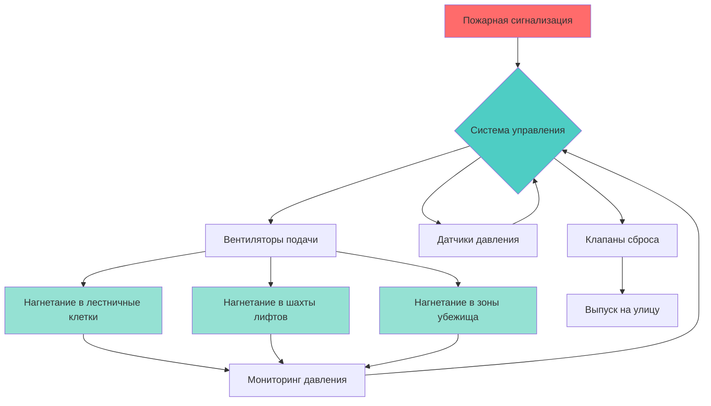
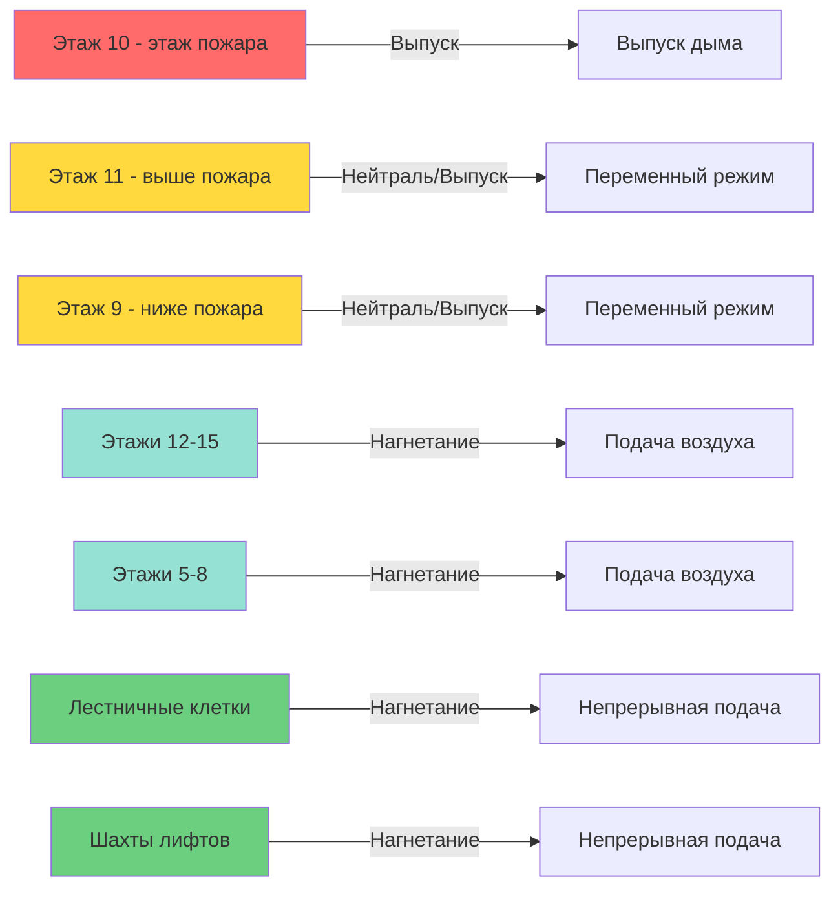

## Фундаментальные принципы

Системы нагнетания создают перепады положительного давления для предотвращения миграции дыма в защищенные пути эвакуации и зоны убежища. Система поддерживает более высокое давление в защищенных зонах относительно соседних пожарных зон, создавая барьеры воздушного потока, которые предотвращают проникновение дыма во время пожара.

**Основные задачи:**
- Поддерживать минимальные перепады давления на границах дымовых барьеров
- Ограничивать усилия открывания дверей в пределах, установленных нормативными документами
- Обеспечивать надежную защиту при различных условиях в здании
- Эффективно работать с одновременно открытыми несколькими дверями

## Требования к перепадам давления

NFPA 92 устанавливает минимальные перепады давления в зависимости от применения и статуса дверей.

| Применение | Минимальное давление (Па) | Максимальное давление (Па) | Предельное усилие открывания двери (Н) |
|-------------|----------------------------|----------------------------|----------------------|
| Лестничные клетки (все двери закрыты) | 12,4 | 24,9 | 133 |
| Лестничные клетки (одна дверь открыта) | 12,4 на закрытых дверях | — | 133 |
| Шахты лифтов | 12,4 | 29,8 | — |
| Зоны убежища | 12,4 | 24,9 | 133 |
| Лифтовые холлы (нагнетаемые) | 12,4 | 19,9 | 133 |

Связь между усилием открывания двери и перепадом давления определяется по формуле:

$$F = \frac{\Delta P \cdot A \cdot W}{2(W - d)}$$

Где:
- $F$ = усилие открывания двери (Н)
- $\Delta P$ = перепад давления (Па)
- $A$ = площадь двери (м²)
- $W$ = ширина двери (м)
- $d$ = расстояние от дверной ручки до петель (м)

Преобразование единиц давления:

$$\Delta P_{Па} = \Delta P_{in.w.c.} \times 248,64$$

Для двери размером 0,9 м × 2,1 м с перепадом давления 0,10 дюйма водяного столба и типичной конструкцией фурнитуры усилие открывания приближается к предельному значению 133 Н, требуя модуляции давления или механизмов сброса.

## Конфигурации систем

### Нагнетание давления в лестничные клетки

Системы с одной точкой впрыска подают воздух в верхнюю часть лестничной клетки, полагаясь на эффект стека и распределение утечек. Системы с несколькими точками впрыска обеспечивают подачу воздуха на разных уровнях для достижения равномерного распределения давления в высоких зданиях.

Требования к расходу воздуха на основе площади утечек и открывания дверей:

$$Q = Q_{leak} + Q_{door}$$

Где:

$$Q_{leak} = 1,238 \cdot A_L \cdot \sqrt{\Delta P}$$

- $Q_{leak}$ = расход утечек (м³/ч)
- $A_L$ = общая площадь утечек (м²)
- $\Delta P$ = перепад давления (Па)

Расход воздуха при открытии двери:

$$Q_{door} = 3,055 \cdot A_{door} \cdot \sqrt{\Delta P}$$

- $A_{door}$ = площадь открытой двери (м²)

### Нагнетание давления в шахты лифтов

Шахты лифтов требуют более высокого максимального давления (29,8 Па) благодаря менее строгим ограничениям по усилиям. Вентиляторы подачи включаются при пожарной сигнализации, нагнетая давление в шахте для предотвращения проникновения дыма через двери лифтов и проемы в шахте.

**Критические соображения:**
- Возврат лифтов на назначенные этажи до нагнетания давления
- Клапаны сброса давления предотвращают избыточное давление
- Координация нагнетания давления в холле для систем типа бутерброд
- Механическая вентиляция машинных отделений лифтов

### Зональные системы нагнетания давления

Зональные системы делят здания на зоны давления, нагнетая давление в незатронутые пожаром зоны и выпуская дым или поддерживая нейтральное давление на этаже пожара. Этот подход обеспечивает превосходное сдерживание дыма в высотных зданиях.

## Нагнетание давления типа "бутерброд"

Нагнетание давления типа "бутерброд" одновременно нагнетает давление на этажи выше и ниже этажа пожара, mientras выпускает дым или поддерживает нейтральное давление на этаже пожара и прилегающих этажах. Это создает вертикальные барьеры давления, предотвращающие вертикальную миграцию дыма.

**Типичная конфигурация бутерброда:**
- Этаж пожара: режим выпуска
- Этаж пожара ± 1: нейтраль или слабый выпуск
- Этаж пожара ± 2 и далее: нагнетание на 12,4-19,9 Па
- Лестничные клетки и шахты лифтов: непрерывное нагнетание на 12,4-24,9 Па

Уравнение профиля давления в зоне бутерброда:

$$\Delta P_i = \Delta P_{target} - \frac{Q_{leak,i}^2}{(1,238 \cdot A_{L,i})^2}$$

Где $i$ обозначает каждый уровень этажа в зоне бутерброда.

## Модуляция давления и управление

Барометрические клапаны сброса давления открываются автоматически при достижении заданных пороговых значений давления, предотвращая чрезмерное повышение давления. Современные системы используют электронную модуляцию давления с применением:

**Управление регулируемыми приводами вентилятора (VSD):**

$$N_{fan} = N_{design} \cdot \sqrt{\frac{\Delta P_{target}}{\Delta P_{measured}}}$$

Где:
- $N_{fan}$ = регулировка скорости вентилятора (%)
- $N_{design}$ = скорость вентилятора при проектировании (%)
- значения давления в согласованных единицах

**Модулирующие клапаны сброса:**
- Непрерывно регулируют положение открытия на основе обратной связи давления
- Обеспечивают более быстрый отклик, чем барометрические клапаны
- Позволяют более тесно контролировать допуск давления

**Управление многоступенчатой подачей:**
- Последовательное включение нескольких вентиляторов подачи
- Адаптация к различным сценариям открывания дверей
- Снижение потребления энергии при частичной нагрузке

## Сводка расчета расходов воздуха

| Параметр | Типичное значение | Диапазон проектирования |
|-----------|--------------|--------------|
| Площадь утечки в лестничной клетке | 0,009 м²/этаж | 0,005-0,019 м²/этаж |
| Утечка в шахте лифта | 0,014 м²/этаж | 0,009-0,023 м²/этаж |
| Утечка закрытой двери | 0,033 м²/дверь | 0,023-0,047 м²/дверь |
| Расход воздуха при открытии одной двери | 450-680 м³/ч | Зависит от ΔP |
| Коэффициент запаса прочности емкости вентилятора | 1,25-1,5 | По NFPA 92 |

Общая производительность системы должна вмещать одновременное открывание дверей согласно требованиям NFPA 92, обычно одна дверь на пять этажей или минимум две двери.

## Испытания и пуско-наладка

**Предварительная функциональная проверка:**
1. Проверить производительность вентилятора подачи и доставку давления при проектных условиях
2. Подтвердить калибровку датчика давления и точность размещения
3. Испытать работу клапана сброса и установленные значения
4. Проверить программирование последовательности управления в соответствии с проектным решением

**Испытания функциональной производительности:**
1. Измерить перепады давления при всех закрытых дверях
2. Испытать поддерживаемое давление при проектном количестве открытых дверей
3. Проверить усилия открывания дверей в пределах максимального значения 133 Н
4. Подтвердить время отклика от сигнала пожарной сигнализации до целевого давления

**Критерии приемки:**
- Поддерживаемый минимальный перепад давления: ≥12,4 Па
- Максимальный перепад давления: ≤ установленный лимит
- Усилие открывания двери: ≤133 Н
- Время нагнетания: ≤60 секунд от сигнала тревоги

## Рассмотрения надежности системы

**Положения о резервировании:**
- Двойные вентиляторы подачи с возможностью автоматического переключения
- Аварийное питание для всего оборудования нагнетания давления
- Резервные барометрические клапаны при отказе основной системы управления
- Ручные органы управления, доступные для пожарной службы

**Требования к техническому обслуживанию:**
- Квартальная проверка перепадов давления
- Полугодовое испытание производительности вентилятора подачи
- Ежегодное полное функциональное испытание системы с имитацией условий пожара
- Ежеквартальная проверка работы клапана сброса давления

Правильно спроектированные системы нагнетания давления обеспечивают эффективный контроль дыма при интеграции с общей стратегией пожарной защиты здания, поддерживая приемлемые условия эвакуации на протяжении всего пожара.
