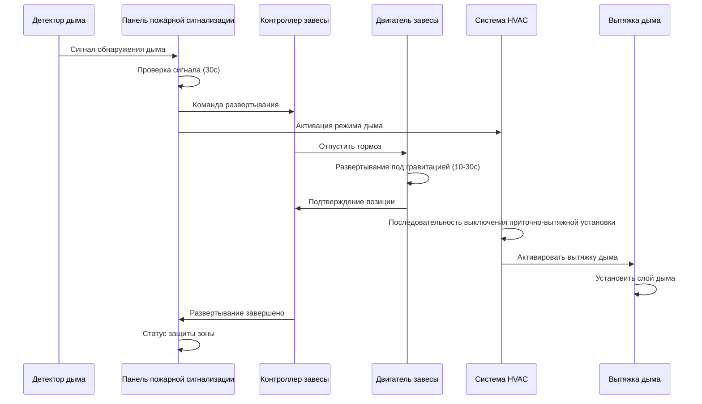
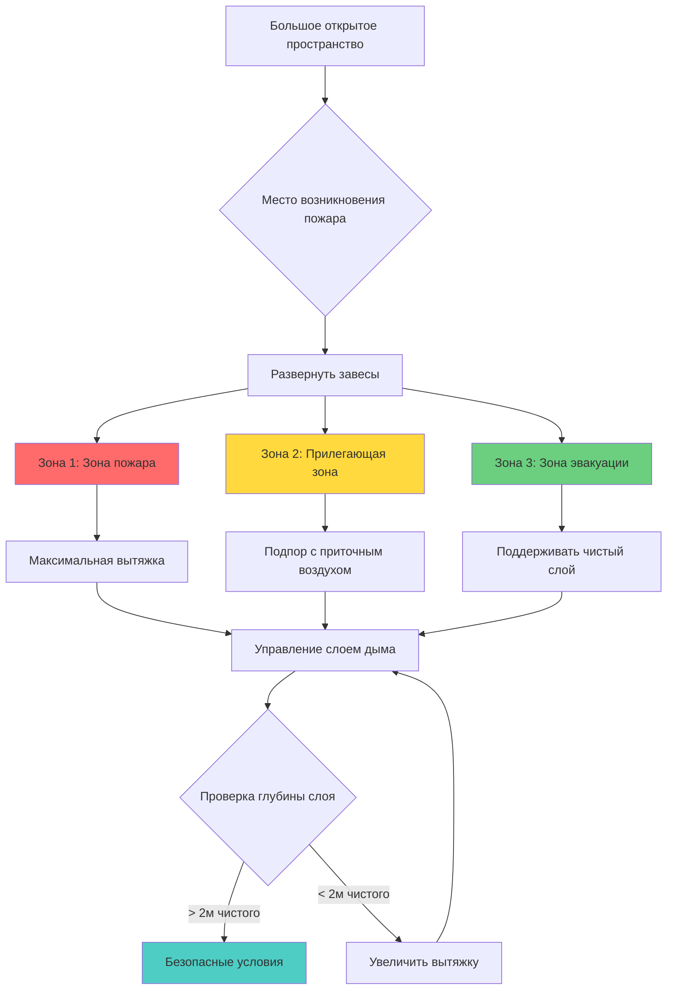

## Введение

Дымовые завесы — это огнестойкие гибкие преграды, которые автоматически развертываются для разделения больших открытых пространств при возникновении пожара. Эти системы создают зоны локализации дыма, которые работают в координации с механическим управлением дымом для поддержания безопасных условий на путях эвакуации и в местах убежища. Дымовые завесы являются критичными в пространствах, где традиционные неподвижные стены непрактичны — таких как атриумы, торговые центры, аэропорты и выставочные центры.

Эффективность систем дымовых завес зависит от надлежащей интеграции с системами пожарной сигнализации, сетями обнаружения дыма и последовательностями управления дымом HVAC. NFPA 92 предоставляет инженерную основу для применения дымовых завес в больших объемах.

## Физические принципы локализации дыма

### Стратификация слоя дыма

Дымовые завесы функционируют путем создания физических границ, которые предотвращают боковое распространение дыма, позволяя развиваться стратифицированным слоям дыма. Глубина слоя дыма под завесой определяется массовым расходом дыма и скоростью извлечения:

$$
z_s = h - \left(\frac{\dot{m}_s}{\rho_\infty \cdot A \cdot \sqrt{2g(h-z_s)}}\right)
$$

Где:
- $z_s$ = высота интерфейса слоя дыма над полом (м)
- $h$ = общая высота потолка или глубина завесы (м)
- $\dot{m}_s$ = массовый расход дыма (кг/с)
- $\rho_\infty$ = плотность окружающего воздуха (кг/м³)
- $A$ = площадь зоны дыма (м²)
- $g$ = ускорение свободного падения (9,81 м/с²)

### Объем локализации дымового шлейфа

Требуемый объем локализации под слоем дыма должен вмещать скорость производства дыма. Для установившегося пожара с квадратичной зависимостью от времени:

$$
V_{smoke} = \frac{\dot{Q}_c}{\rho_\infty \cdot c_p \cdot \Delta T} \cdot t_{RSET}
$$

Где:
- $V_{smoke}$ = объем локализации дыма (м³)
- $\dot{Q}_c$ = скорость конвективного тепловыделения (кВт)
- $c_p$ = удельная теплоемкость воздуха (1,005 кДж/кг·K)
- $\Delta T$ = повышение температуры слоя дыма (K)
- $t_{RSET}$ = требуемое время безопасной эвакуации (с)

### Утечка завесы и миграция дыма

Реальные дымовые завесы имеют утечки по периметру краев и сквозь ткань. Скорость утечки потока зависит от перепада давления:

$$
\dot{V}_{leak} = C_d \cdot A_{gap} \cdot \sqrt{\frac{2\Delta p}{\rho_\infty}}
$$

Где:
- $\dot{V}_{leak}$ = объемный расход утечки (м³/с)
- $C_d$ = коэффициент расхода (обычно 0,6–0,7)
- $A_{gap}$ = общая площадь утечки (м²)
- $\Delta p$ = перепад давления через завесу (Па)

## Последовательность развертывания дымовой завесы

## Конфигурация зон дымовой завесы

## Спецификации проектирования

### Требования к производительности завесы

| Параметр | Спецификация | Стандартная ссылка |
|----------|--------------|-------------------|
| Огнестойкость | 30–120 минут | ASTM E163, UL 2021 |
| Время развертывания | ≤ 30 секунд | NFPA 92, раздел 4.5.3 |
| Скорость спуска | 0,1–0,3 м/с | Спецификация производителя |
| Температурный рейтинг ткани | ≥ 600°C | NFPA 92, раздел 4.5.2 |
| Скорость утечки | ≤ 5 м³/с на 100м периметра при 25 Па | NFPA 92, Приложение D |
| Минимальная чистая высота | 2,0 м | Требование строительного кодекса |
| Устойчивость к ветровой нагрузке | По категории воздействия на здание | ASCE 7 |
| Сейсмическое крепление | По местной сейсмической зоне | ASCE 7, IBC |

### Свойства материала завесы

| Свойство | Стеклоткань | Ткань с силиконовым покрытием | Сетка из нержавеющей стали |
|----------|-------------|----------------------|---------------------|
| Вес | 500–800 г/м² | 600–900 г/м² | 1200–1800 г/м² |
| Толщина | 0,5–0,8 мм | 0,6–1,0 мм | 1,5–2,5 мм |
| Прочность на разрыв | 2000–3000 Н/50мм | 2500–4000 Н/50мм | 5000–8000 Н/50мм |
| Максимальная ширина | 6 м | 6 м | 4 м |
| Срок службы | 15–20 лет | 20–25 лет | 25–30 лет |
| Коэффициент стоимости | 1,0× | 1,3× | 2,5× |

## Требования координации HVAC

### Мощность вытяжки по зонам

Скорость вытяжки дыма должна превышать скорость производства дыма, скорректированную на утечку:

$$
\dot{V}_{exh} = \dot{V}_{plume} + \dot{V}_{leak} + \dot{V}_{makeup}
$$

Где:
- $\dot{V}_{exh}$ = общая мощность вытяжки (м³/с)
- $\dot{V}_{plume}$ = объемный расход дымового шлейфа (м³/с)
- $\dot{V}_{leak}$ = утечка завесы (м³/с)
- $\dot{V}_{makeup}$ = требование на подпор воздуха (м³/с)

### Управление дифференциалом давления

Дымовые завесы создают зоны давления, которые необходимо управлять для предотвращения обратного потока дыма:

$$
\Delta p_{zone} = \frac{\rho_\infty}{2} \left(\frac{\dot{V}_{exh}}{A_{effective}}\right)^2 - \rho_s g h_s
$$

Где:
- $\Delta p_{zone}$ = дифференциал давления через зону (Па)
- $A_{effective}$ = эффективная площадь потока (м²)
- $\rho_s$ = плотность дыма (кг/м³)
- $h_s$ = глубина слоя дыма (м)

### Интеграция последовательности управления

**Предтревожное состояние:**
- Нормальная работа HVAC
- Завесы убраны в корпус
- Обнаружение дыма активно

**Проверка сигнала (0–30с):**
- Панель пожарной сигнализации проверяет обнаружение
- HVAC переходит в режим ожидания
- Контроллеры завес вооружены

**Фаза развертывания (30–60с):**
- Завесы развертываются до расчетной высоты
- Системы подачи воздуха отключаются
- Вентиляторы вытяжки активируются с временной задержкой
- Смежные зоны входят в режим подпора

**Фаза управления дымом (60с и далее):**
- Поддерживать слой дыма на высоте ≥ 2м чистого пространства
- Модулировать скорости вытяжки по условиям зоны
- Мониторить позицию и целостность завесы
- Обеспечить подпорный воздух для предотвращения чрезмерного отрицательного давления

## Рассмотрение установки и испытаний

### Критические параметры установки

1. **Крепление несущей балки:** Корпус завесы должен крепиться к конструктивным элементам, способным выдерживать нагрузку 1,5× собственного веса плюс ветровые нагрузки.

2. **Уплотнения по краям:** Зазоры по периметру не должны превышать 25 мм для обеспечения спецификаций утечки.

3. **Выравнивание направляющих рельсов:** Вертикальные направляющие должны быть отвесными в пределах ±5 мм по полной высоте развертывания.

4. **Системы удержания:** Сила удержания нижней перекладины должна быть достаточной для предотвращения прорыва при расчетных перепадах давления.

### Испытания при пуске

| Тип испытания | Критерий приемки | Периодичность |
|-----------|-------------------|-----------|
| Скорость развертывания | 10–30 секунд полный ход | Первоначально + ежегодно |
| Проверка позиции | ±50 мм от расчетной высоты | Первоначально + ежегодно |
| Целостность уплотнения по краям | Визуальная проверка, без зазоров > 25мм | Первоначально + ежегодно |
| Интеграция с пожарной сигнализацией | Развертывание в течение 5с от сигнала | Первоначально + ежегодно |
| Координация вытяжки дыма | Вытяжка активируется в течение 15с после развертывания | Первоначально |
| Аварийный ручной спуск | Функциональная работа | Первоначально + полугодично |
| Функция втягивания | Полное втягивание без заеданий | Первоначально + ежегодно |

## Ограничения проектирования и особые соображения

**Ограничения по высоте потолка:** Завесы эффективны при высоте потолка приблизительно до 15–20м. Выше этого уровня плавучесть дыма может преодолеть эффективность локализации.

**Ограничения по скорости воздуха:** Чрезмерные скорости воздуха (> 1 м/с) рядом с развернутыми завесами могут нарушить стратификацию слоя дыма и вызвать перемешивание.

**Расположение подпорного воздуха:** Входы подпорного воздуха должны быть расположены низко в пространстве, чтобы избежать нарушения интерфейса слоя дыма.

**Координация множественных завес:** В конфигурациях с несколькими зонами развертывание завес должно быть последовательным для предотвращения переходных процессов давления, которые могут втолкнуть дым в защищаемые области.

**Доступ для обслуживания:** Корпусы завес требуют доступа для осмотра, испытания и замены ткани без нарушения работы здания.

## Заключение

Дымовые завесы — это инженерные системы противопожарной защиты, которые требуют тщательной интеграции с механическим управлением дымом, системами пожарной сигнализации и HVAC здания. Проектирование должно учитывать скорости производства дыма, утечку завесы, управление давлением и координацию с системами вытяжки. Надлежащая спецификация, установка и испытание согласно NFPA 92 обеспечивают надежную работу этих систем при возникновении пожара, поддерживая безопасные условия на путях эвакуации и защищая жильцов здания.
