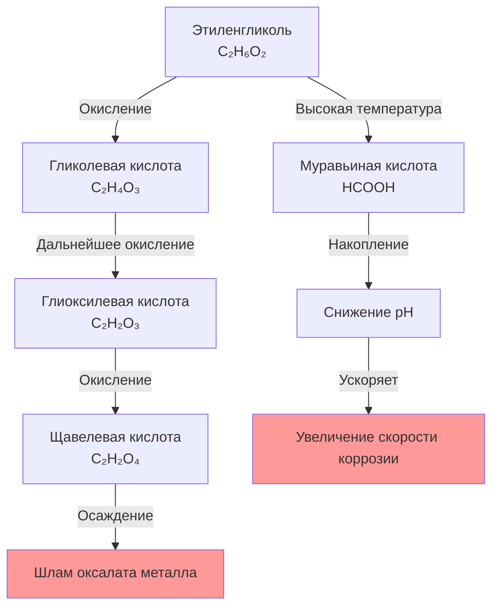
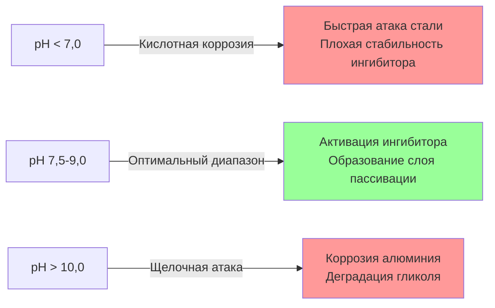
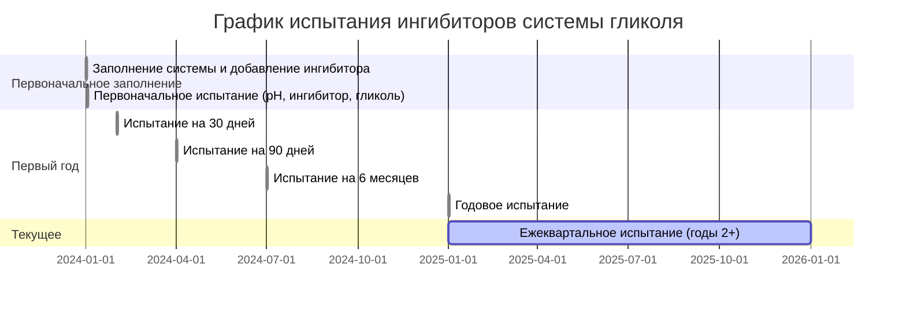

Ингибиторы коррозии являются критическими химическими добавками в системах таяния снега и защиты от замерзания на основе гликоля. Без надлежащего торможения процессов деградация гликоля и электрохимические процессы коррозии разрушают компоненты системы, приводя к загрязнению жидкости, потерям теплопередачи и катастрофическому отказу оборудования. Понимание химии ингибиторов, механизмов деградации и требований к техническому обслуживанию обеспечивает долгосрочную целостность системы.

## Механизмы коррозии в системах на основе гликоля

### Основы электрохимической коррозии

Гальваническая коррозия возникает при наличии разнородных металлов в электролитическом растворе. Плотность тока коррозии следует уравнению Штерна-Геари:

$$i_{corr} = \frac{B}{R_p}$$

где $i_{corr}$ представляет плотность тока коррозии (µА/см²), $B$ — константа Штерна-Геари (обычно 26 мВ для активной коррозии), а $R_p$ — сопротивление поляризации (Ω·см²).

Скорость потери массы от коррозии следует закону Фарадея:

$$m = \frac{i_{corr} \cdot t \cdot M}{n \cdot F}$$

где $m$ — потеря массы (г), $t$ — время (с), $M$ — атомная масса (г/моль), $n$ — количество передаваемых электронов валентности, а $F$ — постоянная Фарадея (96 485 Кл/моль).

### Химия окисления гликоля

Окисление гликоля производит кислые побочные продукты, ускоряющие коррозию. Основной путь деградации этиленгликоля:

Скорость окисления экспоненциально увеличивается с температурой, следуя соотношению Аррениуса:

$$k = A \cdot e^{-E_a/(R \cdot T)}$$

где $k$ — константа скорости реакции, $A$ — предэкспоненциальный множитель, $E_a$ — энергия активации (обычно 50-70 кДж/моль для окисления гликоля), $R$ — газовая постоянная (8,314 Дж/моль·К), а $T$ — абсолютная температура (К).

Эта температурная зависимость объясняет, почему деградация гликоля ускоряется при повышенных температурах системы выше 82°C.

## Компоненты пакета ингибиторов

### Основная химия ингибиторов

Коммерческие пакеты ингибиторов содержат несколько активных ингредиентов, обеспечивающих дополнительные механизмы защиты:

| Тип ингибитора | Химические примеры | Механизм защиты | Защищаемые металлы |
|----------------|-------------------|-----------------|-------------------|
| Азолы | Бензотриазол (BTA), Толилтриазол (TTA) | Формирование адсорбированной защитной пленки | Медь, латунь, бронза |
| Фосфаты | Фосфат натрия, Молибдат натрия | Развитие слоя пассивации | Черные металлы, алюминий |
| Бензоаты | Бензоат натрия | Анодное ингибирование | Сталь, чугун |
| Бораты | Тетраборат натрия | Буферизация pH, защита алюминия | Алюминиевые сплавы |
| Силикаты | Силикат натрия | Защитная силикатная пленка | Все металлы |
| Нитриты | Нитрит натрия | Анодная пассивация | Сталь, чугун |

### Синергетические эффекты ингибиторов

Правильно составленные пакеты используют синергетические взаимодействия. Например, комбинация азолов с фосфатами обеспечивает превосходную защиту меди по сравнению с любым компонентом отдельно. Коэффициент синергии можно количественно определить:

$$S = \frac{CR_{individual}}{CR_{combined}}$$

где $S$ — коэффициент синергии (>1 указывает на синергию), $CR_{individual}$ — сумма скоростей коррозии с отдельными ингибиторами, а $CR_{combined}$ — скорость коррозии с комбинированным пакетом. Хорошо разработанные пакеты достигают коэффициентов синергии 2-4.

## Требования к контролю pH

### Спецификация диапазона pH

Диапазон pH 7,5-9,0 обеспечивает оптимальную эффективность ингибиторов и минимальную коррозию для систем со смешанными металлами:

Диаграмма Пурбе для железа показывает, что пассивация происходит между pH 9-13 при типичных потенциалах системы, но пассивация алюминия требует pH 4-9, создавая ограничение, которое ограничивает допустимый pH диапазоном 7,5-9,0 для систем со смешанными металлами.

### Механизмы смещения pH

pH естественным образом снижается во время работы системы из-за:

1. **Окисления гликоля**: Образование органических кислот (гликолевая, муравьиная, щавелевая кислоты)
2. **Поглощения CO₂**: Образование углеводной кислоты из атмосферного контакта
3. **Истощения ингибиторов**: Потребление при формировании защитной пленки
4. **Гидролиза**: Некоторые компоненты ингибиторов подвергаются гидролитической деградации

Скорость смещения pH может быть приблизительно выражена:

$$\frac{d(pH)}{dt} = -k_{ox} \cdot [O_2] \cdot e^{-E_a/(R \cdot T)} - k_{CO_2} \cdot A_{surface} - k_{dep}$$

где члены представляют вклады от окисления, поглощения CO₂ и истощения ингибиторов соответственно.

## Совместимость материалов

### Матрица совместимости металлов

| Материал | Неингибированный гликоль | Надлежащий ингибированный | Сокращение скорости коррозии |
|----------|-------------------------|-------------------------|------------------------------|
| Углеродистая сталь | 0,38-0,76 мм/год | <0,025 мм/год | 95-98% |
| Медь | 0,13-0,25 мм/год | <0,005 мм/год | 95-98% |
| Чугун | 0,25-0,64 мм/год | <0,025 мм/год | 95-96% |
| Алюминий | 0,05-0,20 мм/год | <0,013 мм/год | 85-94% |
| Латунь (70/30) | 0,08-0,18 мм/год | <0,005 мм/год | 95-97% |
| Нержавеющая сталь | <0,025 мм/год | <0,0025 мм/год | Минимальное улучшение |

### Рассмотрение неметаллических материалов

Пакеты ингибиторов должны оставаться совместимыми с эластомерами, прокладками и уплотнениями:

**Совместимые материалы:**
- EPDM (этилен пропилен диеновый мономер)
- Фторуглеродные эластомеры (Viton)
- PTFE (Тефлон)
- Хлоропрен (Неопрен)

**Несовместимые материалы:**
- Натуральный каучук (деградация и отек)
- Нитрил (NBR) при высоких концентрациях гликоля
- Большинство составов поливинилхлорида (извлечение пластификатора)
- Цинкированные поверхности (коррозия цинка выше pH 8,5)

## Требования к испытаниям и протоколы

### Испытание коррозии стеклянной посуды ASTM D1384

Стандартное в промышленности испытание ASTM D1384 оценивает эффективность ингибиторов в контролируемых условиях:

**Параметры испытания:**
- Температура: 88°C
- Продолжительность: 336 часов (2 недели)
- Образцы металлов: Медь, припой, латунь, сталь, чугун, алюминий
- Критерии прохождения: Все металлы <1 мг/см²/неделя потери массы

Коэффициент жесткости испытания относительно полевых условий:

$$SF = \frac{t_{field}}{t_{test}} \cdot e^{E_a/R \cdot (1/T_{test} - 1/T_{field})}$$

Для типичных условий (71°C в поле, 88°C при испытании) коэффициент жесткости составляет примерно 15-20, что означает 336 часов испытания представляют 5000-7000 часов полевого воздействия.

### График полевого испытания

### Требуемые параметры испытания

| Параметр | Метод испытания | Допустимый диапазон | Предел действия |
|----------|-----------------|-------------------|-----------------|
| pH | ASTM E70 (pH-метр) | 7,5-9,0 | <7,0 или >10,0 |
| Резервная щелочность | ASTM D1121 | >2,0 мл 0,1N HCl/10мл | <1,5 мл |
| Концентрация ингибитора | Ионная хроматография | 95-105% первоначальной | <80% первоначальной |
| Концентрация гликоля | Рефрактометр/Ареометр | ±2% проектная | >5% отклонение |
| Содержание хлорида | ASTM D512 | <25 ppm | >50 ppm |
| Содержание железа | ASTM D1068 | <10 ppm | >50 ppm |
| Содержание меди | ASTM D1688 | <0,1 ppm | >1,0 ppm |

### Интерпретация результатов испытания

**pH ниже 7,0:** Указывает на деградацию гликоля и образование кислот. Требуется немедленная замена жидкости, исследовать источники попадания кислорода.

**Высокое содержание железа (>50 ppm):** Активная коррозия стали. Проверить концентрацию ингибитора, pH и систему на наличие точек попадания растворенного кислорода.

**Высокое содержание меди (>1 ppm):** Коррозия меди, часто указывающая на низкую концентрацию ингибитора азола или чрезмерный pH (>10,5).

**Низкая резервная щелочность:** Емкость буферизации исчерпана. Пакет ингибиторов не может поддерживать pH; замена неминуема.

## Пополнение и техническое обслуживание ингибиторов

### Механизмы истощения

Концентрация ингибиторов снижается через:

1. **Адсорбцию**: Постоянное прикрепление к поверхностям металлов, формирующее защитные пленки
2. **Окисление**: Химическая деградация органических компонентов ингибиторов
3. **Осаждение**: Образование нерастворимых комплексов металл-ингибитор
4. **Термическую деградацию**: Разрушение при повышенных температурах
5. **Физические потери**: Удаление при сливе системы или утечке

### Дополнительное добавление ингибитора

Когда испытание выявляет истощение ингибитора ниже 80% первоначальной концентрации:

$$V_{add} = \frac{V_{system} \cdot (C_{target} - C_{current})}{C_{supplement}}$$

где $V_{add}$ — объем требуемого дополнительного ингибитора, $V_{system}$ — общий объем системы, $C_{target}$ — желаемая конечная концентрация, $C_{current}$ — измеренная концентрация, а $C_{supplement}$ — концентрация раствора дополнительного ингибитора.

**Критические соображения:**
- Используйте только совместимые с производителем дополнительные материалы
- Никогда не смешивайте различные пакеты ингибиторов коррозии
- Испытайте через 48 часов после добавления, чтобы проверить надлежащое смешивание
- Документируйте все добавления в записях технического обслуживания

## Загрязнение системы и режимы отказа

### Общие загрязнители

**Хлориды:** Попадают через водоснабжение для дополнения, химические вещества для очистки или проникновение противогололедной соли. Ускоряют точечную коррозию нержавеющей стали и алюминия. Максимально допустимое количество: 25 ppm.

**Сульфаты:** Указывают на биологическую активность или загрязнение воды. Могут осаждаться с кальцием, образуя накипь. Максимум: 50 ppm.

**Кальций/Магний:** Загрязнение жесткой водой. Образует осадки с ингибиторами, снижая эффективность. Максимум кальция: 50 ppm.

### Образование шлама

Продукты деградации гликоля объединяются с ионами металлов, образуя характерный шлам:

**Коричнево-черный шлам:** Оксид железа и комплексы органических кислот. Указывает на коррозию стали и окисление гликоля.

**Зелено-синий шлам:** Соли меди и органические кислоты. Указывает на коррозию меди и кислые условия.

**Белый осадок:** Соли кальция или алюминия. Указывает на загрязнение жесткой водой или чрезмерный pH с алюминиевыми компонентами.

Скорость накопления шлама:

$$\frac{dm_{sludge}}{dt} = k_{corr} \cdot A_{surface} \cdot \rho_{metal} + k_{precip} \cdot V_{fluid}$$

представляющая вклады от продуктов коррозии и химического осаждения.

## Лучшие практики для долгосрочной работы системы

1. **Надлежащее первоначальное заполнение**: Используйте деионизированную или деминерализованную воду для минимизации введения загрязнителей
2. **Качество гликоля**: Приобретайте предингибированный гликоль у авторитетных производителей, отвечающих стандартам ASTM D1384 и D3306
3. **Исключение воздуха**: Установите автоматические воздухоотводчики и поддерживайте положительное давление в системе для исключения кислорода
4. **Контроль температуры**: Ограничьте температуру жидкости <82°C для минимизации деградации гликоля
5. **Фильтрация**: Установите сетчатые фильтры 100-200 меш для захвата частиц и шлама
6. **Частота испытания**: Минимум ежеквартально, ежемесячно в течение первого года или после модификаций системы
7. **Ведение записей**: Документируйте все результаты испытаний, добавления ингибиторов и замены жидкостей
8. **Критерии замены**: Замените жидкость, когда pH не может поддерживаться выше 7,0, резервная щелочность <1,5 мл, или концентрация ингибитора <80% несмотря на дополнительные добавления

## Ссылки

- ASTM D1384: Стандартный метод испытания коррозии для охлаждающей жидкости двигателя в стеклянной посуде
- ASTM D3306: Стандартная спецификация для охлаждающей жидкости двигателя на основе гликоля для автомобилей и легких грузовиков
- ASTM D1121: Стандартный метод испытания резервной щелочности охлаждающей жидкости двигателя и антиржавчинов
- ASHRAE Handbook—HVAC Systems and Equipment, Chapter 13: Hydronic Heating and Cooling
- SAE J1034: Automotive and Commercial Refrigerant Recovery/Recycling Equipment

---

**Ключевой вывод:** Ингибиторы коррозии преобразуют гликоль из коррозионной жидкости в раствор, защищающий систему. Однако ингибиторы истощаются через адсорбцию, окисление и термическую деградацию. Регулярное испытание и надлежащее техническое обслуживание обеспечивают, чтобы химическая среда оставалась в пределах защитных параметров, предотвращая экспоненциальное увеличение скоростей коррозии, которое происходит, когда концентрация ингибитора падает ниже критических пороговых значений.
