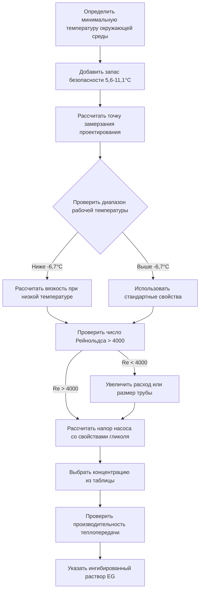
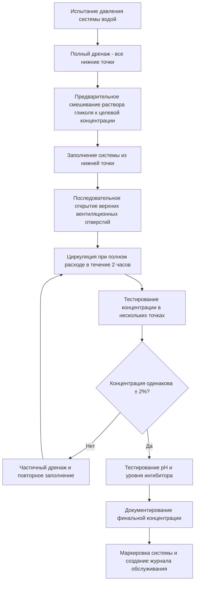

Этиленгликоль (EG) представляет собой высокоэффективное решение для антифриза в замкнутых системах HVAC, обеспечивая превосходные характеристики теплопередачи и более низкую вязкость по сравнению с пропиленгликолем. Несмотря на эти тепловые преимущества, проблемы токсичности ограничивают применение этиленгликоля промышленными системами, сетями районного отопления и установками с полной изоляцией от источников питьевой воды.

## Молекулярные свойства и тепловые характеристики

Молекулярная структура этиленгликоля непосредственно определяет его превосходные характеристики в приложениях теплопередачи.

### Химические и физические свойства

**Молекулярная формула:** C₂H₆O₂ (1,2-этандиол)

**Молекулярный вес:** 62,07 г/моль

Меньший молекулярный вес по сравнению с пропиленгликолем (76,09 г/моль) обеспечивает более низкую вязкость при эквивалентных концентрациях, снижая энергию откачки и повышая коэффициент теплопередачи.

**Свойства чистого этиленгликоля при 25°C:**

| Свойство | Значение | Единицы |
|----------|----------|---------|
| Плотность | 1,113 | г/см³ |
| Удельная теплоемкость | 2,427 | кДж/(кг·K) |
| Теплопроводность | 0,264 | Вт/(м·K) |
| Абсолютная вязкость | 16,1 | сП |
| Кинематическая вязкость | 14,5 | сСт |
| Температура кипения | 197,3 | °C |
| Температура вспышки | 111 | °C |
| Температура самовоспламенения | 400 | °C |

### Преимущества теплопередачи

Растворы этиленгликоля демонстрируют заметно превосходные характеристики теплопередачи по сравнению с пропиленгликолем при эквивалентных уровнях защиты от замерзания.

#### Сравнение теплопроводности

Теплопроводность растворов антифриза влияет на коэффициент конвективной теплопередачи в потоках внутри труб. Для растворов с объемной долей 40% при 10°C:

- **Этиленгликоль**: 0,423 Вт/(м·K)
- **Пропиленгликоль**: 0,382 Вт/(м·K)
- **Преимущество в производительности**: 10,9% выше теплопроводность

Это преимущество в проводимости преобразуется в более высокие числа Нуссельта в приложениях вынужденной конвекции.

#### Характеристики вязкости

Более низкая вязкость снижает энергию откачки и повышает турбулентную теплопередачу. При 4°C с концентрацией 40%:

| Жидкость | Вязкость (сП) | Коэффициент энергии откачки |
|----------|---------------|---------------------------|
| Вода | 1,55 | 1,00 |
| Этиленгликоль (40%) | 5,2 | 3,35 |
| Пропиленгликоль (40%) | 8,9 | 5,74 |

**Результат:** Этиленгликоль требует на 42% меньше энергии откачки чем пропиленгликоль при эквивалентной защите от замерзания.

#### Влияние на коэффициент теплопередачи

Коэффициент поверхностной теплопередачи для турбулентного потока в трубах следует корреляции Диттуса-Бёлерта:

$$Nu = 0,023 \cdot Re^{0,8} \cdot Pr^{0,4}$$

Где число Рейнольдса зависит обратно пропорционально вязкости:

$$Re = \frac{\rho V D}{\mu}$$

При постоянной скорости потока более низкая вязкость этиленгликоля производит:
- Более высокое число Рейнольдса (улучшенная турбулентность)
- Более высокий коэффициент теплопередачи
- Снижение требуемой площади поверхности теплообменника (на 10-15% меньше чем системы с пропиленгликолем)

## Характеристики депрессии точки замерзания

Этиленгликоль обеспечивает защиту от замерзания через колигативные эффекты свойств — растворенные молекулы гликоля нарушают формирование кристаллической решетки льда.

### Зависимость концентрации от точки замерзания

Взаимосвязь между концентрацией гликоля и точкой замерзания нелинейна, с оптимальной производительностью, возникающей между 50-60% по объему.

**Точки замерзания этиленгликоля по концентрации:**

| Концентрация (% по объему) | Концентрация (% по массе) | Точка замерзания (°C) | Точка защиты от разрыва (°C) |
|----------------------------|----------------------------|---------------------|------------------------------|
| 10 | 11,0 | -3,3 | -7,8 |
| 20 | 21,5 | -7,2 | -15,0 |
| 30 | 31,5 | -13,9 | -23,3 |
| 40 | 41,0 | -23,3 | -34,4 |
| 50 | 50,0 | -36,7 | -48,3 |
| 60 | 58,5 | -48,3 | -59,4 |
| 70 | 66,5 | -37,2 | -51,1 |

**Критическое замечание по проектированию:** Превышение концентрации 60% фактически снижает характеристики защиты от замерзания из-за уменьшения доступности воды для нарушения кристаллообразования льда. Эвтектическая точка (максимальная защита от замерзания) возникает около 60% по объему.

### Защита от разрыва в сравнении с точкой замерзания

Раствор сохраняет защитные свойства ниже указанной точки замерзания. Между точкой замерзания и точкой защиты от разрыва жидкость переходит в состояние ледяной каши, а не твердого льда. Это образование каши предотвращает разрыв трубы тремя механизмами:

1. **Размещение объема**: Каша сжимается, а не создает напряжение расширения
2. **Морфология кристаллов**: Дендритные ледяные структуры не образуют непрерывные твердые массы
3. **Остаточная жидкая фаза**: Концентрированный гликоль остается жидким между кристаллами льда

Проектная концентрация должна целиться на 5,6-8,3°C ниже минимальной ожидаемой температуры окружающей среды для обеспечения полной защиты от замерзания.

## Методология выбора концентрации

Надлежащий выбор концентрации уравновешивает требования защиты от замерзания против штрафов тепловой производительности и рассмотрения затрат.

### Процедура расчета проектирования

**Шаг 1: Определить минимальную температуру проектирования**

$$T_{design} = T_{ambient,min} - T_{safety}$$

Где $T_{safety}$ обычно находится в диапазоне 5,6-11,1°C в зависимости от критичности системы:
- Некритические системы: 5,6°C запас безопасности
- Коммерческие системы: 8,3°C запас безопасности
- Критическая инфраструктура: 11,1°C запас безопасности

**Шаг 2: Выбрать концентрацию из таблиц точки замерзания**

Справка ASHRAE Handbook - HVAC Systems and Equipment Глава 21 для точных значений концентрации.

**Шаг 3: Проверить тепловую производительность**

Рассчитать штраф производительности тепла:

$$Q_{glycol} = Q_{water} \cdot \frac{(c_p)_{glycol}}{(c_p)_{water}} \cdot \frac{(\rho)_{glycol}}{(\rho)_{water}}$$

**Шаг 4: Отрегулировать расход или температурный перепад**

Для раствора 40% этиленгликоля:
- Удельная теплоемкость: 2,427 кДж/(кг·K) против 4,187 кДж/(кг·K) для воды
- Плотность: 1,05 против 1,0 для воды
- **Коэффициент тепловой емкости**: 0,924 (снижение на 7,6%)

Компенсировать путем увеличения расхода на 8-10% или увеличения температурного перепада.

### Практические пределы концентрации

**Максимальная рекомендуемая концентрация: 60% по объему**

Сверх концентрации 60%:
- Защита от замерзания снижается (движение за эвтектическую точку)
- Вязкость увеличивается экспоненциально
- Удельная теплоемкость существенно снижается
- Стоимость увеличивается без минимальной выгоды
- Требования по энергии откачки масштабируются

**Минимальная практическая концентрация: 20% по объему**

Ниже концентрации 20%:
- Недостаточная защита от замерзания для большинства климатов
- Неадекватная концентрация ингибитора
- Минимальная защита от коррозии

### Свойства, зависящие от температуры

Свойства раствора гликоля существенно изменяются с рабочей температурой. Проектирование должно учитывать самое холодное рабочее состояние, а не только защиту от замерзания.

## Соображения токсичности и безопасности

Острая токсичность этиленгликоля ограничивает его применение в строительных системах и требует строгих протоколов безопасности в промышленных установках.

### Токсикологические свойства

**LD₅₀ (пероральный, крыса):** 4700 мг/кг

**Смертельная доза для человека:** Примерно 30 мл (1 унция) для взрослого человека весом 70 кг

Этиленгликоль метаболизируется алкогольдегидрогеназой в токсичные метаболиты:
1. **Гликолевая кислота**: Вызывает метаболический ацидоз
2. **Щавелевая кислота**: Образует кристаллы оксалата кальция, вызывая почечную недостаточность
3. **Глиоксиловая кислота**: Способствует ацидозу

**Пути воздействия:**
- Проглатывание (основная проблема)
- Абсорбция через кожу (минимальная)
- Вдыхание (ограниченное при температурах окружающей среды)

### Нормативные ограничения

Многие юрисдикции накладывают строгие ограничения на использование этиленгликоля:

**Международный механический кодекс (IMC):**
- Запрещает этиленгликоль в системах с потенциальным перекрестным соединением питьевой воды
- Требует защиту от обратного потока в двойных системах
- Требует видимую идентификацию систем этиленгликоля

**Государственные и местные коды:**
- Калифорния: Ограничено только промышленными замкнутыми системами
- Нью-Йорк: Требует документацию ежегодной проверки
- Канада: Национальный сантехнический код запрещает EG в системах питьевой воды

**Требования OSHA:**
- Лист технических данных (MSDS) легко доступен
- Подготовка по коммуникации опасности для персонала
- Процедуры локализации и очистки разливов
- Спецификации персональной защиты

### Допустимые применения

Этиленгликоль остается приемлемым и предпочтительным в специфических приложениях, где риски токсичности управляемы:

**Промышленные замкнутые системы:**
- Охлаждение технологических процессов производства
- Системы отвода тепла центра обработки данных
- Промышленные системы охлаждения
- Сети районного отопления/охлаждения
- Системы солнечной тепловой энергии (без интерфейса питьевой воды)

**Критическая инфраструктура:**
- Обогрев взлетно-посадочных полос аэропорта (без близости питьевой воды)
- Системы обогрева мостового настила
- Обогрев погрузочных платформ
- Защита от замерзания наружной технологической трубопроводки

**Требования для использования этиленгликоля:**

1. **Полная изоляция** от систем питьевой воды (теплообменники с двойной стенкой, отсутствие общей трубопроводки)
2. **Видимая идентификация**: Маркеры фиолетовых/фиолетовых труб, предупреждающие ярлыки у всех точек доступа
3. **Системы обнаружения утечек** для внутренних установок
4. **Вторичное удержание** для резервуаров хранения и станций заполнения
5. **План реагирования на разливы** с доступными материалами нейтрализации
6. **Ежегодная проверка** и документация
7. **Обученный персонал** для обработки и обслуживания

## Соображения проектирования системы

Проектирование для растворов этиленгликоля требует специфических корректировок для размещения измененных свойств жидкости.

### Выбор и калибровка насоса

**Модификация расчета напора:**

Коэффициент трения в уравнении Дарси-Вейсбаха изменяется с числом Рейнольдса:

$$h_f = f \cdot \frac{L}{D} \cdot \frac{V^2}{2g}$$

Для растворов этиленгликоля:

1. Рассчитать число Рейнольдса: $Re = \frac{\rho V D}{\mu}$
2. Определить коэффициент трения из диаграммы Муди, используя вязкость гликоля
3. Рассчитать потери напора с модифицированным коэффициентом трения
4. Добавить запас безопасности 10-15% для неопределенности концентрации

**Корректировка кривой насоса:**

Производительность центробежного насоса изменяется со свойствами жидкости:

$$H_{glycol} = H_{water} \cdot \left(\frac{\rho_{glycol}}{\rho_{water}}\right)$$

Тормозная мощность увеличивается с вязкостью в соответствии со стандартами гидравлического института.

### Проектирование теплообменника

**Требуемая корректировка площади поверхности:**

$$A_{EG} = A_{water} \cdot \frac{U_{water}}{U_{EG}}$$

Для 40% этиленгликоля общий коэффициент теплопередачи обычно снижается на 12-15%, требуя эквивалентного увеличения площади поверхности.

**Проектная скорость потока во внутренней трубе:**

Поддерживать минимальную скорость 0,27 м/с для обеспечения:
- Турбулентного потока (Re > 4000)
- Адекватного коэффициента теплопередачи
- Предотвращение накопления воздуха
- Подвеса частиц

### Калибровка расширительного бака

Растворы гликоля проявляют большее объемное расширение чем вода:

**Коэффициент объемного расширения** (40% EG): 0,00038 на °C против 0,00012 на °C для воды

Расчет объема расширительного бака:

$$V_{tank} = \frac{V_{system} \cdot \beta \cdot \Delta T}{1 - \frac{P_1}{P_2}}$$

Для систем этиленгликоля используйте расширительный бак на 15-20% больше чем эквивалентное водяное калибровочное значение.

### Процедуры заполнения и дренажа

Надлежащее первоначальное заполнение предотвращает захват воздуха и обеспечивает полную концентрацию по всей системе.

**Критические рассмотрения заполнения:**

- Никогда не добавляйте концентрированный гликоль в работающую систему — всегда предварительно смешивайте до целевой концентрации
- Используйте специальное оборудование для смешивания для обеспечения однородности
- Тестируйте концентрацию в точках подачи, возврата и удаленных точках
- Документируйте фактическую концентрацию и точку замерзания после финального заполнения
- Проверьте полное удаление воздуха перед пуском системы под давлением

## Требования ингибитора коррозии

Чистый этиленгликоль слегка коррозионен и деградирует через окисление, производя кислотные соединения, которые атакуют металлические компоненты системы. Пакеты ингибиторов защищают как жидкость, так и компоненты системы.

### Химия ингибиторов

Современные формулировки HVAC этиленгликоля содержат многокомпонентные пакеты ингибиторов:

**Защита черных металлов:**
- Молибдат натрия (Na₂MoO₄): Образует защитный слой оксида на стали
- Нитрит натрия (NaNO₂): Пассивирует железные поверхности, окисляется до нитрата
- Типовая концентрация: 1500-3000 ppm

**Защита медных сплавов:**
- Бензотриазол (BTA): Образует органометаллический защитный слой на меди
- Толилтриазол (TTA): Улучшенная термическая стабильность по сравнению с BTA
- Типовая концентрация: 100-500 ppm

**Поддержание pH:**
- Гидроксид натрия или гидроксид калия
- Поддерживает pH между 9,0-10,5 для оптимальной пассивации
- Буферизирует против кислотных продуктов деградации

**Дополнительные добавки:**
- Антивспениватели (на основе кремния): Снижает поверхностное натяжение, предотвращает захват воздуха
- Краситель (флуоресцентный желто-зеленый): Включает обнаружение утечек УФ-светом
- Горькое вещество (бензоат денатония): Препятствует случайному проглатыванию

### Механизмы деградации

Этиленгликоль деградирует путем окисления при воздействии воздуха, высоких температур или каталитических металлов:

**Первичный путь окисления:**

$$\text{C}_2\text{H}_6\text{O}_2 + \text{O}_2 \xrightarrow{\text{heat, catalyst}} \text{Гликолевая кислота} + \text{Муравьиная кислота}$$

**Вторичное окисление:**

$$\text{Гликолевая кислота} \xrightarrow{\text{continued oxidation}} \text{Щавелевая кислота} + \text{CO}_2$$

Эти органические кислоты снижают pH, потребляют резервы щелочного ингибитора и способствуют коррозии.

**Термическое разложение:**

Выше 121°C этиленгликоль подвергается термическому крекингу:
- Образование ацетальдегида
- Образование формальдегида
- Увеличение кислотности
- Снижение защиты от замерзания

**Предел проектирования:** Поддерживайте температуру объема жидкости ниже 121°C; температуры пленки на поверхностях теплообменника не должны превышать 149°C.

### Мониторинг и обслуживание

ASHRAE Standard 147-2013 устанавливает протоколы тестирования для теплопередающих жидкостей на основе гликоля.

**Требования ежегодного тестирования:**

| Параметр | Приемлемый диапазон | Требуемое действие при выходе за диапазон |
|----------|-------------------|--------------------------------------|
| pH | 8,5 - 10,5 | При < 8,0 заменить жидкость; при 8,0-8,5 тестировать резервную щелочность |
| Резервная щелочность | > 50% новой жидкости | Заменить при < 50% оригинала |
| Точка замерзания | Проектное значение ± 1,7°C | Отрегулировать концентрацию |
| Удельный вес | ± 0,005 целевого | Указывает на разведение или концентрирование |
| Содержание хлоридов | < 25 ppm | Высокие уровни указывают загрязнение |
| Содержание железа | < 100 ppm | Повышенное железо указывает коррозию |
| Содержание меди | < 100 ppm | Повышенная медь указывает коррозию |
| Цвет | Небольшое потемнение приемлемо | Черный указывает серьезное окисление |

**Методы тестирования:**

- **pH**: Калиброванный счетчик с компенсацией температуры
- **Точка замерзания**: Рефрактометр (наиболее точный), гидрометр (полевой метод)
- **Резервная щелочность**: Титрование кислотой до конечной точки pH 4,5
- **Содержание металлов**: Спектроскопия ICP-MS (лабораторный анализ)

**Критерии замены жидкости:**

Замените этиленгликоль при наличии любого из условий:
1. pH падает ниже 8,0
2. Резервная щелочность падает ниже 50% от оригинала
3. Отклонение точки замерзания превышает 2,8°C от проектного
4. Железо или медь превышает 200 ppm
5. Жидкость выглядит черной или содержит видимый осадок
6. Возраст превышает 5 лет в чистых замкнутых системах, 3 года в системах с воздействием воздуха

## Промышленные применения

Превосходные тепловые характеристики этиленгликоля и более низкая стоимость оправдывают его использование в крупномасштабных промышленных установках, где управление токсичностью осуществимо.

### Системы районного отопления

Крупномасштабные сети районного отопления, обслуживающие кампусную или муниципальную инфраструктуру, получают выгоду от пониженной энергии откачки этиленгликоля и улучшенной теплопередачи.

**Типичные параметры районного отопления:**

- Температуры контура: 82-93°C подача, 60-71°C возврат
- Концентрация гликоля: 30-40% (защита от замерзания до -10°C до -25°C)
- Объем системы: 37,9-378,5 м³
- Экономия энергии откачки против пропиленгликоля: 25-35%
- Снижение размера теплообменника: 12-18%

**Экономическое обоснование:**

Для системы районного отопления объемом 189,3 м³:
- Стоимость этиленгликоля: 2,50 USD/л × 75,7 м³ (40%) = $189 400
- Стоимость пропиленгликоля: 4,50 USD/л × 75,7 м³ (40%) = $341 400
- **Первоначальная экономия: $152 000**

Годовая экономия энергии откачки (3000 рабочих часов, 149 кВт):
- Штраф откачки EG: 35% против воды
- Штраф откачки PG: 60% против воды
- Разница энергии: 25% × 149 кВт × 3000 часов = 111 750 кВт·ч
- **Годовая операционная экономия: $11 175 при $0,10/кВт·ч**

### Системы солнечных тепловых коллекторов

Установки солнечной тепловой энергии требуют антифризной защиты с максимальной эффективностью теплопередачи и высокой температурной стабильностью.

**Требования солнечной системы:**

- Температурный диапазон: -6,7°C до 176°C (условия застоя)
- Концентрация гликоля: 40-50% для умеренных климатов
- Стабильность жидкости при циклическом нагреве
- Нетоксичные альтернативы (пропиленгликоль) деградируют быстрее при высоких температурах

Этиленгликоль, формулированный с высокотемпературными ингибиторами, обеспечивает:
- Лучшую теплопроводность для эффективного сбора тепла
- Более высокую температуру кипения (меньшее паровое давление при застое)
- Более низкую вязкость для улучшенной естественной циркуляции
- Расширенный срок службы (7-10 лет против 3-5 лет для пропиленгликоля)

### Системы технологического охлаждения

Производственные предприятия используют этиленгликоль для точного контроля температуры в приложениях технологического охлаждения.

**Применения:**
- Охлаждение машин литья под давлением (4-16°C)
- Контроль температуры химических реакторов (0-38°C)
- Системы охлаждения лазеров (13-18°C)
- Охлаждение оборудования пищевой промышленности (2-7°C с изоляцией от продукции)

Узкое допуск по температуре в этих приложениях выигрывает от превосходного теплового отклика этиленгликоля и нижнего температурного запаздывания, вызванного вязкостью.

## Экологические и утилизационные соображения

Надлежащая утилизация растворов этиленгликоля требуется для предотвращения экологического загрязнения и соответствия нормативам.

### Экологическое воздействие

**Биохимическая потребность в кислороде (BOD):** 0,5-1,0 кг O₂/кг гликоля

Этиленгликоль легко биоразлагаем, но потребляет растворенный кислород при разложении, создавая риски водной токсичности. Необработанный сброс истощает кислород в принимающих водах.

**Водная токсичность:**
- LC₅₀ (96-часовой, толстолобик): 8000-13000 мг/л
- Более токсичен чем пропиленгликоль для водных организмов
- Биоразлагается в 7-14 дней при аэробных условиях

### Методы утилизации

**Запрещенные методы утилизации:**
- Прямой сброс в санитарную канализацию (большинство юрисдикций)
- Сброс в ливневую канализацию
- Утилизация жидкого гликоля на полигоне
- Открытый сброс или применение на земле

**Одобренные методы утилизации:**

1. **Сжигание**: Высокотемпературное окисление (982°C+) со скруббингом кислотного газа
2. **Переработка**: Восстановление дистилляцией для повторного использования (предпочтительный метод)
3. **Химическая обработка**: Биологическое окисление на одобренном предприятии сточных вод
4. **Лицензированная утилизация**: Подрядчик опасных отходов для загрязненных жидкостей

**Реагирование на разливы:**

- Локализовать абсорбирующими материалами (вермикулит, глиняный абсорбент, песок)
- Предотвратить проникновение в водные пути или ливневую канализацию
- Нейтрализовать большими объемами воды при неудачной немедленной локализации
- Доложить о разливах, превышающих установленные количества (2268 кг согласно CERCLA)
- Задокументировать очистку и утилизацию

## Сводка сравнительной производительности

Этиленгликоль обеспечивает измеримые преимущества производительности над пропиленгликолем в приложениях, где риски токсичности могут управляться.

**Сравнение производительности при концентрации 40%, 4°C:**

| Свойство | Этиленгликоль | Пропиленгликоль | Преимущество |
|----------|----------------|-----------------|-------------|
| Вязкость (сП) | 5,2 | 8,9 | EG: на 42% ниже |
| Теплопроводность (Вт/(м·K)) | 0,423 | 0,382 | EG: на 11% выше |
| Удельная теплоемкость (кДж/кг·K) | 2,427 | 2,356 | EG: на 3,5% выше |
| Коэффициент теплопередачи (относительный) | 1,00 | 0,85 | EG: на 18% выше |
| Энергия откачки (относительно воды) | 3,35 | 5,74 | EG: на 42% ниже |
| Стоимость за литр | $2,50 | $4,50 | EG: на 44% ниже |
| Точка замерзания (°C) | -10 | -9 | PG: на 1°C ниже |

**Матрица решения выбора:**

Выберите **Этиленгликоль** когда:
- Система полностью изолирована от питьевой воды
- Промышленное или инфраструктурное применение
- Большой объем системы (>3,79 м³) оправдывает экономию затрат
- Энергия откачки представляет значительную операционную стоимость
- Требуется максимальная эффективность теплопередачи
- Местные коды разрешают использование с надлежащими защитами

Выберите **Пропиленгликоль** когда:
- Существует любая потенциальная возможность контакта с питьевой водой
- Система HVAC здания в занятом пространстве
- Местные коды ограничивают или запрещают этиленгликоль
- Проблемы ответственности перевешивают преимущества производительности
- Объем системы небольшой (<0,379 м³)
- Персонал обслуживания не имеет подготовки по работе с опасными материалами

## Ссылки

ASHRAE Handbook - HVAC Systems and Equipment, Chapter 21: Sorbents and Desiccants

ASHRAE Standard 147-2013: Reducing the Release of Halogenated Refrigerants from Refrigerating and Air-Conditioning Equipment and Systems

International Mechanical Code (IMC) Section 1203: Hydronic Piping

OSHA 29 CFR 1910.1200: Hazard Communication Standard

EPA 40 CFR Part 302: Designation, Reportable Quantities, and Notification
