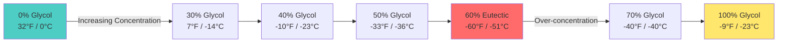

Понижение точки замерзания представляет собой фундаментальное коллигативное свойство, позволяющее гидронным системам работать ниже точки замерзания чистой воды. Понимание физической химии, управляющей этим явлением, необходимо для правильного проектирования антифризных растворов в системах обогрева снега, защиты наружных блоков от замерзания и в гидронных приложениях для холодного климата.

## Физические принципы защиты от замерзания

При растворении молекул гликоля в воде нарушается сеть водородных связей, которая позволяет молекулам воды образовывать кристаллы льда. Наличие молекул растворенного вещества снижает химический потенциал жидкой фазы, требуя более низких температур для достижения термодинамического равновесия между твердой и жидкой фазами.

Понижение точки замерзания следует коллигативному соотношению:

$$\Delta T_f = K_f \cdot m \cdot i$$

Где:
- $\Delta T_f$ = понижение точки замерзания (°C или °F)
- $K_f$ = криоскопическая постоянная растворителя (1.86 °C·kg/mol для воды)
- $m$ = моляльность раствора (моль растворенного вещества/кг растворителя)
- $i$ = фактор Вант-Гоффа (приблизительно 1.0 для гликолей)

Для практических применений в HVAC зависимость между массовой долей концентрации и точкой замерзания является нелинейной и определяется эмпирически в ходе лабораторных испытаний. Производители гликолей предоставляют данные о точке замерзания, учитывающие неидеальность раствора при высоких концентрациях.

## Зависимость концентрации от точки замерзания

Понижение точки замерзания увеличивается с ростом концентрации гликоля до критической точки, после чего дальнейшее добавление фактически повышает точку замерзания. Это поведение определяет эвтектический состав.

## Данные о точке замерзания гликоля

В следующей таблице представлены характеристики защиты от замерзания для растворов пропиленгликоля, являющегося стандартным антифризом для систем, совместимых с питьевой водой:

| Концентрация (% по массе) | Точка замерзания (°F) | Точка замерзания (°C) | Уровень защиты | Удельный вес (60°F) |
|------|--------------|----|----|----|
| 10% | 26 | -3 | Минимальный | 1.008 |
| 20% | 19 | -7 | Легкий | 1.017 |
| 30% | 7 | -14 | Средний | 1.026 |
| 40% | -10 | -23 | Стандартный | 1.034 |
| 50% | -33 | -36 | Для холодного климата | 1.041 |
| 60% | -60 | -51 | **Максимум эвтектики** | 1.045 |
| 70% | -40 | -40 | Переконцентрированный | 1.048 |
| 80% | -15 | -26 | Неэффективный | 1.051 |
| 90% | -5 | -21 | Неэффективный | 1.053 |

**Примечание:** Этиленгликоль обеспечивает несколько более низкие точки замерзания при эквивалентных концентрациях, но он токсичен и не допускается в системах с потенциальной возможностью подключения к питьевой воде.

## Особенности эвтектической точки

Эвтектическая точка представляет собой максимальную защиту от замерзания, достижимую в системе гликоль-вода. Для пропиленгликоля это происходит при концентрации примерно 60% по массе, обеспечивая защиту от замерзания до -60°F (-51°C). При этом составе раствор замерзает как однородная твердая фаза, а не образуя кристаллы льда в равновесии с концентрированной жидкостью.

За пределами эвтектической концентрации поведение раствора фундаментально меняется. Точка замерзания повышается, поскольку сам гликоль начинает ограничивать образование кристаллов. Чистый пропиленгликоль замерзает примерно при -74°F (-59°C), но концентрированный раствор при 70-80% замерзает при более высоких температурах из-за образования комплексов гидратов гликоля.

## Выбор расчетной концентрации

Правильное проектирование системы требует выбора концентрации гликоля, обеспечивающей защиту от замерзания до температуры ниже минимальной ожидаемой внешней температуры, с соответствующим коэффициентом запаса:

$$C_{required} = f(T_{design} - \Delta T_{safety})$$

Стандартная практика устанавливает расчетную температуру следующим образом:

- **Наружные применения:** на 5,6–8,3°C ниже расчетной зимней температуры при 99% обеспеченности
- **Внутренние применения с риском воздействия:** на 2,8–5,6°C ниже минимальной ожидаемой температуры
- **Критические системы:** защита до минимальной зарегистрированной температуры для данной местности

Чрезмерная концентрация выше эвтектической точки снижает морозостойкость, одновременно увеличивая вязкость жидкости, энергозатраты на перекачку и первоначальные затраты на заправку. Оптимальная концентрация обеспечивает баланс между требованиями к морозостойкости и эффективностью системы.

## Проверка концентрации

Полевая проверка концентрации гликоля проводится с помощью рефрактометра, который коррелирует показатель преломления с защитой от замерзания. Зависимость между показателем преломления и концентрацией зависит от температуры и требует коррекции:

$$n_{20°C} = n_{measured} + 0,00023(T_{measured} - 20)$$

Где $n$ представляет собой показание показателя преломления. Шкалы рефрактометров откалиброваны специально для пропиленгликоля или этиленгликоля и не являются взаимозаменяемыми.

## Эффекты деградации раствора

Окисление гликоля и его термическая деградация со временем изменяют характеристики защиты от замерзания. Кислотные продукты деградации могут снизить эффективную концентрацию и повысить точку замерзания на 2,8–5,6°C в течение 5–10 лет в системах без надлежащих ингибиторных пакетов. Ежегодное тестирование подтверждает, что раствор сохраняет достаточную защиту от замерзания в течение всего срока службы.

Понижение точки замерзания, достигаемое антифризными растворами, позволяет гидронным системам HVAC надежно работать в условиях замерзания. Правильный выбор и поддержание концентрации гликоля обеспечивает как защиту от замерзания, так и оптимальную энергоэффективность на протяжении всего срока службы системы.
