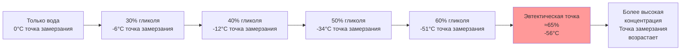
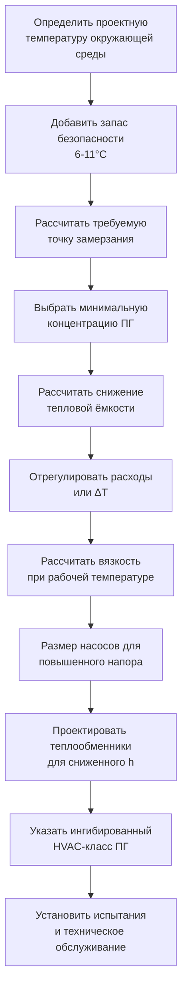

Пропиленгликоль обеспечивает защиту от замерзания гидронных систем таяния снега при сохранении низкой классификации токсичности. Выбор надлежащей концентрации балансирует требования защиты от замерзания против деградации производительности теплопередачи и потерь энергии насоса.

## Молекулярная структура и физические свойства

Пропиленгликоль (1,2-пропандиол, C₃H₈O₂) состоит из трёхуглеродной цепи с двумя гидроксильными группами, которые образуют прочные водородные связи с молекулами воды. Это молекулярное взаимодействие нарушает образование ледяных кристаллов и снижает точку замерзания ниже 0°C.

**Основные свойства при 25°C:**

| Свойство | Значение | Влияние |
|----------|---------|--------|
| Молекулярная масса | 76,09 г/моль | Расчеты концентрации |
| Плотность | 1,036 | Эффекты гидростатического давления |
| Удельная теплоёмкость (чистая) | 2,43 кДж/(кг·К) | Снижение тепловой ёмкости |
| Вязкость (чистая) | 50 сП | Требование энергии насоса |
| Теплопроводность | 0,201 Вт/(м·К) | Коэффициент теплопередачи |
| Температура вспышки | 99°C | Классификация по пожарной безопасности |

Гидроксильные группы позволяют пропиленгликолю оставаться жидким при температурах, при которых вода затвердевает, однако эти же группы значительно повышают вязкость по сравнению с водой (1,0 сП при 25°C).

## Физика депрессии точки замерзания

Когда пропиленгликоль растворяется в воде, молекулы гликоля препятствуют упорядоченному расположению молекул воды, необходимому для образования ледяных кристаллов. Депрессия точки замерзания следует закону Рауля для идеальных растворов, однако смеси гликоль-вода демонстрируют неидеальное поведение, требующее эмпирических корректировок.

**Теоретическое соотношение:**

$$\Delta T_f = K_f \cdot m \cdot i$$

Где:
- $\Delta T_f$ = депрессия точки замерзания (К)
- $K_f$ = криоскопическая постоянная для воды (1,86 К·кг/моль)
- $m$ = моляльность (моль растворённого вещества/кг растворителя)
- $i$ = фактор Вант-Гоффа (примерно 1 для гликоля)

Однако растворы гликоль-вода отклоняются от идеального поведения из-за водородного связывания. Фактические точки замерзания необходимо получать из экспериментальных данных.

### Зависимость концентрация-температура

Эвтектическая точка представляет максимальную депрессию точки замерзания. Концентрации, превышающие 65% по массе, обеспечивают сниженную защиту от замерзания при одновременном увеличении штрафов за вязкость.

### Данные точки замерзания пропиленгликоля

| Концентрация (% по объёму) | Концентрация (% по массе) | Точка замерзания (°C) | Защита от разрыва (°C) | Плотность при 20°C |
|---------------------------|-------------------------|----------------------|----------------------|-------------------|
| 20% | 19% | -7°C | -11°C | 1,015 |
| 30% | 29% | -6°C | -18°C | 1,022 |
| 40% | 38% | -12°C | -27°C | 1,027 |
| 50% | 48% | -34°C | -43°C | 1,031 |
| 60% | 58% | -51°C | -59°C | 1,034 |

**Примечание:** Температура защиты от разрыва указывает точку, при которой раствор образует прокачиваемую кашицу, а не расширяющийся твёрдый лёд. Это обеспечивает дополнительный запас безопасности ниже температуры кристаллизации.

## Требования к концентрации для систем таяния снега

Системы таяния снега должны сохранять защиту во время периодов остановки, когда теплоноситель остаётся неподвижным в подземных трубопроводах. Выбор концентрации следует двухэтапному процессу.

**Расчёт проектирования:**

$$C_{design} = f(T_{ambient,min} - \Delta T_{safety})$$

Где:
- $C_{design}$ = требуемая концентрация гликоля
- $T_{ambient,min}$ = наименьшая ожидаемая температура окружающей среды
- $\Delta T_{safety}$ = запас безопасности (6-11 К)

**Региональные примеры проектирования:**

| Местоположение | Проектная температура | Запас безопасности | Требуемая точка замерзания | Минимальная концентрация ПГ |
|---------------|----------------------|-------------------|--------------------------|-----------------------------|
| Чикаго, Иллинойс | -29°C | 8°C | -37°C | 52% |
| Денвер, Колорадо | -26°C | 8°C | -34°C | 50% |
| Бостон, Массачусетс | -23°C | 8°C | -31°C | 48% |
| Миннеаполис, Миннесота | -34°C | 8°C | -42°C | 57% |

### Рассмотрения при остановке системы

Системы таяния снега сталкиваются с уникальными трудностями в сравнении с гидронными системами жилых зданий:

1. **Продолжительные периоды остановки**: Системы остаются неработающими с апреля по октябрь в большинстве климатов
2. **Термические циклы**: Суточные колебания температуры создают напряжение при расширении/сжатии
3. **Отсутствие подачи тепла**: В отличие от систем отопления зданий, которые поддерживают повышенные температуры
4. **Подземное расположение**: Температуры грунта отстают от температуры воздуха, но могут достигать проектных минимумов

Эти факторы требуют консервативного выбора концентрации с адекватными запасами безопасности.

## Деградация производительности теплопередачи

Пропиленгликоль снижает эффективность теплопередачи тремя механизмами: сниженная удельная теплоёмкость, повышенная вязкость и сниженная теплопроводность.

### Снижение удельной теплоёмкости

Удельная теплоёмкость растворов пропиленгликоля снижается с увеличением концентрации:

$$c_p = c_{p,water} \cdot (1 - 0.008 \cdot C_{vol})$$

Где $C_{vol}$ — концентрация гликоля по объёму (%).

**Значения удельной теплоёмкости:**

| Концентрация гликоля | Удельная теплоёмкость при 25°C | Снижение в сравнении с водой |
|---------------------|--------------------------------|------------------------------|
| 0% (вода) | 4,18 кДж/(кг·К) | 0% |
| 30% | 3,84 кДж/(кг·К) | 8% |
| 40% | 3,68 кДж/(кг·К) | 12% |
| 50% | 3,51 кДж/(кг·К) | 16% |
| 60% | 3,35 кДж/(кг·К) | 20% |

**Компенсация расхода:**

Для передачи эквивалентной теплопроизводительности:

$$\dot{m}_{glycol} = \dot{m}_{water} \cdot \frac{c_{p,water}}{c_{p,glycol}}$$

Система с 50% пропиленгликолем требует на 19% более высокого расхода, чем вода, для передачи одинаковой тепловой мощности при эквивалентном температурном перепаде.

### Эффекты увеличения вязкости

Вязкость пропиленгликоля резко увеличивается с концентрацией и снижается с температурой. Это влияет на энергию насоса и коэффициенты теплопередачи.

**Данные динамической вязкости:**

| Температура | 30% ПГ | 40% ПГ | 50% ПГ | Вода (эталон) |
|------------|--------|--------|--------|---------------|
| -18°C | 22,0 сП | 35,0 сП | 58,0 сП | 1,8 сП |
| -7°C | 11,5 сП | 17,5 сП | 28,0 сП | 1,7 сП |
| 4°C | 7,0 сП | 10,2 сП | 15,0 сП | 1,5 сП |
| 25°C | 3,5 сП | 4,8 сП | 6,8 сП | 1,0 сП |

**Влияние энергии насоса:**

Потеря давления в трубопроводах следует уравнению Дарси-Вейсбаха:

$$\Delta P = f \cdot \frac{L}{D} \cdot \frac{\rho V^2}{2}$$

Где коэффициент трения $f$ зависит от числа Рейнольдса:

$$Re = \frac{\rho V D}{\mu}$$

Для турбулентного течения в гладкой трубе (уравнение Блазиуса):

$$f = \frac{0.316}{Re^{0.25}}$$

Член вязкости $\mu$ появляется в знаменателе числа Рейнольдса. Более высокая вязкость снижает $Re$, увеличивает $f$ и увеличивает потерю давления.

**Практическое сравнение энергии насоса при 4°C:**

| Теплоноситель | Вязкость (сП) | Относительный коэффициент трения | Относительная мощность насоса |
|---------------|--------------|-----------------------------------|------------------------------|
| Вода | 1,5 | 1,00 | 1,00 |
| 30% ПГ | 7,0 | 1,35 | 1,35 |
| 40% ПГ | 10,2 | 1,45 | 1,45 |
| 50% ПГ | 15,0 | 1,57 | 1,57 |

### Деградация коэффициента плёнки

Коэффициент конвективной теплопередачи снижается с повышением вязкости. Для турбулентного течения в трубах применяется уравнение Диттуса-Бёльтерта:

$$Nu = 0.023 \cdot Re^{0.8} \cdot Pr^{0.4}$$

Где:
- $Nu$ = число Нуссельта = $\frac{h \cdot D}{k}$
- $Pr$ = число Прандтля = $\frac{c_p \cdot \mu}{k}$
- $h$ = коэффициент конвективной теплопередачи

Зависимость числа Рейнольдса ($Re^{0.8}$) создаёт чувствительность к изменениям вязкости. Раствор с 50% пропиленгликоля, работающий при 4°C, демонстрирует приблизительно 15-20% снижение коэффициента теплопередачи в сравнении с водой.

**Влияние на размер теплообменника:**

Требуемая площадь теплопередачи увеличивается согласно:

$$A_{glycol} = A_{water} \cdot \frac{U_{water}}{U_{glycol}}$$

Проектируйте теплообменники для работы с гликолем с дополнительной площадью поверхности на 15-25% в сравнении с расчётами на основе воды.

## Профиль экологической безопасности

Основное преимущество пропиленгликоля перед этиленгликолем — низкая токсичность и экологическая совместимость.

### Классификация токсичности

FDA классифицирует пропиленгликоль как «Общепризнанный как безопасный» (GRAS) для контакта с продуктами питания. Пропиленгликоль присутствует в:
- Пищевых продуктах (гигроскопический агент, консервант)
- Фармацевтических препаратах (растворитель, носитель)
- Косметике и средствах личной гигиены

**Сравнительная токсичность:**

| Параметр | Пропиленгликоль | Этиленгликоль |
|----------|-----------------|--------------|
| Пероральная LD50 (крыса) | 20 000 мг/кг | 4 700 мг/кг |
| Чрескожная LD50 (кролик) | 20 800 мг/кг | 10 600 мг/кг |
| Классификация FDA | GRAS | Токсичный |
| Летальная доза (человек) | Не установлена | 100 мл |
| Путь метаболизма | Молочная кислота (нормальная) | Щавелевая кислота (токсичная) |

**Биоразложение:**

Пропиленгликоль легко биоразлагается в аэробных условиях:
- БПК (биохимическое потребление кислорода): 0,63 г O₂/г ПГ
- Полная минерализация за 7-28 дней
- Отсутствие биоаккумуляции
- Низкая водная токсичность (LC50 рыба > 40 000 мг/л)

### Соответствие нормативам

Использование пропиленгликоля разрешено без ограничений в:
- Применениях вблизи питьевой воды
- Жилых зданиях
- Пищевых предприятиях
- Медицинских учреждениях
- Школах и детских учреждениях

Многие юрисдикции запрещают или значительно ограничивают использование этиленгликоля в системах зданий из-за проблем взаимного загрязнения. Пропиленгликоль устраняет эти нормативные барьеры.

## Процесс проектирования системы

### Спецификация концентрации

Указывайте пропиленгликоль процентом по объёму с допуском ±2%. Спецификация по объёму упрощает полевое измерение и проверку с использованием рефрактометров.

**Пример спецификации:**
«Предусмотрите ингибированный пропиленгликоль HVAC-класса при концентрации 50% по объёму (±2%) для обеспечения защиты от замерзания до -34°C.»

### Требования к качеству

Указывайте ингибированный пропиленгликоль HVAC-класса, содержащий:
- Пропиленгликоль чистотой не менее 96%
- Пакет ингибиторов коррозии для систем с несколькими металлами
- pH-буферы для сохранения pH 8,5-10,5
- Противопенные агенты

Запретите автомобильные антифризы, содержащие силикаты, которые загрязняют теплообменники и выпадают в осадок в трубопроводах системы.

## Испытания и техническое обслуживание

Ежегодное испытание гликоля проверяет концентрацию и эффективность ингибитора.

**Требуемые испытания:**

| Параметр | Допустимый диапазон | Действие при выходе за пределы диапазона |
|----------|-------------------|------------------------------------------|
| Точка замерзания | Проектная значение ±3°C | Добавить концентрированный гликоль |
| pH | 8,0-10,5 | Заменить при <8,0 |
| Резервная щелочность | >50% от нового | Заменить при истощении |
| Прозрачность | Чистая, без осадка | Отфильтровать и исследовать |
| Металлы (Fe, Cu) | <50 ppm | Исследовать коррозию |

**Методы полевой проверки:**

1. **Рефрактометр (предпочтительно)**: Измеряет показатель преломления для определения концентрации. Температурно-компенсированные модели непосредственно читают точку замерзания. Точность: ±1°C.

2. **Ареометр**: Измеряет плотность для оценки концентрации. Требует температурную коррекцию. Точность: ±3°C.

3. **Лабораторный анализ**: Требуется ежегодно для полной оценки пакета ингибиторов.

## Ссылки ASHRAE

Следующие публикации ASHRAE предоставляют дополнительное руководство:

- **Справочник ASHRAE - Системы и оборудование HVAC, глава 21**: Комплексные таблицы свойств гликоля и руководство по выбору
- **Стандарт ASHRAE 147**: Сокращение выпуска галогенированных хладагентов из холодильного и кондиционирующего оборудования и систем
- **Справочник ASHRAE - Основы, глава 31**: Физические свойства вторичных хладагентов, включая гликоли

Выбор пропиленгликоля для систем таяния снега балансирует требования защиты от замерзания против потерь теплопередачи и энергии насоса при сохранении экологической безопасности и нормативного соответствия. Надлежащий выбор концентрации, корректировки конструкции системы и постоянное техническое обслуживание обеспечивают надёжную защиту от замерзания на протяжении всего срока службы системы.
