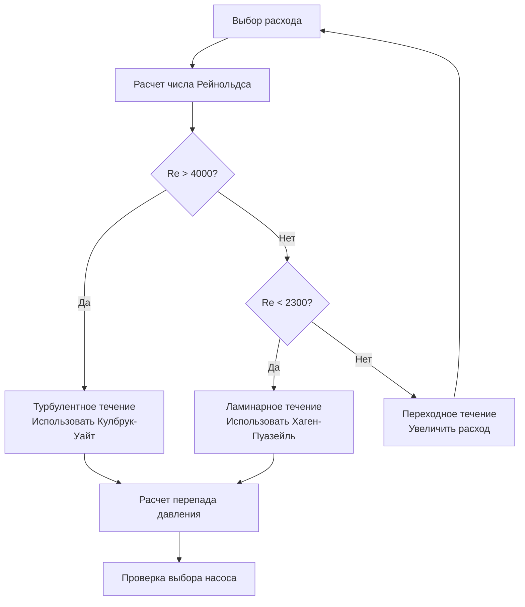

Вязкость гликоля принципиально изменяет характеристики гидродинамики жидкости и теплопередачи в системах снеготаяния. Вязкость растворов пропиленгликоля и этиленгликоля резко возрастает с концентрацией и снижается при повышении температуры, что требует значительных поправок при выборе насоса, проектировании трубопровода и определении размера теплообменника по сравнению с системами на основе воды.

## Зависимость вязкости от температуры

Вязкость растворов гликоля следует экспоненциальной зависимости от температуры, которая описывается уравнением Андраде.

### Зависимость вязкости от температуры

Для смесей гликоля и воды динамическая вязкость $\mu$ изменяется с абсолютной температурой $T$ согласно:

$$\mu(T) = A \cdot e^{B/T}$$

Где:
- $\mu$ = динамическая вязкость (сП или Па·с)
- $T$ = абсолютная температура (К)
- $A$, $B$ = эмпирические константы, зависящие от концентрации

**Практические последствия:**
- Вязкость примерно удваивается при каждом снижении температуры на 11 °C для 50% растворов гликоля
- Условия при запуске при низких температурах создают максимальную вязкость и сопротивление насоса
- Проектирование системы должно учитывать наивысшую вязкость (самую низкую рабочую температуру)

### Влияние концентрации

Вязкость нелинейно возрастает с концентрацией гликоля. Эта зависимость демонстрирует максимум при концентрации примерно 70-80% как для пропиленгликоля, так и для этиленгликоля.

| Температура | Вода | 30% ПГ | 50% ПГ | 30% ЭГ | 50% ЭГ |
|-------------|------|--------|--------|--------|--------|
| −18 °C | 3,2 сП | 9,5 сП | 45 сП | 6,8 сП | 28 сП |
| −7 °C | 2,2 сП | 6,2 сП | 25 сП | 4,8 сП | 17 сП |
| 4 °C | 1,5 сП | 4,1 сП | 14 сП | 3,2 сП | 10 сП |
| 27 °C | 0,86 сП | 2,0 сП | 5,5 сП | 1,6 сП | 4,0 сП |
| 49 °C | 0,56 сП | 1,2 сП | 3,0 сП | 1,0 сП | 2,3 сП |

Отношение вязкости между раствором гликоля и водой при одной и той же температуре определяет коэффициенты коррекции для расчетов мощности насоса, перепада давления и теплопередачи.

## Увеличение перепада давления

Повышенная вязкость прямо влияет на потери давления из-за трения через корреляцию коэффициента трения. Зависимость определяется режимом течения.

### Ламинарное течение (Re < 2300)

В ламинарном течении перепад давления определяется уравнением Хагена-Пуазейля:

$$\Delta P = \frac{32 \mu L V}{D^2}$$

Где:
- $\Delta P$ = перепад давления (Па)
- $\mu$ = динамическая вязкость (Па·с)
- $L$ = длина трубопровода (м)
- $V$ = средняя скорость (м/с)
- $D$ = внутренний диаметр трубопровода (м)

**Ключевой момент:** Перепад давления прямо пропорционален вязкости в ламинарном течении. Увеличение вязкости с 1 сП до 25 сП приводит к 25-кратному увеличению перепада давления при постоянном расходе.

### Турбулентное течение (Re > 4000)

Применяется уравнение Дарси-Вейсбаха с корреляцией коэффициента трения Кулбрука-Уайта:

$$\Delta P = f \frac{L}{D} \frac{\rho V^2}{2}$$

Коэффициент трения $f$ для турбулентного течения вычисляется из:

$$\frac{1}{\sqrt{f}} = -2.0 \log_{10}\left(\frac{\varepsilon/D}{3.7} + \frac{2.51}{Re\sqrt{f}}\right)$$

Где:
- $f$ = коэффициент трения Дарси (безразмерный)
- $\rho$ = плотность жидкости (кг/м³)
- $\varepsilon$ = абсолютная шероховатость трубопровода (м)
- $Re$ = число Рейнольдса

**Влияние вязкости на турбулентное течение:**

Хотя не прямо пропорционально, повышенная вязкость снижает число Рейнольдса, которое увеличивает коэффициент трения. Для стальной коммерческой трубы при Re = 50000 увеличение вязкости с воды на 50% пропиленгликоль при 4 °C типично увеличивает перепад давления на 30-45%.

### Влияние числа Рейнольдса

Число Рейнольдса определяет режим течения и влияет как на перепад давления, так и на теплопередачу:

$$Re = \frac{\rho V D}{\mu} = \frac{4\dot{m}}{\pi D \mu}$$

Где $\dot{m}$ — массовый расход.

**Критические соображения:**

- Системы, спроектированные для турбулентного течения с водой, могут работать в переходном режиме с гликолем
- Переходное течение (2300 < Re < 4000) демонстрирует нестабильное поведение, непригодное для расчета
- Минимальное число Рейнольдса 4000 должно быть обеспечено для надежных предсказаний турбулентного течения



## Коррекции при расчете насоса

Выбор насоса для гликолевых систем требует корректировок как высоты подъема, так и расчетов мощности.

### Коэффициент коррекции высоты подъема

Требуемая высота подъема насоса увеличивается из-за более высоких потерь на трение. Коэффициент коррекции высоты подъема учитывает влияние вязкости на кривую системы:

$$H_{гликоль} = H_{вода} \times C_H$$

Где $C_H$ — коэффициент коррекции высоты подъема, определяемый из:

$$C_H = \frac{(\Delta P)_{гликоль}}{(\Delta P)_{вода}}$$

Для систем с турбулентным течением приблизительные коэффициенты коррекции, основанные на отношении вязкостей:

| Отношение вязкостей ($\mu_{гликоль}/\mu_{вода}$) | Коррекция высоты $C_H$ |
|----------------------------------------------|----------------------|
| 1-2 | 1,05-1,10 |
| 2-5 | 1,10-1,25 |
| 5-10 | 1,25-1,45 |
| 10-20 | 1,45-1,70 |
| 20-30 | 1,70-1,95 |

### Коррекция кривой насоса

Кривые производительности центробежного насоса, опубликованные для воды, требуют корректировки при перекачивании вязких жидкостей. Метод Hydraulic Institute предоставляет коэффициенты коррекции для высоты подъема ($C_H$), расхода ($C_Q$) и эффективности ($C_{\eta}$).

**Процедура коррекции:**

1. Определить производительность воды в точке наилучшей эффективности (BEP)
2. Рассчитать кинематическую вязкость: $\nu = \mu/\rho$ (сантистоксы)
3. Применить коэффициенты коррекции из таблиц Hydraulic Institute
4. Рассчитать производительность для вязкой жидкости:

$$Q_{вязкая} = Q_{вода} \times C_Q$$
$$H_{вязкая} = H_{вода} \times C_H$$
$$\eta_{вязкая} = \eta_{вода} \times C_{\eta}$$

**Типичные коэффициенты коррекции для 50% пропиленгликоля при 4 °C:**
- Коррекция расхода: $C_Q$ = 0,95-0,98
- Коррекция высоты подъема: $C_H$ = 0,90-0,95 (высота уменьшается при заданном расходе)
- Коррекция эффективности: $C_{\eta}$ = 0,85-0,92

### Требуемая мощность

Мощность на валу насоса, требуемая для перекачивания гликоля, увеличивается из-за как более высокой высоты подъема, так и сниженной эффективности:

$$BHP = \frac{Q \times H \times SG}{3960 \times \eta}$$

Где:
- $BHP$ = мощность на валу (кВт)
- $Q$ = расход (л/мин)
- $H$ = полная высота подъема (м)
- $SG$ = удельный вес (безразмерный)
- $\eta$ = эффективность насоса (десятичная дробь)

**Практическое воздействие:**

Правильно подобранный насос для системы снеготаяния с 50% пропиленгликолем типично требует 40-60% больше мощности, чем эквивалентная система на воде при одном и том же расходе и перепаде температуры при проектировании.

## Влияние расхода

Вязкость гликоля влияет на требуемый расход через множественные механизмы, включающие как термодинамические, так и транспортные свойства.

### Пониженная удельная теплоемкость

Растворы гликоля имеют более низкую удельную теплоемкость, чем вода, что требует увеличенного расхода для доставки эквивалентной теплопередачи:

$$\dot{Q} = \dot{m} c_p \Delta T$$

| Жидкость | Удельная теплоемкость при 25 °C |
|-------|---------------------|
| Вода | 4,18 кДж/(кг·К) |
| 30% пропиленгликоль | 3,89 кДж/(кг·К) |
| 50% пропиленгликоль | 3,55 кДж/(кг·К) |
| 30% этиленгликоль | 3,93 кДж/(кг·К) |
| 50% этиленгликоль | 3,68 кДж/(кг·К) |

При постоянной скорости теплопередачи и перепаде температуры расход должен увеличиться обратно пропорционально удельной теплоемкости:

$$\frac{\dot{m}_{гликоль}}{\dot{m}_{вода}} = \frac{(c_p)_{вода}}{(c_p)_{гликоль}}$$

### Снижение коэффициента теплопередачи

Пленочный коэффициент снижается при повышенной вязкости согласно корреляции Сидера-Тейта для турбулентного течения в трубах:

$$Nu = 0.027 Re^{0.8} Pr^{1/3} \left(\frac{\mu}{\mu_s}\right)^{0.14}$$

Где:
- $Nu$ = число Нуссельта
- $Pr$ = число Прандтля = $c_p \mu / k$
- $\mu$ = вязкость жидкости в объеме
- $\mu_s$ = вязкость при температуре стенки

Коэффициент теплопередачи:

$$h = \frac{Nu \cdot k}{D}$$

**Влияние вязкости на теплопередачу:**

Более высокая вязкость увеличивает число Прандтля, но снижает число Рейнольдса. Чистый эффект типично снижает коэффициент теплопередачи на 10-25% для типичных концентраций гликоля.

Для сохранения расчетного теплового потока при сниженном пленочном коэффициенте необходимо одно из следующего:
1. Увеличить перепад температуры (типично для снеготаяния)
2. Увеличить скорость течения (увеличивает Re и теплопередачу)
3. Увеличить площадь поверхности теплообменника

### Комбинированный коэффициент расхода

Общее увеличение расхода, требуемое для гликолевых систем, результат:

$$\dot{V}_{гликоль} = \dot{V}_{вода} \times \frac{(c_p)_{вода}}{(c_p)_{гликоль}} \times \frac{(SG)_{гликоль}}{(SG)_{вода}} \times C_{HT}$$

Где $C_{HT}$ — коэффициент коррекции теплопередачи (типично 1,05-1,15 для 30-50% гликоля).

**Пример расчета:**

Для 50% пропиленгликоля против воды:
- Отношение удельной теплоемкости: 4,18/3,55 = 1,18
- Отношение удельного веса: 1,04/1,00 = 1,04
- Коррекция теплопередачи: 1,10

Полная коррекция расхода: $1,18 \times 1,04 \times 1,10 = 1,35$

Система с гликолем требует 35% больший объемный расход, чем вода, для достижения эквивалентной производительности нагрева.

## Методология расчета при проектировании

Систематический подход обеспечивает точный выбор насоса и проектирование системы для применений гликолевого снеготаяния.

```mermaid
flowchart TD
    A[Требования системы] --> B[Выбор рабочих температур]
    B --> C[Определение концентрации гликоля]
    C --> D[Свойства жидкости при расчетной температуре]

    D --> E[Расчет теплоотдачи]
    E --> F[Определение расхода<br/>Q = q/(ρ·cp·ΔT)]

    F --> G[Расчет числа Рейнольдса]
    G --> H{Re > 4000?}
    H -->|Нет| I[Увеличить скорость или размер трубы]
    I --> F

    H -->|Да| J[Расчет перепада давления<br/>Все компоненты]
    J --> K[Применение кривой системы]

    K --> L[Выбор насоса из кривых воды]
    L --> M[Применение коррекций вязкости<br/>Hydraulic Institute]

    M --> N[Проверка рабочей точки]
    N --> O{Приемлемая<br/>производительность?}
    O -->|Нет| P[Переуточнение насоса]
    P --> L

    O -->|Да| Q[Расчет требуемой мощности]
    Q --> R[Выбор электродвигателя]
    R --> S[Финальный проект]
```

### Пошаговая процедура

**1. Установление условий проектирования**
- Минимальная температура окружающей среды
- Требуемая температура поверхности плиты
- Требуемый тепловой поток для снеготаяния
- Геометрия системы и площадь

**2. Выбор концентрации гликоля**
- Точка замерзания при проектировании = минимальная температура окружающей среды − коэффициент безопасности 6-11 °C
- Выбор концентрации из таблиц депрессии точки замерзания
- Типично: 30-50% по объему для большинства применений

**3. Определение свойств жидкости**
- Динамическая вязкость $\mu$ при температурах подачи и возврата
- Удельная теплоемкость $c_p$ при средней температуре жидкости
- Плотность $\rho$ при средней температуре
- Теплопроводность $k$ для расчетов теплопередачи

**4. Расчет требуемого расхода по массе**

$$\dot{m} = \frac{\dot{Q}}{c_p \Delta T}$$

Преобразование в объемный расход:

$$\dot{V} = \frac{\dot{m}}{\rho}$$

Где:
- $\dot{Q}$ = полная теплоотдача (кВт)
- $\Delta T$ = перепад температуры подачи-возврата (К)

**5. Проверка режима течения**

$$Re = \frac{4 \dot{m}}{\pi D \mu}$$

Обеспечение Re > 4000 во всех участках трубопровода. Если нет, увеличить расход или снизить диаметр трубы.

**6. Расчет перепада давления**

Для каждого участка трубопровода:

$$\Delta P_{трубопровод} = f \frac{L}{D} \frac{\rho V^2}{2}$$

Включение всех фитингов, используя метод эквивалентной длины или K-факторы.

Суммирование полного перепада давления в системе:

$$\Delta P_{полный} = \sum \Delta P_{трубопровод} + \sum \Delta P_{фитинги} + \Delta P_{TX}$$

**7. Применение выбора насоса**

Преобразование полного перепада давления в высоту подъема:

$$H = \frac{\Delta P}{\rho g}$$

Выбор насоса, обеспечивающего требуемую высоту подъема при расчетном расходе с минимум 15% допуском.

**8. Коррекция производительности насоса**

Применение коэффициентов коррекции Hydraulic Institute для вязкой среды. Проверка скорректированной рабочей точки в приемлемом диапазоне кривой насоса (70-110% от расхода BEP).

**9. Расчет эксплуатационных затрат**

$$Годовое\ кВт·ч = кВт \times 8,76 \times часы_{эксплуатация} / \eta_{двигателя}$$

## Практические рекомендации

**Проектирование трубопровода:**
- Ограничить скорость на 1,2-2,4 м/с для баланса перепада давления и теплопередачи
- Использовать большие размеры труб, чем для систем на воде, для обеспечения разумного перепада давления
- Минимизировать потери на фитинги через гладкие переходы и отводы с большим радиусом

**Выбор насоса:**
- Выбрать насосы с плоскими кривыми производительности для минимизации вариации высоты подъема при изменении расхода
- Указать механические уплотнения, рассчитанные на гликольную среду
- Предусмотреть запас по производительности 10-20% сверх расчетных требований

**Эксплуатация системы:**
- Контроль фактических расходов во время наладки для проверки предположений проекта
- Учет повышенных требований к мощности при запуске с холодной вязкой жидкостью
- Рассмотрение переменной скорости насоса для снижения потребления энергии при мягких условиях

**Управление температурой:**
- Более высокие температуры подачи снижают вязкость и улучшают эффективность системы
- Баланс между температурой подачи и потерями тепла, а также пределами температуры материалов
- Типичные системы снеготаяния работают при температуре подачи 38-60 °C, возврата 27-49 °C

**Выбор размера теплообменника:**
- Применение 15-25% дополнительной площади поверхности для гликольной среды в сравнении с водой
- Проверка коэффициентов коррекции производителя для специфической геометрии теплообменника
- Рассмотрение снижения эффективности при расчетных условиях

Комбинация повышенной вязкости, пониженной удельной теплоемкости и измененных транспортных свойств требует комплексного анализа полной системы. ASHRAE Handbook - HVAC Systems and Equipment Chapter 51 предоставляет полное руководство по проектированию и данные свойств для применений снеготаяния с использованием растворов гликоля.
