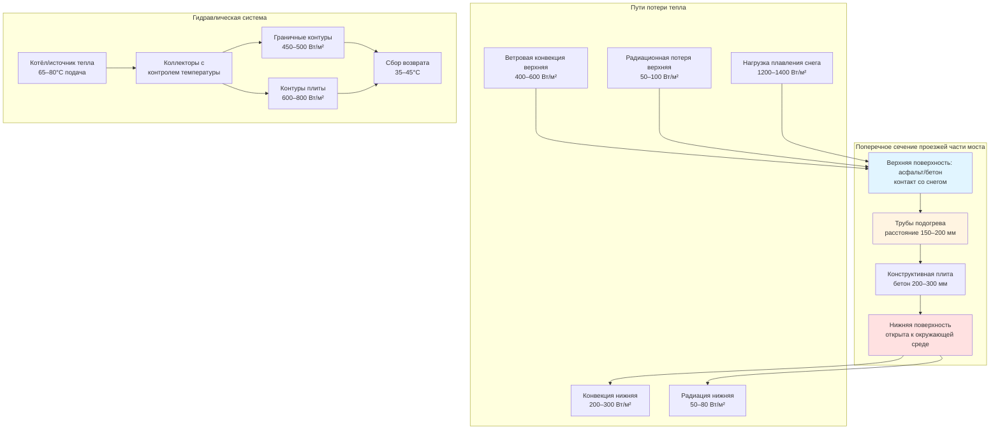

## Физические принципы потери тепла проезжей части моста

Проезжие части мостов представляют уникально сложные граничные тепловые условия для систем плавления снега из-за воздействия на верхнюю и нижнюю поверхности. В отличие от плит, связанных с грунтом, которые получают пользу от земляной изоляции (k = 0,8–1,4 Вт/м·К), проезжие части мостов испытывают конвективные и радиационные потери тепла со всех открытых поверхностей, что приводит к требованиям по тепловому потоку в 2–4 раза выше, чем в эквивалентных наземных приложениях.

Фундаментальный энергетический баланс системы подогрева проезжей части моста, работающей в режиме плавления снега:

$$Q_{total} = Q_{snow} + Q_{conv,top} + Q_{conv,bottom} + Q_{rad,top} + Q_{rad,bottom} + Q_{edge}$$

Где каждый член представляет тепловой поток в Вт/м². Двусторонняя поверхностная экспозиция создает эффект теплового короткого замыкания, при котором тепло, подаваемое на верхнюю поверхность, проводится через бетон и рассеивается с нижней поверхности до плавления снега.

## Анализ теплопередачи

### Конвективная потеря на верхней поверхности

Ветровая конвекция доминирует в потере тепла верхней поверхности:

$$Q_{conv,top} = h_{top}(T_{surface} - T_{air})$$

Коэффициент конвекции для проезжей части моста в зимних условиях:

$$h_{top} = 5.7 + 3.8v_{wind}$$

Где v_wind — скорость ветра в м/с. При ветре 10 м/с (обычном для возвышенных конструкций), h_top достигает 43 Вт/м²·К, в сравнении с 17–23 Вт/м²·К для защищённых наземных приложений.

### Потеря тепла с нижней поверхности

Нижняя сторона испытывает вынужденную конвекцию от движения воздуха, вызванного транспортом, и естественную конвекцию:

$$Q_{conv,bottom} = h_{bottom}(T_{surface} - T_{ambient})$$

Для большинства приложений мостов:

$$h_{bottom} = 12-20 \text{ Вт/м}^2\cdot\text{К}$$

Это представляет 25–35% от общих потерь тепла системы и уникально для применений проезжей части моста.

### Компонент плавления снега

Термодинамическое требование для плавления снега при интенсивности осадков s (мм/ч):

$$Q_{snow} = s \cdot \rho_{snow} \cdot (h_{fusion} + c_p \Delta T)$$

Для типичных условий проектирования (s = 25 мм/ч, ρ_snow = 150 кг/м³, плавление с –10°C):

$$Q_{snow} = 25 \times 0.15 \times (334 + 2.1 \times 10) = 1,333 \text{ Вт/м}^2$$

### Анализ граничной балки

Граничные балки моста создают дополнительные тепловые мосты:

$$Q_{edge} = U_{beam} \cdot A_{beam}/A_{deck} \cdot (T_{fluid} - T_{air})$$

Подогрев краёв может требовать специализированных контуров при 350–500 Вт/м² из-за трёхмерной геометрии потери тепла.

## Требования к проектной тепловой нагрузке

Сравнение тепловых нагрузок:

| Параметр | Наземная плита | Проезжая часть моста | Коэффициент увеличения |
|-----------|-------------|-------------|-----------------|
| Базовый тепловой поток | 300–400 Вт/м² | 600–800 Вт/м² | 2,0–2,5× |
| Потеря при ветровом воздействии | 150–200 Вт/м² | 400–600 Вт/м² | 2,5–3,0× |
| Потеря на обратной поверхности | 0 Вт/м² | 200–300 Вт/м² | N/A |
| Граничные эффекты | 50–75 Вт/м² | 150–250 Вт/м² | 2,5–3,5× |
| **Итого проектная нагрузка** | **500–675 Вт/м²** | **1,350–1,950 Вт/м²** | **2,7–2,9×** |
| Температура теплоносителя | 35–45°C | 50–65°C | 1,4–1,5× |
| Расстояние между трубами | 200–300 мм | 150–200 мм | 0,67–0,75× |

## Конфигурация системы

## Стратегии теплоизоляции

Хотя полная тепловая развязка непрактична, стратегическая изоляция снижает потери тепла:

### Изоляция нижней поверхности

Установка жёсткой изоляции (RSI-2,1 до RSI-3,5) на нижнюю сторону плиты снижает потери на обратной стороне на 60–75%:

$$Q'_{bottom} = \frac{Q_{bottom}}{1 + h_{bottom} \cdot R_{insulation}}$$

Для изоляции RSI-2,1 с h_bottom = 15 Вт/м²·К:

$$\text{Снижение} = \frac{15 \times 2.1}{1 + 15 \times 2.1} = 0.97 \rightarrow 97\% \text{ эффективно}$$

Это снижает общую нагрузку на систему на 15–25%.

### Обработка граничной балки

Вертикальная изоляция на граничных балках предотвращает боковое проведение. Эффективная толщина 50–75 мм с k ≤ 0,035 Вт/м·К.

## Стратегии управления

Системы проезжей части моста требуют предварительного управления из-за быстрого охлаждения:

**Скорость снижения температуры плиты:**

$$\frac{dT}{dt} = -\frac{h_{eff} \cdot A}{m \cdot c_p}(T_{slab} - T_{ambient})$$

Где h_eff включает объединённую верхнюю и нижнюю конвекцию. Проезжие части мостов охлаждаются в 3–5 раз быстрее, чем наземные плиты, что требует активации системы на 2–4 часа раньше событий осадков.

## Стандарты и справочные материалы по проектированию

- **ASHRAE Handbook—HVAC Applications, Chapter 51:** Предоставляет методологию расчёта теплового потока проезжей части моста
- **ACI 330.1:** Спецификация для неармированного бетонного покрытия и накладок с системами плавления снега
- **ASTM E2551:** Стандартная спецификация для гидравлических систем плавления снега проезжей части моста
- **Руководства по подогреву мостов государственных DOT:** Многие штаты публикуют конкретные требования (типично: 1,500–2,000 Вт/м² пиковая нагрузка)

## Практические соображения по проектированию

### Расстояние между трубами и глубина

Более близкое расстояние компенсирует более высокие потери тепла:

$$\text{Расстояние} = 2 \times \sqrt{\frac{k_{concrete} \cdot d \cdot (T_{fluid} - T_{air})}{Q_{required}}}$$

Типичный диапазон: 150–200 мм на глубине 50–75 мм.

### Зонирование системы

Разделите проезжие части мостов на зоны:

1. **Центральные полосы:** 600–800 Вт/м² (частичная защита от ветра транспортом)
2. **Граничные полосы:** 800–1,000 Вт/м² (полное ветровое воздействие)
3. **Граничные балки:** 400–500 Вт/м² (сосредоточенное линейное тепло)

### Защита от замерзания

Даже во время простоя поддерживайте температуру плиты выше 2–3°C, чтобы предотвратить образование льда из остаточной влаги. Это требует ввода фонового тепла в 150–250 Вт/м².

## Экономический анализ

Системы подогрева проезжей части моста имеют более высокие затраты на установку (350–550 $/м² против 200–300 $/м² для наземных плит), но обеспечивают критические преимущества безопасности. Штраф на эксплуатационные затраты от повышенного теплового потока компенсируется снижением зимних работ по содержанию, предотвращением аварий и продлением срока службы плиты благодаря исключению циклов замораживания-оттаивания и снижению воздействия хлоридов.

**Сравнение эксплуатационной тепловой нагрузки:**

- Наземная плита: 120–150 Вт·ч/м² за событие снегопада
- Проезжая часть моста: 350–500 Вт·ч/м² за событие снегопада

Штраф в энергии в 2,5–3,5× оправдан исключением механического снежного удаления на конструктивно чувствительных возвышенных поверхностях.
