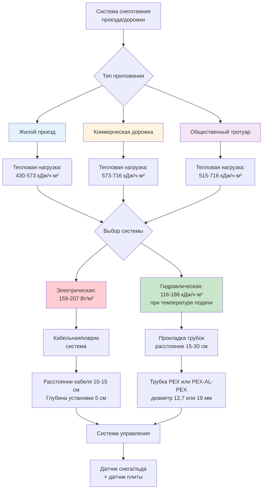
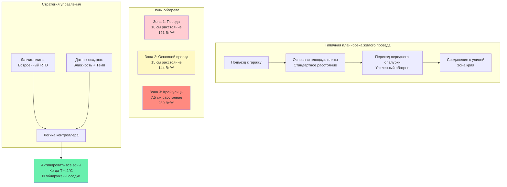

Проезды и пешеходные дорожки представляют наиболее распространённые применения систем снеготаяния, начиная от жилых проездов, требующих 19-37 м² обогреваемой площади, и заканчивая коммерческими комплексами с тысячами квадратных метров пешеходных и проезжих поверхностей. Инженерный подход существенно различается между этими приложениями из-за требований к нагрузке, графиков работы и ожиданий производительности. Успех зависит от точного определения тепловой нагрузки, выбора надлежащей системы и методов установки, обеспечивающих долгосрочную надёжность.

## Основы теплопередачи

Снеготаяние включает три одновременных процесса теплопередачи, которые должны быть преодолены для поддержания чистого покрытия:

**Чувствительное тепло для повышения температуры снега:**

Когда снег падает при температуре воздуха $T_a$ ниже точки замерзания и должен быть нагрет до точки плавления (0°C):

$$q_s = \dot{m} \cdot c_p \cdot (T_m - T_a)$$

Где:
- $q_s$ = плотность потока чувствительного тепла (кДж/ч·м²)
- $\dot{m}$ = поток массы снегопада (кг/ч·м²)
- $c_p$ = удельная теплоёмкость льда (2,093 кДж/кг·°C)
- $T_m$ = температура плавления (0°C)
- $T_a$ = температура окружающего воздуха (°C)

**Скрытое тепло для фазового перехода:**

Плавление снега из твёрдого состояния в жидкое требует значительного ввода энергии:

$$q_l = \dot{m} \cdot h_{fg}$$

Где:
- $q_l$ = плотность потока скрытого тепла (кДж/ч·м²)
- $h_{fg}$ = теплота плавления льда (334 кДж/кг)

**Потери тепла в окружающую среду:**

Нагретая поверхность постоянно теряет тепло в холодные условия окружающей среды через конвекцию и излучение:

$$q_e = h_c \cdot (T_s - T_a) + \varepsilon \sigma (T_s^4 - T_{sky}^4)$$

Где:
- $q_e$ = потери тепла в окружающую среду (кДж/ч·м²)
- $h_c$ = коэффициент конвективной теплопередачи (кДж/ч·м²·°C)
- $T_s$ = температура поверхности (°C абсолютная)
- $\varepsilon$ = коэффициент излучения поверхности (обычно 0,85-0,95 для бетона)
- $\sigma$ = постоянная Стефана-Больцмана

Коэффициент конвекции варьируется в зависимости от скорости ветра согласно:

$$h_c = 1,1 \cdot v^{0,8}$$

Где $v$ = скорость ветра (км/ч).

Для типичных условий (16-32 км/ч ветра), $h_c$ находится в диапазоне 23-40 кДж/ч·м²·°C.

## Расчёт общей тепловой нагрузки

Методология ASHRAE объединяет эти компоненты в общий требуемый тепловой поток:

$$q_{total} = q_s + q_l + q_e + q_{back}$$

Где $q_{back}$ представляет потери тепла в основание (обычно 10-15% поверхностного потока для хорошо изолированных систем).

**Пример жилого проезда:**

Условия проектирования для умеренного климата (ASHRAE Класс II):
- Интенсивность снегопада: 2,54 см/ч (эквивалент 0,24 кг/ч·м²)
- Температура воздуха: -7°C
- Скорость ветра: 24 км/ч
- Целевая температура поверхности: 2°C

Расчёт чувствительного тепла:

$$q_s = 0,24 \times 2,093 \times (0 - (-7)) = 3,51 \text{ кДж/ч·м}^2$$

Расчёт скрытого тепла:

$$q_l = 0,24 \times 334 = 80,2 \text{ кДж/ч·м}^2$$

Расчёт конвективных потерь:

$$h_c = 1,1 \times 24^{0,8} = 10,5 \text{ кДж/ч·м}^2\text{·°C}$$

$$q_{conv} = 10,5 \times (2 - (-7)) = 94,5 \text{ кДж/ч·м}^2$$

Добавляя потери излучением (примерно 86 кДж/ч·м²) и потери через основание (69 кДж/ч·м²):

$$q_{total} = 3,51 + 80,2 + 94,5 + 86 + 69 = 333,2 \text{ кДж/ч·м}^2$$

Округление в большую сторону до 430 кДж/ч·м² для запаса конструкции или использование консервативного значения ASHRAE Класс II 515 кДж/ч·м².

## Проектирование системы по типам приложения

## Требования к проектированию жилых и коммерческих систем

| Параметр | Жилой проезд | Коммерческая дорожка | Обоснование конструкции |
|-----------|---------------------|-------------------|------------------|
| **Тепловой поток** | 430-573 кДж/ч·м² | 573-716 кДж/ч·м² | Коммерческая система требует более быстрого очищения и большей надёжности |
| **Площадь охвата** | 19-74 м² | 46-465 м² | Экономика определяет частичное покрытие в жилых системах |
| **Время отклика** | 30-60 минут | 15-30 минут | Ответственность требует быстрого отклика в коммерческих системах |
| **Производительность без снега** | 80-90% событий | 95-99% событий | Коммерческие системы должны работать надёжно |
| **Стратегия холостого хода** | Только автоматическая | Может использовать предпрогрев | Коммерческие бюджеты поддерживают упреждающую работу |
| **Тип системы** | Электрическая (70%) | Обе (50/50) | Простота электрической системы подходит для жилой установки |
| **Плотность мощности (Электрическая)** | 159-191 Вт/м² | 191-239 Вт/м² | Более высокая плотность улучшает производительность коммерческой системы |
| **Расстояние трубок (Гидравлическая)** | 23-30 см | 15-23 см | Более плотное расстояние для коммерческой однородности |
| **Требование изоляции** | Только края (R-0,88) | Полный периметр (R-1,76) | Коммерческая экономия оправдывает стоимость изоляции |
| **Сложность управления** | Один регион | Несколько регионов распространены | Большие коммерческие площади выигрывают от зонирования |
| **Типичный бюджет** | 160-267 руб./м² | 267-428 руб./м² | Коммерческие системы включают расходы на инфраструктуру |
| **Резервное питание** | Редко | Часто требуется | Критический доступ требует надёжности |
| **Стандарт проектирования** | ASHRAE Класс II | ASHRAE Класс III | Более высокий класс производительности коммерческой системы |

## Проектирование электрической системы для проездов

Электрические системы доминируют в жилых приложениях проездов благодаря простоте установки и низким начальным затратам. Процесс проектирования следует систематическому подходу:

**Выбор плотности мощности:**

Для ASHRAE Класс II (515 кДж/ч·м²):

$$P_{density} = \frac{515}{3,6} = 143 \text{ Вт/м}^2$$

Определить 159 Вт/м² для адекватного запаса.

**Расчёт расстояния кабеля:**

Используя кабель с постоянной мощностью 57 Вт/м:

$$S = \frac{P_{cable} \times 100}{P_{density}} = \frac{57 \times 100}{159} = 36 \text{ см}$$

Определить расстояние 10 см между осями. Это обеспечивает:

$$P_{actual} = \frac{57 \times 100}{10} = 570 \text{ Вт/м}^2$$

**Обработка периметра:**

Периметральные зоны в пределах 60 см открытых краёв требуют 1,5× плотность мощности:

$$P_{edge} = 159 \times 1,5 = 239 \text{ Вт/м}^2$$

Добиться этого путём уменьшения расстояния до 7,5 см по краям или установки кабеля с более высокой мощностью (86 Вт/м при расстоянии 10 см).

## Проектирование гидравлической системы для дорожек

Гидравлические системы обеспечивают экономичный обогрев крупных коммерческих дорожек при наличии котельной инфраструктуры. Планировка трубок определяет равномерность распределения тепла.

**Определение расстояния трубок:**

Для требования 573 кДж/ч·м² при температуре подачи 60°C, перепаде температуры 8°C и плите толщиной 15 см:

Требуемое выделение тепла на линейный метр трубки:

$$q_{tube} = \frac{Q_{total} \times S}{100}$$

Где $S$ = расстояние трубок (см).

Для расстояния 23 см:

$$q_{tube} = \frac{573 \times 23}{100} = 132 \text{ кДж/ч·м}$$

Этот выход достижим с трубкой PEX диаметром 12,7 мм при температуре воды по конструкции.

**Расчёт расхода:**

Для подачи 132 кДж/ч·м с перепадом температуры 8°C:

$$\dot{m} = \frac{q_{tube}}{c_p \Delta T} = \frac{132}{4,18 \times 8} = 3,95 \text{ кг/ч·м}$$

Для петли трубки 91 м:

$$\dot{m}_{loop} = 3,95 \times 91 = 359 \text{ кг/ч} = 0,1 \text{ кг/с} = 0,36 \text{ м}^3\text{/ч}$$

## Принципы проектирования планировки

## Проектирование специально для пешеходных дорожек

Пешеходные дорожки представляют уникальные инженерные проблемы, отличные от проезжих поверхностей:

**Условия нагрузки:**

Дорожки испытывают минимальные конструктивные нагрузки, позволяя более тонкие плиты (10 см против 15 см для проездов). Это уменьшает тепловую массу и улучшает время отклика, но требует тщательного анализа теплового напряжения для предотвращения трещин.

**Отделка поверхности:**

Пешеходные поверхности требуют текстуры без скольжения. Щёткообработанный бетон или открытый заполнитель обеспечивают сцепление во влажном состоянии. Избежать гладкой отделки, которая становится опасной при наличии тонких водяных плёнок.

**Соответствие требованиям доступности:**

Доступные маршруты должны иметь максимальный уклон 1:12 (8,33%) и поперечный уклон менее 2%. Системы снеготаяния должны поддерживать эти уклоны без образования лужи. Дренажное проектирование становится критическим, с системами, рассчитанными на полный сток талого снега плюс осадки.

**Оптимизация ширины:**

Узкие дорожки (1,2-1,8 м) требуют полной ширины обогрева для предотвращения накопления на краях из снега, очищенного с соседних областей. Более широкие дорожки (2,4+ м) могут использовать стратегии частичного обогрева, хотя это создаёт проблемы с обслуживанием неплавленых секций.

**Точки соединения:**

Переходы между обогреваемыми дорожками и необогреваемыми входами зданий требуют тщательных деталей. Продолжить обогрев через пороги дверей, чтобы предотвратить образование ледяных плотин. Координировать с направлениями открывания дверей, чтобы избежать конфликтов при работе.

## Интеграция системы дренажа

Талый снег создаёт значительный сток, который должен быть управляем:

**Расчёт объёма:**

Для интенсивности снегопада 2,54 см/ч над дорожкой площадью 46 м²:

$$V = \frac{A \times R}{100} = \frac{46 \times 2,54}{100} = 1,17 \text{ м}^3\text{/ч} = 1,170 \text{ л/ч}$$

**Уклон дренажа:**

Минимальный уклон 3 мм на метр (0,3%) для положительного стока. Предпочтительный уклон 5 мм на метр (0,5%) для надёжного стока. Включить уклон в изменение толщины плиты, а не в верхнюю поверхность для поддержания уровня ходьбы.

**Размер приёмного колодца:**

Размер дренажей для комбинированного стока талого снега плюс расчётный расход дождевой воды. В северных климатах сток талого снега обычно превышает интенсивность дождя. Предотвратить повторное замерзание в дренажных сооружениях путём расширения кабелей отопления в приёмные колодцы или предоставления теплового след на дренажных линиях.

## Требования системы управления

Эффективное управление отличает успешные системы от операционных сбоев:

**Конфигурация датчика:**

1. **Датчик температуры встроенный в плиту**: RTD или термистор, расположённый 5 см ниже поверхности в геометрическом центре обогреваемой площади. Предотвращает ложное срабатывание от солнечного излучения или охлаждения ветром.

2. **Датчик осадков/льда**: Комбинированный детектор влажности и температуры, установленный в открытом месте. Различает дождь (без обогрева) от снега (требуется обогрев).

3. **Защита от замыкания на землю**: GFCI или оборудование защиты от замыкания на землю (GFEP) требуется для электрических систем в соответствии с NEC статья 426.

**Логика управления:**

Стандартный алгоритм активирует систему при:
- Температура плиты < 2-3°C (регулируемый установочный пункт)
- И обнаружены осадки
- Или ручное управление активировано

Система продолжает работу до:
- Нет осадков в течение 30-60 минут (регулируемое удержание)
- И температура плиты > 4-6°C

**Продвинутое управление:**

Предсказательные алгоритмы используют данные прогноза погоды для предварительной подготовки плит перед снежными событиями, уменьшая время отклика с 30-60 минут до почти мгновенного очищения. Этот подход увеличивает потребление энергии на 15-30%, но обеспечивает превосходную производительность для критических приложений.

## Методы установки и рекомендации по передовой практике

**Укладка бетона:**

1. Установить изоляцию по периметру и под плиту, если указано
2. Разместить нижний слой армирования (обычно 15×15 см сварная сетка)
3. Расположить нагревательные элементы (кабели или трубки), закреплённые на армировании
4. Проверить расстояние и покрытие перед укладкой бетона
5. Залить бетон в одной непрерывной операции, чтобы избежать холодных швов
6. Защитить нагревательные элементы во время уплотнения бетона
7. Должным образом отвердить бетон для достижения расчётной прочности

**Установка электрического кабеля:**

- Закрепить кабели с интервалом 30-45 см, чтобы предотвратить всплытие во время заливки бетона
- Поддерживать минимальный зазор 8 см от любого металлического кожуха или арматуры, чтобы избежать горячих точек
- Использовать направляющие кабеля или шаблоны для поддержания равномерного расстояния
- Установить карман датчика плиты на 1/3 от периметра перед укладкой бетона
- Провести тест сопротивления изоляции до и после укладки бетона (минимум 100 МОм)

**Установка гидравлической трубки:**

- Проверить давлением трубку до 690 кПа перед заделкой и поддерживать давление во время заливки
- Поддерживать трубку с максимальным интервалом 60 см, чтобы предотвратить отклонение
- Избегать перегибов или резких изгибов, создающих ограничения потока (минимальный радиус изгиба 6× внешний диаметр трубки)
- Установить коллекторы подачи и возврата в защищённое место
- Предусмотреть компенсацию расширения в длинных участках
- Промыть трубку перед подключением, чтобы удалить мусор установки

## Проверка производительности и устранение неисправностей

**Тесты ввода в эксплуатацию:**

1. **Тепловизионная съёмка**: Составить карту распределения температуры поверхности во время начального включения, чтобы выявить холодные точки или неправильности кабеля/трубки
2. **Измерение времени отклика**: Записать время от включения системы до достижения поверхностью 4°C в контролируемых условиях
3. **Оценка однородности**: Проверить, остаётся ли изменение температуры на обогреваемой площади в пределах ±3°C
4. **Проверка управления**: Протестировать все входы датчиков и подтвердить надлежащий ответ системы

**Распространённые проблемы производительности:**

| Симптом | Вероятная причина | Решение |
|---------|---------------|------------|
| Медленный отклик (>90 мин) | Чрезмерная тепловая масса, недостаточная плотность мощности | Увеличить температуру холостого хода или добавить дополнительный обогрев |
| Холодные точки в узоре | Ошибка расстояния кабеля, отказ сегмента кабеля | Тепловизионная съёмка для локализации проблемы, возможно усиление требуется |
| Накопление по краям | Недостаточный обогрев зоны края | Установить дополнительный периферийный обогрев или уменьшить расстояние в зоне края |
| Короткие циклы системы | Ошибка расположения датчика, неисправность управления | Переместить датчик в репрезентативное место, проверить логику управления |
| Образование льда в дренажах | Недостаточный обогрев дренажа | Расширить обогрев в дренажные сооружения, проверить положительный дренаж |
| Высокое потребление энергии | Чрезмерный холостой ход, требуется настройка управления | Оптимизировать установочные пункты, проверить работу датчика погоды |

## Экономический анализ

**Пример жилого проезда (37 м²):**

Электрическая система при 159 Вт/м²:
- Стоимость установки: 297,000-444,000 руб. (8,000-12,000 руб./м²)
- Годовая энергия (100 часов работы): 584 кВт·ч
- Стоимость работы при 6 руб./кВт·ч: 3,504 руб./год
- Возврат против услуги удаления снега (2,000 руб./год): Никогда (стоимость удобства)

**Пример коммерческой дорожки (186 м²):**

Гидравлическая система при 573 кДж/ч·м²:
- Стоимость установки: 1,860,000-2,602,000 руб. (10,000-14,000 руб./м²)
- Годовая энергия (150 часов): 18 ГДж
- Стоимость работы при 400 руб./ГДж природного газа: 7,200 руб./год
- Стоимость снижения ответственности: 29,600-88,800 руб./год избежано экспозиции
- Обоснование: Смягчение риска, а не энергетическая экономика

## Стандарты проектирования и справочные материалы

**Стандарты ASHRAE:**

- ASHRAE Guideline 4: Подготовка документации по эксплуатации и техническому обслуживанию
- ASHRAE 90.1: Энергетический стандарт (Раздел 6.4.3.10 для управления снеготаянием)
- ASHRAE Handbook - HVAC Applications, Глава 51: Снеготаяние и защита от замерзания

**Классы производительности (в соответствии с ASHRAE):**

- Класс I: 358-502 кДж/ч·м² (лёгкий снег, нечастое очищение)
- Класс II: 502-644 кДж/ч·м² (умеренный снег, надёжное очищение)
- Класс III: 644-859 кДж/ч·м² (тяжёлый снег, быстрое очищение)

**Электрические стандарты:**

- NEC статья 426: Стационарное наружное электрическое оборудование для таяния льда и снега
- NEC статья 427: Стационарное электрическое оборудование для обогрева трубопроводов и сосудов

**Стандарты строительства:**

- ACI 332: Руководство по жилому бетону
- ACI 360: Проектирование плит на грунте

Надлежащее инженерное проектирование систем снеготаяния для проездов и пешеходных дорожек требует интеграции анализа термодинамики, практических методов установки и эффективных стратегий управления. Успех зависит от точного определения тепловой нагрузки в соответствии с надлежащей мощностью системы, с вниманием к краевым эффектам, дренажу и долгосрочной надёжности. Инвестиция обеспечивает удобство, безопасность и защиту от ответственности, выходящую за рамки простых расчётов экономического возврата.
