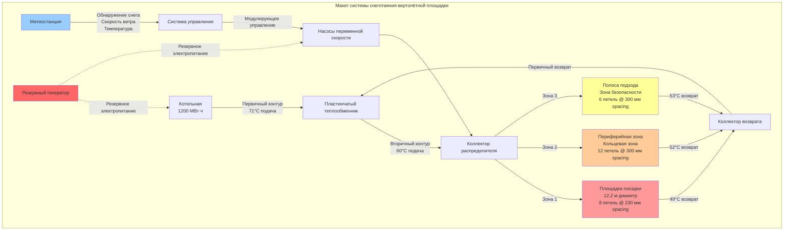

## Физические требования

Вертолётные площадки предъявляют наиболее строгие требования к производительности снеготаяния во всей гражданской инфраструктуре. В отличие от пешеходных или транспортных поверхностей, где частичное снежное покрытие может быть допустимо, вертолётные площадки требуют полного и быстрого удаления снега для обеспечения безопасности полётов. Сочетание аэродинамических сил нисходящего потока, турбулентности ротора и нулевого допуска на ошибки создаёт уникальные проблемы теплового проектирования.

## Системы классификации вертолётных площадок

Стандарты проектирования вертолётных площадок варьируются в зависимости от юрисдикции и эксплуатационных требований. Федеральное управление гражданской авиации (FAA) устанавливает базовые критерии для гражданских авиационных объектов, тогда как военные спецификации налагают дополнительные ограничения для оборонных установок.

### Классификация вертолётных площадок FAA

| Классификация | Минимальный диаметр | Нагрузка на поверхность | Типичное применение |
|----------------|------------------|--------------|---------------------|
| Частная (R/C) | 12,2 м | Лёгкие вертолёты | Корпоративные, жилые |
| Общественная (H1) | 15,2 м | Средние вертолёты | Больницы, муниципальные |
| Транспортная (H2) | 30,5 м | Тяжёлые вертолёты | Морские, грузовые |
| Больничная критическая | 18,3-30,5 м | Средне-тяжёлые | Скорая медицинская помощь |

### Военные стандарты вертолётных площадок

Военные вертолётные площадки следуют спецификациям UFC 3-260-01 (Airfield and Heliport Design) и MIL-STD-621 (Helicopter Landing Facilities). Эти стандарты требуют:

- Несущая способность поверхности превышающая 345 кПа для боевых самолётов
- Зоны подхода/вылета без препятствий с соотношением 8:1
- Повышенные конструктивные требования для палубных установок
- Стойкость к загрязнению авиационным топливом и гидравлической жидкостью

## Расчёты тепловых нагрузок

Системы снеготаяния вертолётных площадок требуют более высокой плотности теплового потока, чем обычные приложения, из-за суровых условий воздействия и критичности эксплуатации.

### Определение базовой плотности теплового потока

Требуемый тепловой выход состоит из трёх компонентов:

$$q_{total} = q_{melt} + q_{sensible} + q_{loss}$$

Где каждый компонент решает конкретные физические процессы:

**Плотность теплового потока снеготаяния:**

$$q_{melt} = \frac{\dot{m}_{snow} \cdot h_{fusion}}{\eta_{system}}$$

Для проектных норм снегопада 25-50 мм в час:

$$q_{melt} = \frac{(0.0211 \text{ м/ч}) \cdot (998 \text{ кг/м}^3) \cdot (334 \text{ кДж/кг})}{0.85} = 8.23 \text{ кВт/м}^2$$

**Требование чувствительного нагрева:**

$$q_{sensible} = \dot{m}_{snow} \cdot c_p \cdot \Delta T$$

Нагрев растаявшего снега с 0°C до температуры стока (обычно 4,4°C):

$$q_{sensible} = (0.253 \text{ кг/ч·м}^2) \cdot (4.18 \text{ кДж/кг·°C}) \cdot (4.4°C) = 0.38 \text{ кВт/м}^2$$

**Потери через проводимость и конвекцию:**

$$q_{loss} = U \cdot \Delta T + h_c \cdot \Delta T$$

Для открытых установок на крыше с ветром 13,4 м/с при температуре -17,8°C:

$$q_{loss} = [(0.85) + (42.5)] \cdot (40) = 1.74 \text{ кВт/м}^2$$

**Итоговая проектная плотность теплового потока:**

$$q_{total} = 8.23 + 0.38 + 1.74 = 10.35 \text{ кВт/м}^2 \approx 155 \text{ Вт/м}^2$$

### Множители влияния ветра

Экспозиция вертолётной площадки значительно превышает защищённые условия поверхности. Установки на крыше и морские платформы испытывают постоянные скорости ветра, требующие коррективов плотности теплового потока:

| Условие экспозиции | Скорость ветра | Множитель | Проектная плотность теплового потока |
|-------------------|------------|------------|------------------|
| Защищённый уровень земли | 4,5-6,7 м/с | 1,0× | 100-120 Вт/м² |
| Открытая крыша | 11,2-15,6 м/с | 1,3-1,5× | 130-180 Вт/м² |
| Морская платформа | 15,6-22,4 м/с | 1,6-2,0× | 160-240 Вт/м² |
| Арктическая установка | 22,4+ м/с | 2,0-2,5× | 200-300 Вт/м² |

## Конфигурации проектирования систем

### Гидравлические системы

Гидравлические системы снеготаяния доминируют в крупных установках вертолётных площадок благодаря превосходному распределению тепла и эксплуатационной гибкости. Типичные конфигурации используют:

**Спецификации расположения трубопровода:**
- Трубопровод PEX или EPDM диаметром 19 мм или 25 мм
- Расстояние: 150-230 мм по центрам для равномерного распределения тепла
- Глубина залегания: 50-75 мм ниже готовой поверхности
- Длина петли: ≤91 м для поддержания перепада давления ниже 103 кПа

**Свойства жидкости:**
- Раствор пропиленгликоля (30-50% концентрация)
- Температура подачи: 48,9-71,1°C в зависимости от условий проектирования
- Расход: 1,9-3,8 л/мин на петлю для турбулентного потока (Re > 4000)
- Перепад температуры: 5,6-11,1°C во всей зоне

**Варианты источников тепла:**
- Центральная котельная с пластинчатыми теплообменниками
- Конденсационные котлы с высоким КПД (95% тепловая эффективность)
- Системы тепловых насосов геотермального происхождения для мягкого климата
- Комбинированная выработка тепла и электроэнергии (CHP) для объектов непрерывной эксплуатации

### Системы электрического сопротивления

Электрические системы подходят для вертолётных площадок меньшего размера (≤18,3 м диаметр) или модернизаций, когда гидравлическая инфраструктура непрактична.

**Спецификации кабеля:**
- Минерально-изолированный (MI) кабель для стойкости к авиационному топливу
- Плотность мощности: 131-197 Вт/м длины кабеля
- Расстояние: 75-100 мм по центрам для приложений высокого потока
- Переходы холодного провода герметизированы авиационными составами

**Электрическая инфраструктура:**
- Трёхфазное распределение электроэнергии для балансировки нагрузки
- Специализированные автоматические выключатели с защитой от замыканий на землю
- Ступенчатое переключение контакторов для управления спросом
- Мощность резервного генератора: 125% подключённой нагрузки снеготаяния

## Стратегии управления

### Управление на основе температуры

Простые установки используют датчики, установленные в плите, для активации отопления, когда температура поверхности падает ниже 3,3°C при наличии влаги. Этот подход обеспечивает надёжную защиту от замерзания, но потребляет избыточную энергию в маргинальных условиях.

### Управление с обнаружением осадков

Продвинутые системы интегрируют метеостанции, измеряющие:
- Интенсивность и накопление осадков
- Скорость и направление ветра
- Температуру окружающей среды и точку росы
- Температуру тротуара на нескольких глубинах

Алгоритмы пропорционального управления модулируют тепловой выход на основе реальной потери тепла в атмосферу, снижая эксплуатационные затраты на 30-50% по сравнению с двоичным управлением включения/выключения.

### Прогнозирующее управление

Критичные для миссии объекты внедряют прогнозирующие алгоритмы, использующие данные прогноза погоды для предварительного нагрева плит перед снежными событиями. Эта стратегия обеспечивает немедленное таяние снега при контакте с осадками, предотвращая любое накопление в течение критического периода прогрева.

## Рассмотрения установки

### Структурная интеграция

Вертолётные площадки на крышах требуют координации между структурными, механическими и авиационными дисциплинами:

1. **Проверка нагрузки:** Вес системы снеготаяния (заполненный жидкостью трубопровод, встраивание в бетон, изоляция) типично добавляет 73-122 кг/м² к конструктивной постоянной нагрузке
2. **Тепловое расширение:** Предусмотрите компенсаторы каждые 6-9 м для размещения дифференциального движения
3. **Интеграция дренажа:** Уклон поверхности вертолётной площадки минимум 1% в сторону периферийных дренажей; обогреваемые трубопроводы дренажа предотвращают замерзание на выходе
4. **Размещение изоляции:** Минимальная жёсткая изоляция RSI 1,76 ниже нагревающих элементов для направления теплового потока вверх

### Требования авиационной безопасности

- **Трение поверхности:** Поддерживайте коэффициент сопротивления скольжению ≥0,6 согласно FAA Advisory Circular 150/5390-2C
- **Сохранение маркировки:** Маркировка идентификации вертолётной площадки должна оставаться видимой при всех эксплуатационных условиях
- **Электромагнитная совместимость:** Экранируйте кабели отопления и провода управления во избежание помех навигации
- **Стойкость к топливу:** Все открытые материалы должны быть устойчивы к загрязнению Jet A/A-1 и JP-8

## Проверка производительности

Вводите в эксплуатацию системы снеготаяния вертолётных площадок поэтапным тестированием:

1. **Испытание под давлением:** Гидравлические петли под давлением 1034 кПа в течение 24 часов с потерей <14 кПа
2. **Тепловизионная съёмка:** Подтвердите равномерное распределение температуры по поверхности (±2,8°C вариация)
3. **Измерение времени отклика:** Задокументируйте время достижения свободной от снега поверхности с холодного запуска
4. **Проверка скорости таяния:** Измерьте фактическую скорость очистки снега при проектных метеорологических условиях

Правильно спроектированные системы снеготаяния вертолётных площадок достигают свободной от льда поверхности в течение 1-2 часов активации системы и поддерживают непрерывное удаление снега со скоростью до 50 мм в час.

## Руководящие принципы эксплуатации

Системы снеготаяния вертолётных площадок требуют проактивных протоколов эксплуатации:

- **Активация перед бурей:** Включите отопление за 2-4 часа до предсказываемого снегопада
- **Непрерывная эксплуатация:** Поддерживайте эксплуатацию системы до 2 часов после окончания осадков
- **Проверка после бури:** Визуальный осмотр подтверждает полное удаление снега/льда перед разрешением полёта
- **Планирование обслуживания:** Ежегодная тепловизионная съёмка, двухлетнее тестирование гидравлической жидкости, трёхлетнее электрическое тестирование

Критичная для безопасности природа вертолётных операций требует абсолютной надёжности производительности системы снеготаяния. Проектный консерватизм, резервные системы управления и строгие протоколы обслуживания обеспечивают эксплуатационную готовность, когда безопасность авиации зависит от этого.
