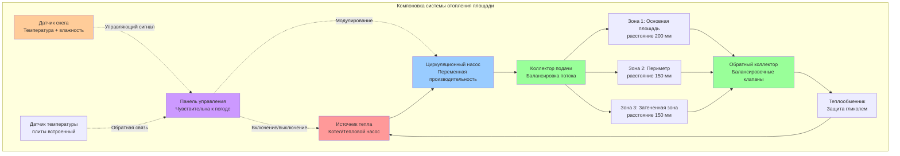

Системы снеготаяния площадей и внутренних дворов обеспечивают безопасность пешеходов и доступность в высокопроходимых наружных пространствах, где ручное удаление снега неэффективно или недостаточно. Эти системы требуют тщательного теплового проектирования для компенсации значительных тепловых потерь из больших открытых площадей при одновременном сохранении температур поверхности, достаточных для свободной от снега работы.

## Физические принципы

Передача тепла от нагретых поверхностей площади происходит через три механизма, действующих одновременно. Кондукция передает тепловую энергию от встроенных гидравлических трубопроводов через бетон или тротуарную плитку на поверхность. Конвекция отводит тепло с поверхности в окружающий воздух, интенсивность передачи зависит от скорости ветра и разности температур. Испарение таяющего снега потребляет скрытую теплоту при 334 кДж/кг, что представляет доминирующую тепловую нагрузку во время активного снежного осадка.

Энергетический баланс поверхности определяет требуемый тепловой поток:

$$q_{total} = q_{sensible} + q_{latent} + q_{radiation} + q_{edges}$$

Где явная тепловая потеря учитывает конвекцию и кондукцию в окружающий воздух, скрытое тепло приводит к таянию снега и испарению влаги, радиационные потоки происходят с небесным сводом, а потери по кромкам передаются через неизолированные условия периметра.

## Расчет тепловой нагрузки площади

Требуемый тепловой поток для снеготаяния площади зависит от проектной интенсивности снегопада, скорости ветра и условий температуры окружающей среды. Стандарт ASHRAE для проектирования снеготаяния использует три класса:

**Класс 1 (легкая интенсивность):** 150–200 Вт/м² для зон нечастого использования
**Класс 2 (средняя интенсивность):** 250–350 Вт/м² для пешеходных площадей
**Класс 3 (тяжелая интенсивность):** 400–500 Вт/м² для критических зон доступа

Комплексный расчет теплового потока включает все механизмы передачи:

$$q_{req} = q_{conv} + q_{melt} + q_{evap} + q_{rad}$$

Конвективные потери тепла подчиняются соотношениям вынужденной конвекции:

$$q_{conv} = h_{conv} \cdot (T_{surface} - T_{ambient})$$

Где коэффициент конвекции зависит от скорости ветра:

$$h_{conv} = 5.7 + 3.8 \cdot V_{wind}$$

При скорости ветра в м/с и результирующем коэффициенте в Вт/(м²·К).

Тепловой поток таяния напрямую связан с интенсивностью снегопада:

$$q_{melt} = s_{rate} \cdot \rho_{snow} \cdot (h_{fusion} + c_{p,water} \cdot \Delta T)$$

Для типичных условий проектирования с интенсивностью снегопада 25 мм/ч, плотностью снега 200 кг/м³ и таянием от −5°C до 2°C:

$$q_{melt} = (25/3600) \cdot 200 \cdot [334\,000 + 4\,186 \cdot 7] = 504 \text{ Вт/м}^2$$

Испарительный тепловой поток удаляет водяную пленку с поверхности:

$$q_{evap} = h_{mass} \cdot h_{fg} \cdot (P_{sat,surface} - P_{ambient})$$

Где коэффициент массопередачи связан с конвекцией через соотношение Льюиса, скрытая теплота испарения равна 2 260 кДж/кг, а разность парциального давления пара приводит массопередачу.

## Соображения при проектировании системы

| Параметр проектирования | Спецификация | Обоснование |
|--------------------------|--------------|-------------|
| Температура поверхности | 2–4°C | Предотвращает образование льда с запасом безопасности |
| Расстояние между трубами | 150–200 мм | Уравновешивает тепловую однородность и стоимость |
| Глубина укладки трубы | 50–75 мм покрытие | Защищает трубу при минимизации теплового запаздывания |
| Температура жидкости | 40–55°C | Обеспечивает адекватный температурный перепад для передачи тепла |
| Скорость потока | 0,6–1,2 м/с | Обеспечивает турбулентный поток для теплопередачи |
| Толщина изоляции | 25–50 мм XPS | Снижает нисходящие тепловые потери до 10–15% |
| Изоляция кромок | 50 мм вертикально | Предотвращает потери тепла по периметру |
| Тепловая реакция | 15–30 минут | Время для достижения рабочей температуры |

## Конфигурация гидравлической компоновки

Системы отопления площадей используют змеевидные или параллельные трубопроводные компоновки обратного потока для обеспечения равномерного распределения температуры поверхности. Расстояние между трубами определяет однородность температуры поверхности, при необходимости более плотное расстояние требуется вблизи кромок и в затененных местах.

## Анализ тепловых характеристик

Однородность температуры поверхности зависит от расстояния между трубами и глубины укладки. Вариация температуры между осью трубы и серединной точкой следует:

$$\Delta T_{surface} = \frac{q \cdot s^2}{8 \cdot k_{concrete} \cdot d}$$

Где расстояние (s), теплопроводность (k) и глубина (d) определяют пульсацию температуры поверхности. Для расстояния 200 мм при глубине 75 мм в бетоне с теплопроводностью 1,4 Вт/(м·К) при тепловом потоке 300 Вт/м²:

$$\Delta T_{surface} = \frac{300 \cdot 0.2^2}{8 \cdot 1.4 \cdot 0.075} = 1.4°C$$

Эта вариация температуры остается приемлемой для комфорта пешеходов и характеристик снеготаяния.

## Эффекты кромок и периметра

Периметры площадей испытывают повышенные потери тепла от открытых кромок и воздействия ветра. Тепловой поток по кромке возрастает на 40–60% в сравнении с внутренними зонами. Вертикальная изоляция кромок, проходящая на 300–600 мм ниже уровня грунта, снижает эту потерю. Проектирование учитывает эффекты кромок посредством:

- Уменьшения расстояния между трубами до 150 мм в пределах 1 м от периметра
- Повышения температуры жидкости для периметровых зон
- Установки вертикальной изоляции на всех открытых кромках
- Обеспечения ветровых экранов при архитектурной целесообразности

## Стратегия управления

Управление, чувствительное к погоде, оптимизирует потребление энергии при одновременном обеспечении своевременной очистки снега. Логика управления контролирует:

- Температуру вне помещения (инициирование ниже 4°C)
- Датчик осадков (определение влаги)
- Температуру поверхности (поддержание 2–4°C во время явлений)
- Скорость ветра (увеличение теплового выхода выше 5 м/с)

Упреждающее управление предварительно нагревает плиту за 30–60 минут до предполагаемого снегопада, снижая тепловое запаздывание и предотвращая начальное накопление снега. Тепловая масса плиты требует это время предварительного нагрева для достижения рабочей температуры.

## Выбор материалов

Материалы поверхности площади влияют на тепловые характеристики и долговечность. Бетон обеспечивает отличную теплопроводность (1,4 Вт/(м·К)) и тепловую массу для стабильной работы. Тротуарная плитка над песчаным основанием снижает тепловой контакт и требует на 20–30% более высокого теплового потока. Природный камень сильно варьируется по теплопроводности (1,5–3,5 Вт/(м·К)), с граньем и известняком, хорошо работающими для нагреваемых приложений.

Гидравлические трубопроводы используют PEX или PEX-AL-PEX для гибкости и коррозионной стойкости. Конструкция с барьером кислорода предотвращает коррозию системы в железных компонентах. Диаметр трубы обычно колеблется от 12 до 20 мм, уравновешивая сопротивление потоку и эффективность теплопередачи.

## Архитектурная интеграция

Системы отопления площадей интегрируются с архитектурными элементами, включая дренажные системы, декоративные элементы и освещение. Уклон поверхности поддерживает уклон 1–2% для дренажа талой воды. Места расположения дренажа требуют расширения отопления для предотвращения образования льда на решетках. Подповерхностный дренаж удаляет грунтовые воды и предотвращает морозное пучение под нагреваемой плитой.

## Проверка производительности

Ввод в эксплуатацию проверяет тепловые характеристики с помощью инфракрасной термографии, выявляя распределение температуры поверхности. Испытания проводятся при расчетных условиях температуры вне помещения при полной работе системы. Однородность температуры поверхности в пределах ±2°C указывает на надлежащую установку и балансировку. Расходы, температуры подачи и перепады давления проверяются в соответствии с расчетными значениями.
