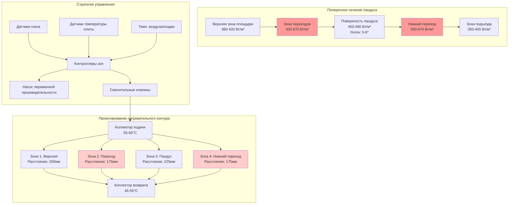

Пандусы и погрузочные доки представляют уникальные проблемы при таянии снега из-за гравитационного дренажа, требований к сцеплению транспортных средств и концентрированных схем движения. Физика наклонных поверхностей требует увеличенного теплового потока для компенсации усиленных конвективных потерь и предотвращения образования льда на критических переходах уклонов.

## Физика таяния снега на наклонных поверхностях

### Усиленная потеря тепла на склоне

Наклонные поверхности испытывают усиленный конвективный теплообмен из-за нарушения пограничного слоя и увеличения скорости воздуха вдоль склона. Требуемый эффективный тепловой поток увеличивается с углом склона:

$$
q''_{\text{slope}} = q''_{\text{flat}} \cdot \left(1 + k_s \cdot \sin\theta\right)
$$

Где:
- $q''_{\text{slope}}$ = требуемый тепловой поток для наклонной поверхности (Вт/м²)
- $q''_{\text{flat}}$ = базовый тепловой поток для плоской поверхности (Вт/м²)
- $k_s$ = коэффициент коррекции склона (обычно 0,15–0,25)
- $\theta$ = угол пандуса от горизонтали (градусы)

Для пандуса под углом 5° с базовым требованием 400 Вт/м²:

$$
q''_{\text{slope}} = 400 \cdot \left(1 + 0.20 \cdot \sin(5°)\right) = 400 \cdot 1.017 = 407 \text{ Вт/м}^2
$$

### Усиление гравитационного дренажа

Градиент склона создает компоненту скорости дренажа, которая способствует удалению талой воды, но требует постоянного нагрева для предотвращения повторного замерзания в зонах переходов:

$$
v_{\text{drain}} = \sqrt{2gh \cdot \sin\theta}
$$

Где:
- $v_{\text{drain}}$ = скорость дренажа (м/с)
- $g$ = ускорение свободного падения (9,81 м/с²)
- $h$ = толщина водяной пленки (обычно 0,5–2 мм)
- $\theta$ = угол склона

## Критические зоны проектирования

### Переходные точки пандуса

Переходы уклонов концентрируют напряжение и образование льда. Эти зоны требуют увеличения теплового потока на 25–40% по сравнению с основной поверхностью пандуса:

$$
q''_{\text{transition}} = q''_{\text{slope}} \cdot (1.25 \text{ до } 1.40)
$$

**Критические места переходов:**
- нижний подъезд (горизонталь к наклону)
- верхняя площадка (наклон к горизонтали)
- точки изменения уклона на многопрофильных пандусах
- зоны интерфейса dock leveler

### Краевые зоны погрузочного дока

Край дока испытывает максимальное тепловое напряжение от:
- попадания выхлопов транспортных средств
- повторяющихся тяжелых нагрузок (концентрированное напряжение)
- потери тепла краем здания
- открытой бетонной консоли

Требуемый тепловой поток в краевой зоне:

$$
q''_{\text{edge}} = q''_{\text{base}} + q''_{\text{load}} + q''_{\text{exhaust}}
$$

Типичные значения краевых зон: 500–650 Вт/м² в зависимости от воздействия.

## Требования для пандусов в сравнении с плоскими поверхностями

| Параметр | Плоская поверхность | Наклонная поверхность | Погрузочный док | Единицы |
|-----------|--------------|--------------|--------------|-------|
| Базовый тепловой поток | 350–400 | 400–480 | 450–550 | Вт/м² |
| Тепловой поток в зоне переходов | N/A | 500–670 | 600–770 | Вт/м² |
| Расстояние между трубами | 225–300 | 200–250 | 175–225 | мм |
| Температура жидкости | 40–50 | 45–55 | 50–60 | °C |
| Скорость потока | 0,6–0,9 | 0,8–1,2 | 1,0–1,5 | м/с |
| Глубина плиты | 100–150 | 150–200 | 200–300 | мм |
| Армирование | №4 @ 450мм | №5 @ 300мм | №6 @ 225мм | - |
| Класс нагрузки | Легкий | Средний–тяжелый | Тяжелый–очень тяжелый | - |

## Коммерческие стандарты для пандусов

### Соответствие требованиям ADA

Пандусы, соответствующие ADA (макс. уклон 1:12, 4,76°), требуют постоянных условий без снега для доступности:

- **Максимальный уклон:** 8,33% (соотношение 1:12)
- **Тепловой поток рабочего склона:** 420–460 Вт/м²
- **Тепловой поток площадки:** 380–420 Вт/м²
- **Краевые зоны:** 500–550 Вт/м² в пределах 600 мм от краев
- **Время отклика:** система должна достичь свободных от снега условий в течение 2 часов после начала снегопада

### Спецификации грузовых пандусов

Высокопроизводительные коммерческие грузовые пандусы требуют надежных систем:

**Структурные нагрузки:**
- нагрузка на одну ось: 80–100 кН
- давление контакта сосредоточенных шин: 800–1200 кПа
- коэффициент удара: 1,5–2,0 для динамических нагрузок

**Тепловые требования:**
- минимальная глубина плиты: 200 мм для нагрузки H-20
- глубина укладки трубы: 75–100 мм от готовой поверхности
- армирование: минимум стержни №6 @ 225 мм в обоих направлениях
- контрольные швы: максимальное расстояние 3,6 м

## Диаграмма Mermaid: Проектирование системы отопления пандуса

## Специальные рассмотрения для погрузочных доков

### Интеграция dock leveler

Нагреваемые dock leveler требуют особого внимания:

**Тепловой поток на интерфейсе leveler:**

$$
q''_{\text{leveler}} = \frac{k_{\text{steel}} \cdot \Delta T}{L} + q''_{\text{base}}
$$

Где:
- $k_{\text{steel}}$ = теплопроводность стали (45 Вт/м·К)
- $\Delta T$ = разность температур на leveler
- $L$ = эффективная длина пути теплопередачи (0,05–0,15 м)

Типичное требование зоны leveler: 650–800 Вт/м²

### Оптимизация схемы движения транспортных средств

Зоны с интенсивным движением испытывают ускоренное удаление снега благодаря:
1. механическому скребковому действию шин
2. выделению фрикционного тепла
3. уплотнению сжатого снега

Однако эти зоны также страдают от:
- усиленного термического циклирования и растрескивания
- ускоренного износа нагревательных элементов
- повышенных требований к техническому обслуживанию

Проектируйте для 1,3× нормального теплового потока в основных полосах движения с улучшенной защитой трубы.

## Лучшие практики установки

### Расположение труб на склонах

**Ориентация петлеобразного рисунка:**
- прокладывать трубы перпендикулярно направлению склона для равномерного распределения тепла
- избегать параллельных прогонов, создающих тепловую полосатость вдоль склона
- использовать коллекторы в верхней и нижней части, а не с боков

**Крепление трубы:**
- повышенная плотность опор: каждые 600 мм на уклонах >4%
- привязывать трубы к арматуре металлическими хомутами на всех пересечениях
- предотвращать всплывание трубы во время укладки бетона с помощью утяжеленных опор

### Последовательность строительства плиты

1. **Подготовка земляного полотна:** уплотнение до 95% стандартной плотности Проктора
2. **Изоляция:** минимум R-0,6 (RSI-0,6) пенопласт XPS под всеми нагреваемыми участками
3. **Пароизоляция:** 6 мил полиэтилен с герметизированными швами
4. **Армирование:** укладка нижнего слоя
5. **Установка трубопроводов:** испытание под давлением 550 кПа в течение минимум 2 часов
6. **Верхнее армирование:** поддержание покрытия 50–75 мм над трубами
7. **Укладка бетона:** смесь минимум 28 МПа с воздухозахватом
8. **Отделка:** шероховатая отделка перпендикулярно склону для сцепления

### Требования гидравлического испытания

Системы водяного отопления в коммерческих пандусах должны выдерживать:

$$
P_{\text{test}} = 1.5 \cdot P_{\text{operating}} \geq 550 \text{ кПа}
$$

Поддерживайте испытательное давление минимум 2 часа с падением давления <35 кПа, указывающим на приемлемую установку.

## Расчет размера системы и производительность

### Пример расчета тепловой нагрузки

Для грузового пандуса длиной 30 м × 6 м шириной под углом 6°:

**Площадь:** $A = 30 \times 6 = 180 \text{ м}^2$

**Средний тепловой поток:** $q'' = 450 \text{ Вт/м}^2$ (с учетом переходов)

**Общая тепловая нагрузка:**

$$
Q_{\text{total}} = q'' \cdot A = 450 \times 180 = 81{,}000 \text{ Вт} = 81 \text{ кВт}
$$

**С коэффициентом безопасности 15%:**

$$
Q_{\text{design}} = 81 \times 1.15 = 93.2 \text{ кВт}
$$

### Требования к расходу жидкости

Для трубы PEX с расстоянием между витками 200 мм:

**Линейная длина трубы на м²:** $L_{\text{specific}} = \frac{1}{0.20} = 5 \text{ м/м}^2$

**Общая длина трубы:** $L_{\text{total}} = 5 \times 180 = 900 \text{ м}$

**Расход на контур (контуры по 100 м):**

$$
\dot{V} = \frac{Q}{c_p \cdot \rho \cdot \Delta T}
$$

Для перепада температуры 10°C:

$$
\dot{V} = \frac{93{,}200}{4186 \times 1000 \times 10} = 0.00223 \text{ м}^3\text{/с} = 2.23 \text{ л/с}
$$

**Количество контуров:** $N = \frac{900}{100} = 9$ контуров

**Расход на контур:** $\dot{V}_{\text{circuit}} = \frac{2.23}{9} = 0.25 \text{ л/с}$ (0,9 м³/ч)

## Экономические соображения

Пандусы и погрузочные доки оправдывают вложения в системы таяния снега благодаря:

- **Снижению ответственности:** иски о страховке за поскальзывание в среднем составляют 50 000–150 000 USD
- **Операционной непрерывности:** предотвращение задержек доставки стоит 500–2 000 USD на один инцидент
- **Исключению затрат на труд:** ручное удаление снега обходится в 75–150 USD за событие
- **Защите активов:** предотвращает повреждение соли транспортных средств и бетона

Типичный период окупаемости для коммерческих установок с высокой частотой использования: 4–7 лет.

---

*Файл: /Users/evgenygantman/Documents/github/gantmane/hvac/content/specialty-applications-testing/specialty-hvac-applications/snow-melting-freeze-protection-systems/application-areas/ramps-loading-docks/_index.md*
