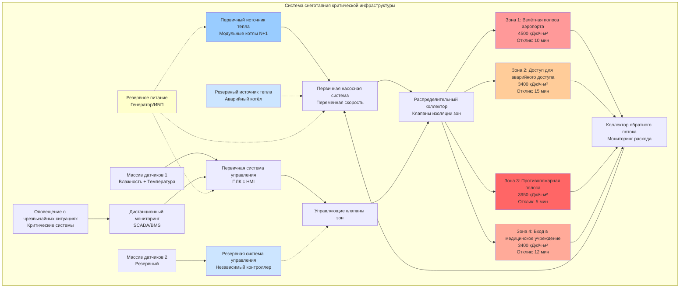

Специализированные приложения систем снеготаяния охватывают критически важные сценарии, в которых отказ системы создаёт непосредственные угрозы безопасности, нарушения работы или опасные для жизни задержки. Такие установки требуют повышенных критериев производительности, резервных стратегий управления и ускоренных характеристик отклика по сравнению с обычными жилыми или коммерческими системами.

## Определяющие характеристики специализированных приложений

Специализированные системы снеготаяния имеют общие атрибуты, которые отличают их от стандартных установок:

**Критичность производительности**
Отказ системы напрямую влияет на безопасность человека, возможность экстренного реагирования или существенные операции. В отличие от дополнительных приложений, где задержанная активация вызывает неудобства, специализированные системы должны поддерживать непрерывную функциональность при всех погодных условиях.

**Соответствие нормативным требованиям**
Правила пожарной безопасности, авиационные регламенты, стандарты аккредитации больниц и требования OSHA по промышленной безопасности устанавливают конкретные пороги производительности. Проектирование должно удовлетворять как инженерные стандарты ASHRAE, так и специфические нормативные требования юрисдикции.

**Требования ускоренного реагирования**
Максимально допустимое время от обнаружения снега до полной очистки поверхности обычно составляет 5–20 минут по сравнению с 30–90 минутами для обычных систем. Это требует более высокой установленной плотности теплового потока и часто требует непрерывного режима ожидания.

**Продлённые сезоны эксплуатации**
Многие специализированные приложения работают круглогодично для защиты от замерзания, а не исключительно для снеготаяния. Взлётные полосы аэропортов требуют защиты от льда в холодных сухих условиях. Промышленные объекты поддерживают функциональность при всех осадках независимо от сезонных сроков.

## Требования к плотности теплового потока для критических приложений

Специализированные приложения универсально требуют производительности класса III с плотностью теплового потока, превышающей стандартные коммерческие установки. Определяющее уравнение учитывает ускоренные графики таяния:

$$q_s = \frac{q_m}{\eta_{response}} + q_c + q_r + q_e + q_{margin}$$

Где:
- $q_s$ = Общая требуемая плотность теплового потока системы (кДж/ч·м²)
- $q_m$ = Теплота плавления для снеготаяния при проектной скорости
- $\eta_{response}$ = Коэффициент эффективности времени отклика (0,25–0,50 для быстрого отклика)
- $q_c$ = Потери конвекцией при проектных условиях ветра
- $q_r$ = Лучистый теплообмен с небом
- $q_e$ = Потери на краях и проводимость вниз
- $q_{margin}$ = Запас прочности для экстремальных условий (обычно 20–30%)

Коэффициент эффективности времени отклика учитывает тепловую энергию, необходимую для быстрого повышения температуры плиты от режима ожидания к активному таянию в течение ограниченного времени.

**Типичные проектные значения плотности теплового потока:**

| Тип приложения | Проектный поток | Коэффициент свободной площади | Время отклика |
|-----------------|-----------------|-------------------------------|----------------|
| Обледенение взлётной полосы аэропорта | 3400–4500 кДж/ч·м² | 0,90–1,0 | 10–15 минут |
| Доступ для аварийных транспортных средств | 2800–3950 кДж/ч·м² | 0,85–1,0 | 10–20 минут |
| Очистка противопожарной полосы | 3400–4500 кДж/ч·м² | 1,0 | 5–10 минут |
| Вход в медицинское учреждение | 2800–3950 кДж/ч·м² | 0,90–1,0 | 10–15 минут |
| Доступ промышленного двора | 2250–3400 кДж/ч·м² | 0,70–0,90 | 15–25 минут |

## Системы обледенения взлётных полос аэропортов

Системы обогрева стоянок воздушных судов и рулёжных дорожек предотвращают образование льда на критически важных манёвренных поверхностях, где механическое удаление снега рискует вызвать повреждение от посторонних предметов (FOD) или помехи от оборудования для работы воздушных судов.

**Проектные ограничения:**
- Грузоподъёмность плиты должна выдерживать нагрузки от колёс воздушного судна (соответствие ASTM F2550)
- Температуры жидкости ограничены для предотвращения тепловых трещин в тяжёлом бетоне (максимум 71°C)
- Гликольные растворы должны использовать пакеты ингибиторов, совместимые с авиацией
- Зоны системы должны соответствовать позициям парковки воздушных судов и сегментам рулёжных дорожек
- Системы управления требуют одобрения FAA для интеграции с операциями аэродрома

**Соображения теплопередачи:**
Взлётные полосы аэропортов испытывают экстремальные конвективные нагрузки из-за струй реактивных двигателей и закрутки винтов. Проектные скорости ветра достигают 64–97 км/ч во время операций с воздушными судами, увеличивая коэффициенты конвекции до:

$$h_c = 0,99 \cdot v_{wind}^{0,8} = 0,99 \cdot 80^{0,8} = 22,4 \text{ кДж/ч·м²·°C}$$

Этот коэффициент конвекции в 3–4 раза выше стандартных проектных значений ASHRAE, что прямо увеличивает требуемую плотность теплового потока.

**Расстояние между трубами и пропускная способность:**
Более близкое расстояние между трубами (10–15 см между центрами) в сравнении со стандартными 23–30 см макетами обеспечивает равномерную температуру поверхности при высоких конвективных нагрузках. Размер коллектора должен вмещать потоки на 30–50% выше для поддержания турбулентного режима течения (число Рейнольдса > 4000) для эффективной доставки тепла.

## Маршруты доступа для аварийных транспортных средств

Дороги доступа пожарных служб, полосы подъезда скорой помощи и маршруты быстрого реагирования полиции требуют гарантированной очистки в сроки, установленные кодексом.

**Нормативные требования производительности:**
- Международный кодекс пожарной безопасности (IFC) требует доступа для аварийного транспорта в пределах 45 метров от всех сооружений
- Многие юрисдикции требуют безснежного доступа в течение 15 минут с момента начала снегопада
- Резервирование системы (двойные источники тепла или резервное питание) часто требуется местными постановлениями
- Непрерывный мониторинг 24/7 с оповещением диспетчерских центров

**Стратегия зонирования:**
Маршруты аварийного доступа используют распределённое зонирование плотности теплового потока:

1. **Основные полосы доступа:** 3400–3950 кДж/ч·м² для гарантированной очистки
2. **Вторичный подъезд:** 2250–2800 кДж/ч·м² для сокращённого, но функционального доступа
3. **Парковка/зоны подготовки:** 1700–2250 кДж/ч·м² для позиционирования транспортных средств

Такой многоуровневый подход оптимизирует установленную мощность при обеспечении надёжности критически важного пути.

**Интеграция управления:**
Системы экстренного доступа взаимодействуют с системами противопожарной сигнализации здания, автоматически активизируя зоны обогрева при возникновении условий сигнализации независимо от погодных условий. Это предотвращает отказ оборудования во время длительных периодов неиспользования и обеспечивает немедленную готовность во время кризисного реагирования.

## Непрерывное покрытие противопожарных полос

Противопожарные полосы отличаются от общего аварийного доступа требованием абсолютного запрета на любое накопление снега в любое время во время зимних операций.

**Проектирование с нулевой толерантностью:**
Одобрение органом пожарной безопасности (AHJ) требует документального подтверждения способности:
- Поддерживать полностью обнажённое покрытие при максимально вероятной интенсивности снегопада
- Предотвращать любое образование льда во время температурных циклов
- Обеспечивать немедленное визуальное подтверждение работы системы
- Включать независимые резервные системы для резервирования

**Философия управления:**
Противопожарные полосы используют непрерывную работу вместо активации по требованию:

$$q_{continuous} = q_{idling} + \frac{q_{boost}}{duty_{cycle}}$$

Где непрерывный режим ожидания поддерживает температуру поверхности на уровне 3–6°C, с автоматическим усилением до полной мощности таяния, запускаемым обнаружением влаги. Средний сезонный коэффициент загрузки обычно составляет 0,15–0,30 в зависимости от климата.

**Визуальное индикирование:**
Многие установки включают цветной бетон или термохромные добавки, которые визуально подтверждают надлежащий обогрев. Индикаторы температуры поверхности предупреждают менеджеров объектов о деградации системы до накопления снега.

## Защита входов медицинских учреждений

Отделения скорой помощи больниц, центры неотложной помощи и амбулаторные хирургические центры требуют специализированных систем входов, которые сбалансируют требования доступности с соображениями инфекционного контроля.

**Требования безопасности пациентов:**
- Соответствие ADA для сопротивления скольжению при всех условиях
- Стабильность амбулаторного пациента при использовании вспомогательных ходунков
- Минимизация сопротивления качению инвалидных колясок и каталок
- Защита, распространяющаяся на парковку скорой помощи и зоны высадки пациентов

**Соображения инфекционного контроля:**
Стоячая вода на входных поверхностях создаёт пути передачи загрязнений. Системы должны обеспечить полное испарительное высыхание в течение 20–30 минут после окончания осадков для поддержания протоколов биобезопасности.

Требование теплоты в фазе сушки:

$$q_{dry} = \frac{h_{fg} \cdot \rho_{water} \cdot d_{film}}{t_{dry}}$$

Где:
- $h_{fg}$ = Скрытая теплота испарения (1050 кДж/кг при 10°C)
- $\rho_{water}$ = Плотность воды (1000 кг/м³)
- $d_{film}$ = Толщина водяной плёнки (обычно 0,5–1,3 мм)
- $t_{dry}$ = Требуемое время высыхания (0,33–0,50 часа)

Для водяной плёнки толщиной 0,76 мм, высушиваемой за 25 минут:

$$q_{dry} = \frac{1050 \cdot 1000 \cdot 0,00076}{0,417} = 1910 \text{ кДж/ч·м²}$$

Этот существенный нагрев при сушке часто превышает требования снеготаяния и определяет размер системы для медицинских учреждений.

## Доступ промышленных дворов

Производственные объекты, распределительные центры и перерабатывающие заводы требуют надёжного доступа для тяжёлых транспортных средств для непрерывных операций независимо от погодных условий.

**Соображения нагрузки:**
- Движение вилочных погрузчиков и тяжёлых грузовиков требует усиленного проектирования плиты (20–30 см толщины)
- Сосредоточенные колесные нагрузки создают локализованные напряжения, требующие уменьшенной глубины трубы (4–6 см ниже поверхности)
- Химическое воздействие от промышленных процессов требует трубок материалов, устойчивых к коррозии
- Деформационные швы должны учитывать тепловые циклы и конструктивные нагрузки

**Экономика операций:**
Промышленные приложения подчёркивают экономическую эффективность над быстротой реагирования. Многие объекты применяют:
- Стратегии частичного покрытия (только следы шин)
- Пониженные коэффициенты свободной площади (Ar = 0,60–0,70)
- Продлённое время отклика (20–30 минут приемлемо)
- Структуры интерактивных коммунальных ставок для снижения затрат на эксплуатацию

**Интеграция процесса:**
Объекты с доступностью утилизируемого тепла интегрируют снеготаяние в общее управление тепловой энергией:

$$Q_{available} = \dot{m}_{waste} \cdot c_p \cdot (T_{hot} - T_{return})$$

Где утилизируемое тепло от компрессоров, охлаждения процесса или производства электроэнергии компенсирует требования к выделенному источнику тепла. Такой подход может снизить эксплуатационные расходы на снеготаяние на 60–80% при наличии достаточного утилизируемого тепла.

## Специализированные компоненты системы

Критические приложения используют улучшенные компоненты за пределами стандартных спецификаций жилых/коммерческих установок:

**Резервные системы управления:**
- Двойные независимые датчиковые системы с перекрёстной проверкой
- Резервные источники питания (ИБП или генератор)
- Режимы безопасного отказа, которые активизируют обогрев при обнаружении неисправности датчика
- Дистанционный мониторинг с сотовой/спутниковой связью

**Источники тепла высокой надёжности:**
- Несколько модульных котлов (резервирование N+1)
- Двухтопливная способность (природный газ с резервным пропаном)
- Защита теплообменника для изоляции системы во время технического обслуживания
- Автоматические переключающие элементы управления, не требующие вмешательства оператора

**Компоненты ускоренного реагирования:**
- Работа при повышенной температуре (82–93°C подача) для быстрого прогрева
- Насосы с регулируемой скоростью, обеспечивающие расходы 200–300% от проектного при усилении
- Тонкая конструкция плит (7,5–10 см), минимизирующая тепловую массу
- Системы жидкостей с низкой тепловой массой (концентрация глицола 40–50%)

## Архитектура системы для критических приложений

## Матрица сравнения специализированных приложений

| Параметр проекта | Взлётные полосы | Аварийный доступ | Противопожарные полосы | Вход в медицинское учреждение | Промышленные дворы |
|------------------|-----------------|------------------|------------------------|--------------------------------|-------------------|
| **Плотность теплового потока** | 3950–4500 | 3100–3650 | 3650–4250 | 3100–3650 | 2550–3100 |
| **Время отклика** | 10–15 мин | 15–20 мин | 5–10 мин | 12–18 мин | 20–30 мин |
| **Коэффициент свободной площади** | 0,95–1,0 | 0,85–0,95 | 1,0 | 0,90–1,0 | 0,65–0,80 |
| **Толщина плиты** | 30–45 см | 15–20 см | 15–20 см | 13–18 см | 25–35 см |
| **Расстояние между трубами** | 10–15 см | 15–20 см | 15–20 см | 15–23 см | 23–30 см |
| **Режим работы** | Непрерывное ожидание | По требованию + ожидание | Непрерывное | Непрерывное ожидание | По требованию |
| **Уровень резервирования** | Полное N+1 | Частичный резерв | Полное N+1 | Полное N+1 | Единственный источник |
| **Интеграция управления** | Системы FAA | Противопожарная сигнализация | Противопожарная сигнализация | BMS/безопасность | Управление процессом |
| **Проектная скорость ветра** | 80 км/ч | 32 км/ч | 32 км/ч | 24 км/ч | 40 км/ч |
| **Требование высыхания** | Высокий приоритет | Умеренный | Высокий приоритет | Критичный | Низкий приоритет |

## Наладка и проверка производительности

Специализированные системы требуют строгого приёмного испытания сверх стандартных жилых процедур:

**Тестирование тепловой производительности:**
Имитируемое применение снега при проектных погодных условиях проверяющее:
- Измеренную плотность теплового потока в нескольких местах поверхности
- Время отклика от режима ожидания к полному таянию
- Равномерность температуры поверхности (максимальное изменение ±1,7°C)
- Полное таяние и высыхание в пределах установленного времени

**Проверка надёжности:**
- Тестирование отказоустойчивости резервной системы
- Эксплуатация переключения резервного питания
- Реакция системы управления на неисправность
- Проверка и калибровка точности датчика
- Функциональность системы связи

**Требования к документации:**
- Комплексное руководство по эксплуатации с анализом режимов отказа
- График профилактического обслуживания с инвентаризацией критических компонентов
- Процедуры аварийного реагирования
- Сертификация обучения операторов
- Положения об гарантии, специфичные для высоконадёжных приложений

Специализированные приложения систем снеготаяния представляют пересечение требований безопасности жизни, критичности операций и передовой теплотехники. Надлежащее проектирование, монтаж и техническое обслуживание обеспечивают надёжное выполнение этими системами своих критически важных функций на протяжении всего их срока служения.
