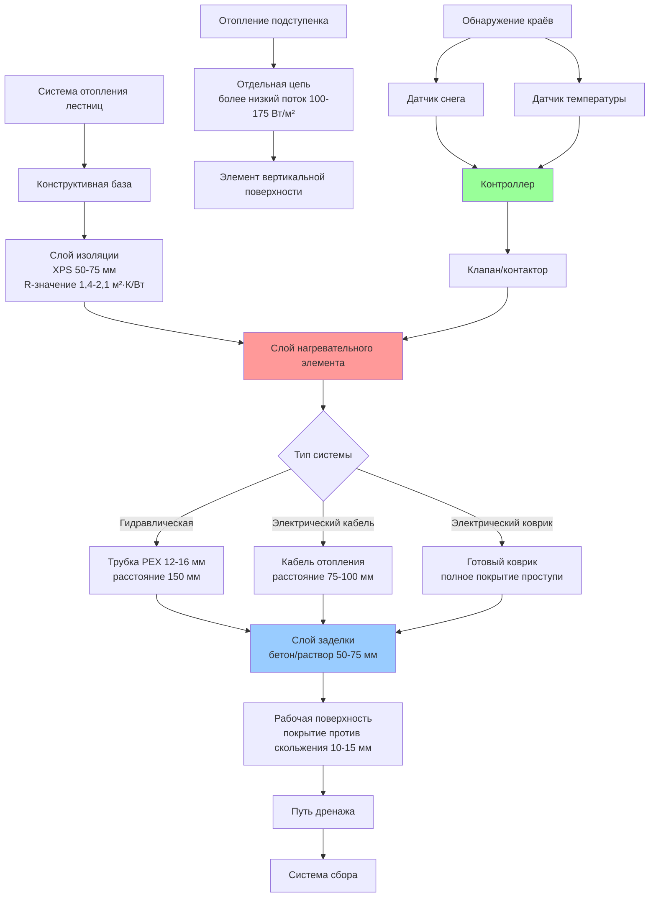

## Физические принципы отопления лестниц

Системы снеготаяния лестниц и ступеней представляют уникальные тепловые и проблемы безопасности, отличные от отопления горизонтальных поверхностей. Вертикальная геометрия создаёт предпочтительное накопление снега на проступях, а подступенки испытывают сток воды, который может снова замерзнуть. Критическое требование безопасности — поддержание полностью свободных от снега условий во время всех осадков, так как даже частичное покрытие снегом создаёт экстремальную опасность скольжения.

### Рассмотрение теплопередачи

Лестницы испытывают трёхмерные механизмы потери тепла:

1. **Конвекция на поверхности проступи** — усилена турбулентным потоком воздуха вокруг краёв ступеней
2. **Вертикальные потери подступенка** — конвективное охлаждение от окружающего воздуха
3. **Эффекты выступающего края** — ускоренная потеря тепла на передних краях проступей
4. **Тепловые мосты** — проводимость через конструктивные опоры

Геометрия усиливает ветровые эффекты. Выступ ступени испытывает на 40–60% более высокие коэффициенты конвективной теплопередачи по сравнению с плоскими поверхностями из-за зон отделения и повторного присоединения потока.

## Требования к тепловому потоку

### Расчёт нагрузки на поверхность проступи

Требуемый тепловой поток для проступей лестниц превышает требования для плоских поверхностей:

$$q_{tread} = q_{melt} + q_{sens} + q_{edge} + q_{backup}$$

Где:
- $q_{melt}$ = Нагрузка на таяние снега (обычно 150–250 Вт/м²)
- $q_{sens}$ = Чувствительное тепло для поддержания температуры (50–100 Вт/м²)
- $q_{edge}$ = Компенсация эффекта краёв (30–60 Вт/м²)
- $q_{backup}$ = Коэффициент безопасности (20–30% от общей величины)

При условиях проектирования -10°C окружающего воздуха, ветра 5 м/с и осадков 25 мм/ч:

$$q_{tread} = 200 + 75 + 45 + 96 = 416 \text{ Вт/м}^2$$

Это представляет плотность теплового потока на 65–85% выше, чем на сравнимых горизонтальных поверхностях.

### Требования к отоплению подступенка

Подступенки требуют отопления для предотвращения образования льда из талой воды:

$$q_{riser} = h_c \cdot (T_s - T_a) + \varepsilon \sigma (T_s^4 - T_{sky}^4)$$

Где:
- $h_c$ = Коэффициент конвекции (15–35 Вт/м²·К для вертикальных поверхностей)
- $T_s$ = Температура поверхности (обычно 5–10°C)
- $T_a$ = Температура окружающего воздуха
- $\varepsilon$ = Излучательная способность поверхности (0,85–0,95 для бетона)
- $\sigma$ = Постоянная Стефана–Больцмана

Для большинства установок отопление подступенка требует 100–175 Вт/м² для предотвращения накопления льда.

## Сравнение систем отопления лестниц

| Тип системы | Возможность теплового потока | Время отклика | Предел глубины проступи | Сложность монтажа | Стоимость эксплуатации |
|-------------|---------------------|---------------|-------------------|------------------------|----------------|
| Гидравлическая (встроенная) | 300–500 Вт/м² | 45–90 мин | Без ограничений | Высокая | Низкая |
| Электрический кабель | 250–400 Вт/м² | 20–40 мин | ≥250 мм оптимально | Средняя | Средняя–Высокая |
| Электрический коврик | 200–350 Вт/м² | 15–30 мин | 225–400 мм | Низкая | Высокая |
| Отопляемая металлическая ступень | 300–600 Вт/м² | 10–25 мин | Индивидуальная | Очень высокая | Средняя |
| Инфракрасное лучистое | 400–800 Вт/м² | 5–15 мин | Без контакта | Средняя | Высокая |

### Критерии выбора системы

**Гидравлические системы** обеспечивают равномерное распределение тепла и низкие эксплуатационные расходы, но требуют доступа к инфраструктуре котельной и тщательного проектирования уклона для дренажа. Оптимальны для лестниц с глубиной проступи >300 мм и при интеграции с системами отопления здания.

**Системы с электрическим кабелем** обеспечивают гибкость в расположении и более быстрый отклик, но генерируют более высокие эксплуатационные расходы. Рекомендуются для модернизации и лестниц со сложной геометрией.

**Системы с электрическими ковриками** обеспечивают быстрый монтаж и предсказуемое покрытие. Лучше всего подходят для стандартных размеров проступей (250–300 мм в глубину) в новом строительстве.

**Отопляемые металлические ступени** обеспечивают максимальную безопасность за счёт высокого теплового потока и конструктивной интеграции. Используются в критических приложениях (аварийные выходы, входы в высокотрафиковые коммерческие объекты), где отказ неприемлем.

**Инфракрасное лучистое** исключает встроенные системы полностью, монтируясь над головой для обеспечения направленного отопления. Эффективно для исторических конструкций или когда проникновение в проступь запрещено.

## Архитектура установки

## Требования к проектированию

### Стандарты тепловой производительности

Системы отопления лестниц должны поддерживать поверхность проступи при минимум 2°C во время осадков и предотвращать образование льда при всех условиях погоды ниже 5°C окружающего воздуха. ASHRAE 90.1 требует автоматического управления как с обнаружением осадков, так и температурным датчиком для минимизации потребления энергии.

### Расстояние и покрытие

**Покрытие проступи:** 100% ходовой поверхности от выступа до подступенка, расширяясь на 25 мм за каждый боковой край.

**Расстояние гидравлических трубок:**

$$s_{tube} = \frac{2k_{concrete} \cdot (T_{tube} - T_{surface})}{q_{required}}$$

Для бетона с $k = 1,4$ Вт/м·К, температура трубки 40°C, целевая поверхность 5°C и требуемый поток 400 Вт/м²:

$$s_{tube} = \frac{2 \times 1,4 \times (40 - 5)}{400} = 0,245 \text{ м} = 245 \text{ мм}$$

Это представляет максимальное расстояние. Практические установки используют расстояние 150–175 мм для равномерного распределения температуры на поверхности.

**Расстояние электрического кабеля:** 60–75% от расстояния гидравлических трубок из-за более высокой температуры элемента и локализованной генерации тепла. Типичный диапазон: 75–100 мм.

### Требования к изоляции

Изоляция под плитой критична для эффективности отопления лестниц. Потеря тепла на основание может представлять 40–60% от общего входного потока без надлежащей изоляции.

Минимальное значение R-изоляции:

$$R_{min} = \frac{T_{surface} - T_{substrate}}{0,3 \times q_{input}}$$

Для поверхности при 5°C, основания при -5°C и входного потока 400 Вт/м²:

$$R_{min} = \frac{5 - (-5)}{0,3 \times 400} = 0,083 \text{ м}^2 \cdot \text{К/Вт}$$

Практические установки используют R-1,4 до R-2,1 (50–75 мм пены XPS) для достижения 85–92% эффективности поднаправленной теплопередачи.

## Безопасность и соответствие кодам

### Требования к сопротивлению скольжению

ASTM F1637 определяет минимальный динамический коэффициент трения (DCOF) 0,42 для наружных лестниц. Отопляемые поверхности должны поддерживать это значение во влажном состоянии и во время активного таяния снега. Варианты обработки поверхности включают:

- Текстурированная отделка бетона (щёткой или открытым заполнителем)
- Полосы против скольжения на выступах
- Системы покрытий, устойчивых к скольжению, рассчитанные на отопляемые приложения
- Рифлёные или узорчатые металлические ступени

### Электрическая безопасность

Статья 426 NEC регулирует фиксированное наружное электрическое удаление льда и оборудование для таяния снега:
- Защита GFCI требуется для всех цепей
- Заземление оборудования обязательно
- Максимальная температура поверхности 80°C для предотвращения ожогов
- Защита от теплового отключения на всех электрических системах

### Конструктивная нагрузка

Дополнительная постоянная нагрузка от компонентов системы отопления обычно добавляет 50–90 кг/м² к конструкции лестницы. Проектирование должно учитывать:
- Толщину и плотность слоя заделки
- Массу жидкости в гидравлических системах
- Вес слоя изоляции
- Повышенную снежную нагрузку во время частичного таяния (мокрый снег в 2–3 раза тяжелее сухого)

## Стратегии управления

Передовое управление отоплением лестниц интегрирует несколько входов датчиков для оптимальной безопасности и эффективности:

1. **Обнаружение осадков** в месте расположения лестницы (не на удалённых метеостанциях)
2. **Измерение температуры поверхности** на северной стороне проступи
3. **Температура окружающего воздуха** с корреляцией скорости ветра
4. **Обнаружение влаги** для различия замёрзших осадков от дождя

Системы активируются, когда температура поверхности падает ниже 5°C и обнаруживаются осадки, поддерживая работу в течение 30–60 минут после окончания осадков для обеспечения полного высыхания.

## Проверка производительности

Инфракрасная термография, проведённая при условиях проектирования, должна показать:
- Равномерность температуры поверхности проступи в пределах ±2°C
- Отсутствие холодных точек >5°C ниже средней температуры поверхности
- Температуры выступа в пределах 3°C от значений середины проступи
- Полное покрытие без неотопляемых зон

Эти стандарты проверки обеспечивают безопасность пользователей благодаря исключению риска повторного замерзания и последовательному сопротивлению скольжению во всех погодных условиях.
