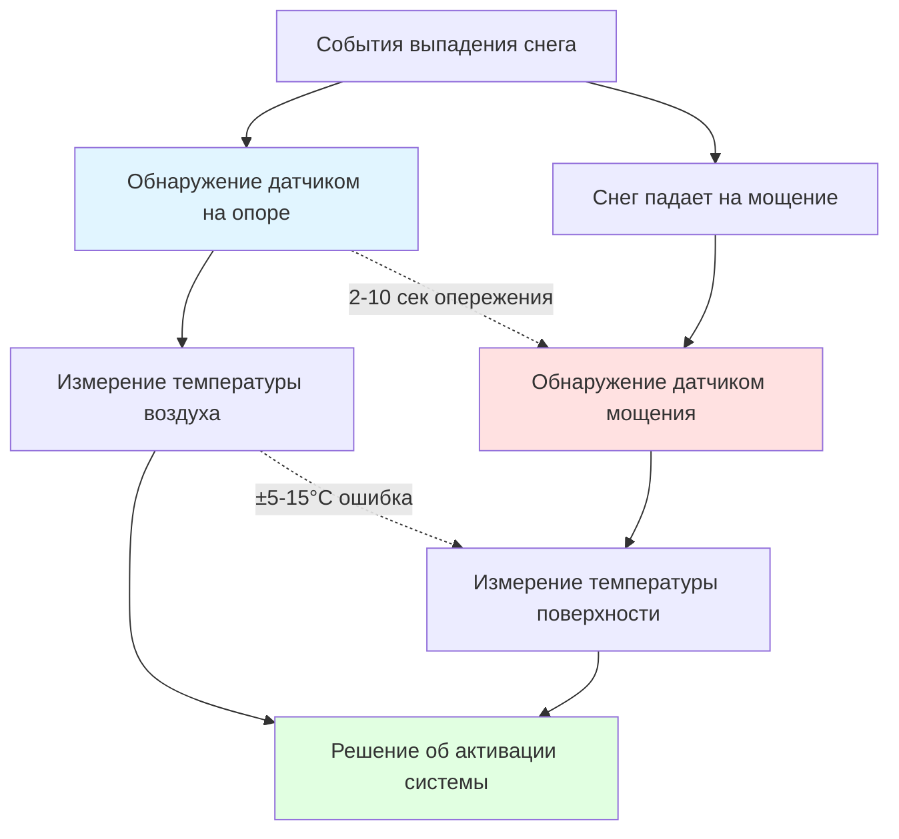

## Физические принципы размещения датчиков снега

Управление системой таяния снега зависит принципиально от точного обнаружения осадков и температуры поверхности мощения. Место установки датчиков — на опорах или встроенные в покрытие — создает различные тепловые среды, которые влияют на производительность системы через разные механизмы теплопередачи и характеристики отклика.

Оптимальное размещение датчиков уравновешивает три конкурирующих требования: раннее обнаружение осадков, точное измерение температуры поверхности и надежную работу при всех погодных условиях.

## Размещение датчиков на опорах

Датчики на опорах устанавливаются выше поверхности мощения, как правило, на столбах или строительных конструкциях на высоте 2-5 м. Эти датчики обнаруживают осадки путем прямого воздействия падающего снега или дождя, одновременно измеряя температуру воздуха как косвенный показатель условий поверхности.

### Тепловая среда

Датчик на опоре испытывает конвективную теплопередачу, определяемую температурой окружающего воздуха и скоростью ветра. Тепловой отклик датчика описывается:

$$\rho c V \frac{dT_s}{dt} = hA(T_\infty - T_s) + q_{solar} - q_{rad}$$

Где:
- $\rho$ = плотность материала датчика (кг/м³)
- $c$ = удельная теплоемкость (Дж/кг·К)
- $V$ = объем датчика (м³)
- $T_s$ = температура датчика (К)
- $h$ = коэффициент конвективной теплопередачи (Вт/м²·К)
- $A$ = площадь поверхности (м²)
- $T_\infty$ = температура окружающего воздуха (К)
- $q_{solar}$ = поглощение солнечного излучения (Вт)
- $q_{rad}$ = радиационные потери тепла (Вт)

Коэффициент конвекции значительно варьируется в зависимости от скорости ветра:

$$h = C \cdot v^{0.8}$$

Где $v$ — скорость ветра, а $C$ — геометрически зависимая константа, обычно находящаяся в диапазоне 5-10 для цилиндрических датчиков.

### Характеристики отклика

Датчики на опорах обеспечивают наиболее раннее обнаружение осадков, так как они перехватывают падающий снег перед тем, как он достигает мощения. Время предварительного обнаружения $\Delta t$ зависит от высоты установки $h$ и скорости падения осадков $v_p$:

$$\Delta t = \frac{h}{v_p}$$

Для скорости снегопада 0,5-1,5 м/с и высоты установки 3-5 м это обеспечивает 2-10 секунд предварительного предупреждения.

Однако датчики на опорах измеряют температуру воздуха, а не температуру мощения. Разница температур между воздухом и мощением зависит от солнечного излучения, теплоемкости и недавней истории погоды:

$$\Delta T_{air-pave} = f(Q_{solar}, \rho c_p d_{pave}, \dot{Q}_{stored})$$

Эта разница может превышать 10°С в солнечные зимние дни, вызывая преждевременную активацию системы.

## Датчики, встроенные в мощение

Датчики мощения встраиваются непосредственно в или устанавливаются заподлицо с нагревательной поверхностью, испытывая ту же тепловую среду, что и плита, которой они управляют. Эти датчики обычно устанавливаются на 25-50 мм ниже готовой поверхности.

### Тепловая связь

Встроенный датчик реагирует на тепловое состояние мощения путем кондукции:

$$\frac{\partial T}{\partial t} = \alpha \nabla^2 T$$

Где $\alpha = k/(\rho c)$ представляет коэффициент температуропроводности бетонной или асфальтовой матрицы.

Температура датчика отстает от температуры поверхности в зависимости от глубины укладки и свойств материала:

$$T_{sensor}(t) = T_{surf}(t - \tau)$$

$$\tau = \frac{d^2}{2\alpha}$$

Для бетона ($\alpha \approx 0,7 \times 10^{-6}$ м²/с) на глубине 40 мм тепловая задержка составляет примерно 1200 секунд (20 минут).

### Обнаружение влаги

Датчики мощения обнаруживают осадки через изменения сопротивления в сетках датчиков влажности или через тепловые эффекты при контакте снега с нагретой чувствительной поверхностью. Обнаружение происходит только после накопления осадков на мощении, создавая задержку в обнаружении по сравнению с датчиками на опорах.

## Сравнительный анализ

### Сравнение производительности

| Параметр | Датчик на опоре | Датчик мощения | Инженерное значение |
|-----------|-----------------|----------------|---------------------|
| Скорость обнаружения | 2-10 сек опережение | Точка отсчета | Влияет на время предварительного нагрева |
| Точность температуры | ±5-15°C vs поверхность | ±1-2°C | Критично для обнаружения точки замерзания |
| Влияние тепловой массы | Минимальное | Высокое | Влияет на отклик на быстрые изменения |
| Влияние солнечного прироста | Прямое на датчик | Интегрировано с плитой | Влияет на частоту ложной активации |
| Доступ для обслуживания | Легкий | Требует выемки грунта | Рассмотрение стоимости жизненного цикла |
| Стоимость установки | 1 000-2 000 EUR | 1 500-3 200 EUR | Начальные капитальные вложения |
| Уязвимость | Повреждение ветром/льдом | Трещины плиты | Фактор надежности |
| Зона охвата | 1 500-3 000 м² | 300-500 м² | Требование плотности датчиков |

## Соображения по проектированию системы

### Рекомендации ASHRAE

Стандарт ASHRAE 34P (Таяние снега и защита от замерзания) рекомендует датчики мощения как основной входной сигнал управления для критических приложений, поскольку температура поверхности непосредственно определяет риск замерзания. Датчики на опорах служат вспомогательными устройствами раннего предупреждения.

Стандарт указывает размещение датчиков в представительных местах с учетом:
- Затенения соседними конструкциями
- Схем воздействия ветра
- Характеристик дренажа
- Схем движения, влияющих на накопление снега

### Гибридные конфигурации

Оптимальная производительность системы часто требует обоих типов датчиков в дополнительном расположении:

1. **Датчик на опоре** инициирует цикл предварительного нагрева при обнаружении осадков
2. **Датчик мощения** поддерживает работу на основе фактических условий поверхности
3. **Логика управления** использует более консервативное показание (более низкая температура или наличие влаги)

Энергетический баланс для комбинированной системы:

$$Q_{required} = Q_{melt} + Q_{sensible} + Q_{evap} + Q_{losses}$$

Должна быть активирована достаточно рано (через датчик на опоре), чтобы предотвратить образование льда, но модулирована фактическими условиями поверхности (через датчик мощения), чтобы минимизировать ненужную работу.

### Стандарты размещения датчиков

Для датчиков мощения:
- Устанавливайте в местах, где снег появляется первым или последним
- Минимум 2 датчика для площадей <500 м²
- Дополнительный датчик на каждые 250-500 м² для больших площадей
- Избегайте мест с подповерхностными источниками тепла

Для датчиков на опорах:
- Монтируйте на представительной высоте воздействия
- Обеспечьте беспрепятственный путь осадков
- Защитите от прямого выхлопа оборудования обогрева
- Разместите в соответствии с преобладающим направлением ветра

## Анализ времени отклика

Общее время отклика системы объединяет задержку обнаружения и время нагрева:

$$t_{total} = t_{detect} + t_{heat}$$

$$t_{heat} = \frac{\rho c_p d_{pave} \Delta T}{q_{flux}}$$

Где $q_{flux}$ представляет выходную мощность системы обогрева на единицу площади (Вт/м²).

Для типичной установки с $q_{flux} = 400$ Вт/м², бетонной плитой 100 мм и требуемым повышением температуры 5°С, время нагрева превышает 15 минут. Преимущество датчика на опоре в 2-10 секунд обнаружения становится значительным для предотвращения начального образования льда.

## Заключение

Датчики на опорах обеспечивают более раннее обнаружение осадков, но измеряют температуру воздуха со значительным отклонением от условий поверхности. Датчики мощения точно измеряют температуру поверхности, но обнаруживают осадки только после накопления на поверхности.

Анализ на основе физики демонстрирует, что ни одно место установки универсально не превосходит другое — оптимальный выбор зависит от климатических условий, тепловой емкости системы и операционных приоритетов. Критические приложения выигрывают от гибридных конфигураций, которые объединяют раннее предупреждение датчиков на опорах с точностью датчиков мощения, позволяя стратегиям управления минимизировать как риск замерзания, так и потребление энергии.

---

*Инженерная справка: Выбор датчика должен быть проверен путем теплового моделирования конкретного узла мощения и климатических условий. Приведенные уравнения тепловой задержки предполагают однородные материалы и одномерную теплопередачу — фактические установки могут требовать анализа методом конечных элементов для сложных геометрий или многослойной конструкции.*
