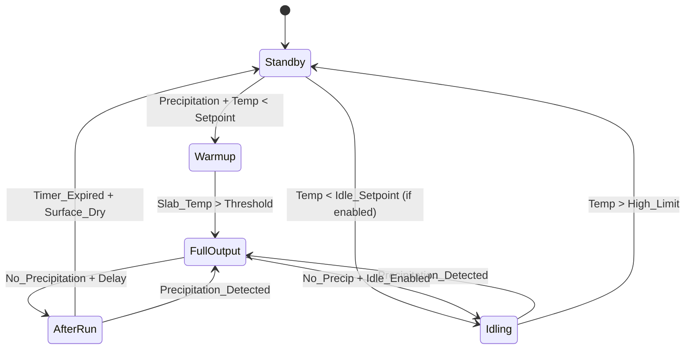
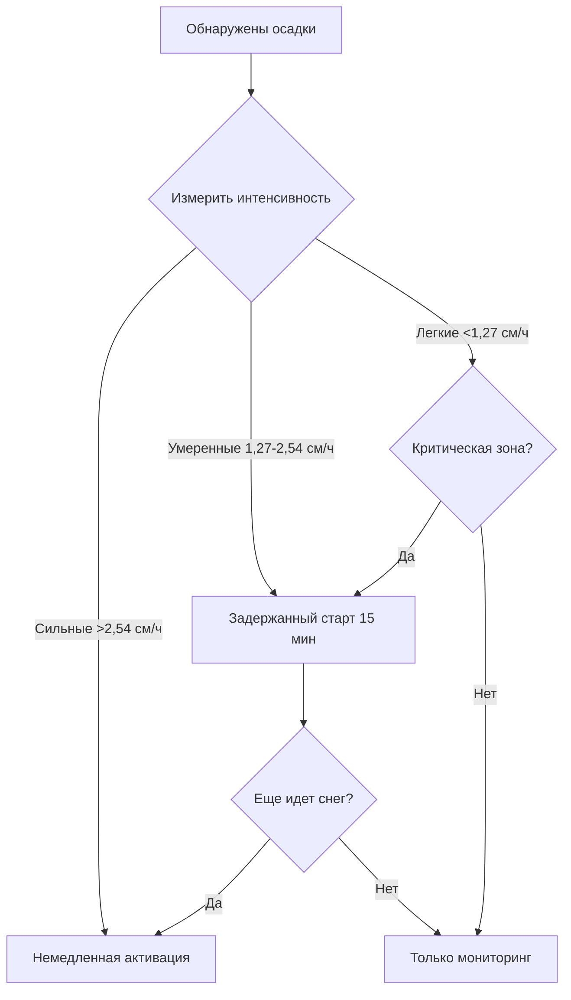

## Режимы оперативного управления

Системы таяния снега работают через отдельные режимы управления, которые балансируют время отклика, потребление энергии и надежность. Стратегия управления в принципе определяет эффективность системы и годовые расходы на эксплуатацию, при этом правильный выбор режима снижает энергопотребление на 40-70%, сохраняя поверхности свободными от снега.

Режимы управления подразделяются на три основные категории на основе критериев активации и интенсивности работы: ожидание (ВЫКЛЮЧЕНО), холостой ход (частичный ввод тепла) и полная производительность (расчетный тепловой поток). Переходы между этими состояниями зависят от входных сигналов датчиков, расчетных требований прогрева и алгоритмов оптимизации энергопотребления.

### Режим 1: Ожидание (система ВЫКЛЮЧЕНА)

Система полностью ВЫКЛЮЧЕНА без подвода тепла на плиту. Это условие существует когда:

- Температура покрытия превышает верхний предельный сигнал (обычно 3-6°C)
- Осадки не обнаруживаются в течение периода таймера доработки
- Подано команда ручного отключения
- Температура наружного воздуха выше предела блокировки активации (обычно 4-7°C)

Во время ожидания температура плиты следует условиям окружающей среды в соответствии с переходной теплопроводностью. Профиль температуры через глубину плиты развивается из граничных условий на поверхности (конвекция, излучение, испарение) и дне (контакт с землей или кондиционируемое пространство ниже).

Одномерное уравнение переходного теплопроводства определяет распределение температуры в плите:

$$\frac{\partial T}{\partial t} = \alpha \frac{\partial^2 T}{\partial z^2}$$

Где коэффициент термической диффузии $\alpha = k/(\rho c)$ определяет скорость проникновения температуры. Для типичного бетона с $k = 1,728$ кДж/(ч·м·°C), $\rho = 2322$ кг/м³ и $c = 0,921$ кДж/(кг·°C), коэффициент диффузии равен:

$$\alpha = \frac{1,728}{2322 \times 0,921} = 0,000813 \text{ м}^2/\text{с}$$

Эта относительно низкая диффузия создает значительное тепловое запаздывание между изменениями температуры поверхности и условиями на глубине нагревательной трубы.

### Режим 2: Холостой ход

Режим холостого хода поддерживает температуру поверхности плиты при или чуть выше нуля (обычно -1 до 3°C) за счет непрерывного низкоуровневого подвода тепла. Система работает с пониженной производительностью, достаточной для компенсации потерь тепла и предотвращения замерзания, но ниже расчетной способности таяния снега.

**Тепловой поток холостого хода** балансирует установившиеся потери:

$$q_{idle} = h_c(T_s - T_a) + h_r(T_s - T_{sky}) + q_{ground}$$

Где:
- $h_c$ = Комбинированный коэффициент конвекции (3,41-8,53 кДж/(ч·м²·°C))
- $h_r$ = Коэффициент излучения (≈1,73 кДж/(ч·м²·°C))
- $T_s$ = Сигнал температуры поверхности (обычно 2°C)
- $T_a$ = Температура наружного воздуха (°C)
- $T_{sky}$ = Эффективная температура неба (°C)
- $q_{ground}$ = Потеря тепла в грунт (кДж/(ч·м²))

Для поверхности, поддерживаемой при 2°C с температурой наружного воздуха -7°C, спокойные условия ветра ($h_c = 3,41$) и потеря в грунт 15,8 кДж/(ч·м²):

$$q_{idle} = 3,41(2-(-7)) + 1,73(2-(-9)) + 15,8 = 30,7 + 19 + 15,8 = 65,5 \text{ кДж/(ч·м}^2)$$

Это представляет приблизительно 30-40% типичного расчетного теплового потока таяния снега (473-789 кДж/(ч·м²)).

**Применение режима холостого хода:**

- Критические зоны доступа 24/7 (входы в помещения, полосы для пожарных машин)
- Места, требующие нулевого допуска накопления снега
- Учреждения с высокими требованиями безопасности при интенсивном движении
- Плиты с тепловой массой, превышающей 2-часовое время прогрева

**Штраф энергопотребления:** Непрерывный холостой ход в течение сезона отопления потребляет значительную энергию. Для зоны площадью 100 м² в течение 100 часов зимнего сезона при 65,5 кДж/(ч·м²):

$$E_{idle} = 65,5 \times 100 \times A = 6,550A \text{ кДж за сезон}$$

Где $A$ = нагреваемая площадь (м²). Площадь 93 м² потребляет 609,35 ГДж для холостого хода, эквивалент 2,97 ГДж вводимого природного газа при эффективности котла 80%.

### Режим 3: Полная производительность (активное таяние снега)

Режим полной производительности обеспечивает расчетный тепловой поток для плавления падающего снега и устранения существующих накоплений. Система работает на максимальной производительности, определяемой расстоянием между трубами, температурой теплоносителя и расходом.

Активация происходит при выполнении всех условий:

1. Обнаружены осадки (датчик влажности активен)
2. Температура покрытия ниже сигнала активации (1-3°C)
3. Истек таймер задержки начала (предотвращает ложные срабатывания)
4. Температура наружного воздуха ниже предела активации

Требуемый тепловой поток состоит из трех компонентов:

$$q_{total} = q_s + q_l + q_e$$

Где:
- $q_s$ = Явное тепло для повышения температуры снега от температуры воздуха до 0°C
- $q_l$ = Скрытое тепло плавления льда (452,8 кДж/кг)
- $q_e$ = Потери тепла при плавлении (конвекция, излучение, испарение)

ASHRAE предоставляет уравнение расчетного теплового потока:

$$q_o = \frac{0,3 s_r h_{fg}}{\eta} + h_c(T_s - T_a) + \frac{\epsilon \sigma (T_s^4 - T_{sky}^4)}{3,412}$$

Упрощено для типичных условий с $s_r$ = интенсивность осадков (кг/(ч·м²)), $h_{fg}$ = 452,8 кДж/кг, $\eta$ = 0,6-0,8 эффективность плавления:

Для осадков 2,54 см/ч (0,17 кг/(ч·м²) при плотности 96 кг/м³):

$$q_{melt} = \frac{0,3 \times 0,17 \times 452,8}{0,7} = 31,5 \text{ кДж/(ч·м}^2)$$

Это представляет только прямую компоненту плавления. Потери тепла обычно составляют 80-90% от общей расчетной нагрузки.

### Режим 4: Работа доработки

Режим доработки продолжает работу на полной производительности в течение установленного периода после прекращения осадков. Этот критический режим обеспечивает полное плавление накопленного снега и испарение остаточной влаги для предотвращения повторного замерзания.

Таймер доработки обычно колеблется от 30 до 120 минут в зависимости от:

- Тепловой массы плиты (большая масса требует более длительной доработки)
- Типичной глубины накопления снега
- Условий ветра (более сильный ветер увеличивает скорость испарения)
- Критичности поверхности (вход в больницу vs парковка)

**Физика остаточной сушки:**

Испарение водной пленки требует значительного энергопотребления. Скрытая теплота испарения равна 3,307 кДж/кг при температуре поверхности 4°C. Тонкая пленка воды толщиной 0,25 мм (0,026 кг/м²) требует:

$$q_{evap} = 0,026 \times 3,307 = 86 \text{ кДж/м}^2$$

Это тепло должно быть подано системой для предотвращения замерзания остаточной влаги. Скорость испарения зависит от разности парциального давления и коэффициента массопередачи:

$$\dot{m}_{evap} = h_m(W_s - W_a)$$

Где $h_m$ = коэффициент массопередачи, $W_s$ = влагосодержание при насыщенной поверхности, $W_a$ = влагосодержание окружающего воздуха.

## Логика переходов состояния

Современные контроллеры реализуют конечные автоматы с условными переходами на основе нескольких входных сигналов датчиков и рассчитанных параметров.

### Условия переходов

**Ожидание → Прогрев:**
- Осадки обнаружены в течение длительности задержки начала (5-15 минут)
- Температура покрытия < сигнал активации (1-3°C)
- Температура наружного воздуха < предел активации (4-7°C)
- Расчетное время прогрева > 0 минут

**Прогрев → Полная производительность:**
- Температура поверхности плиты достигает минимального рабочего порога (2°C)
- ИЛИ таймер прогрева истекает (предотвращает неопределенное ожидание)
- И осадки продолжаются

**Полная производительность → Доработка:**
- Осадки не обнаружены в течение задержки очистки осадков (10-30 минут)
- ИЛИ подана команда ручного отключения с активированной доработкой

**Доработка → Ожидание:**
- Таймер доработки истекает
- И датчик влажности поверхности указывает сухие условия
- И осадки не обнаружены

## Стратегии оптимизации энергопотребления

### Стратегия 1: Оптимизация сигнала активации

Повышение сигнала температуры активации с 0°C до 3°C снижает время работы для маргинальных событий осадков. Снег, падающий на покрытие выше 2°C, часто плавится от грунтового тепла и движения без механической помощи.

**Механизм экономии энергии:** События между 2-3°C не активируют систему, исключая 15-25% годового времени работы в умеренном климате. Компромисс включает кратковременное накопление снега (5-15 минут) перед тем, как наступает окружающее плавление.

### Стратегия 2: Различение интенсивности осадков

Продвинутые датчики измеряют интенсивность осадков, чтобы различить легкие снежные хлопья от устойчивых снегопадов. События легкого снега (<1,27 см/ч) могут не оправдывать полную активацию системы в низкоприоритетных зонах.

Алгоритм управления:

### Стратегия 3: Зонирование

Крупные установки разделены на зоны с поэтапной активацией для снижения пикового электрического спроса и скорости срабатывания котла. Приоритетные зоны активируются в первую очередь с последующими зонами с задержкой 15-30 минут.

**Снижение спроса:** Система площадью 929 м² при 631 кДж/(ч·м²) требует 585,7 ГДж/ч всего. Поэтапная активация в четыре зоны снижает пиковый спрос до 146,4 ГДж/ч на этап, позволяя выбрать меньший котел или снизить расходы по спросу электроэнергии.

Последовательность зонирования:

| Этап | Зоны | Задержка | Пиковый спрос |
|------|------|----------|---------------|
| 1 | Въездные проезжие (25%) | 0 мин | 146,4 ГДж/ч |
| 2 | Основной доступ (25%) | 15 мин | 292,7 ГДж/ч |
| 3 | Парковка (30%) | 30 мин | 439,1 ГДж/ч |
| 4 | Вторичные зоны (20%) | 45 мин | 585,7 ГДж/ч |

### Стратегия 4: Модуляция нагрузки при прогреве

Во время фазы прогрева плиты полная расчетная производительность не требуется. Модуляция производительности на основе скорости повышения температуры оптимизирует использование энергии, сохраняя требования по времени.

Требуемый тепловой поток прогрева вытекает из тепловой массы и целевого времени:

$$q_{warmup} = \frac{m \cdot c \cdot \Delta T}{A \cdot t_{target}}$$

Для 15-сантиметровой плиты бетона (366 кг/м²), требующей повышение на 11°C за 60 минут:

$$q_{warmup} = \frac{366 \times 0,921 \times 11}{1 \times 1} = 3,700 \text{ кДж/(ч·м}^2)$$

Если расчетная производительность превышает это требование, модуляция в соответствии с рассчитанной нагрузкой прогрева снижает циклирование котла и улучшает эффективность.

### Стратегия 5: Интеграция прогноза погоды

Контроллеры, подключенные к интернету, получают доступ к данным прогноза для реализации прогнозной логики:

- Предварительный прогрев плит перед прогнозируемыми штормами (исключает накопление снега во время прогрева)
- Предотвращение активации для штормов, прогнозирующихся не попасть в местоположение
- Корректировка длительности доработки на основе прогноза погоды после осадков
- Отключение режима холостого хода во время продолжительных теплых периодов

**Воздействие на энергию:** Интеграция прогноза снижает ложные срабатывания на 30-40% и предотвращает ненужный холостой ход во время теплых перерывов зимой, дающие 15-25% годовой экономии энергии.

## Сравнение стратегий управления

| Стратегия | Время отклика | Использование энергии | Годовая стоимость | Применение |
|-----------|----------------|-----------------------|-------------------|------------|
| Ручное управление | 30-120 мин | Высокое | Высокая | Малые жилые |
| Авто + ожидание | 15-60 мин | Низкое | Низкая | Общее коммерческое |
| Авто + холостой ход | 0-5 мин | Очень высокое | Очень высокая | Критический доступ |
| Интеграция прогноза | 0 мин (предварительный старт) | Среднее | Средняя | Крупное коммерческое |
| Поэтапное зонирование | 0-45 мин | Среднее-низкое | Низкая-средняя | Крупные установки |

## Рекомендации по проектированию

Правильный выбор стратегии управления требует анализа:

1. **Критичность** - Критический доступ требует холостого хода или интеграции прогноза для нулевого допуска накопления снега
2. **Размер площади** - Крупные области выигрывают от стратегий зонирования и поэтапной активации
3. **Тепловая масса плиты** - Плиты высокой массы (>15 см) требуют холостого хода или интеграции прогноза для минимизации задержки прогрева
4. **Климат** - Расположения с частыми циклами замораживания-оттаивания выигрывают от оптимизированных сигналов
5. **Стоимость энергии** - Высокие расходы на энергию оправдывают инвестиции в продвинутые функции управления

Справочник ASHRAE - Приложения HVAC Глава 51 рекомендует автоматическое управление с режимом ожидания для большинства применений, отводя операцию холостого хода для критических зон, требующих немедленного отклика. Таймер доработки должен равняться минимум 30 минут с расширением до 60-90 минут для установок с высокой тепловой массой.

Комиссионирование системы управления должно подтвердить калибровку датчика, значения сигналов, настройки временной задержки и надлежащие переходы состояния в смоделированных условиях перед первым снежным событием. Документируйте все параметры управления и корректируйте на основе наблюдений производительности в первый сезон.
