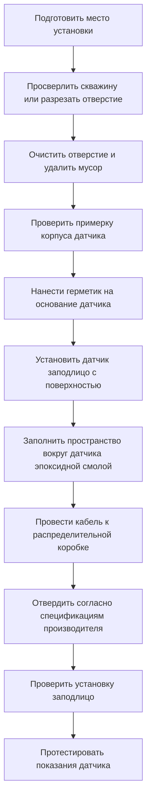
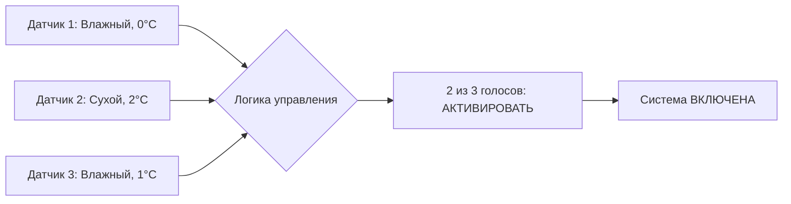

## Обзор

Датчики, установленные на проезжей части, обеспечивают прямое измерение состояния поверхности для автоматического управления системой растапливания снега. Эти датчики устанавливаются заподлицо с обогреваемой поверхностью и интегрируют несколько элементов датчиков—измерение температуры, обнаружение влаги и мониторинг осадков—в одном узле. Встроенная конструкция исключает воздействие ветра и переменные угла наклона, влияющие на воздушные датчики, при этом обеспечивая точные данные в реальном времени на критическом интерфейсе снег-проезжая часть.

Надлежащий выбор датчика, установка и размещение определяют надежность системы управления. Поврежденный или неправильно откалиброванный датчик на проезжей части вызывает ложные срабатывания, пропуск снежных событий или полный отказ системы. Понимание конструкции датчика, требований к установке и соображений долговечности обеспечивает надежную долгосрочную работу.

## Конструкция датчика

### Узел многофункционального датчика

Современные датчики на проезжей части объединяют три важные функции датчиков в одном корпусе:

**Элемент измерения температуры**
- ДСС (датчик сопротивления температурный) или прецизионный термистор
- Диапазон измерения: от −40°C до 60°C типичный
- Точность: ±0,6°C в диапазоне эксплуатации
- Время отклика: 60−90 секунд до 63,2% от скачкообразного изменения
- Местоположение датчика: 6 мм ниже поверхности

**Сетка обнаружения влаги**
- Открытые пары электродов на поверхности датчика
- Измеряет электрическую проводимость между электродами
- Обнаруживает толщину пленки воды в 0,025 мм
- Различает влажные и сухие условия
- Устойчив к загрязнению дорожными солями

**Обнаружение интенсивности осадков**
- Тепловой или емкостный элемент датчика
- Отличает активные осадки от остаточной влаги
- Предотвращает ложное срабатывание при высыхании после дождя
- Пороговое значение отклика: типичный 0,25 мм/час

### Физические характеристики

Стандартные размеры датчика на проезжей части:

| Параметр | Типичная спецификация | Соображения при проектировании |
|-----------|----------------------|------------------------|
| Диаметр поверхности | 10−15 см | Большая поверхность улучшает усреднение |
| Глубина установки | 7,5−10 см | Должна достигать ниже глубины промерзания |
| Материал корпуса | Армированная эпоксидная смола или полиуретан | Химическая стойкость к противогололедным реагентам |
| Материал поверхности | Полимерный композит | Грузоподъемность >89 кН |
| Длина кабеля | 15−150 м | Удлиняемый в поле с распределительной коробкой |
| Защита от проникновения | IP68 (погружаемый) | Предотвращает попадание влаги |
| Рабочая температура | −40°C до 60°C | Выдерживает циклическое изменение температуры |

## Принципы измерения температуры

### Измерение температуры ДСС

Датчики сопротивления температурные работают на основе принципа, что электрическое сопротивление чистых металлов предсказуемо увеличивается с температурой. ДСС из платины проявляют следующую зависимость:

$$R_T = R_0[1 + \alpha(T - T_0) + \beta(T - T_0)^2]$$

Где:
- $R_T$ = Сопротивление при температуре $T$ (Ω)
- $R_0$ = Сопротивление при эталонной температуре $T_0$ (Ω)
- $\alpha$ = Температурный коэффициент (0,00385 Ω/Ω/°C для Pt100)
- $\beta$ = Коэффициент второго порядка (типично малый)
- $T$ = Измеренная температура (°C)
- $T_0$ = Эталонная температура (0°C)

Для датчиков Pt100 (100Ω при 0°C) сопротивление изменяется примерно на 0,385 Ω на °C, обеспечивая отличное разрешение для критического диапазона 0°C−4°C, где происходят решения о растапливании снега.

### Характеристики тепловой реакции

Отклик датчика на изменение температуры подчиняется динамике первого порядка:

$$T_{sensor}(t) = T_{final} + (T_{initial} - T_{final})e^{-t/\tau}$$

Где:
- $\tau$ = Тепловая постоянная времени (секунды)
- $t$ = Прошедшее время (секунды)

Постоянная времени датчика зависит от тепловой массы, площади поверхности и контактного сопротивления между датчиком и окружающей проезжей частью. Типичные значения варьируются от 60 до 120 секунд, что достаточно для отслеживания изменений температуры проезжей части во время снежных событий при одновременной фильтрации быстрых колебаний.

## Методы обнаружения влаги

### Обнаружение на основе проводимости

Открытые сетки электродов обнаруживают влагу через изменения электрической проводимости. Чистая вода проявляет низкую проводимость (0,055 мкСм/см), но влага на дорожной поверхности содержит растворенные ионы от противогололедных солей, существенно увеличивая проводимость.

Датчик применяет небольшое переменное напряжение (типично 12 В при 1−10 кГц) между парами электродов и измеряет ток протечки:

$$\sigma = \frac{I \cdot L}{V \cdot A}$$

Где:
- $\sigma$ = Электрическая проводимость (См/м)
- $I$ = Измеренный ток (А)
- $V$ = Приложенное напряжение (В)
- $L$ = Расстояние между электродами (м)
- $A$ = Эффективная площадь датчика (м²)

Проводимость увеличивается с обоими количеством влаги и ионной концентрацией. Контроллеры устанавливают порог проводимости (типично 50−200 мкСм/см), выше которого поверхность считается влажной.

### Толщина пленки влаги

Связь между измеренной проводимостью и толщиной водяной пленки примерно следующая:

$$d = \frac{\sigma_{measured}}{\sigma_{bulk} \cdot f}$$

Где:
- $d$ = Толщина водяной пленки (м)
- $\sigma_{measured}$ = Измеренная проводимость (См/м)
- $\sigma_{bulk}$ = Проводимость объема воды (См/м)
- $f$ = Геометрический фактор, учитывающий конфигурацию электродов

Обнаружение пленок толщиной в 0,025 мм позволяет осуществить раннее включение системы до значительного накопления снега.

## Требования к установке

### Проникновение в плиту и монтирование

### Этапы установки заподлицо

**1. Выбор местоположения**
- Представительная область, получающая типичное накопление снега
- Избегать путей дренажа или областей, затененных конструкциями
- Минимум 15 см от контрольных швов или трещин
- По возможности защищена от прямого движения в полосах движения

**2. Подготовка отверстия**
- Диаметр скважины: диаметр датчика + 6 мм допуска
- Глубина: согласно спецификации производителя (типично 9−11,5 см)
- Тщательно очистить отверстие, чтобы обеспечить надлежащую адгезию эпоксидной смолы
- Убедиться, что стенки скважины квадратные и гладкие

**3. Установка датчика**
- Проверить примерку датчика перед нанесением клея
- Нанести герметик или эпоксидную смолу производителя на основание датчика
- Плотно установить датчик на место
- Проверить, что поверхность датчика точно заподлицо (не утопленная или выступающая)
- Использовать линейку для проверки выравнивания по всей установке

**4. Заполнение пустот**
- Заполнить зазор между корпусом датчика и бетоном эпоксидным раствором
- Обеспечить полное устранение пустот (предотвращает попадание воды)
- Скосить края для создания гладкого перехода
- Дать полностью затвердеть перед воздействием движения (24−72 часа типично)

**5. Защита кабеля**
- Провести кабель в трубопровод, встроенный в плиту или установленный на поверхности
- Предусмотреть сервисный запас у датчика
- Загерметизировать точки входа трубопровода от попадания воды
- Маркировать кабель на обоих концах с идентификацией датчика

### Соображения при модернизационной установке

Разрезание существующих плит требует особого внимания к:

- **Местоположение армирования**: Сканирование X-лучами или ГПР для определения арматуры
- **Зазор трубки отопления**: Сохранить минимум 15 см от гидравлических труб
- **Образование трещин**: Установить уплотнение сжатия вокруг периметра датчика
- **Возраст плиты**: Бетон должен отвердеть минимум 28 дней перед разрезанием
- **Структурное воздействие**: Избегать разрезания через первичное армирование

## Стратегия размещения датчика

### Приложения с одним датчиком

Небольшие установки (жилые проезжие части, дорожки менее 46 м²) обычно используют один датчик. Критерии выбора местоположения:

- Центр защищенной области (для однородной экспозиции)
- Высшая точка возвышения (первая для охлаждения, последняя для высыхания)
- Условия репрезентативного микроклимата
- Доступное место для будущего обслуживания

### Массивы датчиков

Крупные установки выигрывают от нескольких датчиков для учета вариаций микроклимата:

| Область установки | Рекомендуемая плотность датчиков | Стратегия размещения |
|-------------------|---------------------------|-------------------|
| < 46 м² | 1 датчик | Геометрический центр |
| 46−186 м² | 2 датчика | Противоположные углы |
| 186−930 м² | 3−4 датчика | Сетчатый паттерн, интервал 15−21 м |
| > 930 м² | 4+ датчика | Микроклиматы, изменения возвышения |

### Логика управления для датчиков

**Логика ИЛИ** (любое активирование датчика включает систему)
- Максимальная надежность для удаления снега
- Повышенное энергопотребление от раннего включения
- Предотвращает локальное накопление снега в холодных точках

**Логика И** (все датчики должны активироваться)
- Уменьшает ложные старты
- Риск накопления снега в областях раннего охлаждения
- Пониженное энергопотребление

**Логика большинства** (2 из 3 или 3 из 5 датчиков должны активироваться)
- Балансирует надежность и эффективность использования энергии
- Исключает ложные срабатывания от отказов одиночного датчика
- Рекомендуется для критических приложений

## Долговечность и устойчивость к окружающей среде

### Механическая нагрузка

Датчики на проезжей части выдерживают нагрузки дорожного движения через:

**Прочность поверхности**
- Композитный полимерный материал поверхности
- Прочность на сжатие: 20 000+ фунт-сила (соответствует бетону)
- Прочность при изгибе предотвращает растрескивание при точечных нагрузках
- Устойчивость к истиранию от снежных плугов

**Распределение нагрузки**
Поверхность датчика действует как балка, поддерживаемая окружающим бетоном:

$$\sigma_{max} = \frac{M \cdot c}{I}$$

Где:
- $\sigma_{max}$ = Максимальное напряжение в поверхности датчика (кПа)
- $M$ = Момент изгиба от приложенной нагрузки (Н·м)
- $c$ = Расстояние от нейтральной оси до внешнего волокна (м)
- $I$ = Момент инерции поперечного сечения поверхности датчика (м⁴)

Надлежащая установка исключает пустоты под датчиком, которые снижали бы поддержку и увеличивали концентрацию напряжений.

### Химическая устойчивость

Дорожные химические вещества атакуют материалы датчика:

**Противогололедные соли**
- Хлорид натрия (NaCl): Наиболее распространенный, умеренная коррозивность
- Хлорид кальция (CaCl₂): Гигроскопический, увеличивает воздействие влаги
- Хлорид магния (MgCl₂): Более коррозивный, чем NaCl
- Ацетат калия (CH₃COOK): Некоррозивный, но дорогостоящий

**Выбор материала**
- Покрытие электродов: Золото или платина (коррозийная иммунность)
- Изоляция провода: Фторполимер (химическая стойкость)
- Герметики: Полиуретан или полисульфид (совместимость с противогололедными солями)
- Материал корпуса: Эпоксидная смола (инертна к хлоридам)

### Эффекты циклического изменения температуры

Годовые колебания температуры от −29°C до 60°C (прямой солнечный свет на темную проезжую часть) создают тепловой стресс:

$$\epsilon = \alpha \cdot \Delta T$$

Где:
- $\epsilon$ = Тепловая деформация (безразмерная)
- $\alpha$ = Коэффициент теплового расширения (м/м/°C)
- $\Delta T$ = Изменение температуры (°C)

Несовпадение материалов между корпусом датчика ($\alpha_{sensor}$ ≈ 30×10⁻⁶ м/м/°C) и бетоном ($\alpha_{concrete}$ ≈ 5×10⁻⁶ м/м/°C) вызывает дифференциальное расширение. Надлежащий выбор герметика учитывает движение без растрескивания.

## Электрический интерфейс

### Кондиционирование сигнала

Контроллеры интерпретируют сигналы датчика через:

**Сигнал температуры**
- 4-проводное подключение ДСС исключает ошибки сопротивления проводов
- 3-проводная конфигурация приемлема для расстояний <30 м
- Ток возбуждения: 1 мА (минимизирует саморазогрев)
- Диапазон сигнала: 80 Ω до 120 Ω для Pt100 в диапазоне эксплуатации

**Сигнал влаги**
- Цифровой выход (порог сухо/влажно) или аналоговый (значение проводимости)
- Скорость обновления: 1−10 секунд
- Выходное напряжение: 0−5 В или 0−10 В аналоговый
- Замыкание контакта: Некоторые модели обеспечивают выход реле

**Сигнал осадков**
- Бинарное указание (да/нет) или измерение интенсивности
- Время интеграции: 30−60 секунд (предотвращает переходные процессы от капель)
- Регулировка чувствительности: Пороговое значение, регулируемое в поле

### Спецификации проводки

| Тип кабеля | Типичная спецификация | Примечания по применению |
|------------|----------------------|-------------------|
| Размер проводника | 18−22 AWG | Больший размер для трасс >60 м |
| Количество проводников | 4−8 | Зависит от функций датчика |
| Изоляция | THHN или FEP | Химически и влагостойкая |
| Экранирование | Фольга 100% + провод стока | Защита ЭМП рядом с силовой проводкой |
| Оболочка | УФ-стойкий ПВХ или ПЭ | Рейтинг для наружной укладки |
| Трубопровод | ПВХ Schedule 40 минимум | Защита от механических повреждений |

## Калибровка и техническое обслуживание

### Проверка калибровки температуры

Сравнить показания датчика с эталонным термометром:

**Метод ледяной ванны**
1. Подготовить ледяную ванну при 0°C
2. Погрузить датчик (если съемный) или использовать поверхностный контакт
3. Дать 5 минут на стабилизацию
4. Записать показание датчика
5. Приемлемое отклонение: ±0,8°C

**Сравнение с окружающей средой**
1. Сравнить с откалиброванным эталоном, помещенным рядом с датчиком
2. Дать ночную стабилизацию для исключения солнечных эффектов
3. Провести измерение на рассвете (условия теплового равновесия)
4. Записать отклонение для регулировки смещения контроллера

### Тестирование обнаружения влаги

Имитировать влажные условия:

**Тест применения воды**
1. Нанести 15 мл воды на поверхность датчика
2. Датчик должен указать влажность в течение 5 секунд
3. Проверить получение контроллером сигнала влажности
4. Позволить поверхности высыхать естественным путем
5. Датчик должен указать сухость в течение 5 минут после визуального высыхания

**Тест раствора соли**
1. Нанести раствор соли (10% NaCl) для имитации остатка противогололедного реагента
2. Проверить неизменение чувствительности обнаружения
3. Промыть чистой водой
4. Подтвердить надлежащее указание высыхания

### График планового обслуживания

| Задача обслуживания | Частота | Процедура |
|-----------------|-----------|-----------|
| Визуальный осмотр | Ежемесячно (зима) | Проверить повреждение, проверить установку заподлицо |
| Очистка | По мере необходимости | Удалить мусор, промыть водой |
| Проверка калибровки | Ежегодно (осень) | Проверить точность температуры ±1,1°C |
| Тест влаги | Ежегодно (осень) | Подтвердить отклик влажности/сухости |
| Осмотр кабеля | Ежегодно | Проверить повреждение, попадание воды |
| Состояние герметика | Каждые 3−5 лет | Переуплотнить, если вокруг датчика развиваются трещины |

## Оптимизация производительности

### Эффекты местоположения датчика на производительность системы

Размещение датчика существенно влияет на годовое энергопотребление и эффективность удаления снега:

**Влияние энергии от неправильного размещения**
- Затенённое местоположение: Увеличенное время работы на 15−25% (отложенное высыхание)
- Путь дренажа: Увеличенные ложные старты на 20−30% (стоячая вода)
- Защищенная ниша от ветра: Увеличенное время после работы на 10−15%

**Влияние надежности**
- Открытое возвышение: На −5 до −6°C холоднее, чем защищённые области (более раннее включение)
- Южная ориентация склона: На +3 до +8°C теплее (возможный пропуск включения)
- Край в сравнении с центром: Граничные местоположения охлаждаются на 30−60 минут раньше

### Стратегии голосования датчиков

Внедрить избыточность без чрезмерного энергопотребления:

Этот подход голосования большинства обеспечивает устойчивость к отказам при одновременном предотвращении отказов одиночного датчика от отключения системы или ненужного включения.

## Устранение неисправностей распространённых проблем

| Признак | Возможная причина | Диагностический тест | Решение |
|---------|---------------|-----------------|----------|
| Температура читается постоянной | Отказ элемента ДСС | Измерить сопротивление (должно быть 80−120 Ω) | Заменить датчик |
| Всегда указывает влажность | Загрязнение электрода | Визуальный осмотр, проверка сопротивления | Очистить или заменить |
| Никогда не указывает влажность | Разрыв цепи влаги | Нанести воду, измерить непрерывность электрода | Заменить датчик или кабель |
| Прерывистые показания | Повреждение кабеля или слабое соединение | Тест покачивания, проверка непрерывности | Отремонтировать или заменить кабель |
| Показывает на 6−11°C выше | Саморазогрев от тока обнаружения влаги | Проверить ток возбуждения <1 мА | Снизить ток обнаружения |
| Датчик выступает или утоплен | Осадка установки или морозное вздутие | Измерение линейкой | Переустановить уровень или заменить |

## Спецификация и критерии выбора

### Требования к производительности

Указать датчики на проезжей части на основе требований приложения:

**Измерение температуры**
- Требование точности: ±0,6°C для критических приложений, ±1,1°C приемлемо для общего использования
- Диапазон: −40°C до 60°C минимум
- Время отклика: <90 секунд до 63,2% скачкообразного изменения

**Обнаружение влаги**
- Чувствительность: Обнаружение пленки воды 0,025 мм
- Время отклика: <10 секунд до указания влажности
- Коэффициент ложного срабатывания: <1% при надлежащей установке

**Долговечность**
- Грузоподъемность: Прочность на сжатие 89 кН минимум
- Химическая стойкость: Совместима со всеми распространёнными противогололедными реагентами
- Ожидаемый срок службы: 15−20 лет при надлежащей установке

### Анализ затрат и выгод

Экономика датчика на проезжей части в сравнении с альтернативами:

| Тип датчика | Первоначальная стоимость | Стоимость установки | Годовое обслуживание | Ожидаемый срок службы | Общая стоимость за 20 лет |
|-------------|-------------|-------------------|-------------------|-----------------|-------------------|
| Датчик на проезжей части | 200−400 € | 150−350 € | 35 € | 15−20 лет | 1 800−2 800 € |
| Воздушный датчик + ДСС плиты | 300−550 € | 200−400 € | 50 € | 12−15 лет | 2 400−3 800 € |
| Ручное управление | 0 € | 0 € | 0 € | Н/Д | 5 500−10 000 €† |

†Стоимость ручного управления отражает потерю энергии от отложенного отключения и пропущенного оптимального времени включения.

## Отраслевые стандарты и ссылки

**Справочник приложений ASHRAE**
- Глава 51: Растапливание снега и защита от промерзания
- Рекомендации по размещению датчика
- Руководство по проектированию системы управления

**Спецификации производителя**
- Инструкции по установке имеют приоритет над общими рекомендациями
- Процедуры калибровки специфичны для модели датчика
- Требования гарантии для надлежащей установки

**Стандарты IEEE**
- IEEE 1451: Стандарты интерфейса интеллектуального датчика
- Применяется к цифровым датчикам со стандартизированной связью

Датчик на проезжей части служит первичным входом для автоматического управления растапливанием снега, непосредственно измеряя условия, определяющие включение системы. Надлежащий выбор, установка и техническое обслуживание обеспечивают надёжное удаление снега с оптимальной энергоэффективностью на протяжении всего расчётного срока службы системы.
