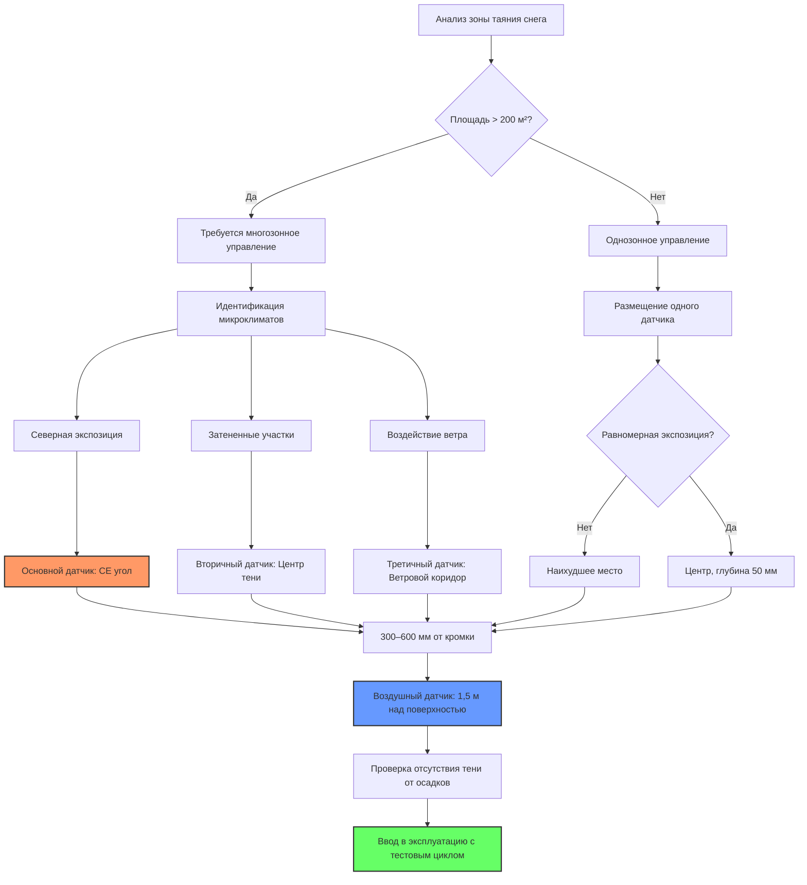

## Физические принципы размещения датчиков

Размещение датчиков в системах антиобледенения напрямую влияет на время отклика, энергопотребление и эксплуатационную надежность. Критическая задача заключается в выборе мест, обеспечивающих репрезентативные условия, с учетом тепловой инерции и изменчивости воздействия окружающей среды.

Время теплового отклика встроенных датчиков в плите подчиняется законам теплопроводности. Для датчика, расположенного на глубине $d$ ниже поверхности, постоянная времени составляет:

$$\tau = \frac{d^2}{\alpha}$$

где $\alpha$ — коэффициент температуропроводности (м²/с). Для бетона при $\alpha \approx 7 \times 10^{-7}$ м²/с на глубине 50 мм:

$$\tau = \frac{(0.05)^2}{7 \times 10^{-7}} = 3571 \text{ с} \approx 60 \text{ мин}$$

Эта задержка определяет минимальные требования к предварительному нагреву.

## Выбор репрезентативного места размещения

Выбранное место размещения датчика должно отражать наихудшие условия для защищаемой зоны. Это требует анализа трех тепловых граничных условий:

**Краевые эффекты**: Потери тепла происходят через все шесть поверхностей элемента плиты на периметре, в отличие от одномерных потерь в центре. Дефицит температуры на краю составляет:

$$\Delta T_{edge} = \frac{q \cdot L}{2k_{eff}}$$

где $q$ — поверхностный тепловой поток (Вт/м²), $L$ — расстояние до края (м), а $k_{eff}$ — эффективная теплопроводность с учетом теплоизоляции.

**Радиационный баланс**: Поверхностные датчики испытывают различный чистый радиационный поток в зависимости от коэффициентов обзора. Датчик в месте с высоким коэффициентом обзора неба испытывает большее радиационное охлаждение:

$$q_{rad} = \epsilon \sigma (T_s^4 - T_{sky}^4)$$

При ясном небе $T_{sky} \approx T_{air} - 6$ К, что увеличивает скорость охлаждения на 15-20% по сравнению с защищенными местами.

**Воздействие ветра**: Коэффициент конвективной теплоотдачи варьируется в зависимости от скорости ветра согласно формуле:

$$h_c = 5.7 + 3.8V$$

где $V$ — скорость ветра (м/с). Датчик в защищенном от ветра месте недооценивает фактические тепловые потребности в отношении отношения местной скорости ветра к расчетной.

## Сравнение типов датчиков

| Тип датчика | Типичное место размещения | Время отклика | Параметр обнаружения | Точность | Применение |
|------|----------------|----------|-----------------|------|-------|
| Воздушный датчик влажности/температуры | 1.5-2 м над поверхностью | 30-90 с | Осадки + температура воздуха | ±0.5°C, 95% обнаружение | Основное обнаружение осадков |
| Встроенный RTD | 25-50 мм ниже поверхности | 10-60 мин | Температура плиты | ±0.1°C | Управление температурой плиты |
| Поверхностный RTD | Приклеен к поверхности | 2-10 мин | Температура поверхности | ±0.2°C | Быстродействующее управление |
| Датчик дорожного покрытия | Вровень с поверхностью | 5-15 мин | Температура поверхности + влажность | ±0.3°C | Комбинированное обнаружение |
| Удаленный инфракрасный | 2-5 м от объекта | <1 с | Температура поверхности | ±1°C | Бесконтактная проверка |

## Стратегия зон с несколькими датчиками

Для больших площадей требуется несколько зон обнаружения для учета вариаций микроклимата. Максимальная площадь на один датчик ограничена тепловой однородностью (вариация ±1°C), эффектами тени от осадков и пропускной способностью управляющих клапанов.

Для прямоугольных площадей деление на зоны требуется при:

$$A > \frac{k \cdot \Delta T_{max}}{q_{design} \cdot CV}$$

где $CV$ — коэффициент вариации для снежных отложений (обычно 0.15-0.25).

## Критические соображения по размещению

### Приоритет северной экспозиции

Северные экспозиции получают минимальное солнечное излучение в зимние месяцы. Разница в солнечном притоке между северными и южными экспозициями на широте 40°N в январе составляет примерно:

$$\Delta Q_{solar} = 150-200 \text{ Вт/м²}$$

Это составляет 30-40% от типичного расчетного теплового потока (400-500 Вт/м²). Размещайте основные датчики на северных участках, чтобы предотвратить недогрев критических зон.

### Затененные участки против солнечных

Затененные участки теряют солнечную помощь (100-200 Вт/м²), получают уменьшенное длинноволновое излучение и испытывают более низкие температуры воздуха (дефицит 1-3°C). Размещайте как минимум один датчик в постоянно затененных местах. Для смешанной экспозиции:

$$q_{effective} = f_{shade} \cdot q_{shade} + (1-f_{shade}) \cdot q_{sun}$$

### Размещение по периметру против центра

Периметральные зоны теряют тепло как через верхнюю поверхность, так и через открытые кромки. Потери тепла в углах превышают потери в центральных зонах на величину:

$$q_{corner} = q_{surface} + 2 \cdot U_{edge} \cdot h_{slab} \cdot \Delta T$$

где $U_{edge}$ — коэффициент теплопередачи кромки (Вт/м·К), а $h_{slab}$ — толщина плиты (м).

**Стандартная практика**: Разместите основной датчик управления на расстоянии 300–600 мм от наиболее открытой кромки (обычно северо-восточный угол для установок в северном полушарии). Эта локация позволяет зафиксировать тепловую потерю на кромке, избегая экстремальных эффектов в углах, которые могут привести к чрезмерной работе системы.

## Оптимальная схема размещения датчиков

## Проверка монтажа

Проверьте размещение датчиков с помощью тепловизора (подтверждение самых холодных зон), измерения времени отклика (тест холодной водой), испытаний на осадки (распыление под несколькими углами) и сравнительных показаний (разброс <0,5°C).

Правильное размещение датчиков снижает энергопотребление на 15–25% и повышает надежность работы без снега с 85–90% до 95–98%.
