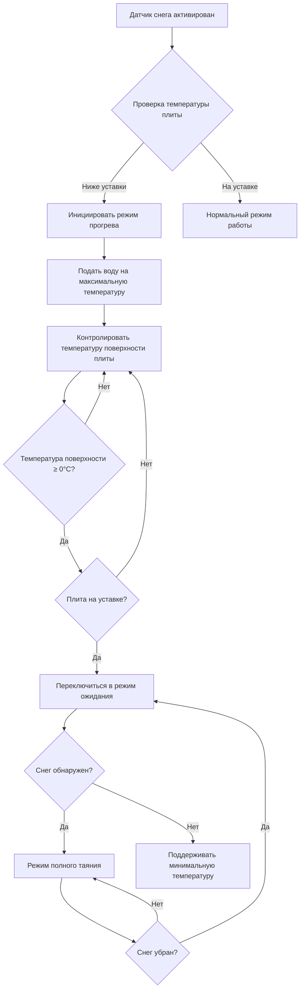

## Основные принципы прогрева плиты

Прогрев плиты — это процесс повышения температуры встроенного трубопровода или нагревательного элемента от температуры окружающей среды до рабочей температуры до начала или во время снегопада. Период прогрева представляет критическую фазу управления, которая определяет эффективность системы и потребление энергии. Физический процесс включает теплопроводность через бетон, нестационарный теплопередачу и эффекты накопления тепла.

Время прогрева зависит от трех основных факторов: тепловой массы плиты (плотность и удельная теплоемкость бетона), теплового сопротивления между нагревательными элементами и поверхностью плиты, а также скорости подвода тепла от трубопровода или нагревательных кабелей.

## Расчет времени прогрева

Нестационарная теплопередача во время прогрева подчиняется экспоненциальному отклику, управляемому постоянной времени системы плиты. Для упрощенного анализа время прогрева можно оценить по формуле:

$$t_{warmup} = \frac{\rho \cdot c_p \cdot V \cdot \Delta T}{Q_{input}}$$

Где:
- $t_{warmup}$ = время прогрева (секунды)
- $\rho$ = плотность бетона (типично 2400 кг/м³)
- $c_p$ = удельная теплоемкость бетона (880 Дж/кг·К)
- $V$ = эффективный объем прогреваемого бетона (м³)
- $\Delta T$ = требуемое повышение температуры (К)
- $Q_{input}$ = скорость подвода тепла (Вт)

Для более точного прогноза с учетом потерь тепла во время прогрева:

$$t_{warmup} = \frac{\rho \cdot c_p \cdot A \cdot d \cdot \Delta T}{Q_{input} - Q_{loss}}$$

Где:
- $A$ = площадь плиты (м²)
- $d$ = эффективная глубина прогреваемой зоны (м)
- $Q_{loss}$ = потери тепла в окружающую среду во время прогрева (Вт)

Эффективная глубина обычно простирается от нагревательного элемента до поверхности плюс примерно 50–75 мм ниже нагревательного элемента из-за двусторонней теплопередачи.

## Постоянная времени системы

Плита ведет себя как система первого порядка с постоянной времени:

$$\tau = \frac{R_{th} \cdot C_{th}}{1}$$

Где:
- $R_{th}$ = тепловое сопротивление от нагревательного элемента до поверхности (К/Вт)
- $C_{th}$ = тепловая емкость плиты (Дж/К)

Отклик температуры поверхности следует:

$$T(t) = T_{final} \cdot \left(1 - e^{-t/\tau}\right) + T_{initial}$$

При $t = \tau$ плита достигает 63% от своей конечной температуры. При $t = 3\tau$ плита достигает 95% от конечной температуры, что обычно определяет точку практического завершения прогрева.

## Последовательность управления прогревом

## Стратегии прогрева по типам плит

| Конфигурация плиты | Типичное время прогрева | Стратегия управления | Влияние на энергию | Примечания |
|-------------------|---------------------|------------------|---------------|-------|
| Тонкое покрытие (50–75 мм) | 1,0–1,5 ч | Агрессивный предварительный прогрев | Низкая тепловая масса, быстрый отклик | Требует частых циклов |
| Стандартный бетон (100–150 мм) | 2,0–3,0 ч | Умеренный предварительный прогрев | Сбалансированный отклик | Наиболее распространен в жилых зданиях |
| Тяжелый бетон (>150 мм) | 3,0–4,5 ч | Расширенный предварительный прогрев | Высокая тепловая масса, медленный отклик | Коммерческие применения |
| Асфальт с поверхностным трубопроводом | 0,75–1,25 ч | Быстрый предварительный прогрев | Более низкая теплоемкость | Требует тщательного управления |
| Бетон с глубоким трубопроводом | 3,5–5,0 ч | Очень ранний предварительный прогрев | Значительные потери тепла при прогреве | Ненадлежащая практика монтажа |

## Требования к предварительному прогреву

Рекомендации ASHRAE предусматривают поддержание температуры плиты выше 0°C во время выпадения осадков. Стратегия предварительного прогрева зависит от режима работы системы:

**Автоматический режим**: Датчики снега инициируют прогрев при соответствии условий выпадения осадков и температуры. Система должна завершить прогрев до значительного накопления снега, обычно требуя 1–2 часа предварительного уведомления.

**Ручной режим**: Оператор инициирует прогрев на основе прогноза погоды. Позволяет более длительные периоды прогрева, но рискует ненужным потреблением энергии из-за ложных тревог.

**Режим непрерывного ожидания**: Плита поддерживается при температуре 0–4°C в течение зимних месяцев. Исключает задержку прогрева, но увеличивает сезонное потребление энергии на 40–60%.

## Рассмотрение тепловой массы

Тепловая масса системы плиты включает:

1. **Объем бетона**: Основной компонент теплового хранилища
2. **Вода в трубопроводе**: Обычно 5–10% от полной тепловой массы
3. **Базовые материалы**: Изоляция исключает этот вклад
4. **Отделочные материалы поверхности**: Незначительный вклад

Полная тепловая емкость определяет емкость накопления тепла:

$$C_{total} = \sum_{i} (m_i \cdot c_{p,i})$$

Большая тепловая масса обеспечивает:
- Большую стабильность температуры во время работы
- Снижение колебаний температуры поверхности
- Продленный период остывания после остановки системы
- Увеличение времени прогрева и высшую энергию предварительного прогрева

## Потребление энергии во время прогрева

Энергия, необходимая для прогрева плиты, может быть рассчитана:

$$E_{warmup} = \rho \cdot c_p \cdot V \cdot \Delta T + \int_0^{t_{warmup}} Q_{loss}(t) \, dt$$

Первый член представляет явное тепло, накопленное в плите. Второй член учитывает потери тепла в течение периода прогрева, которые могут составлять 30–50% от полной энергии прогрева в зависимости от условий окружающей среды и скорости ветра.

Для типичных жилых применений энергия прогрева составляет 0,5–2,0 кВт·ч/м², варьируется в зависимости от толщины плиты и требуемого повышения температуры.

## Стратегия установки уставки температуры

Целевая температура прогрева уравновешивает два конкурирующих требования:

**Более низкая уставка (0–2°C)**:
- Минимальное потребление энергии
- Адекватно для легкого снегопада
- Риск замерзания поверхности при интенсивном осадкообразовании
- Подходит для режима ожидания

**Более высокая уставка (3–4°C)**:
- Немедленная емкость таяния
- Отсутствие накопления на поверхности во время прогрева
- Потребление энергии на 15–25% выше
- Рекомендуется для критических применений

Оптимальная уставка варьируется в зависимости от географического местоположения, интенсивности снегопада и последствий временного накопления.

## Практическая реализация

Эффективное управление прогревом требует:

1. **Точное измерение температуры плиты**: Датчики, встроенные на 12–25 мм ниже поверхности
2. **Интеграция прогноза погоды**: Локальные прогнозы выпадения осадков или датчики влажности/температуры
3. **Адаптивное управление временем**: Алгоритмы обучения, которые регулируют инициирование предварительного прогрева на основе исторической производительности прогрева
4. **Плавное увеличение температуры подачи**: Постепенное повышение предотвращает тепловой удар в бетоне

Современные контроллеры используют предсказательные алгоритмы, которые инициируют прогрев на основе данных прогноза погоды, достигая оптимального баланса между временем отклика и энергетической эффективностью.
