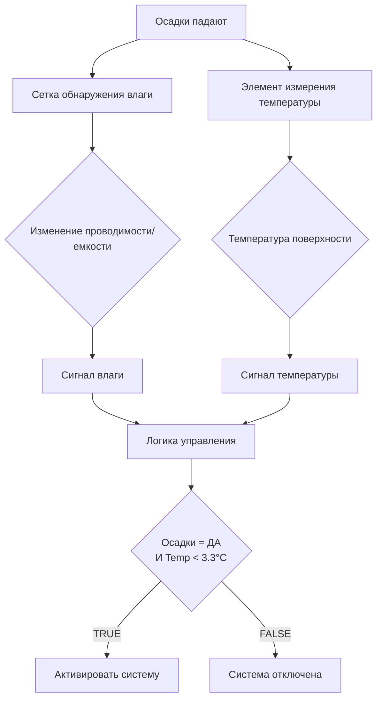

## Обзор

Датчики обнаружения снега и льда образуют критический входной интерфейс для автоматических систем управления таянием снега. Эти устройства должны надежно различать замерзшие и жидкие осадки, измерять температуру поверхности покрытия с точностью и обеспечивать своевременные сигналы активации до значительного накопления снега. Производительность датчика напрямую определяет эффективность системы и энергетическую эффективность.

Фундаментальная задача обнаружения снега включает дифференциацию типов осадков (снег против дождя) при учете переходной зоны около точки замерзания, где осадки могут начаться как снег и измениться на дождь или наоборот. Датчики должны обнаруживать наличие влаги, точно измерять температуру и в расширенных конструкциях количественно определять интенсивность осадков, чтобы различать короткие снежные вспышки от интенсивного снегопада, требующего активации системы.

## Принципы обнаружения влаги

### Датчики электропроводности

Датчики обнаружения влаги на основе проводимости используют электрические свойства воды для определения осадков. Датчик содержит открытые электроды, разделенные небольшим зазором (обычно 2,5-13 мм), встроенные заподлицо с поверхностью покрытия. Когда влага перекрывает зазор между электродами, электрическое сопротивление уменьшается, вызывая сигнал обнаружения.

Соотношение между наличием влаги и проводимостью следует соотношению:

$$\sigma = \frac{1}{\rho} = \frac{I}{V \cdot A/L}$$

Где:
- $\sigma$ = электропроводность (См/м)
- $\rho$ = удельное электрическое сопротивление ($\Omega \cdot м$)
- $I$ = ток (А)
- $V$ = приложенное напряжение (В)
- $A$ = площадь поперечного сечения электрода (м²)
- $L$ = расстояние между электродами (м)

Чистая вода проявляет низкую проводимость ($5.5 \times 10^{-6}$ См/м), но осадки содержат растворенные ионы, которые значительно увеличивают проводимость. Датчик прикладывает небольшое переменное напряжение (обычно 5-24 В переменного тока) на сетку электродов и контролирует поток тока. Когда влага перекрывает электроды, ток увеличивается на 2-3 порядка, обеспечивая четкий порог обнаружения.

**Эффекты температуры на проводимость:**

Проводимость воды изменяется с температурой согласно:

$$\sigma_T = \sigma_{25} \cdot [1 + \alpha(T - 25)]$$

Где:
- $\sigma_T$ = проводимость при температуре $T$ (См/м)
- $\sigma_{25}$ = проводимость при 25°C (См/м)
- $\alpha$ = температурный коэффициент (0.019-0.025/°C для типичных осадков)
- $T$ = температура (°C)

Передовые датчики включают температурную компенсацию для поддержания согласованных порогов обнаружения во всем рабочем диапазоне температур (-40°C до 49°C).

### Технология емкостного зондирования

Емкостные датчики влаги обнаруживают изменение диэлектрической проницаемости при появлении воды на поверхности зондирования. Датчик состоит из чередующихся электродов, образующих конденсатор, емкость которого изменяется при изменении диэлектрической среды с воздуха на воду или лед.

Соотношение емкости следует:

$$C = \epsilon_0 \epsilon_r \frac{A}{d}$$

Где:
- $C$ = емкость (Ф)
- $\epsilon_0$ = электрическая постоянная ($8.854 \times 10^{-12}$ Ф/м)
- $\epsilon_r$ = относительная диэлектрическая проницаемость материала
- $A$ = площадь электрода (м²)
- $d$ = расстояние между электродами (м)

Значения относительной диэлектрической проницаемости для различных материалов:
- Воздух: $\epsilon_r = 1.0$
- Лед: $\epsilon_r = 3.2$
- Вода: $\epsilon_r = 80.4$ при 20°C

Когда влага контактирует с поверхностью датчика, емкость резко увеличивается из-за высокой диэлектрической проницаемости воды. Схема датчика контролирует емкость посредством обнаружения сдвига частоты или измерения импеданса переменного тока, обеспечивая индикацию наличия влаги.

**Преимущества емкостного зондирования:**
- Отсутствие открытых электродов, подверженных коррозии
- Обнаружение влаги сквозь защитные покрытия
- Менее чувствительна к вариациям химии воды
- Может различать лед и воду на основе диэлектрических различий

## Методы измерения температуры

### Датчики сопротивления температуры (RTD)

RTD обеспечивают наивысшую точность измерения температуры покрытия в приложениях таяния снега. Эти датчики используют предсказуемое изменение сопротивления чистых металлов (обычно платины) с температурой.

Уравнение Каллендара-Ван Дюзена описывает соотношение сопротивление-температура RTD:

$$R_T = R_0[1 + AT + BT^2 + C(T-100)T^3]$$

Для температур выше 0°C уравнение упрощается до:

$$R_T = R_0(1 + AT + BT^2)$$

Где:
- $R_T$ = сопротивление при температуре $T$ ($\Omega$)
- $R_0$ = сопротивление при 0°C (100 $\Omega$ для Pt100)
- $A$ = 3.9083 × 10⁻³ °C⁻¹
- $B$ = -5.775 × 10⁻⁷ °C⁻²
- $C$ = -4.183 × 10⁻¹² °C⁻⁴ (ниже 0°C)

Для типичных приложений таяния снега с использованием RTD Pt100:

| Температура | Сопротивление | Изменение/°C |
|-------------|----------|----------|
| -40°C | 84.27 Ω | 0.386 Ω/°C |
| -17.8°C | 93.20 Ω | 0.390 Ω/°C |
| 0°C | 100.00 Ω | 0.395 Ω/°C |
| 4.4°C | 101.73 Ω | 0.396 Ω/°C |

Большое изменение сопротивления на градус (примерно 0.39 Ω/°C для Pt100) обеспечивает высокоразрешающее измерение температуры. Высококачественные датчики таяния снега достигают точности ±0.3°C во всем диапазоне работы, критически важно для надежного различения снега/дождя при температурах около точки замерзания.

**Конфигурации проводов RTD:**
- **2-провод**: Простейшая, но включает сопротивление проводов; точность ±1.1°C
- **3-провод**: Компенсирует сопротивление проводов; точность ±0.6°C
- **4-провод**: Исключает все эффекты проводов; точность ±0.3°C

Приложения таяния снега требуют RTD с 3 или 4 проводами для поддержания точности с длинными кабелями (до 305 м) от датчика к контроллеру.

### Датчики термистора

Термисторы с отрицательным температурным коэффициентом (NTC) обеспечивают альтернативу RTD с более высокой чувствительностью, но сниженной точностью и более ограниченным диапазоном температур. Соотношение сопротивление-температура следует:

$$R_T = R_0 \exp\left[\beta\left(\frac{1}{T} - \frac{1}{T_0}\right)\right]$$

Где:
- $R_T$ = сопротивление при температуре $T$ (К)
- $R_0$ = сопротивление при эталонной температуре $T_0$ (обычно 10,000 Ω при 25°C)
- $\beta$ = материальная константа (3000-4500 К для типичных NTC термисторов)
- $T$ = абсолютная температура (К)

Термисторы проявляют намного более высокую чувствительность, чем RTD (4-5% изменение сопротивления на °C против 0.4% для Pt100), но страдают от нелинейного отклика и вариаций параметров между устройствами. Приложения таяния снега обычно отдают предпочтение RTD за их точность и долгосрочную стабильность.

## Типы датчиков и технологии

### Датчики, встроенные в покрытие

Датчики, установленные на покрытии, устанавливаются заподлицо с нагреваемой поверхностью, обеспечивая прямое измерение фактических условий поверхности. Они представляют наиболее распространенный тип датчика для управления таянием снега.

**Детали конструкции:**
- **Корпус**: Нержавеющая сталь или высокопрочный полимер, рассчитанный на автомобильный трафик
- **Размеры**: Диаметр 10-15 см, глубина 13-19 мм
- **Монтаж**: Заливка в плиту при укладке или сверление в существующем покрытии
- **Проводка**: Кабель в экранировке с 4-8 проводами, обычно провод 18-22 AWG
- **Защита**: Эпоксидная заливка для полной герметизации от влаги

Лицевая поверхность датчика включает несколько элементов:

1. **Сетка обнаружения влаги**: Чередующиеся проводники или емкостные пластины
2. **RTD или термистор**: Встроенный на глубине 6-13 мм ниже поверхности
3. **Эталонный элемент**: Для температурной компенсации цепи влаги
4. **Нагревательный элемент** (опционально): Предотвращает накопление льда на лице датчика

### Датчики осадков в воздухе

Датчики в воздухе монтируются над защищаемой зоной (типичная высота 2.4-3.7 м) и обнаруживают падающие осадки без контакта с покрытием. Эти датчики исключают озабоченность механическим повреждением, но требуют отдельного измерения температуры покрытия.

**Обнаружение нагреваемой сетки:**

Датчик поддерживает небольшую нагреваемую поверхность (6.5-26 см²) при температуре выше окружающей (обычно на 8-14°C выше температуры воздуха). Когда осадки падают на нагреваемую поверхность, мощность, требуемая для поддержания температуры установки, увеличивается из-за охлаждения испарением:

$$Q_{evap} = \dot{m} h_{fg}$$

Где:
- $Q_{evap}$ = скорость охлаждения испарением (кДж/ч)
- $\dot{m}$ = массовый поток влаги (кг/ч)
- $h_{fg}$ = скрытая теплота испарения (2257 кДж/кг при 27°C)

Для легких осадков (2.5 мм/ч), датчик площадью 13 см² испытывает приблизительно:

$$\dot{m} = 2.5 \text{ мм/ч} \times 13 \text{ см}^2 \times 1 \text{ г/см}^3 / 10 \text{ мм/см} = 3.25 \text{ г/ч}$$

$$Q_{evap} = 3.25 \times 10^{-3} \times 2257 = 7.34 \text{ кДж/ч} = 2.04 \text{ Вт}$$

Датчик обнаруживает это увеличение мощности (обычно 2-20 Вт в зависимости от интенсивности осадков) и генерирует сигнал тревоги, когда мощность превышает порог в течение указанной продолжительности (1-5 минут).

**Инфракрасное/оптическое обнаружение:**

Передовые датчики используют инфракрасные или видимые световые лучи для обнаружения частиц осадков. Когда капли воды или кристаллы снега проходят через объем зондирования, они рассеивают свет, который обнаруживается фотодатчиками. Принцип обнаружения следует теории рассеяния Ми для частиц, сравнимых с длиной волны света:

$$I_{scattered} \propto \frac{d^6}{\lambda^4}$$

Где:
- $I_{scattered}$ = интенсивность рассеянного света
- $d$ = диаметр частицы
- $\lambda$ = длина волны света

Оптические датчики различают снег и дождь на основе размера частиц, скорости падения и характеристик рассеяния. Кристаллы снега (диаметр 2.5-25 мм) производят различные картины рассеяния по сравнению с каплями дождя (диаметр 0.5-5 мм).

### Комбинированные массивы датчиков

Установки высокой надежности используют избыточные датчики с логикой голосования:

**Конфигурация с двумя датчиками:**
- Два датчика покрытия с расстоянием 3-6 м
- Система активируется, когда любой датчик обнаруживает снег и холодную температуру
- Сокращает события с ложными отрицательными (пропущено обнаружение снега)

**Тройной датчик с голосованием:**
- Три датчика в схеме голосования 2 из 3
- Требует согласия двух датчиков для активации
- Сокращает события с ложными положительными (активация во время дождя)

Вероятность отказа системы уменьшается с избыточностью:

$$P_{fail} = P_{sensor}^n$$

Где:
- $P_{fail}$ = вероятность полного отказа системы
- $P_{sensor}$ = вероятность отказа одного датчика
- $n$ = количество избыточных датчиков

Для датчиков с надежностью 95% ($P_{sensor} = 0.05$), двойная избыточность достигает 99.75% надежности системы.

## Лучшие практики установки

### Размещение датчика на покрытии

Надлежащее размещение датчика обеспечивает репрезентативное измерение условий поверхности:

**Критерии размещения:**
1. **Репрезентативная зона**: Разместите датчик в типичной зоне, не в затененных или защищенных зонах
2. **Дренаж**: Избегайте низких мест, где накапливается вода
3. **Трафик**: Позиционируйте датчик вне основных путей колес, когда возможно
4. **Экспозиция солнца**: Учтите эффекты солнечного нагрева на склонах, ориентированных на юг
5. **Несколько зон**: Установите отдельные датчики для различных микроклиматов

**Глубина установки:**

Лицо датчика должно располагаться заподлицо с готовым покрытием (допуск ±3 мм). Элементы измерения температуры располагаются на 6-13 мм ниже поверхности для измерения критической температуры интерфейса, где происходит контакт со снегом.

Для бетонных плит датчик монтируется во время заливки:

Критические этапы установки:
1. Закрепите датчик к арматуре с помощью вязальной проволоки или монтажных зажимов
2. Проложите кабель под трубкой к краю плиты в защитном кожухе
3. Проверьте высоту лица датчика в соответствии с плановой высотой плиты
4. Защитите кабельный проход через край плиты гибким уплотнением
5. Протестируйте функцию датчика перед заливкой бетона

### Монтаж датчика в воздухе

Высота монтажа и угол значительно влияют на производительность:

| Параметр | Рекомендуемый диапазон | Причина |
|-----------|------------------|---------|
| Высота над покрытием | 2.4-3.7 м | Сбалансировать зону покрытия против эффектов ветра |
| Угол монтажа | 30-45° от вертикали | Предотвратить скопление воды на лице датчика |
| Зазор от препятствий | >0.9 м | Избежать эффектов укрытия/тени |
| Расстояние от края нагреваемой зоны | <15 м | Обеспечить корреляцию осадков |

**Компенсация эффекта ветра:**

Ветер создает ложные срабатывания на датчиках нагреваемой сетки через принудительное охлаждение конвекцией. Коэффициент конвективной теплопередачи увеличивается со скоростью ветра:

$$h_c = 4.56 + 4.88 V$$

Где:
- $h_c$ = коэффициент конвекции (Вт/м²·°C)
- $V$ = скорость ветра (м/с)

При скорости ветра 9 м/с коэффициент конвекции увеличивается с 4.56 (неподвижный воздух) до 48.48 Вт/м²·°C, вызывая увеличение мощности нагрева датчика даже без осадков. Передовые датчики включают измерение скорости ветра и алгоритмы компенсации для снижения ложной активации.

### Проводка и защита

Кабели датчиков требуют защиты от влаги, механических повреждений и электромагнитных помех:

**Спецификации кабеля:**
- Сечение проводника: 18-22 AWG (в зависимости от длины кабеля и типа сигнала)
- Изоляция: Номинал 600 В, подходит для влажных/сырых мест
- Экран: 100% фольга или плетение экрана для устойчивости к шумам
- Оболочка: УФ-стойкий ПВХ или полиэтилен для датчиков в воздухе

**Требования установки:**
1. Прокладывайте кабели в отдельном кожухе от кабелей электроснабжения
2. Поддерживайте расстояние 30 см от кабелей переменного тока, если не в кожухе
3. Используйте герметичные фитинги кожуха на подключениях датчика и контроллера
4. Предусмотрите петли для предотвращения капель перед входом в ограждения
5. Соедините экран в конце контроллера только (избегайте земляных петель)

Максимальные длины кабелей:
- RTD датчики (4-провод): 305 м
- Датчики термистора: 152 м
- Обнаружение влаги (проводимость): 229 м
- Емкостные датчики: 76 м (зависит от рабочей частоты)

### Калибровка и тестирование

Новые установки датчиков требуют проверки перед вводом системы в эксплуатацию:

**Калибровка температуры:**
1. Измерьте сопротивление датчика с помощью прецизионного омметра
2. Сравните со справочной таблицей RTD/термистора при температуре окружающей среды
3. Проверьте точность показаний в пределах ±0.6°C
4. Запишите смещение в контроллере, если предусмотрен диапазон регулировки

**Тест обнаружения влаги:**
1. Нанесите воду на лицо датчика из распылителя
2. Проверьте сигнал тревоги влаги в течение 5-30 секунд (в соответствии со спецификацией производителя)
3. Высушите датчик и подтвердите очистку сигнала тревоги
4. Протестируйте при нескольких температурах (4.4°C, 0°C, -3.9°C)

**Тест имитационного снега:**
1. Предварительно охладите датчик покрытия до -0.6 до -1.7°C
2. Нанесите ледяную водную смесь на лицо датчика
3. Проверьте активацию системы контроллером с надлежащими задержками по времени
4. Контролируйте ложную деактивацию во время активной влаги

Ежегодное обслуживание включает:
- Визуальный осмотр лица датчика на предмет повреждений/деградации
- Очистка сеток обнаружения влаги (удаление мусора, дорожных солей)
- Проверка точности температуры
- Тестирование времени отклика обнаружения влаги
- Документирование состояния датчика и производительности

## Передовые функции

### Датчик интенсивности осадков

Премиум-датчики измеряют интенсивность осадков, чтобы различать легкие снежные вспышки от сильного снегопада:

$$R = \frac{\Delta h}{\Delta t}$$

Где:
- $R$ = интенсивность осадков (мм/ч)
- $\Delta h$ = накопленная глубина (мм)
- $\Delta t$ = временной интервал (часы)

Датчик коррелирует изменения проводимости сетки влаги с интенсивностью осадков. Более высокая интенсивность осадков вызывает более быстрое увеличение проводимости:

$$\frac{dC}{dt} \propto R$$

Контроллеры используют информацию о скорости для:
- Задержки активации для кратких вспышек (< 2.5 мм/ч)
- Немедленный старт для тяжелого снега (> 7.6 мм/ч)
- Модуляция тепловой нагрузки на основе спроса на таяние

### Профилирование многоточечной температуры

Передовые установки измеряют температуру на нескольких глубинах:

- Температура поверхности (0-6 мм глубины)
- Температура в середине плиты (5-10 см глубины)
- Базовая температура (10-15 см глубины)

Профиль температуры указывает на тепловое состояние плиты и прогресс прогрева. Градиент температуры через плиту следует:

$$\frac{dT}{dx} = -\frac{q}{k}$$

Где:
- $dT/dx$ = градиент температуры (°C/см)
- $q$ = тепловой поток (Вт/м²)
- $k$ = коэффициент теплопроводности бетона (1.3-1.7 Вт/м·°C)

Во время прогрева датчики температуры на различных глубинах позволяют рассчитать переходное накопление тепла:

$$Q_{stored} = m c_p (T_{avg,final} - T_{avg,initial})$$

Эта информация позволяет использовать алгоритмы предиктивного управления, которые оптимизируют время прогрева и потребление энергии.

## Технологии производителей

Ведущие производители применяют собственные методы обнаружения:

**Thermostor (SunTouch/Watts)**
- Датчики нагреваемой сетки в воздухе с компенсацией ветра
- Датчики покрытия с интегрированным измерением влаги/температуры
- Рабочий диапазон: -40°C до 60°C

**ETI (Environmental Technology Inc.)**
- Датчики покрытия на основе проводимости
- Передовые алгоритмы интенсивности осадков
- Возможности самодиагностики

**ICM Controls**
- Емкостное обнаружение влаги
- Цифровая обработка сигналов для устойчивости к шумам
- Модульная архитектура датчик/контроллер

**Tekmar/Watts**
- Двухэлементное измерение температуры
- Обнаружение влаги с автоматической регулировкой чувствительности
- Интеграция с котлами и управлением клапанами смешивания

Обратитесь к справочнику ASHRAE - главе 51 "Применение HVAC" для получения подробного руководства по выбору датчиков и рекомендаций, зависящих от конкретного применения. Производители предоставляют спецификации датчиков, включая времена отклика, спецификации точности и требования установки, которые должны быть проверены на этапе проектирования.
