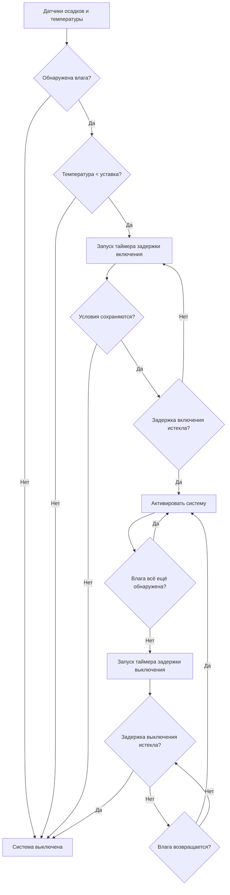

Настройки времени задержки в системах управления снеготаянием выполняют две критические функции: предотвращение ненужной активации системы от переходных погодных явлений (задержка включения) и обеспечение полного высыхания поверхности после окончания осадков (задержка выключения). Правильная конфигурация задержки требует понимания тепловой динамики плиты и физики передачи тепла через бетонные основания.

## Физические основы для времени задержки

**Требования к задержке включения**

Таймер задержки включения предотвращает активацию системы во время кратковременных колебаний погоды, которые истратили бы энергию без значительного таяния снега. Эта задержка должна быть достаточно короткой для активации перед значительным накоплением снега, но достаточно длинной для фильтрации ложных срабатываний от:

- Проходящей облачности, временно снижающей показания датчика температуры
- Легких осадков, испаряющихся без накопления
- Загрязнения датчика мусором или временным затенением

Оптимальная задержка включения балансирует эти факторы с требуемым временем нагрева плиты для достижения эффективных температур таяния на поверхности.

**Требования к задержке выключения**

Таймер задержки выключения обеспечивает полное высыхание поверхности плиты перед отключением системы. Преждевременное отключение оставляет остаточную влагу, которая может повторно замёрзнуть, создавая опасные ледяные условия. Требуемая задержка выключения зависит от:

- Остаточного тепла, накопленного в тепловой массе плиты
- Скорости испарительного охлаждения на поверхности
- Температуры и влажности окружающей среды
- Пористости плиты и характеристик удержания влаги

## Расчёты тепловой реакции плиты

**Накопление тепла в бетонной массе**

Тепловая энергия, накопленная в бетонной плите, определяет время нагрева и поведение охлаждения:

$$Q_{stored} = \rho \cdot V \cdot c_p \cdot \Delta T$$

Где:
- $Q_{stored}$ = накопленная тепловая энергия (кДж)
- $\rho$ = плотность бетона (обычно 2320 кг/м³)
- $V$ = объём плиты (м³)
- $c_p$ = удельная теплоёмкость бетона (0,92 кДж/кг·К)
- $\Delta T$ = повышение температуры от окружающей среды до рабочей температуры (K)

**Оценка времени нагрева**

Время, необходимое для нагрева плиты от температуры окружающей среды до эффективной ёмкости таяния:

$$t_{heatup} = \frac{\rho \cdot d \cdot c_p \cdot \Delta T}{q_{avg}}$$

Где:
- $t_{heatup}$ = время нагрева (часы)
- $d$ = эффективная глубина плиты, на которую влияет нагрев (м)
- $q_{avg}$ = среднее тепловое потокоплотность от встроенных труб или кабелей (Вт/м²)

Для типичной бетонной плиты толщиной 102 мм с тепловыделением 158 Вт/м²:

$$t_{heatup} = \frac{2320 \times 0,102 \times 920 \times 16,7}{158} = 0,63 \text{ часа} \approx 38 \text{ минут}$$

Этот расчёт предполагает повышение температуры на 16,7 К и представляет теоретический минимум. Фактическое время нагрева превышает это из-за:

- Потерь тепла в основание ниже
- Потерь тепла в окружающий воздух выше
- Неравномерного распределения температуры
- Переходных эффектов теплопроводности

Практическое время нагрева обычно составляет от 45 до 90 минут в зависимости от конструкции плиты и условий окружающей среды.

## Логика управления с времени задержкой

Последовательность управления интегрирует входные сигналы датчиков с функциями таймера для оптимизации работы системы:

## Рекомендации по настройке задержки по применению

| Тип применения | Задержка включения (мин) | Задержка выключения (мин) | Обоснование |
|---|---|---|---|
| Критические пешеходные дорожки | 5-7 | 45-60 | Минимизировать риск скольжения; обеспечить полное высыхание |
| Входы в здания | 7-10 | 40-50 | Баланс безопасности и энергозатрат |
| Парковочные площади | 10-15 | 30-40 | Допустить кратковременное накопление; снизить время работы |
| Дороги/пандусы | 3-5 | 60-90 | Максимальный приоритет безопасности; расширенное высыхание |
| Погрузочные доки | 8-12 | 35-45 | Операционная непрерывность; умеренный приоритет |
| Декоративные площади | 12-15 | 30-35 | Эстетическое содержание; низкая критичность безопасности |

**Корректировка настроек**

Базовые значения задержки требуют модификации в зависимости от местных условий:

- **Ветреные районы**: Снизить задержку выключения на 10-15% (ускоренное испарение)
- **Влажный климат**: Увеличить задержку выключения на 20-30% (замедленное испарение)
- **Высокая солнечная экспозиция**: Снизить задержку включения на 15-20% (естественная помощь при таянии)
- **Затенённые местоположения**: Увеличить обе задержки на 10-15% (снижение теплоприхода от окружающей среды)

## Стандарты и соображения при проектировании

ASHRAE Handbook - HVAC Applications, Глава 51 предоставляет рекомендации по системам управления снеготаянием, но не указывает точные значения таймеров. Вместо этого проектирование должно учитывать:

1. **Требования класса нагрузки**: Свободная площадь от снега (класс I) против площади без снега (класс II) или площади без снега с резервной ёмкостью (класс III)
2. **Стратегия холостого хода**: Системы, поддерживающие температуру плиты выше нуля, снижают требования к задержке включения
3. **Источник энергии**: Системы электрического сопротивления нагреваются быстрее, чем гидравлические системы с длинными трубопроводами
4. **Конструкция плиты**: Изоляция под нагревательными элементами улучшает время нагрева на 30-50%

**Реализация регулируемого таймера**

Современные системы управления предоставляют регулируемые на месте задержки, позволяющие калибровку к конкретным условиям объекта. Пусконаладка должна включать:

- Тестирование реакции системы во время фактических событий осадков
- Измерение скоростей повышения температуры поверхности
- Проверку полного удаления влаги перед отключением
- Документирование финальных настроек для справки по эксплуатации

Оптимальная конфигурация таймера балансирует три цели: безопасность путём надёжного удаления снега, энергоэффективность путём минимизации времени работы и долговечность оборудования путём снижения термических циклов.

## Практические соображения

**Предотвращение ложных срабатываний**

Чрезмерная задержка включения вызывает накопление снега перед активацией системы, требуя более высокого тепловыделения для достижения очистки. Недостаточная задержка включения истратит энергию на ложные события. Правильная настройка зависит от локальных закономерностей интенсивности снегопадов и допустимой глубины накопления.

**Последствия неполного высыхания**

Преждевременное отключение системы из-за недостаточной задержки выключения создаёт риск ледяного образования. Остаточная влага в порах бетона повторно замёрзнет при падении температуры окружающей среды, потенциально вызывая поверхностное отслоение бетона в дополнение к опасностям скольжения. Задержка выключения должна продлиться до момента, когда показания температуры поверхности и скорость испарения указывают на полное высыхание.

**Сезонная корректировка**

Некоторые установки выигрывают от сезонной модификации таймера. Условия в начале и конце зимы с более высокими углами солнца и температурой окружающей среды позволяют более короткие задержки по сравнению с зимней эксплуатацией в середине сезона. Передовые системы управления с компенсацией по температуре окружающей среды автоматически корректируют периоды задержки на основе измеренных условий.
