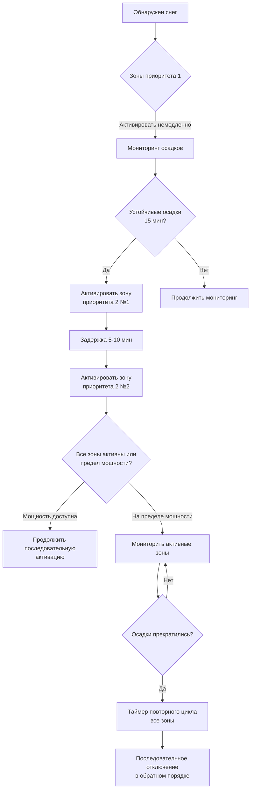
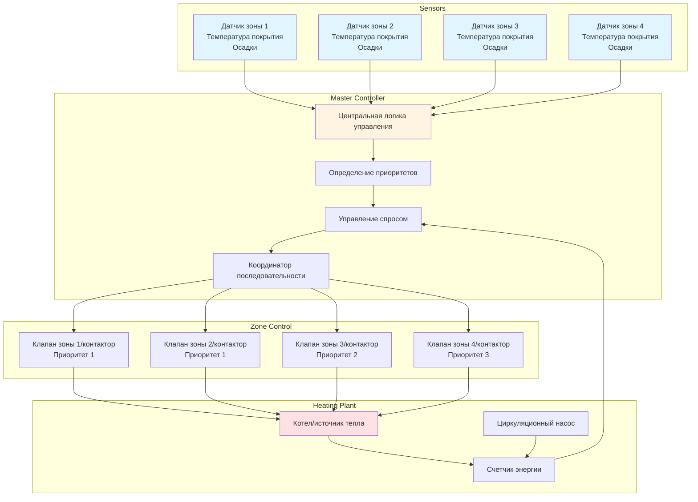

## Обзор

Зонирование разделяет крупные установки снеготаяния на независимо управляемые сегменты для управления электрическим спросом, оптимизации энергопотребления и обеспечения операционной гибкости. Многозональное управление решает два фундаментальных ограничения: ограниченная мощность отопительной установки и ограничения пиковой мощности, которые запрещают одновременную работу всех зон. Стратегия зонального управления определяет эффективность системы, стоимость установки и годовые эксплуатационные расходы.

Зоны снеготаяния отличаются от зон систем HVAC зданий в критических аспектах. Зоны зданий реагируют на стационарные нагрузки с предсказуемым разнообразием, в то время как зоны снеготаяния одновременно испытывают одинаковые снежные нагрузки во всех областях. Эта одновременность исключает традиционные коэффициенты разнообразия и требует тщательного проектирования для предотвращения перегрузки системы при максимальном спросе.

## Основы определения размера зон

### Распределение теплового потока

Размер зоны зависит от доступной плотности теплового потока и общей мощности отопления. Фундаментальное соотношение определяет площадь зоны:

$$A_{\text{zone}} = \frac{Q_{\text{available}}}{q_{\text{flux}}}$$

Где:
- $A_{\text{zone}}$ = Максимальная площадь зоны (м²)
- $Q_{\text{available}}$ = Доступная мощность отопления для зоны (кДж/ч)
- $q_{\text{flux}}$ = Требуемая плотность теплового потока (кДж/ч·м²)

Требуемая плотность теплового потока варьируется в зависимости от класса снеготаяния (классы ASHRAE I, II, III) и условий на месте:

| Класс снеготаяния | Расчетный тепловой поток | Применение |
|-------------------|------------------------|-----------|
| Класс I | 316–474 кДж/ч·м² | Жилые проезжие части, маловажные проходы |
| Класс II | 474–790 кДж/ч·м² | Коммерческие входы, парковочные зоны |
| Класс III | 790–1 265 кДж/ч·м² | Критический доступ, аварийные маршруты, вертодромы |

### Требования гидравлического баланса

Гидронное зонирование требует расчета расхода для каждой зоны, чтобы обеспечить надлежащую подачу тепла. Расход зоны определяется из теплонагрузки и температурного дифференциала системы:

$$\dot{m}_{\text{zone}} = \frac{Q_{\text{zone}}}{c_p \cdot \Delta T}$$

Преобразование в общие единицы (л/мин):

$$\text{л/мин}_{\text{zone}} = \frac{Q_{\text{zone}} \text{ (кДж/ч)}}{210 \cdot \Delta T \text{ (°C)}}$$

Где:
- $\dot{m}_{\text{zone}}$ = Массовый расход зоны (кг/ч)
- $Q_{\text{zone}}$ = Теплонагрузка зоны (кДж/ч)
- $c_p$ = Удельная теплоемкость жидкости (4,19 кДж/кг·°C для воды)
- $\Delta T$ = Разность температур подачи-возврата (°C)
- 210 = Коэффициент преобразования

Стандартные гидронные системы снеготаяния работают с температурными дифференциалами 6–11°C. Более высокие дифференциалы снижают расходы и размеры труб, но требуют более высоких температур подачи.

### Расчет электрической нагрузки

Электрические зоны снеготаяния требуют анализа распределения мощности для определения мощности цепи и пределов зоны:

$$P_{\text{zone}} = \frac{q_{\text{flux}} \cdot A_{\text{zone}}}{0.001163}$$

Где:
- $P_{\text{zone}}$ = Требуемая электрическая мощность (кВт)
- $q_{\text{flux}}$ = Плотность теплового потока (кДж/ч·м²)
- $A_{\text{zone}}$ = Площадь зоны (м²)
- 0.001163 = Коэффициент преобразования (кДж/ч в кВт)

Электрические системы имеют жесткие ограничения, обусловленные пропускной способностью автоматического выключателя и номиналами трансформатора. Типичная цепь на 200 А, 240 В обеспечивает максимум 48 кВт (172 800 кДж/ч), ограничивая площадь зоны в зависимости от расчетного теплового потока:

- При 474 кДж/ч·м²: Максимум 101,5 м²
- При 632 кДж/ч·м²: Максимум 76,1 м²
- При 790 кДж/ч·м²: Максимум 60,9 м²

## Стратегии зонирования

### Зонирование на основе приоритетов

Зонирование по приоритетам назначает операционную важность различным зонам, активируя критические зоны в первую очередь и вторичные зоны по мере наличия мощности. Эта стратегия максимизирует эффективность снегоудаления в пределах ограничений пропускной способности системы.

**Классификация приоритетов:**

1. **Приоритет 1 (критический)** – аварийный доступ, входы здания, пандусы доступности, пожарные проезды
2. **Приоритет 2 (высокий)** – основные проходы, главные проезды парковки, погрузочные доки
3. **Приоритет 3 (стандартный)** – общая парковка, вторичные проходы, переполненные зоны
4. **Приоритет 4 (низкий)** – удаленная парковка, складские зоны, редко используемый доступ

Система управления контролирует общую мощность системы и доступный резерв перед активацией зон более низкого приоритета. Зоны приоритета 1 получают немедленную активацию при обнаружении снега. Зоны приоритетов 2–4 активируются последовательно с временными задержками (обычно 15–30 минут) для проверки устойчивых осадков и предотвращения ненужной работы во время кратковременных морозов.

### Последовательная активация

Последовательная активация распределяет запуск зоны во времени, чтобы ограничить пиковый спрос и снизить термический удар по отопительной установке. Эта стратегия оказывается необходимой для систем, приближающихся к полной загрузке.

**Последовательность активации:**

Задержки активации составляют 5–15 минут между активациями зон. Задержка обеспечивает время для стабилизации потока, выравнивания давления и отклика отопительной установки. Чрезмерно короткие задержки вызывают нестабильность системы; чрезмерно длительные задержки приводят к накоплению снега на неактивных зонах.

### Географическое зонирование

Географическое зонирование разделяет установку по физическому расположению, а не по приоритету. Такой подход подходит для больших площадок, где разные зоны испытывают различные микроклиматические условия из-за теней зданий, воздействия ветра или перепадов высоты.

**Критерии определения зоны:**

- Солнечное воздействие (южнообращенные vs. северообращенные склоны)
- Воздействие ветра (защищенные vs. открытые зоны)
- Перепады высоты (пандусы vs. ровные поверхности)
- Тип основания (бетон vs. асфальт, различия в тепловой массе)
- Схемы движения (высокопроходимые vs. малопроходимые зоны)

Географические зоны могут требовать отдельных датчиков для учета местных условий. Защищенный северообращенный вход может накапливать снег, в то время как южнообращенная парковка остается чистой, требуя независимого управления.

### Зонирование на основе спроса

Зонирование на основе спроса контролирует потребление энергии в реальном времени и доступную мощность, динамически активируя зоны для максимального покрытия в пределах ограничений мощности. Эта стратегия требует сложных систем управления с учетом энергии и прогностических алгоритмов.

Система рассчитывает доступную мощность:

$$Q_{\text{available}} = Q_{\text{total}} - Q_{\text{active}} - Q_{\text{reserve}}$$

Где:
- $Q_{\text{available}}$ = Мощность, доступная для дополнительных зон
- $Q_{\text{total}}$ = Общая мощность системы
- $Q_{\text{active}}$ = Текущая нагрузка от работающих зон
- $Q_{\text{reserve}}$ = Резервный запас (обычно 10–15%)

Дополнительные зоны активируются только если доступная мощность превышает расчетную нагрузку зоны плюс резервный запас. Это предотвращает перегрузку системы при экстремальных условиях, когда активные зоны потребляют максимальную мощность.

## Сравнение стратегий зонирования

| Стратегия | Преимущества | Недостатки | Оптимальное применение |
|-----------|-----------|-----------|----------------------|
| **На основе приоритетов** | Гарантирует покрытие критических зон; простая логика; предсказуемая работа | Может оставить низкоприоритетные зоны неочищенными; двоичное включение/отключение на зону | Объекты с четким различием критических и некритических зон |
| **Последовательная** | Ограничивает пиковый спрос; постепенная загрузка системы; снижает термический удар | Все зоны в конце концов активны (без истинного сброса нагрузки); задержанное покрытие | Системы на пределе мощности; крупные установки |
| **Географическая** | Учитывает микроклиматы; оптимизирует местные условия; снижает ненужную работу | Требует нескольких датчиков; сложная установка; более высокие затраты на установку | Большие площадки с разным воздействием; кампусы с несколькими зданиями |
| **На основе спроса** | Максимальная эффективность; адаптация к условиям в реальном времени; оптимизация использования мощности | Требует передовых систем управления; сложная наладка; непредсказуемая активация зон | Установки с переменной мощностью; интегрированные системы объектов |

## Архитектура многозонального управления

Полная система многозонального управления интегрирует датчики, контроллеры зон, управление отопительной установкой и системы мониторинга:

Главный контроллер получает входные сигналы от всех датчиков зон и определяет последовательность активации на основе назначенных приоритетов, доступной мощности и условий осадков. Отдельные контроллеры зон (клапаны для гидронных систем, контакторы для электрических систем) реагируют на команды главного контроллера при сохранении локальных блокировок безопасности.

## Проектные соображения

### Выбор размера зональных клапанов

Гидронные зональные клапаны должны обеспечивать адекватную пропускную способность без чрезмерного перепада давления. Коэффициент $C_v$ клапана определяет пропускную способность:

$$C_v = \frac{\text{л/мин}}{\sqrt{\Delta P}}$$

Где:
- $C_v$ = Коэффициент потока клапана
- л/мин = Требуемый расход зоны
- $\Delta P$ = Допустимый перепад давления на клапане (кПа)

Выбирайте клапаны с коэффициентами $C_v$ на 25–30% выше расчетного требования, чтобы обеспечить адекватный поток при частично открытых положениях и учесть износ клапана.

### Электрическое разнообразие нагрузок

В отличие от электрических нагрузок зданий, системы снеготаяния показывают нулевое разнообразие во время активных снежных событий. Все зоны одновременно испытывают одинаковые снежные нагрузки, что исключает традиционные коэффициенты разнообразия, используемые в электрическом проектировании.

Общая мощность системы должна равняться сумме всех нагрузок зон:

$$P_{\text{total}} = \sum_{i=1}^{n} P_{\text{zone,i}}$$

Коэффициент разнообразия не применяется. Зонирование на основе спроса обеспечивает единственный способ снизить установленную мощность ниже общей подключенной нагрузки, принимая, что некоторые зоны могут не работать при экстремальных событиях.

### Интеграция управления

Многозональные системы требуют координации между контроллерами зон и центральной отопительной установкой. Отопительная установка должна получать сигналы спроса, указывающие количество и размер активных зон, для модуляции скорости зажигания, скорости насоса и температуры подачи.

**Необходимые сигналы интеграции:**

- Общее количество активных зон
- Совокупный спрос на тепло (кДж/ч)
- Требуемый расход системы (л/мин)
- Обратная связь по температуре возврата
- Условия сигнализации высокого/низкого предела

Современные системы используют протоколы BACnet, Modbus или проприетарные для связи контроллеров. Убедитесь в совместимости между контроллерами зон, главным контроллером и управлением отопительной установкой во время проектирования.

## Оптимизация производительности

Надлежащее определение размера зон и настройка управления максимизируют эффективность системы:

**Ограничения размера зон:**
- Минимальный размер зоны: 46–74 м² (избежать чрезмерного зонирования с высокими затратами на клапаны/контакторы)
- Максимальный размер зоны: ограничен доступной мощностью и ограничениями расхода одиночной цепи/мощностью
- Оптимальный размер зоны: 139–279 м² для сбалансированной установки и эксплуатационных расходов

**Параметры управления:**
- Задержка запуска между зонами: 5–15 минут
- Время повторного цикла: 30–60 минут (все зоны)
- Возможность переопределения приоритета: позволить переназначение приоритетов вручную
- Резерв мощности: сохранить запас 10–15% перед активацией дополнительных зон

**Проверка при вводе в эксплуатацию:**
- Проверить отдельную активацию и деактивацию зон
- Подтвердить надлежащую последовательность активации и временные задержки
- Протестировать функции переопределения приоритетов
- Измерить фактические расходы зон или потребление мощности
- Проверить ограничения мощности системы и пороги сброса нагрузки

Справочник ASHRAE – Приложения HVAC, глава 51 обеспечивает подробное руководство по стратегиям зонального управления, в то время как техническая документация производителя указывает требования по выбору размера зональных клапанов и управлению проводкой для конкретного оборудования.
