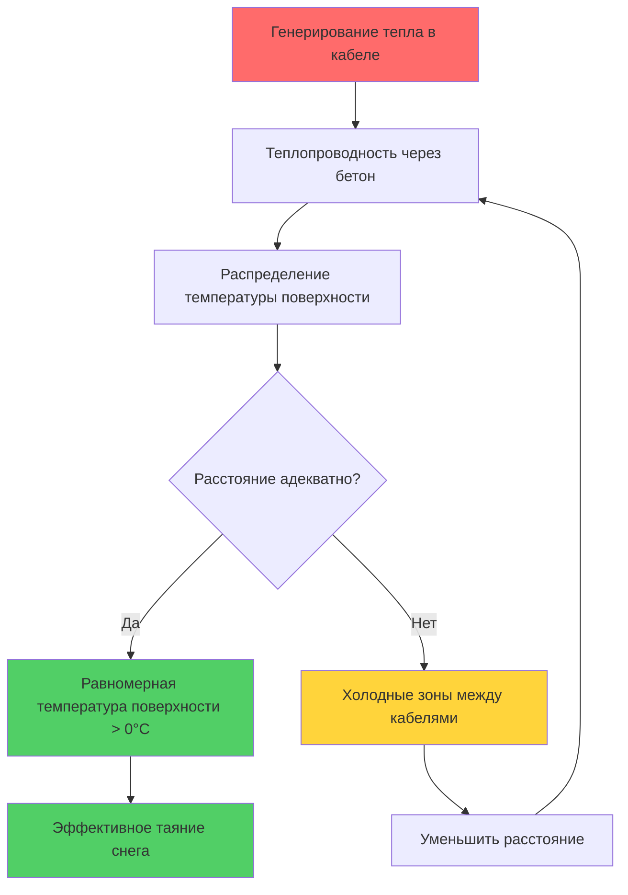
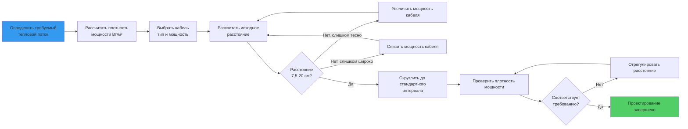
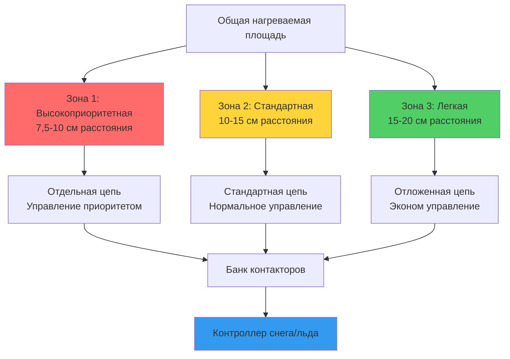

Расстояние между кабелями представляет критический параметр проектирования, связывающий выходную мощность электрического нагревательного кабеля с требуемой плотностью мощности для систем таяния снега. Надлежащее расстояние обеспечивает равномерное распределение температуры поверхности при одновременном соответствии требованиям теплопроизводительности. Основная зависимость балансирует мощность кабеля на единицу длины относительно целевой мощности на единицу площади, а расстояние служит геометрическим коэффициентом, связывающим эти параметры.

## Основная зависимость расстояния

Расчет расстояния вытекает из требования, чтобы полная выходная мощность на единицу площади равнялась мощности кабеля, распределенной по зоне его влияния. Для параллельных кабельных линий с равномерным расстоянием зависимость плотности мощности имеет вид:

$$P_{\text{плотность}} = \frac{P_{\text{кабель}}}{S}$$

Где:
- $P_{\text{плотность}}$ = плотность мощности (Вт/м²)
- $P_{\text{кабель}}$ = выходная мощность кабеля (Вт/м)
- $S$ = расстояние от оси к оси (м)

Переформулируя для решения относительно расстояния:

$$S = \frac{P_{\text{кабель}}}{P_{\text{плотность}}}$$

Эта формула демонстрирует обратную зависимость между расстоянием между кабелями и плотностью мощности. Более высокая требуемая плотность мощности требует пропорционально более тесного расстояния между кабелями для данной мощности кабеля.

## Примеры расчета расстояния

**Пример 1: Жилая подъездная дорога**

Заданные параметры:
- Требуемый тепловой поток: 568 Вт/м² (ASHRAE Класс II, умеренный климат)
- Выбранный кабель: 57 Вт/м с постоянной мощностью

Расчет расстояния:

$$S = \frac{57}{568} = 0,100 \text{ м} = 10 \text{ см}$$

Установить расстояние по центрам 10 см (стандартный интервал).

Проверка фактической плотности мощности:

$$P_{\text{факт}} = \frac{57}{0,100} = 570 \text{ Вт/м}^2$$

Это обеспечивает 570 Вт/м², превышая требуемое значение 568 Вт/м² на 2,3% для адекватного запаса прочности.

**Пример 2: Коммерческая погрузочная платформа**

Заданные параметры:
- Требуемый тепловой поток: 790 Вт/м² (Класс III, сильный снегопад)
- Выбранный кабель: 70 Вт/м минерально изолированный

Расчет расстояния:

$$S = \frac{70}{790} = 0,089 \text{ м} ≈ 8,9 \text{ см}$$

Установить расстояние 9 см или использовать 7,5 см для запаса:

При расстоянии 9 см: $P = 70 / 0,090 = 778$ Вт/м²
При расстоянии 7,5 см: $P = 70 / 0,075 = 933$ Вт/м²

Расстояние 9 см обеспечивает приемлемую производительность; расстояние 7,5 см предлагает 19% избыточную емкость для суровых условий или быстрого срабатывания.

## Физика теплопередачи при расстоянии между кабелями

Передача тепла от встроенных кабелей к поверхности покрытия следует двумерным путям теплопроводности. Размер расстояния напрямую влияет на равномерность температуры на поверхности. Эта зависимость вытекает из установившейся теплопроводности в полубесконечной среде.

Для линейного источника тепла на глубине $d$ ниже поверхности распределение температуры вдоль поверхности приблизительно следует:

$$T(x) - T_{\infty} = \frac{q'}{2\pi k} \ln\left(\frac{L}{r}\right)$$

Где:
- $T(x)$ = температура поверхности на расстоянии $x$ от центральной оси кабеля
- $T_{\infty}$ = температура окружающей среды
- $q'$ = выходная мощность кабеля на единицу длины (Вт/м)
- $k$ = коэффициент теплопроводности материала покрытия (Вт/м·К)
- $r$ = расстояние от кабеля до точки поверхности
- $L$ = характеристическая длина

Профиль температуры показывает более высокие значения непосредственно над каждым кабелем с постепенным снижением между кабелями. Расстояние должно быть достаточно близким, чтобы минимальная температура (точка посередине между смежными кабелями) превышала точку замерзания при условиях проектирования.

## Анализ равномерности температуры поверхности

Равномерность температуры на поверхности зависит от отношения расстояния между кабелями к глубине их залегания. Определите коэффициент расстояния:

$$R_s = \frac{S}{d}$$

Где:
- $S$ = расстояние между кабелями
- $d$ = глубина залегания кабеля

Для бетонных систем таяния снега с типичной глубиной залегания 5 см (0,05 м):

| Расстояние (см) | Коэффициент расстояния $R_s$ | Колебание температуры поверхности | Оценка равномерности |
|------------------|---------------------|------------------------|-------------------|
| 7,5 | 1,5:1 | ±1,1-1,7°C | Отличная |
| 10 | 2:1 | ±1,7-2,8°C | Хорошая |
| 15 | 3:1 | ±2,8-4,4°C | Приемлемая |
| 20 | 4:1 | ±4,4-6,7°C | Граничная |
| 25 | 5:1 | ±6,7-10°C | Плохая |

Практические пределы проектирования ограничивают коэффициенты расстояния 3:1 или менее для приемлемой равномерности. Более тесные коэффициенты обеспечивают более равномерный нагрев, но увеличивают длину кабеля и стоимость установки. Оптимальный коэффициент балансирует требования теплопроизводительности с экономическими ограничениями.

## Методология проектирования расстояния

## Практические ограничения расстояния

**Минимальное расстояние: 7,5 см**

Физические и тепловые ограничения устанавливают минимальное практическое расстояние:

1. **Зазор для монтажа**: Кабель не должен соприкасаться с соседними линиями во время укладки или уплотнения бетона
2. **Тепловое взаимодействие**: Кабели, расположенные ближе чем на 7,5 см, создают перекрывающиеся картины теплового потока, которые могут вызвать локальный перегрев
3. **Механическая целостность**: Чрезмерная плотность тепла (>317 Вт/м²) в бетоне может вызвать тепловые трещины
4. **Координация с арматурой**: Расстояние должно позволять крепить кабель хомутами к армирующей сетке без помех

**Максимальное расстояние: 20 см**

Верхние пределы расстояния вытекают из требований равномерности температуры:

1. **Колебание температуры поверхности**: Расстояние более 20 см создает холодные зоны между кабелями, где накапливается снег
2. **Время отклика**: Большое расстояние увеличивает тепловую массу между источником тепла и поверхностью, замедляя отклик системы
3. **Стандартная практика**: Полевой опыт устанавливает 20 см как практический максимум для стабильной производительности
4. **Экономический порог**: Очень большое расстояние требует кабеля с более высокой мощностью для достижения плотности мощности, часто сводя на нет экономию затрат

**Стандартные интервалы**

Монтаж в полевых условиях использует дискретные значения расстояния, согласованные с схемами армирующей сетки:
- 7,5 см: Высокой плотности приложения, краевые зоны
- 10 см: Типичные жилые и легкие коммерческие
- 15 см: Стандартные коммерческие установки
- 20 см: Легкие работы или проекты с ограниченным бюджетом

## Проектирование краевых зон

Периметровые области испытывают на 30-50% большие потери тепла, чем внутренние зоны, из-за:

1. **Дополнительные поверхности экспозиции**: Тепло проводится боком через открытые края бетона
2. **Эффекты конвективной границы**: Ветер создает повышенные коэффициенты теплопередачи на периметрах
3. **Тепловые мосты**: Краевые условия не имеют непрерывности изоляции
4. **Накопление снежных наносов**: Ветровой снег откладывается предпочтительно на краях

Компенсация краевой зоны требует более тесного расстояния между кабелями или кабеля с более высокой мощностью. Краевая зона распространяется на 45-60 см от любого открытого периметра.

**Расчет расстояния в краевой зоне:**

$$S_{\text{край}} = \frac{S_{\text{внутр}}}{F_{\text{край}}}$$

Где $F_{\text{край}}$ = коэффициент края, типично 1,5–2,0

Для системы с расстоянием во внутренних зонах 15 см и коэффициентом края 1,5:

$$S_{\text{край}} = \frac{15}{1,5} = 10 \text{ см}$$

Альтернативный подход: сохранить расстояние во внутренних зонах, но увеличить мощность кабеля в краевых зонах на величину коэффициента края.

## Компромиссы между расстоянием и плотностью мощности

Решение о расстоянии между кабелями включает несколько взаимосвязанных факторов:

| Фактор | Близкое расстояние (7,5-10 см) | Большое расстояние (15-20 см) |
|--------|------------------------|---------------------|
| **Равномерность температуры** | Отличная (±1-2°C) | Приемлемая (±3-5°C) |
| **Время отклика системы** | Быстрое (15-30 мин) | Среднее (30-60 мин) |
| **Требуемая длина кабеля** | Высокая (+50-100%) | Исходная |
| **Монтажный труд** | Увеличенный | Стандартный |
| **Стоимость материала** | Выше | Ниже |
| **Достигаемая плотность мощности** | Высокая (190-285 Вт/м²) | Средняя (95-160 Вт/м²) |
| **Доступные варианты мощности кабеля** | Приемлемы низкие Вт/м | Требуется выше Вт/м |
| **Качество поверхности** | Отличное | Адекватное |

## Многозонное проектирование расстояния

Сложные установки используют переменное расстояние для оптимизации производительности и стоимости:

**Зона 1 - Высокоприоритетные области:**
- Пешеходные дорожки, входы в здания, погрузочные зоны
- Расстояние: 7,5-10 см
- Плотность мощности: 190-254 Вт/м²
- Цель: Быстрое очищение, постоянная открытая поверхность

**Зона 2 - Стандартные области:**
- Основные подъездные дороги, парковочные площади
- Расстояние: 10-15 см
- Плотность мощности: 160-206 Вт/м²
- Цель: Эффективное очищение во время активного снегопада

**Зона 3 - Легкие области:**
- Переполненные парковочные зоны, вторичные проезды
- Расстояние: 15-20 см
- Плотность мощности: 111-159 Вт/м²
- Цель: Снижение снега, предотвращение обледенения

## Программное обеспечение для расчета и инструменты проектирования

Современное проектирование расстояния между кабелями использует вычислительные инструменты для оптимизации сложных схем расстановки:

**Входные данные проектирования:**
- Размеры покрытия и краевые условия
- Требуемый тепловой поток из расчетов ASHRAE
- Спецификации кабеля (напряжение, мощность, диаметр)
- Стратегия управления (вся площадь или зонированная)
- Бюджетные ограничения

**Алгоритмы оптимизации:**
- Минимизировать общую длину кабеля с учетом ограничений плотности мощности
- Балансировать требования равномерности против стоимости
- Координировать расстояние с конструкционным армированием
- Генерировать установочные чертежи с размерами расстояния

**Выходная документация:**
- Планы прокладки кабеля с обозначениями расстояния
- Расчеты электрической нагрузки по цепям
- Спецификация материалов с длинами кабеля
- Установочные спецификации

## Контроль качества установки

Точное выполнение в полевых условиях спроектированного расстояния обеспечивает производительность системы:

**Методы разметки:**

1. **Шаблонные полосы**: Фанерные или металлические шаблоны с отверстиями, соответствующими расстоянию проекта
2. **Линии мелом**: Отметить параллельные линии с интервалами, указанными в проекте
3. **Предварительно размеченная сетка**: Армирующая сетка с индикаторами расстояния
4. **Лазерные направляющие**: Проектировать параллельные линии с точным расстоянием

**Процедуры проверки:**

1. Измерить расстояние через каждые 3 м вдоль кабельных линий
2. Проверить допуск расстояния: ±1,3 см от спроектированной спецификации
3. Документировать фактические колебания расстояния на чертежах как построено
4. Рассчитать фактическую плотность мощности на основе полевых измерений

**Типичные ошибки монтажа:**

- Прогрессирующий дрейф расстояния: накопленная ошибка в повторяющихся измерениях расстояния
- Несогласованное расстояние краевой зоны: невозможность перейти на более тесное расстояние на периметрах
- Перекрестие кабелей: расстояние, измеренное до неправильного соседнего кабеля на поворотах
- Сжатие во время бетонирования: расстояние закрывается под действием вибратора

## Расширенные соображения по расстоянию

**Компенсация переменной глубины:**

Когда глубина залегания кабеля варьируется (наклонные поверхности, профили дренажа), отрегулируйте расстояние для сохранения плотности мощности:

$$S_{\text{отрегулировано}} = S_{\text{номинальное}} \times \sqrt{\frac{d_{\text{номинальная}}}{d_{\text{фактическая}}}}$$

Эта квадратно-корневая зависимость объясняет трехмерное распространение тепла от более глубоких положений залегания.

**Эффекты теплопроводности:**

Материалы покрытия с различными коэффициентами теплопроводности требуют регулировок расстояния. Материалы с более высокой проводимостью (плотный бетон) позволяют немного большее расстояние, чем материалы с низкой проводимостью (асфальт с воздушными пустотами) для эквивалентной равномерности температуры поверхности.

**Оптимизация переходной реакции:**

Системы, требующие быстрого отклика (экстренные вертолетные площадки, критичные дороги доступа), выигрывают от более тесного расстояния. Сокращенная тепловая масса между кабелем и поверхностью снижает постоянную времени для повышения температуры.

## Экономическая оптимизация

Полная стоимость установки включает материал кабеля, труд и электрическую инфраструктуру:

$$C_{\text{итого}} = (C_{\text{кабель}} \times L) + (C_{\text{труд}} \times L) + C_{\text{электрич}}$$

Где длина кабеля $L$ обратно пропорциональна расстоянию $S$:

$$L = \frac{A}{S}$$

Для площади $A$ и расстояния $S$ в м.

Оптимальное расстояние минимизирует полную стоимость при соответствии требованиям производительности. Анализ обычно показывает экономический оптимум в диапазоне 10-15 см для большинства приложений, балансируя стоимость установки с операционной эффективностью.

## Итоговое резюме

Проектирование расстояния между кабелями требует систематического анализа требований тепловой мощности, возможностей кабеля и ограничений монтажа. Основное уравнение расстояния обеспечивает отправную точку с регулировками для краевых зон, требований равномерности и практических полевых соображений. Надлежащий выбор расстояния обеспечивает эффективную производительность таяния снега при одновременном контроле стоимости установки и операционной эффективности.
