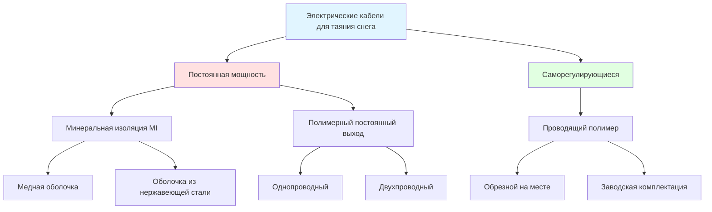

Электрические кабели для таяния снега преобразуют электрическую энергию в тепловую энергию посредством резистивного нагрева, работая на фундаментальном принципе, что поток тока через резистивный элемент генерирует тепло согласно закону Джоуля. Выбор типа кабеля напрямую влияет на производительность системы, эксплуатационные расходы и надежность.

## Фундаментальные механизмы нагрева

Все электрические нагревательные кабели преобразуют электрическую энергию в тепловую энергию посредством резистивного нагрева. Рассеивание мощности следует закону Джоуля:

$$P = I^2 R = \frac{V^2}{R}$$

где:
- $P$ = рассеивание мощности (Вт)
- $I$ = ток (А)
- $R$ = сопротивление (Ω)
- $V$ = напряжение (В)

Тепловой поток, подаваемый на поверхность, зависит от расстояния между кабелями и мощности:

$$q = \frac{P_L}{s}$$

где:
- $q$ = тепловой поток (Вт/м²)
- $P_L$ = линейная плотность мощности (Вт/м)
- $s$ = расстояние между кабелями (м)

## Классификация технологии кабелей

## Системы кабелей с постоянной мощностью

Кабели с постоянной мощностью поддерживают фиксированную мощность независимо от температуры окружающей среды или условий поверхности. Сопротивление на единицу длины остается постоянным:

$$R_L = \frac{R_{total}}{L}$$

где:
- $R_L$ = сопротивление на единицу длины (Ω/м)
- $L$ = общая длина кабеля (м)

**Кабель с минеральной изоляцией (MI):**

MI кабель состоит из сплошных металлических проводников, встроенных в уплотненную изоляцию из оксида магния (MgO) внутри безшовной металлической оболочки. Конструкция обеспечивает исключительную прочность и характеристики теплопередачи.

Теплопроводность через изоляцию MgO следует закону Фурье:

$$q = -k A \frac{dT}{dr}$$

Для цилиндрической геометрии, тепловое сопротивление от проводника к оболочке:

$$R_{th} = \frac{\ln(r_o/r_i)}{2\pi k L}$$

где:
- $k$ = теплопроводность MgO (приблизительно 40 Вт/м·К при 20°C)
- $r_o$ = внешний радиус изоляции
- $r_i$ = внутренний радиус (радиус проводника)

**Ключевые характеристики MI кабеля:**

- Максимальная температура работы: 150-260°C в зависимости от материала оболочки
- Медная оболочка: Превосходная теплопроводность (385 Вт/м·К), более низкая стоимость
- Оболочка из нержавеющей стали: Коррозионная стойкость в агрессивных химических средах
- Изоляция из оксида магния: Гигроскопична, требует герметизации на концах
- Линейная плотность мощности: Обычно 10-65 Вт/м

**Полимерный кабель с постоянной мощностью:**

Использует полимерную изоляцию с встроенным резистивным проводом. Доступен в однопроводной конфигурации (требует отдельного заземления) или двухпроводной конфигурации (нагревательный элемент и обратный провод в одном кабеле).

- Максимальная температура работы: 65-85°C
- Более низкая стоимость, чем MI кабель
- Более простая установка и подключение
- Линейная плотность мощности: 8-50 Вт/м

## Технология саморегулирующихся кабелей

Саморегулирующиеся кабели используют матрицу из проводящего полимера между двумя параллельными токопроводящими проводами. Электрическое сопротивление полимера увеличивается с температурой, создавая механизм отрицательной обратной связи:

$$R(T) = R_0[1 + \alpha(T - T_0)]$$

где:
- $R(T)$ = сопротивление при температуре $T$
- $R_0$ = сопротивление при опорной температуре $T_0$
- $\alpha$ = температурный коэффициент сопротивления (положительный)

При снижении температуры окружающей среды сопротивление полимера снижается, позволяя большему потоку тока и увеличению выходной мощности. И наоборот, более теплые участки автоматически снижают потребление мощности.

**Зависимость мощности от температуры:**

$$P(T) = \frac{V^2}{R_0[1 + \alpha(T - T_0)]}$$

Это саморегулирующееся поведение предотвращает перегрев и снижает потребление энергии, когда полная мощность не требуется. Кабель можно обрезать до любой длины на месте без влияния на электрические характеристики других участков.

## Сравнение производительности

| Параметр | Постоянная мощность (MI) | Постоянная мощность (полимер) | Саморегулирующиеся |
|-----------|----------------------|---------------------------|-----------------|
| **Выходная мощность** | Фиксированная, высокая точность | Фиксированная | Переменная с температурой |
| **Макс. температура работы** | 150-260°C | 65-85°C | 65-85°C |
| **Температурный коэффициент** | Близко к нулю | Близко к нулю | Положительный (саморегулирующийся) |
| **Перекрывающаяся установка** | Не допускается (перегрев) | Не допускается | Допускается (саморегулирующийся) |
| **Энергетическая эффективность** | Постоянное потребление | Постоянное потребление | Снижается с повышением температуры |
| **Пусковой ток при холодном запуске** | Номинальный ток | Номинальный ток | 1,5-2,5× номинальный ток |
| **Обрезка на месте** | Требует пересчета | Требует пересчета | Обрезать на любую длину |
| **Срок службы** | 30+ лет | 15-25 лет | 15-25 лет |
| **Стоимость (Относительная)** | 2,0-3,0× | 1,0× | 1,5-2,0× |

## Критерии выбора кабеля

**Выбрать кабель с постоянной мощностью MI, когда:**
- Требуется максимальная плотность теплового потока (>200 Вт/м²)
- Ожидается воздействие высоких температур
- Критичен наиболее длительный срок службы
- Присутствует агрессивная химическая среда
- Требуется точная, предсказуемая выходная мощность

**Выбрать саморегулирующийся кабель, когда:**
- Переменные тепловые требования по всей площади
- Приоритет энергетической эффективности
- Высокая сложность установки (возможно перекрытие)
- Ожидается обрезка и модификации на месте
- Требуется снизить затраты на установку

## Расчет линейной плотности мощности

Требуемая выходная мощность кабеля зависит от проектной тепловой нагрузки:

$$P_L = q \cdot s$$

Для проектного теплового потока 400 Вт/м² с расстоянием между кабелями 150 мм:

$$P_L = 400 \text{ Вт/м}^2 \times 0,15 \text{ м} = 60 \text{ Вт/м}$$

## Соответствие кодексам

NEC Article 426 регулирует стационарное наружное электрическое оборудование для обледенения и таяния снега:

- **426.20**: Встроенное оборудование для разрушения льда должно быть идентифицировано как подходящее для применения
- **426.22**: Кабели должны быть зарегистрированы для определенных значений напряжения и мощности
- **426.23**: Установка в бетон или асфальт требует кабелей, рассчитанных на влажные помещения
- **426.28**: Защита от замыкания на землю требуется для всех ответвительных цепей
- **426.50**: Отключающее средство должно быть легко доступно

IEEE Standard 515 предоставляет процедуры испытания и критерии производительности для систем электрического таяния снега.

## Соображения при монтаже

Расстояние между кабелями непосредственно контролирует равномерность теплового потока. Неравномерное расстояние создает холодные пятна, где накапливается снег. Для синусоидального варьирования расстояния:

$$q(x) = \frac{P_L}{s_0[1 + \epsilon \sin(2\pi x/\lambda)]}$$

где $\epsilon$ — доля варьирования расстояния и $\lambda$ — длина волны варьирования. Поддержание допуска расстояния в пределах ±10% обеспечивает достаточную производительность.

Временная постоянная теплового отклика системы:

$$\tau = \frac{\rho c h}{2q}$$

где:
- $\rho$ = плотность бетона (2400 кг/м³)
- $c$ = удельная теплоемкость (880 Дж/кг·К)
- $h$ = толщина плиты (м)

Типичные времена отклика варьируются от 20-45 минут для плит толщиной 100-150 мм, требуя предварительной активации перед снежной бурей для эффективного таяния снега.
