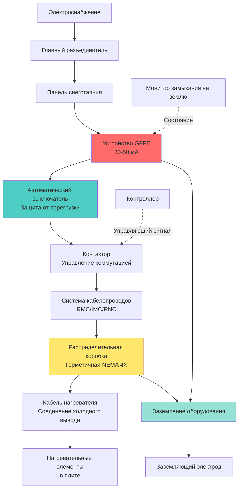

## Физические основы электрической защиты

Системы электрического снеготаяния работают путем преобразования электрической энергии непосредственно в тепловую энергию через резистивные нагревательные элементы. Плотность мощности обычно составляет от 300 до 800 Вт/м² в зависимости от климатических условий и требований применения. Поскольку эти системы работают во влажной среде с прямым контактом с проводящими материалами (бетон, влага), электрическая защита становится критически важной как для безопасности персонала, так и для долговечности оборудования.

Основная сложность заключается в обнаружении и прерывании токов замыкания на землю до достижения опасного уровня. Замыкание на землю происходит, когда ток протекает через незапланированный путь к земле, обычно через проникновение влаги или отказ изоляции. Взаимосвязь между током, сопротивлением и напряжением управляет поведением при замыкании:

$$I_{fault} = \frac{V_{line-ground}}{R_{fault}}$$

Где $R_{fault}$ включает объединенное сопротивление поврежденной изоляции, пути утечки влаги и контакта с землей. Во влажных условиях $R_{fault}$ может снизиться до опасного уровня, что требует быстрого обнаружения замыкания.

## Требования NEC Article 426

NEC Article 426 устанавливает обязательные требования для стационарного наружного электрического оборудования для удаления льда и снеготаяния. Код признает присущие риски эксплуатации электрических систем в условиях насыщенной влагой среды и требует определенных схем защиты.

### Защита оборудования от замыканий на землю (GFPE)

Все ответвленные цепи, питающие стационарное наружное электрическое оборудование для удаления льда и снеготаяния, должны включать защиту от замыканий на землю. Максимальный порог срабатывания составляет 30 мА для приложений защиты персонала или может быть выше (до 50 мА) для защиты оборудования, когда контакт персонала маловероятен.

Время срабатывания следует обратной зависимости от величины замыкания:

$$t_{trip} = \frac{K}{I_{fault} - I_{threshold}}$$

Где $K$ — постоянная, зависящая от устройства, и $I_{threshold}$ — номинальный ток срабатывания. Это обеспечивает быстрое отключение больших замыканий, при этом минимизируя ложные срабатывания от переходных токов утечки.

### Защита от перегрузки по току ответвленной цепи

Автоматические выключатели ответвленной цепи должны быть выбраны для непрерывного пропускания полного тока нагрузки при обеспечении защиты от перегрузок и коротких замыканий. Минимальный номинал выключателя определяется по формуле:

$$I_{breaker} \geq \frac{P_{total}}{V_{line} \times \sqrt{3} \times PF \times 0.8}$$

Для трехфазных систем, где коэффициент 0.8 учитывает ограничение непрерывной нагрузки 80% в NEC 210.19(A). Для однофазных систем:

$$I_{breaker} \geq \frac{P_{total}}{V_{line} \times PF \times 0.8}$$

Коэффициент мощности (PF) для резистивных нагревательных элементов обычно составляет 1.0, что упрощает расчеты.

## Сравнение методов защиты

Различные схемы защиты обеспечивают разные уровни безопасности и надежности в зависимости от требований приложения.

| Метод защиты | Порог срабатывания | Время отклика | Применение | Риск ложного срабатывания |
|-------------------|----------------|---------------|-------------|-------------------|
| Class A GFCI | 4-6 мА | <25 мс | Защита персонала | Высокий в больших системах |
| GFPE (30 мА) | 30 мА | <100 мс | Небольшие системы, пешеходные дорожки | Средний |
| GFPE (50 мА) | 50 мА | <100 мс | Системы большой площади | Низкий |
| Только заземление оборудования | N/A (перегрузка по току) | Варьируется | Не разрешено NEC | N/A |

Выбор зависит от размера системы и характеристик тока утечки. Более крупные системы с обширными кабельными линиями демонстрируют более высокий емкостной ток утечки:

$$I_{leakage} = 2\pi f C V$$

Где $f$ — частота сети (60 Гц), $C$ — емкость кабеля относительно земли, и $V$ — линейное напряжение. Для систем длиной более 61 м нагревательного кабеля обычно требуется GFPE 50 мА для предотвращения ложных срабатываний.

## Архитектура защиты системы

## Расчет нагрузки и выбор цепи

Правильный выбор цепи требует точного определения нагрузки на основе площади и плотности мощности. Общая подключаемая нагрузка составляет:

$$P_{total} = A \times \rho_{power}$$

Где $A$ — отапливаемая площадь в м² и $\rho_{power}$ — плотность мощности в Вт/м². Ток полной нагрузки составляет:

$$I_{full} = \frac{A \times \rho_{power}}{V_{line} \times \sqrt{3} \times PF}$$

Для проезжей части площадью 93 м² при 540 Вт/м² на 240В трехфазного:

$$I_{full} = \frac{93 \times 540}{240 \times \sqrt{3} \times 1.0} = 120.3 \text{ A}$$

Минимальная проводимость проводника должна быть:

$$I_{conductor} \geq I_{full} \times 1.25 = 150.4 \text{ A}$$

Выберите выключатель 175 А и медные проводники сечением 120 мм² (номинал 200 А при 75°C).

## Кабелепроводы и методы прокладки проводов

NEC 426.12 требует доступности концов кабеля нагревателя. Системы кабелепроводов должны использовать жесткий металлический кабелепровод (RMC), промежуточный металлический кабелепровод (IMC) или жесткий неметаллический кабелепровод (RNC), подходящий для влажных мест. PVC Schedule 40 или Schedule 80 обычно используется благодаря коррозионной стойкости.

Распределительные коробки должны быть рассчитаны на NEMA 4X для защиты от непогоды и расположены выше ожидаемого уровня снежного покрова. Все соединения холодного вывода между питающими проводниками и кабелями нагревателя происходят в этих корпусах с использованием методов, указанных производителем кабеля нагревателя.

Проводник заземления оборудования должен быть непрерывным от распределительной панели через устройство GFPE ко всем распределительным коробкам и должен заканчиваться у каждого экрана или оплетки кабеля нагревателя. Это обеспечивает эталонный путь для обнаружения замыкания на землю.

## Испытания и проверка

Перед включением проверьте сопротивление изоляции между проводниками и землей с помощью мегомметра на 500В или 1000В. Минимальные приемлемые значения обычно составляют 20 МОм для новых установок. После установки, но перед бетонированием, подтвердите:

1. Непрерывность нагревательных элементов и путей заземления
2. Сопротивление изоляции превышает минимумы производителя
3. Устройство GFPE срабатывает в течение установленного времени при тестовом токе
4. Все окончания герметичны и должным образом герметизированы

Испытания после установки должны включать функциональную проверку кнопки теста устройства GFPE ежемесячно в течение снежного сезона, чтобы убедиться, что защита остается работоспособной.

## Критические рассмотрения при установке

Проникновение влаги на концах кабеля представляет основной режим отказа для систем электрического снеготаяния. Используйте комплекты термоусадочной изоляции с трехслойным уплотнением: внутренний слой с клеевой подложкой, средний изоляционный слой и внешний влагозащитный барьер. Нанесите диэлектрический компаунд на все соединения перед герметизацией.

Расстояние между кабелями нагревателя влияет как на тепловые характеристики, так и на электрическую защиту. Более близкое расстояние увеличивает емкостную связь между проводниками, повышая ток утечки. Поддерживайте расстояние, указанное производителем, чтобы удерживать утечку ниже порогов срабатывания GFPE, при этом обеспечивая требуемую плотность мощности.

Заземление оборудования служит двойной цели: обеспечивает путь возврата замыкания для работы защитного устройства и снижает воздействие электромагнитного поля. Надлежащее заземление обеспечивает возврат токов замыкания через предусмотренные пути с низким сопротивлением, а не через конструктивную сталь или другие проводящие компоненты здания.
