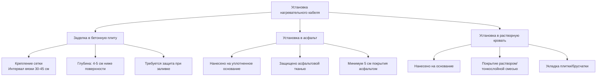

## Основы технологии кабелей

Электрические нагревательные кабели преобразуют электрическую энергию в тепловую энергию посредством резистивного нагрева, описываемого законом Джоуля:

$$Q = I^2 R t$$

где $Q$ — тепло (Дж), $I$ — ток (А), $R$ — сопротивление (Ω), $t$ — время (с). Выходная мощность на единицу длины:

$$P_L = \frac{V^2}{R_L}$$

где $P_L$ — мощность на единицу длины (Вт/м), $R_L$ — сопротивление на единицу длины (Ω/м).

## Системы кабелей постоянной мощности

### Конструкция и принцип работы

Кабели постоянной мощности (последовательное сопротивление) сохраняют фиксированный выход мощности независимо от температуры. Нагревательный элемент состоит из непрерывного проволочного сопротивления или параллельных цепей сопротивления, встроенных в полимерную изоляцию с экраном из плетеного металла.

**Ключевые характеристики:**

- Проволока с фиксированным сопротивлением (обычно сплав никель-хром)
- Постоянный выход мощности: 33-164 Вт/м
- Рабочие температуры до 65°C
- Требует точного отрезания длины в соответствии с характеристиками цепи

### Уравнение выходной мощности

Для кабелей с последовательным сопротивлением:

$$P_{total} = \frac{V^2}{R_{total}} = \frac{V^2}{R_L \cdot L}$$

где $L$ — общая длина кабеля (м). Это уравнение демонстрирует, что кабели последовательного типа не могут быть разрезаны на месте без изменения общего сопротивления цепи и выходной мощности.

### Требования к установке

В соответствии с NEC Article 426.20, кабели постоянной мощности требуют:

- Отдельных ветвей цепи с защитой GFCI
- Максимальный рейтинг цепи 50A при 208-240V
- Системы управления с датчиками температуры
- Минимальный интервал: 76 мм между параллельными ветвями
- Максимальная глубина заделки: 51 мм в бетон

## Системы саморегулирующихся кабелей

### Технология проводящего полимера

Саморегулирующиеся кабели используют матрицы проводящего полимера между параллельными шинами. По мере повышения температуры полимер расширяется, снижая проводящие пути и уменьшая силу тока. Это создает обратную зависимость между температурой и выходной мощностью:

$$P(T) = P_0 \left(1 - \alpha(T - T_0)\right)$$

где $P_0$ — номинальная мощность при опорной температуре $T_0$, $\alpha$ — температурный коэффициент (обычно 0,008-0,012 на °C).

### Физический механизм

Проводящий полимер содержит углеродные частицы, распределенные в полукристаллической полимерной матрице. При более низких температурах:

1. Полимер сжимается, создавая больше проводящих путей
2. Сопротивление снижается, ток увеличивается
3. Выходная мощность увеличивается

При более высоких температурах происходит обратное, обеспечивая автоматическое регулирование температуры без внешних элементов управления.

### Характеристики производительности

**Типичные спецификации:**

- Диапазон выходной мощности: 13-39 Вт/м при 10°C
- Максимальная температура воздействия: 85°C
- Может быть разрезана на месте на любую длину
- Выходная мощность варьируется на 50-70% в рабочем диапазоне
- Ток запуска: 1,5-2,5× установившийся ток

## Сравнение типов кабелей

| Параметр | Постоянная мощность | Саморегулирующийся |
|-----------|-----------------|-----------------|
| Выход мощности | Фиксированный | Переменный в зависимости от температуры |
| Резка на месте | Нет (последовательно), Да (параллельно) | Да |
| Энергоэффективность | Ниже | Выше (автоматическое регулирование) |
| Стоимость установки | Ниже | Выше |
| Требования к управлению | Обязательны | Опциональны для оптимизации |
| Допуск на перекрытие | Нулевой | Хороший (саморазрушающийся) |
| Срок службы | 15-20 лет | 10-15 лет |
| Холодный пусковой скачок | Низкий | Высокий (1,5-2,5×) |

## Методы установки

### Процедура заделки в бетон

1. **Подготовка основания**: Очистка, выравнивание бетонного основания с надлежащим уклоном дренажа (минимум 1,27 см на 30 см)

2. **Раскладка кабеля**: Установка кабелей в соответствии с проектным интервалом (обычно 7,5-10 см для подъездных дорог, 5-7,5 см для критических зон)

3. **Крепление**: Закрепление на сетке пластиковыми хомутами через каждые 30-45 см

4. **Электрическое тестирование**: Измерение сопротивления до и после заделки:

$$R_{measured} = \frac{R_L \cdot L}{1000}$$

Отклонение должно быть в пределах ±10% от спецификаций производителя.

5. **Заливка бетона**: Заливка бетона класса прочности минимум 20 МПа, поддержание глубины кабеля 4-5 см

6. **Защита при твердении**: Избегать включения кабеля минимум на 28 дней для полного твердения бетона

## Расчеты плотности мощности

Требуемая плотность мощности зависит от класса таяния снега в соответствии с условиями проектирования ASHRAE:

### Требования тепловой нагрузки

Общая тепловая нагрузка состоит из трех компонентов:

$$q_{total} = q_{melt} + q_{sensible} + q_{losses}$$

**Тепловая нагрузка таяния:**

$$q_{melt} = \frac{\dot{m}_s \cdot h_{sf}}{\eta}$$

где $\dot{m}_s$ — интенсивность накопления снега (кг/м²·ч), $h_{sf}$ — теплота плавления (334 кДж/кг), $\eta$ — эффективность системы (обычно 0,65-0,75 для электрической).

**Чувствительное нагревание:**

$$q_{sensible} = \dot{m}_s \cdot c_p \cdot (T_{out} - T_{snow})$$

где $c_p$ — удельная теплоемкость воды (4,19 кДж/кг·К).

**Потери тепла:**

$$q_{losses} = h_c \cdot (T_{surface} - T_{air}) + \varepsilon \sigma (T_{surface}^4 - T_{sky}^4)$$

Коэффициент конвекции $h_c$ варьируется от 15-35 Вт/м²·К в зависимости от скорости ветра.

### Типичные плотности мощности

В соответствии с руководящими принципами ASHRAE:

| Применение | Класс | Плотность мощности |
|-------------|-------|---------------|
| Жилая подъездная дорога | I | 150-200 Вт/м² |
| Коммерческая пешеходная дорожка | II | 200-300 Вт/м² |
| Критический доступ | III | 300-400 Вт/м² |
| Пандусы/погрузочные площадки | III | 400-500 Вт/м² |

### Расчет расстояния между кабелями

Требуемое расстояние для желаемой плотности мощности:

$$S = \frac{P_L}{q_{required}} \times 1000$$

где $S$ — расстояние (мм), $P_L$ — мощность кабеля (Вт/м), $q_{required}$ — проектная плотность мощности (Вт/м²).

**Пример:** Для кабеля 98 Вт/м при достижении 250 Вт/м²:

$$S = \frac{98}{250} \times 1000 = 392 \text{ мм} \approx 39 \text{ см}$$

Используйте расстояние 38 см с отступом от края 9 см.

## Интеграция управления и соответствие NEC

### Требуемые элементы управления (NEC 426.28)

Системы электрического таяния снега должны включать:

- Защиту от замыканий на землю (максимум 30 мА)
- Средства отключения в зоне видимости
- Системы управления с датчиками температуры и влажности
- Защиту от перегрузки по току в соответствии с NEC 426.4

### Стратегии управления

**Базовое обнаружение снега/льда:**
- Комбинированный датчик температуры/влажности
- Активируется при температуре <3°C и наличии влаги
- Продолжает работу в течение 30-90 минут после прекращения снегопада

**Оптимизированное управление:**
- Предварительный нагрев на основе прогноза погоды
- Переменный выход мощности в зависимости от интенсивности снегопада
- Поддержание температуры плиты для быстрого ответа

## Соображения электрического проектирования

### Определение размера цепи

Максимальная длина кабеля на цепь:

$$L_{max} = \frac{V \cdot I_{breaker}}{P_L \cdot 1.25}$$

Множитель 1,25 учитывает постоянный режим работы (NEC 426.4).

**Пример:** цепь 240V, 20A, кабель 40 Вт/м:

$$L_{max} = \frac{240 \times 20}{40 \times 1.25} = 96 \text{ м максимум}$$

### Ограничения падения напряжения

Поддерживайте падение напряжения ниже 3% для оптимальной производительности:

$$\Delta V = \frac{2 \cdot L \cdot I \cdot R_{conductor}}{1000}$$

где $L$ — односторонняя длина цепи (м), $I$ — ток (А), $R_{conductor}$ — сопротивление проводника (Ω/км).

## Критерии выбора системы

**Выбирайте кабели постоянной мощности, если:**

- Требуется точный, однородный тепловой выход
- Приоритет низкой начальной стоимости
- Гарантирована профессиональная установка
- Простые геометрические конфигурации

**Выбирайте саморегулирующиеся кабели, если:**

- Энергоэффективность имеет первостепенное значение
- Неправильные конфигурации или переменные условия
- Возможны перекрывающиеся ветви кабеля
- Предпочтение более низкому обслуживанию
- Требуется резервирование/избыточность

Оба типа кабелей обеспечивают надежное таяние снега при надлежащем проектировании, установке и управлении в соответствии с NEC Article 426 и расчетами тепловой нагрузки ASHRAE.
