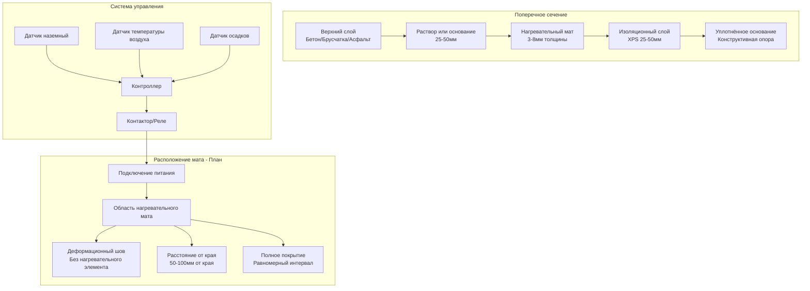

## Физические принципы электрических нагревательных матов

Электрические нагревательные маты преобразуют электрическую энергию непосредственно в тепловую энергию посредством сопротивительного нагревания. Когда ток проходит через резистивный проводник, столкновения электронов с атомной решёткой проводника производят тепло со скоростью, определяемой законом Джоуля:

$$P = I^2 R = \frac{V^2}{R}$$

где $P$ — мощность (Вт), $I$ — ток (А), $R$ — сопротивление (Ом), и $V$ — напряжение (В). Это тепло проводится через основу мата к поверхности сверху, где оно плавит снег и предотвращает накопление льда.

Эффективность нагревательного мата зависит от обеспечения достаточной плотности мощности для преодоления потерь тепла с поверхности. Эти потери происходят через три механизма: конвекция в окружающий воздух, излучение в небо и скрытая теплота, необходимая для фазового перехода льда в жидкую воду.

## Требования к плотности мощности

Требуемая плотность мощности для снеготаяния зависит от климатических условий и желаемого уровня производительности. Фундаментальное уравнение энергетического баланса:

$$q_{required} = q_{conv} + q_{rad} + q_{melt} + q_{sens}$$

где:
- $q_{conv}$ = потери тепла на конвекцию в воздух
- $q_{rad}$ = потери тепла на излучение
- $q_{melt}$ = скрытая теплота плавления снега
- $q_{sens}$ = чувствительная теплота для нагрева талой воды

Для практического проектирования ASHRAE предоставляет упрощённые рекомендации по плотности мощности:

$$q = \frac{A_r \cdot S \cdot (h_f + c_p \Delta T)}{3600} + h_c A_s (T_s - T_a)$$

где:
- $A_r$ = интенсивность снегопада (мм/ч)
- $S$ = плотность снега (кг/м³)
- $h_f$ = скрытая теплота плавления (334 кДж/кг)
- $c_p$ = удельная теплоёмкость воды (4,18 кДж/кг·К)
- $\Delta T$ = повышение температуры талой воды
- $h_c$ = коэффициент конвективной передачи тепла (Вт/м²·К)
- $A_s$ = коэффициент площади поверхности
- $T_s$ = температура поверхности (°C)
- $T_a$ = температура окружающего воздуха (°C)

Типичные жилые приложения требуют 215-320 Вт/м², в то время как коммерческие приложения с более высокими требованиями к производительности требуют 320-540 Вт/м².

## Типы конструкций нагревательных матов

Электрические нагревательные маты состоят из элементов резистивного нагревания, встроенных или приклеенных к гибкой основе. Существуют три основных метода конструкции:

**Маты с двухпроводниковым кабелем**: параллельные проводники, намотанные в виде змеевика, собранные на заводе на полимерной сетке. Конструкция с двумя проводниками исключает проблемы электромагнитного поля и упрощает монтаж одноточечным подключением питания.

**Саморегулирующиеся полимерные маты**: проводящий полимер между шинами питания регулирует сопротивление на основе локальной температуры. По мере повышения температуры мата сопротивление полимера увеличивается, что снижает выходную мощность. Это обеспечивает встроенную защиту от перегрева и повышение энергоэффективности.

**Маты с металлической фольгой**: резистивная металлическая фольга, ламинированная между изоляционными слоями. Однородная толщина элемента нагревания обеспечивает постоянную плотность мощности по всей площади мата.

## Сравнение нагревательных матов

| Тип мата | Плотность мощности | Напряжение | Основание монтажа | Основное применение | Предел температуры |
|----------|---------------------|------------|-------------------|-------------------|------------------|
| Двухпроводниковый кабель | 160-430 Вт/м² | 120/240В | Бетон, асфальт, брусчатка | Проезжие части, пешеходные дорожки, ступени | 65°C непрерывно |
| Саморегулирующийся полимер | 110-320 Вт/м² | 120/208/240В | Любая жёсткая поверхность | Крыши, желоба, трубы | Варьируется с полимером |
| Металлическая фольга | 215-540 Вт/м² | 120/240В | Бетон, тонкослойный раствор | Коммерческие входы, пандусы | 82°C непрерывно |
| Усиленный кабель | 320-650 Вт/м² | 208/240/480В | Бетон (встроенный) | Платформы погрузки, вертолётные площадки | 93°C непрерывно |

## Конфигурация монтажа

Правильный монтаж обеспечивает равномерное распределение тепла и долговечность системы. Последовательность монтажа и расположение слоёв существенно влияют на тепловую производительность.

## Проектные соображения при монтаже

**Тепловая изоляция**: установка жёсткой пенной изоляции под нагревательные маты снижает потери тепла вниз на 30-50%. Экструдированный полистирол (XPS) с минимальным RSI-0,88 — стандарт. Без изоляции тепло проводится в грунт, снижая температуру поверхности и тратя впустую энергию.

**Краевые эффекты**: потери тепла увеличиваются рядом с необогреваемыми краями. Поддерживайте расстояние 50-100 мм от краёв или увеличьте плотность мощности в краевых зонах на 20-30% для компенсации.

**Деформационные швы**: никогда не устанавливайте нагревательные элементы через деформационные швы. Структурные движения повреждают кабели. Завершайте маты за 25 мм до швов и предусмотрите отдельные цепи по обе стороны.

**Глубина укладки**: оптимальная укладка в бетон составляет 25-50 мм ниже поверхности. Поверхностная укладка улучшает время отклика, но увеличивает риск физического повреждения. Более глубокая укладка защищает элементы, но увеличивает тепловую инерцию.

**Проектирование цепи**: разделяйте большие площади на несколько цепей (максимум 15-20 А на цепь при 120В, 20-30 А при 240В). Это обеспечивает резервирование, упрощает поиск неисправностей и позволяет управлять отдельными зонами для областей с различной солнечной экспозицией или интенсивностью движения.

## Интеграция системы управления

Автоматические системы управления оптимизируют производительность и минимизируют потребление энергии. Системы с тремя датчиками (температура почвы, температура воздуха, осадки) обеспечивают наиболее эффективную работу:

1. **Датчик почвы** предотвращает работу, когда поверхность превышает установку (обычно 4°C)
2. **Датчик осадков** определяет влагу и инициирует цикл нагревания
3. **Датчик температуры окружающей среды** предотвращает работу выше условий замерзания

Продвинутые контроллеры включают алгоритмы скорости изменения температуры для предварительного нагрева поверхностей перед снегопадом, снижая накопление во время начала бури.

## Стандарты производительности и тестирование

Системы электрического снеготаяния должны соответствовать:

- **UL 1093**: стандарт для блоков систем пожаротушения с галогенированным агентом
- **NEC статья 426**: требования к оборудованию для электрического размораживания и снеготаяния на открытом воздухе
- **IEEE 844**: рекомендуемая практика электрического сопротивления, индукции и поверхностного нагрева трубопроводов и сосудов
- **Руководство по проектированию ASHRAE**: снеготаяние и защита от замерзания

Защита от замыкания на землю (GFCI) обязательна по NEC для всех цепей. Используйте коробки в защитном корпусе, рассчитанные на минимум NEMA 4X. Все установки нагревательных матов требуют испытания сопротивления изоляции перед включением (минимум 20 МОм при 500В постоянного тока).

## Анализ операционной энергии

Годовое потребление энергии зависит от климатической зоны, желаемого уровня отклика и стратегии управления. Сезонное требование энергии:

$$E_{season} = \sum_{i=1}^{n} P \cdot A \cdot t_i \cdot \eta$$

где $P$ — плотность мощности (Вт/м²), $A$ — нагреваемая площадь (м²), $t_i$ — продолжительность работы для события $i$ (часы), и $\eta$ — эффективность системы (обычно 0,75-0,85, учитывая тепловые потери).

Для 50 м² жилой проезжей части в климатической зоне 5A с плотностью мощности 300 Вт/м² и 200 часами годовой работы сезонное потребление составляет примерно 2250 кВт·ч. При $0,12/кВт·ч годовая стоимость работы составляет $270.

Стратегии холостого хода поддерживают температуру поверхности немного выше точки замерзания (1-2°C) во время предсказанных снегопадов, потребляя 30-50% от полной мощности, но обеспечивая немедленное таяние снега при начале осадков. Это увеличивает потребление энергии, но улучшает производительность для критически важных приложений.

## Выбор материалов и долговечность

Изоляция нагревательного кабеля должна выдерживать напряжения при монтаже, химическое воздействие дорожных солей и термические циклы. Обычные изоляционные материалы:

- **Фторполимер (PTFE, FEP)**: отличная химическая стойкость, рейтинг температуры до 200°C, премиальная цена
- **Сшитый полиэтилен (XLPE)**: хорошая стойкость к влаге, рейтинг температуры до 90°C, умеренная цена
- **Поливинилхлорид (PVC)**: более низкая цена, рейтинг температуры до 75°C, адекватный для лёгких приложений

Экраны кабеля (обычно луженая медная оплётка) обеспечивают электромагнитную совместимость и служат в качестве проводника защитного заземления. Минимальное покрытие экрана — 90% для уличных приложений снеготаяния.

Ожидаемый срок службы правильно установленных систем составляет 20-30 лет при минимальном техническом обслуживании. Отказы обычно являются результатом физического повреждения во время строительства или неадекватного заземления, вызывающего проникновение влаги.

---

*Данный технический контент обеспечивает инженерный анализ систем электрических нагревательных матов для приложений снеготаяния, охватывая термодинамические принципы, расчёты проектирования, методы монтажа и оптимизацию производительности.*
