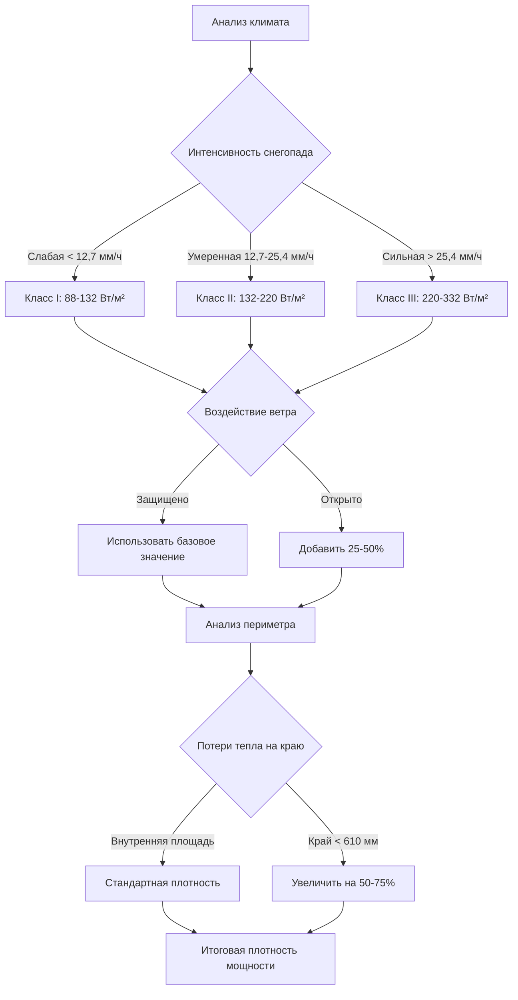

Плотность мощности представляет фундаментальный параметр проектирования систем электрического снеготаяния, количественно определяя тепловой выход, подаваемый на единицу площади обогреваемого дорожного покрытия. Правильное указание плотности мощности обеспечивает достаточную емкость таяния при одновременном избежании чрезмерного электрического оборудования, которое увеличивает затраты на установку. Процесс проектирования требует перевода требований теплового потока, обусловленных климатом, в электрические спецификации мощности на основе фундаментальных принципов теплопередачи.

## Физика плотности мощности

Системы электрического снеготаяния преобразуют электрическую энергию в тепловую энергию посредством резистивного нагрева. Взаимосвязь между электрической мощностью и тепловым выходом непосредственно следует из первого закона Джоуля:

$$P = I^2 R = \frac{V^2}{R}$$

Где:
- $P$ = мощность, рассеиваемая в виде тепла (ватты)
- $I$ = ток (амперы)
- $R$ = сопротивление (омы)
- $V$ = напряжение (вольты)

Для встроенных нагревательных кабелей сопротивление на единицу длины определяет плотность мощности в сочетании с геометрическим расстоянием. Плотность мощности на основе площади становится:

$$P_{density} = \frac{P_{cable} \times 304.8}{S}$$

Где:
- $P_{density}$ = плотность мощности (Вт/м²)
- $P_{cable}$ = мощность кабеля на погонный метр (Вт/м)
- $S$ = расстояние между кабелями от центра к центру (мм)
- Коэффициент 304,8 переводит метры в миллиметры

Эта взаимосвязь показывает, что плотность мощности масштабируется линейно с мощностью кабеля и обратно пропорционально расстоянию. Кабель мощностью 65 Вт/м, установленный с расстоянием 100 мм, обеспечивает:

$$P_{density} = \frac{65 \times 304.8}{100} = 198 \text{ Вт/м}^2$$

Тот же кабель с расстоянием 150 мм снижает плотность мощности до 132 Вт/м², демонстрируя критическую важность точности расстояния.

## Преобразование теплового потока в плотность мощности

Плотность мощности должна соответствовать или превышать требуемый тепловой поток, необходимый для таяния снега и преодоления потерь в окружающей среде. ASHRAE предоставляет подробные расчеты теплового потока в Главе 52 справочника HVAC Applications, учитывающие:

1. **Скрытая теплота плавления** для таяния снега: 335 кДж/кг
2. **Явная теплота** для повышения температуры талой воды
3. **Конвективные потери** в окружающий воздух
4. **Радиационный теплообмен** с небом и окружающей средой
5. **Потери через основание** через дорожное покрытие и подложку

Общий требуемый тепловой поток объединяет эти компоненты:

$$q_{total} = q_{melt} + q_{sensible} + q_{conv} + q_{rad} - q_{back}$$

Преобразование из кДж/ч·м² в ватты на квадратный метр требует коэффициента преобразования:

$$P_{density} = \frac{q_{total}}{3.6}$$

Коэффициент 3,6 преобразует кДж/ч в ватты (1 ватт = 3,6 кДж/ч).

Пример расчета для условий умеренного снегопада:
- Требуемый тепловой поток: 568 кДж/ч·м²
- Плотность мощности = 568 ÷ 3,6 = 158 Вт/м²
- Указанное значение проектирования: 160 Вт/м² (округлено вверх с запасом)

## Значения проектирования на основе климата

Требования к плотности мощности значительно различаются в зависимости от географического расположения и целей проектирования. ASHRAE классифицирует системы на три класса в зависимости от уровня производительности:

| Класс системы | Описание | Диапазон теплового потока | Диапазон плотности мощности |
|--------------|---------|---------------------------|---------------------------|
| Класс I | Минимизировать накопление, некоторые остатки | 316-473 кДж/ч·м² | 88-132 Вт/м² |
| Класс II | Чистое дорожное покрытие во время снегопада | 473-789 кДж/ч·м² | 132-220 Вт/м² |
| Класс III | Быстрое таяние, снег, гонимый ветром | 789-1264 кДж/ч·м² | 220-332 Вт/м² |

Климатические зоны накладывают дополнительные ограничения проектирования на основе интенсивности снегопада, воздействия ветра и температуры окружающего воздуха во время штормов.

**Регионы холодного климата** (Миннеаполис, Денвер, Бостон):
- Жилые системы класса II: 176-206 Вт/м²
- Коммерческие системы класса III: 249-293 Вт/м²
- Открытые площади: 293-352 Вт/м²

**Регионы умеренного климата** (Сиэтл, Портленд, Филадельфия):
- Жилые системы класса I: 103-132 Вт/м²
- Коммерческие системы класса II: 147-191 Вт/м²
- Открытые площади: 206-249 Вт/м²

**Регионы с периодическим снегом** (Южные штаты, прибрежные районы):
- Жилые системы класса I при периодическом использовании: 73-103 Вт/м²
- Приоритетные коммерческие системы класса II: 118-161 Вт/м²

## Рассмотрение граничных зон

Периметры дорожного покрытия испытывают повышенные потери тепла из-за трехмерного теплопередачи через открытые края. Тепловое сопротивление на границах снижается по сравнению с внутренними областями, где тепловой поток является преимущественно одномерным (вертикальным).

Потери тепла на краях следуют:

$$q_{edge} = U_{edge} \times (T_{slab} - T_{ambient})$$

Эффективное значение U на краях обычно превышает внутренние значения на 40-80% в зависимости от конфигурации теплоизоляции и воздействия. Это требует более высокой плотности мощности в граничных зонах.

Стандартная практика делит обогреваемые площади на зоны:

| Тип зоны | Расстояние от края | Множитель плотности мощности |
|----------|-------------------|------------------------------|
| Внутренняя | > 610 мм | 1,0 (базовое значение проектирования) |
| Граничная | 305-610 мм | 1,25-1,5 |
| Периметр | 0-305 мм | 1,5-1,75 |

Для базового проектирования 220 Вт/м²:
- Внутреннее расстояние: 100 мм (220 Вт/м²)
- Граничное расстояние: 75 мм (295 Вт/м²)
- Периметр: 65 мм (352 Вт/м²)

Этот градуированный подход обеспечивает равномерность температуры поверхности при контроле затрат на установку.

## Dimensioning электроснабжения

Общая электрическая нагрузка определяет требования к электроснабжению, конфигурацию цепей и спецификации распределительного оборудования. Расчеты нагрузки происходят систематически от плотности мощности к общему спросу системы.

**Общая подключенная нагрузка:**

$$P_{total} = P_{density} \times A_{heated} \times DF$$

Где:
- $P_{total}$ = общая нагрузка системы (ватты)
- $P_{density}$ = плотность мощности проектирования (Вт/м²)
- $A_{heated}$ = общая обогреваемая площадь (м²)
- $DF$ = коэффициент разнообразия (обычно 1,0 для снеготаяния)

Пример для коммерческого входа площадью 280 м² при 215 Вт/м²:

$$P_{total} = 215 \times 280 \times 1,0 = 60,200 \text{ Вт} = 60,2 \text{ кВт}$$

**Dimensioning ответвленной цепи:**

NEC Статья 426.4 требует, чтобы ответвленные цепи были рассчитаны на 125% общей подключенной нагрузки для непрерывной работы:

$$I_{branch} = \frac{P_{circuit} \times 1.25}{V}$$

Для цепи 240 В с кабелем мощностью 65 Вт/м при расстоянии 100 мм, покрывающем 18,6 м²:
- Требуемая длина кабеля: 18,6 м² × (1000 мм/м ÷ 100 мм) = 186 м
- Нагрузка цепи: 186 м × 65 Вт/м = 12,090 Вт
- Требуемый ток: (12,090 × 1,25) ÷ 240 = 63,0 А

Это требует автоматического выключателя 70 А с проводниками из меди № 4 AWG (номинальные 85 А при 75°C).

**Нагрузка главной панели:**

Главное электрическое распределение должно вмещать нагрузку снеготаяния плюс существующие нагрузки здания:

$$S_{main} = (P_{existing} + P_{snowmelt}) \times DF_{panel}$$

Где $DF_{panel}$ представляет коэффициент разнообразия панели, обычно 1,0 когда снеготаяние работает как основная нагрузка во время штормов.

| Обогреваемая площадь | Типичная нагрузка при 220 Вт/м² | Требование электроснабжения |
|---------------------|-----------------------------------|-----------------------|
| 46 м² (небольшой подъезд) | 10,1 кВт | Панель 125-150 A |
| 139 м² (большой подъезд) | 30,6 кВт | Панель 300-400 A |
| 465 м² (коммерческая) | 102 кВт | Электроснабжение 800-1000 A |
| 929 м² (площадь) | 204 кВт | Электроснабжение 1600 A+ |

## Выбор напряжения и распределение нагрузки

Рабочее напряжение влияет на величину тока, dimensioning проводников и соображения относительно падения напряжения. Стандартные напряжения включают:

**120 В однофазное:**
- Жилые приложения < 3,73 кВт
- Максимальная нагрузка цепи: ~1,422 кВт (16 A × 120 В × 80%)
- Ограничено небольшими площадями или дополнительным нагревом

**240 В однофазное:**
- Жилые и малые коммерческие приложения
- Максимальная нагрузка цепи: ~2,843 кВт (20 A × 240 В × 80%)
- Наиболее распространено для подъездов и тротуаров

**208 В трехфазное:**
- Коммерческие приложения
- Позволяет сбалансированное распределение нагрузки между фазами
- Снижает размеры проводников по сравнению с однофазным

**480 В трехфазное:**
- Крупные коммерческие и промышленные приложения
- Требует понижающие трансформаторы в зонах обогрева
- Минимизирует стоимость распределительных проводников для обширных площадей

Плотность мощности остается постоянной независимо от напряжения, но ток меняется обратно пропорционально:

$$I = \frac{P_{density} \times A}{V \times \text{Количество фаз}}$$

Для площади 9,3 м² при 220 Вт/м² (2,050 Вт в сумме):
- 120 В: 17,1 A требуется
- 240 В: 8,5 A требуется
- 480 В: 4,3 A требуется

Более высокие напряжения снижают затраты на проводники, но увеличивают требования к трансформаторам и изоляции.

## Стратегии оптимизации производительности

Максимизация тепловой эффективности при контроле электроспроса требует стратегического распределения плотности мощности:

**1. Градуированное распределение плотности по зонам:**
Выделите более высокую плотность мощности критическим областям, снижая ее в менее приоритетных зонах. Иерархия приоритетов:
- Уровень 1 (наивысший): Пути выхода, маршруты ADA (220-293 Вт/м²)
- Уровень 2: Основные проходные зоны (176-220 Вт/м²)
- Уровень 3: Вторичные зоны (132-176 Вт/м²)
- Уровень 4 (наименьший): Декоративные или переполненные зоны (88-132 Вт/м²)

**2. Использование тепловой массы:**
Увеличенная толщина плиты обеспечивает тепловое хранилище, позволяя снизить холостую плотность мощности:
- Стандартная плита толщиной 100 мм: требуется полная плотность мощности
- Плита толщиной 150 мм: может снизить холостую работу на 20-30%
- Плита толщиной 200+ мм: может снизить холостую работу на 30-40%

**3. Эффективность теплоизоляции:**
Теплоизоляция под плитой перенаправляет тепло вверх, улучшая эффективность поверхности:

| Значение RSI теплоизоляции | Эффективная подача тепла | Потенциал снижения плотности |
|---------------------------|---------------------------|---------------------------|
| Без изоляции | 60-70% | Базовое значение |
| RSI 0,88 | 75-80% | 10-15% |
| RSI 1,76 | 80-85% | 15-20% |
| RSI 2,64+ | 85-90% | 20-25% |

При RSI 1,76 система, требующая 220 Вт/м² без изоляции, может достичь эквивалентной производительности при 177-188 Вт/м², снижая затраты на электрическую инфраструктуру.

## Пример проектирования: коммерческий вход

**Параметры проекта:**
- Местоположение: Чикаго, Иллинойс
- Площадь: 111,5 м² входной площади
- Производительность: Класс II (чистое дорожное покрытие)
- Воздействие ветра: Умеренное
- Периметр края: 49 м

**Шаг 1: базовый тепловой поток**
Из климатических данных ASHRAE для Чикаго:
- Расчетная интенсивность снегопада: 19 мм/ч
- Расчетная температура окружающего воздуха: -9°C
- Скорость ветра: 6,7 м/с
- Требуемый тепловой поток: 695 кДж/ч·м²

**Шаг 2: Расчет плотности мощности**
$$P_{base} = \frac{695}{3.6} = 193 \text{ Вт/м}^2$$

Укажите 200 Вт/м² для внутренних зон.

**Шаг 3: Корректировка граничной зоны**
Площадь граничной зоны: 49 м × 0,61 м = 30 м²
Внутренняя площадь: 111,5 - 30 = 81,5 м²

Плотность мощности граничной зоны: 200 × 1,5 = 300 Вт/м² (укажите 300 Вт/м²)

**Шаг 4: общая электрическая нагрузка**
$$P_{interior} = 81,5 \times 200 = 16,300 \text{ Вт}$$
$$P_{edge} = 30 \times 300 = 9,000 \text{ Вт}$$
$$P_{total} = 25,300 \text{ Вт} = 25,3 \text{ кВт}$$

**Шаг 5: Конфигурация цепей**
Используя кабель мощностью 65 Вт/м при 240 В:

Внутреннее расстояние: (65 × 1000) ÷ 200 = 325 мм → используйте 300 мм (217 Вт/м²)
Граничное расстояние: (65 × 1000) ÷ 300 = 217 мм → используйте 225 мм (289 Вт/м²)

Требуемая длина кабеля:
- Внутренняя: 81,5 ÷ (300 ÷ 1000) = 272 м
- Граничная: 30 ÷ (225 ÷ 1000) = 133 м
- Всего: 405 м

Количество цепей (240 В, 20 A, 80% нагрузки):
Максимум кабеля на цепь: (240 × 20 × 0,8) ÷ 65 = 59 м
Требуемые цепи: 405 ÷ 59 = 6,9 → 7 цепей

**Шаг 6: электроснабжение панели**
С множителем NEC 125%:
Требование электроснабжения = 25,3 кВт × 1,25 = 31,6 кВт
Ток при 240 В: 31,600 ÷ 240 = 132 А
Укажите: панель 150 A с 7 × 20 A GFCI автоматическими выключателями

## Распространенные ошибки проектирования

**Недостаточное значение плотности мощности:**
Указание недостаточной плотности мощности на основе мягких зимних средних значений вместо расчетных условий приводит к плохой производительности во время фактических штормовых событий. Всегда проектируйте в соответствии с условиями проектирования ASHRAE 99% зимой, а не типичными значениями.

**Игнорирование граничных эффектов:**
Равномерная плотность мощности по всей площади приводит к холодным периметрам и неполному таянию на границах, где потери тепла наиболее значительны. Граничные зоны требуют на 50-75% больше плотности мощности.

**Неадекватная электрическая инфраструктура:**
Невыполнение учета множителя непрерывной нагрузки NEC 125% вызывает ложное срабатывание автоматического выключателя или перегрев проводников. Все расчеты должны включать этот запас безопасности.

**Пренебрежение падением напряжения:**
Долгие прогоны кабеля при низком напряжении вызывают значительное падение напряжения, снижая фактическую подачу мощности ниже расчетных значений. Напряжение на самом дальнем нагревательном элементе должно оставаться в пределах 5% номинального.

**Недостаточная теплоизоляция:**
Эксплуатация систем без теплоизоляции под плитой тратит впустую 30-40% генерируемого тепла в землю. Дополнительная стоимость теплоизоляции RSI 1,76 окупается за счет сниженных требований к электроснабжению за 3-5 лет в большинстве приложений.

## Справочные материалы ASHRAE по проектированию

ASHRAE предоставляет подробное руководство проектирования в нескольких публикациях:

**Справочник ASHRAE - приложения HVAC, Глава 52:**
- Методология расчета теплового потока
- Климатические данные для проектирования снеготаяния
- Коэффициенты распределения нагрузки
- Критерии классификации систем

**Стандарт ASHRAE 90416:**
Хотя этот стандарт не существует специально для снеготаяния, проектировщики должны ссылаться на:
- ASHRAE 90.1: Энергетический стандарт для зданий (эффективность электросистемы)
- Локальные климатические данные проектирования из ASHRAE Climatic Design Conditions

**Ключевые значения проектирования из ASHRAE:**

| Местоположение | Расчетная температура 99% (°C) | Расчетная интенсивность снега (мм/ч) | Рекомендуемый класс II (Вт/м²) |
|---------------|-------------------------------|---------------------------------------|------------------------------|
| Миннеаполис, MN | -11 | 20 | 206-235 |
| Денвер, CO | -17 | 18 | 191-220 |
| Чикаго, IL | -18 | 19 | 191-220 |
| Бостон, MA | -13 | 15 | 176-206 |
| Сиэтл, WA | -2 | 10 | 132-161 |
| Портленд, OR | -4 | 9 | 118-147 |

## Проверка плотности мощности

После установки, но до размещения бетона, проверьте фактическую плотность мощности посредством измерений сопротивления:

**Метод измеренного сопротивления:**
$$R_{measured} = \frac{V^2}{P_{rated}}$$

Для кабеля 65 Вт/м при 240 В, цепь длиной 61 м:
- Ожидаемое сопротивление: (240²) ÷ (65 × 61) = 14,4 Ω
- Допустимый диапазон: 14,0-14,8 Ω (±3%)

Измерьте сопротивление между проводниками мегаомметром. Рассчитайте фактическую мощность:
$$P_{actual} = \frac{V^2}{R_{measured}}$$

Если $R_{measured}$ = 14,6 Ω:
$$P_{actual} = \frac{240^2}{14.6} = 3,945 \text{ Вт}$$

По сравнению с проектированием: 3,965 Вт (в пределах 1%, приемлемо)

**Метод измерения тока:**
Включите цепь и измерьте фактическое потребление тока:
$$P_{actual} = V \times I \times \text{коэффициент мощности}$$

Для резистивного нагрева коэффициент мощности = 1,0

Эта проверка подтверждает надлежащую установку перед размещением бетона, что делает последующие исправления невозможными.

## Заключение

Спецификация плотности мощности для систем электрического снеготаяния требует систематического анализа климатических условий, требований теплового потока и ограничений электрической инфраструктуры. Надлежащее проектирование обеспечивает адекватную тепловую производительность при контроле затрат на установку и эксплуатацию. Фундаментальная взаимосвязь между мощностью кабеля, геометрическим расстоянием и результирующей плотностью мощности управляет всеми конфигурациями системы, с значениями проектирования на основе климата, варьирующимися от 88 Вт/м² для облегченных приложений до 332 Вт/м² для экстремальных условий. Рассмотрение граничных зон, dimensioning электроснабжения и оптимизация производительности за счет теплоизоляции и тепловой массы завершают полный процесс проектирования.
