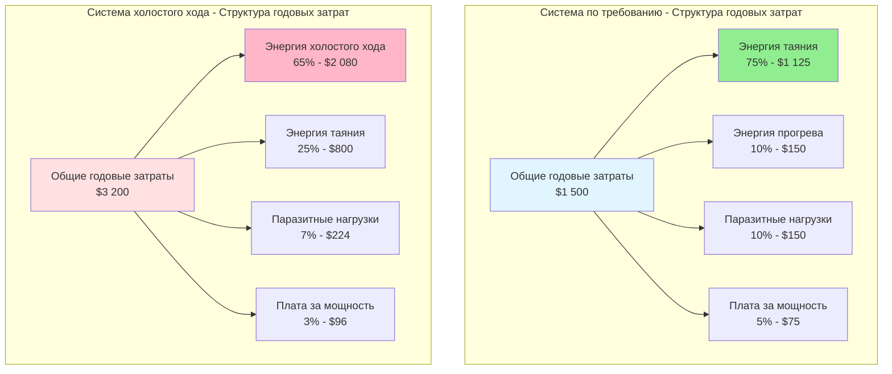

Годовая стоимость эксплуатации представляет наиболее значительное финансовое соображение для систем снеготаяния на протяжении их срока службы, как правило составляя 60-80% от общих затрат жизненного цикла. Структура затрат зависит от характера потребления энергии, механизмов тарифов на коммунальные услуги, географического расположения и параметров проектирования системы. Понимание этих компонентов затрат позволяет провести точный экономический анализ и оптимизацию стратегий управления.

## Основы расчета затрат

Годовая стоимость эксплуатации состоит из потребления энергии, умноженного на применимые тарифы коммунальных услуг, с корректировками для сложности структуры тарифов. Фундаментальное соотношение вытекает из принципов энергетического баланса, применяемых к сезонной работе.

### Основное уравнение годовой стоимости

Годовая стоимость эксплуатации системы снеготаяния рассчитывается как:

$$C_{annual} = C_{energy} + C_{demand} + C_{fixed}$$

где каждый компонент представляет отдельные механизмы выставления счетов коммунальными предприятиями для работы системы.

### Стоимость потребления энергии

Компонент потребления энергии представляет наибольшую часть годовой стоимости, рассчитываемую из требований по подаче тепла:

$$C_{energy} = \sum_{i=1}^{n} \left( \frac{E_i}{\eta_{sys}} \times R_i \right)$$

где:
- $C_{energy}$ = годовая стоимость энергии ($/год)
- $E_i$ = энергия, подаваемая на плиту в течение периода $i$ (кВт·ч или термы)
- $\eta_{sys}$ = эффективность системы (0,65–1,00)
- $R_i$ = энергетический тариф в период $i$ ($/кВт·ч или $/терм)
- $n$ = количество расчетных периодов или уровней тарифов

### Стоимость платежа за мощность

Электрические системы подлежат платежам за мощность в зависимости от пиковой мощности во время расчетных периодов:

$$C_{demand} = P_{peak} \times R_d \times N_{months}$$

где:
- $C_{demand}$ = годовая стоимость платежа за мощность ($/год)
- $P_{peak}$ = максимальная средняя мощность за 15 минут (кВ)
- $R_d$ = тариф за мощность ($/кВ·месяц)
- $N_{months}$ = количество месяцев с активными платежами за мощность (обычно 4–6)

Для систем снеготаяния пиковая мощность обычно возникает во время начальных циклов прогрева, когда полная мощность системы активируется одновременно. Это может представлять 20-40% от общих электрических затрат в коммерческих тарифных структурах.

## Компоненты потребления энергии

Общее годовое потребление энергии вытекает из трех режимов работы, каждый из которых способствует годовому бремени затрат на основе стратегии управления и климатических условий.

### Энергия таяния

Энергия, необходимая для таяния накопленного снега, представляет основную функцию системы:

$$E_{melt} = A_{slab} \times q_{design} \times t_{melt} \times 0.001$$

где:
- $E_{melt}$ = потребление энергии на таяние (кВт·ч)
- $A_{slab}$ = площадь отапливаемой плиты (м²)
- $q_{design}$ = расчетный тепловой поток (Вт/м²)
- $t_{melt}$ = совокупные часы таяния за сезон (часы)
- 0,001 = коэффициент преобразования Вт·ч в кВт·ч

Типичные часы таяния по климатическим зонам:

| Климатическая зона | Ежегодные события снегопада | Часы таяния/сезон |
|--------------|-------------------|---------------------|
| Мягкая (Сиэтл, Портленд) | 10-20 | 50-100 |
| Умеренная (Чикаго, Бостон) | 30-50 | 150-300 |
| Суровая (Миннеаполис, Буффало) | 50-80 | 300-500 |
| Экстремальная (Анкоридж, высокогорье) | 80-120 | 500-800 |

### Энергия холостого хода

Системы, работающие в режиме холостого хода, поддерживают повышенную температуру плиты в зимние месяцы, чтобы исключить задержки прогрева:

$$E_{idle} = A_{slab} \times q_{idle} \times t_{idle} \times 0.001$$

где:
- $E_{idle}$ = потребление энергии холостого хода (кВт·ч)
- $q_{idle}$ = тепловой поток холостого хода, обычно 30-50 Вт/м² (10-16 БТЕ/ч·фут²)
- $t_{idle}$ = общее количество часов холостого хода за сезон (обычно 1500-3000 часов)

Работа холостого хода увеличивает годовое потребление энергии на 150-400% по сравнению со стратегиями по требованию, представляя значительный штраф за затраты, оправданный только для критических приложений, требующих нулевой допуск к накоплению снега.

### Энергия прогрева

Системы по требованию требуют входного энергоснабжения для повышения температуры плиты от условий окружающей среды к эффективной способности плавления:

$$E_{warmup} = A_{slab} \times \rho_{conc} \times c_{conc} \times d_{eff} \times \Delta T \times N_{events} \times 2.78 \times 10^{-7}$$

где:
- $E_{warmup}$ = энергия прогрева за сезон (кВт·ч)
- $\rho_{conc}$ = плотность бетона (2400 кг/м³)
- $c_{conc}$ = удельная теплоемкость бетона (880 Дж/кг·К)
- $d_{eff}$ = эффективная глубина отапливаемой плиты (0,05–0,10 м)
- $\Delta T$ = повышение температуры (обычно 15–25 К)
- $N_{events}$ = количество снежных событий, требующих прогрева (20–60/сезон)
- $2.78 \times 10^{-7}$ = коэффициент преобразования Дж в кВт·ч

Энергия прогрева обычно представляет 5-15% от общего годового потребления для систем по требованию, с более высокими процентами в мягких климатах с частыми небольшими снежными событиями.

## Структуры тарифов на коммунальные услуги

Структуры тарифов электроэнергии и газа коммунальных предприятий значительно влияют на годовые затраты на эксплуатацию через различные механизмы определения цен, отражающие ограничения емкости системы коммунального предприятия и изменяющиеся во времени затраты на производство энергии.

### Компоненты электрического тарифа

**Плата за энергию (¢/кВт·ч)**
- Жилой простой тариф: 10-25 ¢/кВт·ч (фиксированный тариф)
- Коммерческий многоуровневый тариф: 8-12 ¢/кВт·ч (первый уровень), 10-18 ¢/кВт·ч (более высокие уровни)
- Тариф с разделением по времени суток: 6-10 ¢/кВт·ч (внепиковые часы), 15-30 ¢/кВт·ч (пиковые часы)

**Плата за мощность ($/кВ·месяц)**
- Коммерческие объекты: $5-25/кВ·месяц
- Промышленные объекты: $10-35/кВ·месяц
- Жилые: обычно отсутствует

**Фиксированные платежи**
- Плата за счет: $10-50/месяц
- Положения о минимальном счете
- Платежи за трансформатор/обслуживание

### Компоненты тарифа на природный газ

**Плата за товар ($/терм или $/CCF)**
- Жилой тариф: $0,80-1,80/терм
- Коммерческий тариф: $0,60-1,40/терм (применяются скидки на объем)
- Сезонное варьирование: на 20-40% выше в зимние месяцы

**Распределительные платежи**
- Фиксированная плата клиента: $10-30/месяц
- Плата за доставку: $0,20-0,60/терм

Тарифы на природный газ демонстрируют более низкую сезонную волатильность, чем электричество, и обеспечивают преимущества в затратах для гидравлических систем в большинстве географических рынков.

## Региональный анализ затрат на эксплуатацию

Годовые затраты на эксплуатацию существенно варьируются по географическому расположению из-за суровости климата, структур тарифов коммунальных услуг и наличия инфраструктуры. Следующий анализ сравнивает представительные системы в климатических зонах Северной Америки.

### Таблица сравнения затрат

**Система: 100 м² (1076 фут²) подъездная дорога, расчетный тепловой поток 300 Вт/м², автоматическое управление по требованию**

| Регион | Тип климата | Часы работы | Стоимость электричества | Стоимость газа (гидравлическая) | Соотношение затрат (Э/Г) |
|--------|--------------|----------------|---------------|---------------------|------------------|
| Сиэтл, WA | Мягкий морской | 80 ч | $480 | $90 | 5,3:1 |
| Чикаго, IL | Умеренный континентальный | 250 ч | $1 500 | $245 | 6,1:1 |
| Миннеаполис, MN | Суровый континентальный | 400 ч | $2 400 | $380 | 6,3:1 |
| Буффало, NY | Суровый береговой эффект озера | 450 ч | $2 700 | $510 | 5,3:1 |
| Денвер, CO | Умеренный высокогорье | 200 ч | $1 200 | $215 | 5,6:1 |
| Бостон, MA | Умеренный береговой | 280 ч | $1 680 | $420 | 4,0:1 |
| Анкоридж, AK | Экстремальный субарктический | 600 ч | $4 200 | $780 | 5,4:1 |

**Предположения по тарифам:**
- Электричество: $0,12/кВт·ч в среднем (варьируется $0,08-0,18/кВт·ч по регионам)
- Природный газ: $1,20/терм в среднем (варьируется $0,90-1,80/терм по регионам)
- Эффективность гидравлической системы: 75% в целом (включая потери в котле и распределении)
- Эффективность электрической системы: 100% (резистивное нагревание)

### Региональные факторы затрат

**Тихоокеанский Северо-Запад (Сиэтл, Портленд)**
- Высокие тарифы на электричество ($0,10-0,14/кВт·ч) благоприятствуют газовым системам
- Низкие тарифы на природный газ ($0,90-1,20/терм)
- Минимальные снежные события снижают абсолютные затраты
- Мягкие температуры снижают штрафы на энергию прогрева

**Верхний Средний Запад (Чикаго, Миннеаполис, Мэдисон)**
- Умеренные тарифы на электричество ($0,10-0,13/кВт·ч)
- Низкие тарифы на природный газ ($0,80-1,10/терм)
- Высокая частота снежных событий влечет общее потребление
- Суровый холод увеличивает потери холостого хода

**Северо-Восток (Бостон, Буффало, Олбани)**
- Высокие тарифы на электричество ($0,14-0,22/кВт·ч) сильно благоприятствуют газу
- Умеренные-высокие тарифы на газ ($1,20-1,80/терм)
- Области с береговым эффектом озера испытывают продленные часы работы
- Плотные городские площади могут иметь штрафы за плату за мощность

**Горный Запад (Денвер, Солт-Лейк-Сити)**
- Умеренные тарифы на электричество ($0,09-0,12/кВт·ч)
- Умеренные тарифы на газ ($0,90-1,30/терм)
- Высокая солнечная инсоляция снижает требования к холостому ходу
- Быстрые колебания температуры увеличивают частоту циклирования

## Разбивка компонентов затрат

Понимание пропорционального вклада каждого элемента затрат позволяет целенаправленные стратегии оптимизации. Следующая диаграмма иллюстрирует типичное распределение затрат для стратегий управления по требованию и холостого хода.

Структура затрат демонстрирует, что системы холостого хода перенаправляют потребление энергии от продуктивного таяния к непродуктивным потерям резервирования, увеличивая общие годовые затраты на 100-150%, одновременно улучшая время отклика и исключая начальное накопление снега.

## Влияние платежа за мощность

Коммерческие и промышленные потребители электроэнергии сталкиваются с платежами за мощность, которые могут представлять 20-40% от общих годовых затрат на снеготаяние. Плата за мощность применяется к пиковой средней мощности за 15 минут в течение каждого расчетного периода.

### Расчет платежа за мощность

Для электрической системы снеготаяния с установленной мощностью 150 кВ, работающей на коммерческом объекте:

$$C_{demand,annual} = P_{system} \times R_d \times N_{winter}$$

Пример расчета:
- Мощность системы: 150 кВ
- Тариф за мощность: $12,50/кВ·месяц
- Зимние расчетные месяцы: 5 (ноябрь-март)

$$C_{demand,annual} = 150 \text{ кВ} \times 12,50 \text{ $/кВ·месяц} \times 5 \text{ месяцев} = \$9 375/\text{год}$$

Этот платеж за мощность применяется даже если система работает всего 200 часов за сезон, представляя существенный компонент фиксированных затрат.

### Стратегии снижения платежа за мощность

**Отключение нагрузки**
- Последовательная активация зоны для ограничения одновременной работы
- Снижает пиковую мощность на 30-50%
- Требует контроллеров зоны высокой степени сложности
- Может скомпрометировать производительность очистки снега

**Управление плавным запуском**
- Постепенное увеличение мощности системы в течение 15-20 минут
- Снижает пиковую среднюю мощность за 15 минут на 20-30%
- Минимизирует влияние на производительность очистки
- Простая реализация с твердотельными системами управления

**Работа вне пиковых часов**
- График предварительного нагрева в течение внепиковых часов, если применимо
- Исключает платежи за мощность в пиковые часы в тарифных структурах с разделением по времени суток
- Требует точного прогнозирования погоды
- Ограниченная применимость для непредсказуемых снежных событий

## Оптимизация тарифов с разделением по времени суток

Электрические коммунальные предприятия все чаще используют тарифные структуры с разделением по времени суток (TOU), которые варьируют плату за энергию в зависимости от времени суток и сезона. Эти тарифы создают возможности для оптимизации затрат благодаря стратегическому программированию управления.

### Типичная структура тарифа с разделением по времени суток

| Период | Зимние месяцы (ноябрь-март) | Энергетический тариф |
|--------|------------------------|-------------|
| Внепиковые часы | 22:00 - 6:00 в будни, все выходные | $0,06-0,08/кВт·ч |
| Среднепиковые часы | 6:00 - 16:00, 21:00 - 22:00 в будни | $0,10-0,13/кВт·ч |
| Пиковые часы | 16:00 - 21:00 в будни | $0,18-0,30/кВт·ч |

Снежные события часто происходят в течение внепиковых или среднепиковых часов, обеспечивая естественное согласование с более низкими тарифами. Однако, поздний вечер или вечерний снег в течение пиковых часов может резко увеличить затраты на эксплуатацию.

### Пример влияния на затраты

Система площадью 100 м² работающая 200 часов за сезон в соответствии с тарифами TOU:
- Работа в внепиковые часы (60%): 120 ч × 30 кВ × $0,07/кВт·ч = $252
- Работа в среднепиковые часы (30%): 60 ч × 30 кВ × $0,12/кВт·ч = $216
- Работа в пиковые часы (10%): 20 ч × 30 кВ × $0,25/кВт·ч = $150

**Общая стоимость: $618 (в сравнении с $720 при фиксированном тарифе $0,12/кВт·ч)**

Стратегическое предварительное нагревание в течение внепиковых часов может снизить требования к плаванию во время чувствительных по времени пиковых окон, обеспечивая экономию затрат на 15-30% в тарифных структурах TOU.

## Стратегии экономической оптимизации

Снижение годовой стоимости эксплуатации при сохранении приемлемой производительности очистки снега требует систематической оптимизации параметров проектирования и алгоритмов управления.

### Меры по снижению затрат с высоким воздействием

| Стратегия | Сокращение затрат | Сложность реализации | Влияние на капитальные затраты |
|----------|---------------|---------------------------|---------------------|
| Управление по требованию в сравнении с холостым ходом | 40-60% | Низкая (программирование) | Минимум |
| Изоляция под плитой (R-1,76) | 25-40% | Средняя (строительство) | +$160-270/м² |
| Зональное управление (таяние только следов протектора) | 30-50% сокращение площади | Средняя (дополнительные системы управления) | +$1 500-3 000 |
| Конденсационный котел высокой эффективности | 15-25% (только гидравлический) | Средняя (модернизация оборудования) | +$2 000-5 000 |
| Расширенное управление с предсказанием погоды | 10-20% | Высокая (программное обеспечение/датчики) | +$3 000-8 000 |
| Система теплового насоса (холодный климат) | 50-70% в сравнении с электрическим сопротивлением | Высокая (переделка системы) | +$10 000-25 000 |

### Критерии выбора стратегии управления

**Выберите управление по требованию, когда:**
- Снежные события редки (< 30/сезон)
- Задержка прогрева на 30-90 минут приемлема
- Минимизация энергетических затрат является основной целью
- Ручное удаление снега доступно в качестве резервной копии во время прогрева

**Выберите управление холостого хода, когда:**
- Нулевая допуск к накоплению снега (больница неотложной помощи, рампа аэропорта)
- Риск ответственности от любого образования льда суров
- Стоимость энергии вторична по отношению к надежности
- Объект имеет круглосуточное мониторинг и резервное питание

**Выберите зональное управление, когда:**
- Полное таяние площади не требуется (следы протектора подъездной дороги в сравнении со всей поверхностью)
- Площадь системы превышает 200 м² (2 150 фут²)
- Платежи за мощность являются значительным компонентом затрат
- Дополнительная стоимость управления зоной оправдывается экономией

## Сезонное варьирование затрат

Затраты на эксплуатацию сосредоточены в зимних месяцах с существенным месячным варьированием на основе погодных условий и сезонных структур тарифов коммунальных услуг.

### Распределение месячных затрат

Типичный профиль сезонных затрат для умеренного климата (площадь Чикаго, 100 м² система):

| Месяц | Снежные события | Часы работы | Стоимость энергии | % годовой |
|-------|-------------|----------------|-------------|-------------|
| Ноябрь | 3 | 15 | $90 | 6% |
| Декабрь | 8 | 45 | $270 | 18% |
| Январь | 12 | 70 | $420 | 28% |
| Февраль | 10 | 60 | $360 | 24% |
| Март | 7 | 40 | $240 | 16% |
| Апрель | 2 | 10 | $60 | 4% |
| май-октябрь | 0 | 0 | $60 (фиксированные платежи) | 4% |
| **Годовой итог** | **42** | **240** | **$1 500** | **100%** |

Январь и февраль обычно составляют 50-55% от общих годовых затрат на эксплуатацию из-за пиковой частоты снега и самых холодных температур окружающей среды, которые увеличивают потери тепла.

## Контекст экономики жизненного цикла

Годовые затраты на эксплуатацию должны оцениваться в рамках более широкой экономической базы жизненного цикла для поддержки оптимального выбора системы и решений по проектированию. Соотношение между начальными капитальными затратами и постоянными эксплуатационными расходами определяет экономически оптимальную конфигурацию.

### Анализ точки безубыточности

Точка пересечения, при которой гидравлические системы становятся более экономичными, чем электрические системы, зависит от площади системы, тарифов коммунальных услуг и срока службы.

**Текущая стоимость затрат на эксплуатацию (20-летний анализ, ставка дисконтирования 5%):**

$$PV_{operating} = C_{annual} \times \frac{1 - (1 + i)^{-n}}{i} \times (1 + g)$$

где:
- $PV_{operating}$ = текущая стоимость затрат на эксплуатацию
- $C_{annual}$ = первогодичная годовая стоимость эксплуатации
- $i$ = ставка дисконтирования (0,05 типичная)
- $n$ = период анализа (годы)
- $g$ = ставка эскалации энергетических затрат (0,02-0,03 типичная)

Для типичных структур тарифов ($0,12/кВт·ч, $1,20/терм, 75% эффективность гидравлической системы):
- Системная площадь точки безубыточности: 150-200 м² (1 600-2 150 фут²)
- Гидравлические системы благоприятствуют большим установкам
- Электрические системы благоприятствуют меньшим применениям при модернизации

Анализ годовой стоимости эксплуатации обеспечивает основание для комплексной экономической оценки, позволяя принимать обоснованные данными решения по типу системы, размеру, стратегии управления и мероприятиям оптимизации, которые минимизируют общую стоимость жизненного цикла при соблюдении требований к производительности.

## Ссылки

ASHRAE Handbook - HVAC Applications, Chapter 51: Snow Melting and Freeze Protection
ASHRAE Economic Analysis of HVAC Systems (2015)
DOE Energy Cost Calculator Methodology
