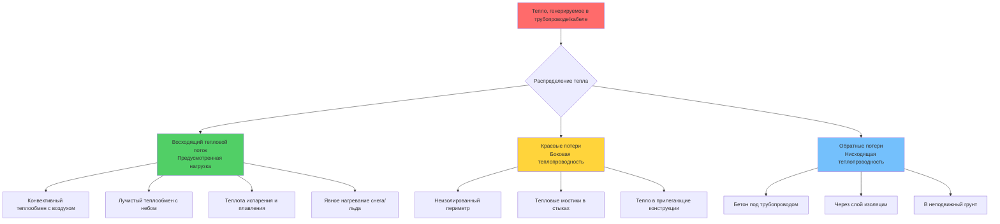

## Физические принципы теплопотерь

Системы таяния снега испытывают тепловые потери по нескольким путям, которые снижают тепловую эффективность и увеличивают эксплуатационные расходы. Понимание этих механизмов потерь с первых принципов позволяет правильно проектировать изоляцию и проводить точные расчеты нагрузок.

Тепло течет из областей с более высокой температурой в области с более низкой температурой в соответствии с законом Фурье. При установке системы таяния снега нагреваемая плита теряет энергию не только на снег (предусмотренную нагрузку), но и на окружающий грунт и прилегающие конструкции путем теплопроводности, на периметр через краевые эффекты и в атмосферу через края плиты.

## Краевые потери

Краевые потери возникают на периметре, где нагреваемая плита сопрягается с ненагреваемыми прилегающими поверхностями или завершается открытым краем. Это представляет собой тепловой мостик, где тепло проводится боком через бетон.

Краевая теплопотеря на единицу длины периметра рассчитывается как:

$$q_{edge} = \frac{(T_{slab} - T_{ambient}) \times k_{concrete} \times A_{edge}}{L_{path}}$$

Где:
- $q_{edge}$ = коэффициент краевых теплопотерь (Вт/м или кДж/ч·м)
- $T_{slab}$ = температура эксплуатации плиты (°C)
- $T_{ambient}$ = температура прилегающей поверхности или воздуха (°C)
- $k_{concrete}$ = коэффициент теплопроводности бетона (1,4 Вт/м·К)
- $A_{edge}$ = площадь поперечного сечения края плиты (м²)
- $L_{path}$ = длина пути потока тепла (м)

Для упрощенного проектного подхода с использованием линейной передачи тепла:

$$Q_{edge,total} = U_{edge} \times P \times (T_{slab} - T_{ambient})$$

Где:
- $Q_{edge,total}$ = общие краевые теплопотери (Вт)
- $U_{edge}$ = коэффициент краевой передачи тепла (Вт/м·К), обычно 0,5-1,5
- $P$ = общая длина периметра (м)

Коэффициент краевой передачи тепла зависит от толщины плиты, краевой изоляции и тепловых свойств прилегающих материалов. Неизолированные края могут терять 50-150 Вт/м при условиях проектирования.

## Обратные потери

Обратные потери представляют собой нисходящий поток тепла из плиты в грунт под ней. Этот тепловой поток вызван разностью температур между нижней поверхностью плиты и температурой неподвижного грунта.

Плотность обратных теплопотерь рассчитывается как:

$$q_{back} = \frac{T_{slab} - T_{ground}}{R_{total}}$$

Где:
- $q_{back}$ = плотность обратных теплопотерь (Вт/м² или кДж/ч·м²)
- $T_{ground}$ = температура неподвижного грунта (°C)
- $R_{total}$ = полное тепловое сопротивление слоев ниже трубопровода (м²·К/Вт)

Полное тепловое сопротивление включает бетон ниже трубопровода и любые слои изоляции:

$$R_{total} = R_{concrete,below} + R_{insulation} + R_{soil,effective}$$

Для бетона под трубопроводом:

$$R_{concrete,below} = \frac{d_{below}}{k_{concrete}}$$

Где $d_{below}$ — толщина бетона ниже центральной линии трубопровода.

Без изоляции обратные потери могут составлять 30-50% от общего теплоотдачи системы. Установка изоляции из экструдированного полистирола (ХПС) толщиной 5-10 см под плитой снижает обратные потери до менее 10% от общей мощности системы.

## Стратегии снижения теплопотерь

Эффективные стратегии изоляции значительно улучшают эффективность системы и снижают эксплуатационные расходы. Выбор стратегии зависит от типа установки, бюджета и требований к производительности.

| Стратегия | Снижение краевых потерь | Снижение обратных потерь | Типичное R-значение | Стоимость установки | Экономия за весь срок |
|----------|------------------------|------------------------|-----------------|-------------------|----------------------|
| Без изоляции (базовый уровень) | 0% | 0% | R-0 | Базовый уровень | Базовый уровень |
| Только краевая изоляция | 60-80% | 0% | R-0,9 до R-1,8 края | +5-10% | 15-25% |
| Только подплитная изоляция | 0% | 70-85% | R-1,8 до R-3,5 | +15-25% | 30-45% |
| Полный периметр и подплитная | 60-80% | 70-85% | R-1,8/R-3,5 | +20-35% | 45-60% |
| Усиленный пакет изоляции | 75-90% | 80-90% | R-2,6/R-5,3 | +30-50% | 55-70% |
| Изолированная граничная зона (0,9 м) | 40-60% | 40-60% | R-1,8/R-2,6 | +10-15% | 25-35% |

## Стандарты проектирования ASHRAE

ASHRAE Handbook - HVAC Applications Глава 51 предоставляет основную методологию расчета нагрузок при таянии снега, включая компоненты теплопотерь. Стандартный подход разделяет:

1. **Компоненты нагрузки таяния снега**: явное нагревание, скрытая теплота плавления, испарение
2. **Экологические потери**: лучеиспускание, конвекция
3. **Потери теплопроводностью**: обратные потери и краевые потери

Общая мощность системы должна учитывать все пути потерь:

$$Q_{total} = Q_{snow} + Q_{radiation} + Q_{convection} + Q_{evaporation} + Q_{back} + Q_{edge}$$

Стандарт рекомендует уровни изоляции на основе климатической зоны и часов работы системы. Для непрерывной работы в суровых климатических условиях подплитная изоляция R-2,6 до R-3,5 и краевая изоляция минимум R-1,8 указаны для поддержания приемлемой энергетической эффективности.

## Рекомендации по проектированию

**Глубина размещения изоляции**: Расположите изоляцию непосредственно под трубопроводом или кабелями обогрева, чтобы минимизировать массу бетона, который необходимо нагревать. Каждый дополнительный сантиметр бетона ниже нагревательного элемента увеличивает тепловую емкость и потенциал обратных потерь.

**Выполнение краевого узла**: Продлите вертикальную краевую изоляцию на полную глубину плиты и обеспечьте сплошное покрытие без зазоров. Тепловые мостики в строительных швах или в местах проникновений создают локализованные зоны с высокими теплопотерями.

**Устойчивость к влаге**: Используйте материалы закрытоячеистой изоляции (ХПС или полиизоциануратные), которые сохраняют R-значение при воздействии грунтовой влаги. Открытоячеистые или стекловолоконные изделия теряют тепловую производительность при насыщении.

**Вариация температуры грунта**: Температура неподвижного грунта варьируется в зависимости от глубины и сезона. Для систем с частой работой предположите, что грунт под ней достигает квазиустановившейся повышенной температуры на 3-6°C выше естественной температуры грунта, что снижает эффективную разность температур и обратные потери.

**Экономическая оптимизация**: Рассчитайте период окупаемости инвестиций в изоляцию, сравнивая надбавку к установленной стоимости с текущей стоимостью экономии энергии за 20-30 лет срока службы системы. В большинстве коммерческих приложений полная подплитная и краевая изоляция обеспечивает окупаемость в течение 3-7 лет за счет снижения эксплуатационных расходов.
