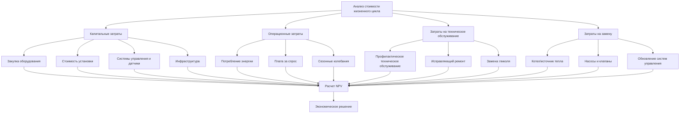

## Экономическая база для систем снеготаяния

Анализ стоимости жизненного цикла (LCC) обеспечивает фундаментальную экономическую базу для оценки инвестиций в системы снеготаяния и защиты от замерзания на протяжении их эксплуатационного периода. В отличие от простых сравнений первоначальной стоимости, анализ LCC учитывает временную стоимость денег, операционные расходы, требования к техническому обслуживанию и долговечность оборудования для определения истинной экономической эффективности.

Физика снеготаяния—требующая значительных энергозатрат для преодоления скрытой теплоты плавления (334 кДж/кг) и чувствительного нагрева—напрямую переводится в операционные затраты, которые обычно превышают первоначальные капиталовложения в течение 20-30 лет эксплуатации системы. Надлежащий экономический анализ должен отражать эти долгосрочные последствия.

## Компоненты стоимости жизненного цикла

### Капитальные вложения

Первоначальные капитальные затраты включают услуги проектирования, закупку оборудования, стоимость установки, трубопроводное или электрическое оборудование, системы управления и пуско-наладку. Для гидравлических систем расходы на котлы или теплообменники являются основными. Системы электрического сопротивления имеют более низкие затраты на установку, но более высокие операционные расходы из-за структуры цен на энергию.

Установленная стоимость на единицу площади варьируется значительно:

| Тип системы | Типовая установленная стоимость | Срок службы оборудования |
|-------------|----------------------------------|--------------------------|
| Гидравлическая (котел) | 1550-2600 €/м² | 20-25 лет |
| Гидравлическая (тепловой насос) | 1860-3100 €/м² | 15-20 лет |
| Электрическое сопротивление | 1030-1860 €/м² | 15-20 лет |
| Инфракрасное лучистое | 1240-2070 €/м² | 10-15 лет |

### Операционные затраты

Годовое потребление энергии определяет операционные расходы. Тепловой поток, необходимый для эффективного таяния снега при расчетных условиях (обычно 150-400 Вт/м² в зависимости от климата), умноженный на время работы и тарифы на энергию, определяет годовые затраты.

Для гидравлической системы с КПД котла $\eta_b$ годовая стоимость энергии составляет:

$$C_{annual} = \frac{Q_{required} \cdot t_{operation}}{\eta_b} \cdot c_{fuel}$$

где $Q_{required}$ — расчетный тепловой поток (Вт/м²), $t_{operation}$ — совокупное количество часов работы в сезон, а $c_{fuel}$ — стоимость единицы энергии.

Электрические системы сталкиваются с более высокими затратами на энергию из-за ценообразования на электроэнергию:

$$C_{electric} = Q_{required} \cdot A \cdot t_{operation} \cdot c_{electricity}$$

где $A$ — площадь отопления (м²) и $c_{electricity}$ — тариф на электроэнергию (€/кВт·ч).

### Техническое обслуживание и замена

Затраты на техническое обслуживание включают сезонный запуск/остановку, тестирование и замену гликоля (гидравлические системы), калибровку систем управления и мелкий ремонт. Годовое техническое обслуживание обычно составляет 1-3% от первоначальной стоимости капитала.

Графики замены оборудования должны быть включены в модели LCC. Котлы, теплообменники, насосы и системы управления имеют конечный срок службы, требующий капитальных переинвестиций.

## Анализ чистой текущей стоимости

Фундаментальной метрикой LCC является чистая текущая стоимость, которая дисконтирует все будущие затраты на эквивалент текущего дня, используя временную стоимость денег:

$$LCC = C_0 + \sum_{n=1}^{N} \frac{C_n}{(1+r)^n}$$

где:
- $C_0$ = первоначальное капитальное вложение (€)
- $C_n$ = затраты в году $n$, включая энергию, техническое обслуживание и замены (€)
- $r$ = ставка дисконтирования (обычно 3-8% реальная ставка)
- $N$ = период анализа (лет, обычно 20-30)

Ставка дисконтирования отражает альтернативную стоимость капитала и риск. Более высокие ставки дисконтирования благоприятствуют системам с низкой первоначальной стоимостью и более высокими операционными расходами, тогда как более низкие ставки благоприятствуют эффективным системам с более высокими капитальными затратами.

## Методология экономического сравнения

### Эквивалентная годовая стоимость

Для сравнения систем с различными сроками эксплуатации эквивалентная годовая стоимость (EAC) нормализирует LCC на годовой основе:

$$EAC = \frac{LCC \cdot r}{1-(1+r)^{-N}}$$

Эта метрика обеспечивает прямое сравнение капиталоемких и операционно-интенсивных альтернатив.

### Простой период окупаемости

Простой период окупаемости, хотя и игнорирует временную стоимость денег, обеспечивает интуитивное понимание:

$$PBP = \frac{\Delta C_0}{\Delta C_{annual}}$$

где $\Delta C_0$ — дополнительная капитальная стоимость эффективного варианта и $\Delta C_{annual}$ — годовая экономия операционных затрат.

Для систем снеготаяния периоды окупаемости, сравнивающие высокоэффективное и стандартное оборудование, обычно составляют 5-12 лет в зависимости от суровости климата и стоимости энергии.

## Сравнение стоимости жизненного цикла системы

## Стратегии оптимизации

### Влияние стратегии управления

Продвинутые стратегии управления значительно влияют на LCC путем снижения ненужной работы. Управление обратной связью по температуре плиты может снизить потребление энергии на 30-50% по сравнению с простым обнаружением снега, что значительно улучшает долгосрочную экономику, несмотря на более высокие первоначальные затраты на систему управления.

Преимущество NPV продвинутого управления в течение 20-летнего периода с ставкой дисконтирования 5%:

$$NPV_{control} = -\Delta C_{control} + \sum_{n=1}^{20} \frac{S_{annual}}{(1.05)^n}$$

где $\Delta C_{control}$ — дополнительная стоимость системы управления и $S_{annual}$ — годовая экономия энергии.

### Выбор источника энергии

Выбор источника энергии в основном определяет операционные затраты. Гидравлические системы, работающие на природном газе, обычно предлагают самый низкий LCC в регионах с сильными снежными нагрузками и умеренным ценообразованием газа. Системы с тепловыми насосами могут оптимизировать LCC в умеренном климате с коэффициентом соотношения цен электричества и газа, превышающим 3:1.

Системы электрического сопротивления редко достигают конкурентного LCC, кроме как для небольших площадей (< 50 м²), где экономия на капитальных затратах компенсирует операционные потери.

### Зонирование и ступенчатость

Разделение больших площадей на независимо управляемые зоны снижает требуемый средний тепловой поток за счет нацеливания на критические пути, позволяя вторичным областям работать с пониженной мощностью. Эта стратегия зонирования может снизить 20-летний LCC на 15-25% для парковок и больших пешеходных сетей.

## Анализ чувствительности

Результаты LCC чувствительны к ключевым предположениям, включая эскалацию цен на энергию, ставку дисконтирования и суровость климата. Волатильность цен на энергию вводит неопределенность; анализ чувствительности должен оценить LCC в диапазоне ставок эскалации (0-5% годовое реальное увеличение), чтобы оценить надежность инвестиций.

Прогнозы изменения климата предполагают снижение снежных нагрузок во многих регионах, что может снизить операционные затраты, но также может поставить под сомнение обоснованность инвестиций. Экономические модели должны включать сценарии, отражающие климатическую неопределенность в течение горизонта анализа 20-30 лет.

## Структура принятия экономических решений

| Фактор решения | Высокий приоритет LCC | Низкий приоритет LCC |
|----------------|----------------------|----------------------|
| Первоначальный бюджет | Ограниченный | Гибкий |
| Стоимость энергии | Высокая (>0,12 €/кВт·ч) | Низкая (<0,08 €/кВт·ч) |
| Интенсивность использования | Непрерывная работа | Периодическая работа |
| Возможность техобслуживания | Собственный опыт | Ограниченные ресурсы |
| Срок эксплуатации системы | >20 лет | <15 лет |

Здоровый экономический анализ требует прозрачных предположений, комплексного учета затрат и реалистичных операционных прогнозов. Анализ стоимости жизненного цикла преобразует выбор системы снеготаяния из решения, основанного на первоначальной стоимости, в стратегическую оптимизацию инвестиций, согласованную с долгосрочной экономикой объекта.
