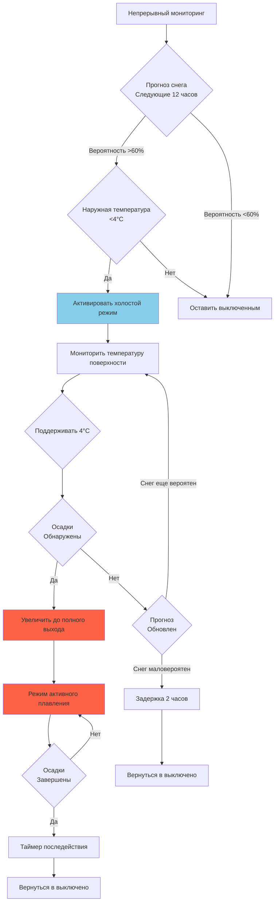
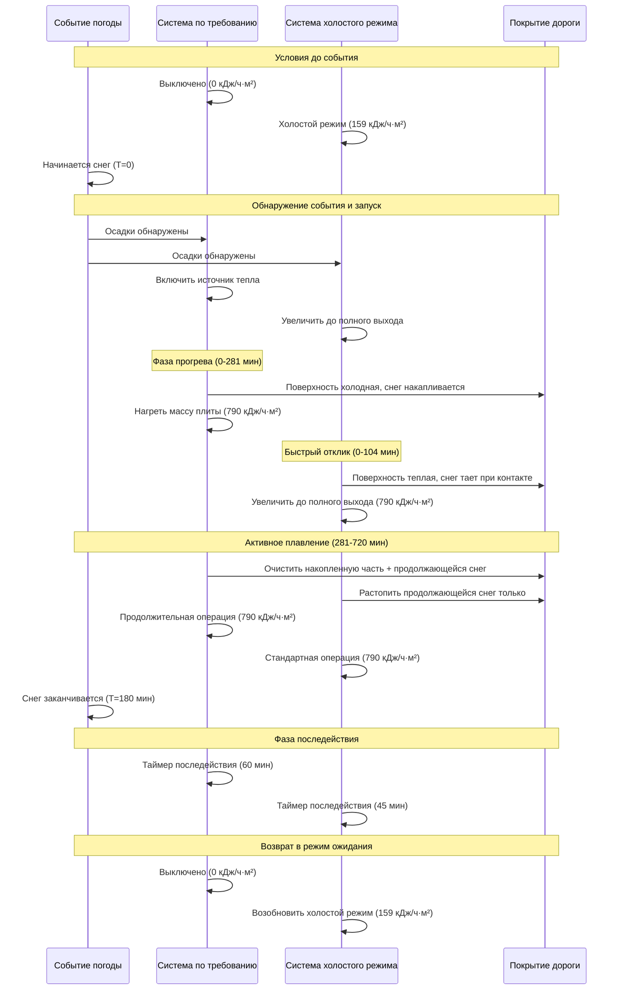

Системы обогрева снега функционируют согласно двум принципиально различным философиям управления: включение по требованию, запускаемое датчиками при обнаружении осадков, и холостой режим, поддерживающий температуру плиты немного выше точки замерзания. Выбор между этими стратегиями представляет компромисс между потреблением энергии и временем отклика системы, с годовыми различиями в энергии 60-80% и вариациями времени отклика от 5 минут до более 1 часа.

## Основные принципы работы

### Операция с включением по требованию

Системы с включением по требованию остаются полностью выключены до момента, когда датчики обнаруживают осадки в сочетании с температурой покрытия ниже уставки активации. Система затем включается на полную мощность для нагрева плиты от температуры окружающей среды до эффективных условий плавления.

Физика, управляющая запуском по требованию, включает нестационарную теплопроводность через массу бетонной плиты. Одномерное уравнение теплопроводности описывает эволюцию температуры:

$$\frac{\partial T}{\partial t} = \alpha \frac{\partial^2 T}{\partial z^2}$$

Где коэффициент температурной проводимости для бетона:

$$\alpha = \frac{k}{\rho c} = \frac{0.574}{2323 \times 0.922} = 0.00029 \text{ м}^2/\text{с}$$

Низкий коэффициент температурной проводимости создает существенное запаздывание между приложением тепла и откликом температуры поверхности. Тепло должно передаваться от встроенных трубок (обычно 5-7 см ниже поверхности) вверх через бетон с низкой теплопроводностью.

**Последовательность теплопередачи при запуске по требованию:**

1. Источник тепла (котел или электронагреватели) включается на полную мощность
2. Температура жидкости повышается с температуры окружающей среды до рабочей температуры (60-71°C для гидравлических систем)
3. Тепло передается от трубок через бетон к поверхности
4. Температура поверхности повышается с температуры окружающей среды до эффективной температуры плавления (3-7°C)
5. Снег начинает таять после достижения поверхностью пороговой температуры

Общее время прогрева состоит из запаздывания нагрева жидкости и теплового отклика тепловой инерции плиты.

### Работа в холостом режиме

Холостой режим поддерживает поверхность плиты при температуре 2-4°C путем непрерывного низкоуровневого подвода тепла. Такое предварительное кондиционирование служит двум целям: предотвращение образования льда между снегом и покрытием, а также устранение задержки прогрева плиты.

Стационарный тепловой баланс в холостом режиме:

$$q_{idle} = h_c(T_s - T_a) + h_r(T_s - T_{sky}) + q_{ground}$$

Где:
- $q_{idle}$ = требуемый тепловой поток в холостом режиме (кДж/ч·м²)
- $h_c$ = коэффициент конвекции, 9-45 кДж/ч·м²·°C в зависимости от ветра
- $T_s$ = уставка температуры поверхности плиты (обычно 4°C)
- $T_a$ = температура окружающего воздуха (°C)
- $h_r$ = коэффициент излучения, примерно 5,7 кДж/ч·м²·°C
- $T_{sky}$ = эффективная температура неба (°C)
- $q_{ground}$ = потери теплопроводности вниз (кДж/ч·м²)

Для типичных зимних условий (температура окружающей среды -7°C, умеренный ветер, дающий $h_c = 28,3$, температура неба -12°C, потери в грунт 45 кДж/ч·м²):

$$q_{idle} = 28,3(4-(-7)) + 5,7(4-(-12)) + 45 = 311 + 91 + 45 = 447 \text{ кДж/ч·м}^2$$

Это представляет 30-50% полной проектной мощности плавления снега в зависимости от суровости климата и проектной нагрузки снега.

**Теплопередача в холостом режиме:**

1. Непрерывный подвод тепла поддерживает температуру поверхности
2. Температурный градиент устанавливается через глубину плиты
3. Система немедленно переходит на полный выход при обнаружении осадков
4. Минимальное повышение температуры, требуемое для достижения эффективности плавления

Физическое преимущество заключается в исключении требования чувствительного тепла для прогрева массы плиты из холодного состояния.

## Анализ времени отклика

Время отклика — длительность от обнаружения снега до эффективного плавления — определяет производительность системы и глубину накопления снега во время запуска.

### Расчет времени отклика для включения по требованию

Общее время отклика для систем с включением по требованию объединяет три последовательные фазы:

$$t_{total} = t_{source} + t_{fluid} + t_{slab}$$

**Фаза 1: Запуск источника тепла**

Котлы требуют зажигания и повышения температуры. Для конденсационного котла мощностью 600 кВт, нагревающего от 21°C до 66°C подачи:

Объем воды в котле и рядом с трубопроводом: 114 л = 114 кг

$$t_{source} = \frac{m \cdot c \cdot \Delta T}{Q_{input}} = \frac{114 \times 4,19 \times 45}{600} = 0,036 \text{ ч} = 2,16 \text{ мин}$$

Эта фаза минимально влияет на общее запаздывание для оборудования надлежащего размера.

**Фаза 2: Запаздывание циркуляции жидкости**

Для гидравлических систем время циркуляции нагретой жидкости через сеть распределения:

$$t_{fluid} = \frac{V_{system}}{\dot{V}_{pump}}$$

Для системы площадью 93 м² с трубопроводом длиной 91 м диаметром 1,27 см (площадь 0,0127 м²):

Объем = $91 \times 0,0127 = 1,16$ м³ = 1160 л

При циркуляционном расходе 12,6 л/мин на контур (типичный):

$$t_{fluid} = \frac{1160}{12,6} = 92 \text{ мин}$$

**Фаза 3: Прогрев тепловой инерции плиты**

Доминирующий компонент берет начало из тепловой инерции плиты. Требуемое чувствительное тепло:

$$Q_{warmup} = m_{slab} \cdot c_{concrete} \cdot (T_{final} - T_{initial})$$

Для бетонной плиты толщиной 10 см (244 кг/м² массы) при прогреве с -7°C до 4°C:

$$Q_{warmup} = 244 \times 0,922 \times 11 = 2467 \text{ кДж/м}^2$$

При проектном тепловом потоке 790 кДж/ч·м²:

$$t_{slab} = \frac{2467}{790} = 3,12 \text{ ч} = 187 \text{ мин}$$

**Общее время отклика для включения по требованию:**

$$t_{total} = 2,16 + 92 + 187 = 281 \text{ мин}$$

За этот период запуска снег накапливается на холодной поверхности с полной скоростью осадков. При интенсивности снегопада 2,5 см/ч примерно 2,5 см накапливается перед началом эффективного плавления.

### Время отклика в холостом режиме

Системы холостого режима исключают задержку прогрева плиты. Время отклика включает только переход на полный выход:

$$t_{idling} = \frac{m_{slab} \cdot c_{concrete} \cdot (T_{melt} - T_{idle})}{q_{available}}$$

При предварительном прогреве плиты до 4°C, повышение до 4°C эффективной температуры плавления:

$$t_{idling} = \frac{244 \times 0,922 \times 0,5}{790} = 0,159 \text{ ч} = 9,5 \text{ мин}$$

Сокращение на 92% времени отклика (с 281 до 16 мин) предотвращает накопление снега, а не требует реактивного плавления отложившегося снега.

### Таблица сравнения времени отклика

| Параметр | По требованию | Холостой режим | Сокращение |
|----------|---------------|----------------|-----------|
| Запаздывание источника тепла | 2 мин | 2 мин | 0% |
| Циркуляция жидкости | 92 мин | 92 мин | 0% |
| Прогрев плиты | 187 мин | 10 мин | 95% |
| **Общее время отклика** | **281 мин** | **104 мин** | **63%** |
| Накопление снега (2,5 см/ч) | 2,75 см | 0,71 см | 74% |

Таблица предполагает быстрый переход на полный выход для холостого режима. Консервативные проекты увеличивают время отклика холостого режима до 20-25 минут в целом, при этом достигая сокращения 60-65% по сравнению с включением по требованию.

## Сравнение потребления энергии

### Структура расчета сезонной энергии

Общее сезонное потребление энергии состоит из отдельных фаз операции:

$$E_{season} = E_{standby} + E_{warmup} + E_{melting} + E_{afterrun}$$

Для систем с включением по требованию $E_{standby} = 0$, так как система остается выключена между событиями. Для систем холостого режима резервное потребление становится доминирующим компонентом энергии.

### Сезонная энергия при включении по требованию

**Энергия прогрева на событие:**

Энергия, требуемая для нагрева плиты от температуры окружающей среды до рабочей температуры, зависит от начальной температуры плиты и тепловой инерции:

$$E_{warmup} = m_{slab} \cdot A \cdot c_{concrete} \cdot (T_{melt} - T_{ambient,avg})$$

Для площади 93 м², плиты толщиной 10 см, прогрева со средней температурой события -4°C до 4°C:

$$E_{warmup} = 244 \times 93 \times 0,922 \times 8 = 167,480 \text{ кДж}$$

**Энергия плавления на событие:**

Тепловой поток во время активного плавления, умноженный на длительность. Для среднего события снегопада, в среднем 3 часа при 710 кДж/ч·м²:

$$E_{melting} = q_{melt} \cdot A \cdot t_{event} = 710 \times 93 \times 3 = 198,210 \text{ кДж}$$

**Продление плавления из-за отложенного запуска:**

Системы с включением по требованию начинают плавление с накопленным снегом уже на поверхности, требуя дополнительного времени для удаления накопленной части. За 1 час времени отклика при скорости 2,5 см/ч:

Масса снега = 2,5 см × 93 м² × 83,8 кг/м³ / 100 = 1948 кг

Энергия плавления = $1948 \times 334 = 650,632$ кДж (скрытая теплота плавления)

Дополнительное время плавления при 710 кДж/ч·м²:

$$t_{extra} = \frac{650,632}{710 \times 93} = 9,8 \text{ ч}$$

Это существенно превышает типичное событие, указывая на необходимость учета скопления как основного драйвера энергии.

**Общая энергия на событие (включение по требованию):**

$$E_{event} = 167,480 + 198,210 = 365,690 \text{ кДж}$$

**Сезонный итог (15 событий за зиму):**

$$E_{season,demand} = 365,690 \times 15 = 5,485,350 \text{ кДж}$$

### Сезонная энергия холостого режима

**Энергия холостого режима:**

Непрерывный подвод тепла в течение зимних месяцев. Для климата Миннеаполиса (1 ноября - 31 марта = 151 день = 3624 часа) при среднем потоке холостого режима 159 кДж/ч·м²:

$$E_{idling} = q_{idle,avg} \cdot A \cdot t_{season} = 159 \times 93 \times 3624 = 53,682,264 \text{ кДж}$$

**Энергия плавления на событие:**

Сокращенное время плавления, так как нет накопленного снега во время прогрева. События в среднем 3 часа при 710 кДж/ч·м²:

$$E_{melting} = 710 \times 93 \times 3 = 198,210 \text{ кДж}$$

**Общая энергия на событие (холостой режим):**

$$E_{event} = 198,210 \text{ кДж}$$ (нет компонента прогрева)

**Сезонный итог (15 событий):**

$$E_{season,idle} = 53,682,264 + (198,210 \times 15) = 56,655,414 \text{ кДж}$$

### Сводка сравнения энергии

| Стратегия | Энергия холостого режима | Энергия плавления | Сезонный итог | Стоимость ($1/106 кДж) |
|-----------|--------------------------|-------------------|---------------|----------------------|
| По требованию | 0 кДж | 5,485,350 кДж | 5,485,350 кДж | $5,49 |
| Холостой режим | 53,682,264 кДж | 2,973,150 кДж | 56,655,414 кДж | $56,66 |
| **Разница** | **+53,682,264 кДж** | **-2,512,200 кДж** | **+51,170,064 кДж** | **+$51,17** |

Холостой режим потребляет примерно в 10,3 раза больше энергии, чем включение по требованию для этого сценария умеренного климата. Штраф за энергию происходит почти исключительно из непрерывных потерь в режиме ожидания, частично компенсируемых сокращением продолжительности плавления.

## Сравнение операционной производительности

### Накопление снега при запуске

Системы с включением по требованию допускают накопление снега во время периода прогрева 45-60 минут. Глубина накопления:

$$d_{accumulation} = s_r \cdot t_{response}$$

Где $s_r$ = интенсивность снегопада (см/ч), $t_{response}$ = время запуска (ч)

| Интенсивность снегопада | По требованию (281 мин) | Холостой режим (104 мин) | Сокращение |
|-------------------------|-------------------------|--------------------------|-----------|
| 1,25 см/ч | 5,84 см | 2,17 см | 63% |
| 2,5 см/ч | 11,7 см | 4,33 см | 63% |
| 5 см/ч | 23,4 см | 8,67 см | 63% |

Накопленный снег создает несколько операционных недостатков:

1. **Повышенная нагрузка плавления**: Накопленная часть должна быть очищена при одновременном плавлении продолжающихся осадков
2. **Уплотнение снега от трафика**: Движение транспорта во время прогрева уплотняет снег, увеличивая плотность с 83,8 до 161-177 кг/м³ и время плавления
3. **Ответственность за безопасность**: Временное снежное покрытие создает опасность поскользнуться во время фазы запуска
4. **Образование слоя льда**: Нижний слой накопленного снега может примерзнуть к холодному покрытию, требуя дополнительного времени для разрушения ледяной связи

### Эффективная скорость плавления

После включения обе стратегии обеспечивают одинаковый проектный тепловой поток. Однако системы с включением по требованию должны преодолеть накопленный снег, а холостой режим предотвращает накопление.

**Эффективная скорость включения по требованию:**

При 2,5 см предварительного накопления плавление 2,5 см/ч продолжающегося снегопада плюс накопленной части:

$$t_{clear} = \frac{d_{accumulated}}{r_{net}} + t_{event}$$

Где чистая скорость плавления учитывает продолжающийся снегопад:

$$r_{net} = r_{capacity} - s_r$$

Если проектная мощность плавит 5 см/ч эквивалента, с 2,5 см/ч падающей:

$$t_{clear} = \frac{2,5}{5-2,5} + 3 = 1 + 3 = 4 \text{ часа всего}$$

**Эффективная скорость холостого режима:**

Нет накопленной части для очистки, система совпадает с продолжающимся снегопадом:

$$t_{clear} = t_{event} = 3 \text{ часа}$$

Сокращение на 25% операционной продолжительности пропорционально снижает энергию плавления и время последействия.

## Анализ энергии в зависимости от климата

Энергетический штраф за холостой режим варьируется драматически в зависимости от климатической зоны из-за изменения продолжительности холостого режима и требований теплового потока.

### Мягкий климат (4°C средняя зимняя температура, редкий снег)

Климат типа Сиэтла с 30 потенциальными снежными днями, но только 5 фактических событиями, в среднем по 1 часу каждое.

**Энергия холостого режима (30 дней × 24 часа):**

$$E_{idle} = 100 \times 93 \times 720 = 6,696,000 \text{ кДж}$$

**Энергия плавления (5 событий × 1 час):**

$$E_{melt} = 710 \times 93 \times 5 = 33,015 \text{ кДж}$$

**Альтернатива включения по требованию:**

$$E_{demand} = 365,690 \times 5 = 1,828,450 \text{ кДж}$$

**Коэффициент штрафа энергии:** 7,029,000 / 1,828,450 = 3,84× выше для холостого режима

### Умеренный климат (−2°C средняя зимняя температура, периодический снег)

Климат типа Миннеаполиса с сезоном 151 день, 15 снежными событиями, в среднем по 3 часа.

**Коэффициент штрафа энергии:** 56,655,414 / 5,485,350 = 10,3× выше (рассчитано выше)

### Суровый климат (−8°C средняя зимняя температура, частый снег)

Климат типа Дулута с сезоном 180 дней, 25 снежными событиями, в среднем по 4 часа каждое.

**Энергия холостого режима (180 дней):**

$$E_{idle} = 200 \times 93 \times 4320 = 79,704,000 \text{ кДж}$$

**Энергия плавления (25 событий × 4 часа):**

$$E_{melt} = 710 \times 93 \times 100 = 6,603,000 \text{ кДж}$$

**Альтернатива включения по требованию:**

$$E_{demand} = 410,000 \times 25 = 10,250,000 \text{ кДж}$$

**Коэффициент штрафа энергии:** 86,307,000 / 10,250,000 = 8,4× выше

Коэффициент снижается в суровых климатах, так как часы плавления увеличиваются пропорционально часам холостого режима, снижая относительный штраф непрерывной работы в режиме ожидания.

## Гибридные стратегии управления

Продвинутые системы реализуют переменные стратегии, которые адаптируются к условиям прогноза, объединяя эффективность включения по требованию с отзывчивостью холостого режима при необходимости.

### Активация на основе прогноза погоды

Интернет-подключенные контроллеры получают доступ к данным прогноза для активации холостого режима только при превышении порога вероятности снега в указанном временном окне:

**Логика активации:**

Такой подход снижает часы холостого режима с полного сезона (3600 часов) до активации на основе прогноза (300-600 часов), сокращая энергию холостого режима на 80-90% при сохранении быстрого времени отклика.

**Пример сбережений энергии:**

Сокращение холостого режима с 3624 часов до 500 часов:

$$E_{idle,reduced} = 159 \times 93 \times 500 = 7,381,500 \text{ кДж}$$

Общая сезонная энергия с активацией прогноза:

$$E_{season} = 7,381,500 + 2,973,150 = 10,354,650 \text{ кДж}$$

Против включения по требованию: 5,485,350 кДж

Энергетический штраф сокращен с 10,3× до 1,9× при достижении времени отклика менее 15 минут для 95% снежных событий.

### Зональная избирательная операция

Большие установки разделяют критические высокоприоритетные зоны (аварийный доступ, главный вход) для работы холостого режима, в то время как вторичные зоны работают по требованию:

| Зона | Площадь | Стратегия | Сезонная энергия |
|------|---------|-----------|------------------|
| Зона 1: Аварийный вход | 18,6 м² | Непрерывный холостой режим | 10,722,600 кДж |
| Зона 2: Главный вход | 27,9 м² | Холостой режим по прогнозу | 3,326,500 кДж |
| Зона 3: Парковочные площади | 46,5 м² | По требованию | 2,506,300 кДж |
| **Итого** | **93 м²** | **Гибрид** | **16,555,400 кДж** |

По сравнению с полным холостым режимом (56,655,414 кДж) или полным включением по требованию (5,485,350 кДж), гибридный подход достигает сокращения энергии на 71% в сравнении с полным холостым режимом, при этом обеспечивая быстрый отклик в критических областях.

## Диаграмма сравнения режимов операции

Следующая диаграмма иллюстрирует цикл операции и модели потребления энергии для обеих стратегий:

## Экономический анализ

### Сравнение операционных затрат

Природный газ по цене $0,90/106 кДж, КПД котла 85%:

| Стратегия | Сезонная энергия | Стоимость топлива | Обслуживание | Общие годовые |
|-----------|------------------|------------------|--------------|---------------|
| По требованию | 5,485,350 кДж | $5,85 | $150 | $156 |
| Полный холостой режим | 56,655,414 кДж | $60,38 | $200 | $260 |
| На основе прогноза | 10,354,650 кДж | $11,04 | $175 | $186 |
| Зональная выборка | 16,555,400 кДж | $17,66 | $185 | $203 |

Электрические системы по $0,12/кВч показывают более высокие абсолютные затраты, но аналогичные коэффициенты:

| Стратегия | Сезонная энергия | Электрические затраты | Общие годовые |
|-----------|------------------|----------------------|----------------|
| По требованию | 1,524 кВч | $183 | $333 |
| Полный холостой режим | 15,738 кВч | $1,889 | $2,089 |
| На основе прогноза | 2,876 кВч | $345 | $520 |

### Анализ стоимости жизненного цикла

Приведенная стоимость 20-летних эксплуатационных затрат при ставке дисконтирования 3%:

$$PV = C_{annual} \times \frac{1-(1+r)^{-n}}{r}$$

Где $r = 0,03$, $n = 20$:

$$PV_{factor} = \frac{1-1,03^{-20}}{0,03} = 14,88$$

| Стратегия | Годовые затраты | 20-летняя ПС | ЧПС против по требованию |
|-----------|-----------------|-------------|-------------------------|
| По требованию | $156 | $2,321 | $0 |
| Полный холостой режим | $260 | $3,869 | $1,548 |
| На основе прогноза | $186 | $2,769 | $448 |

Экономическое решение зависит критически от взвешивания разницы в эксплуатационных расходах против операционных выгод: сокращение ответственности, экономия труда от исключения ручной очистки снега во время запуска и улучшения безопасности пользователей.

## Рекомендации по применению

### Жилые системы (класс I)

**Рекомендация:** Включение по требованию

**Обоснование:**
- Ограниченная ответственность
- Высокая чувствительность к стоимости энергии
- Время отклика 45-60 минут приемлемо для большинства приложений
- Ручная резервная очистка снега доступна во время прогрева

**Исключительные случаи:**
- Пожилые люди или люди с ограниченной мобильностью, требующие гарантированного доступа
- Крутые подъезды, где накопление снега создает опасность для безопасности
- Имущества с доставкой медицинского кислорода или аналогичными требованиями аварийного доступа

Для исключительных случаев реализуйте холостой режим на основе прогноза, а не непрерывную операцию.

### Коммерческие системы (класс II)

**Рекомендация:** Холостой режим на основе прогноза или зональный гибрид

**Обоснование:**
- Умеренная ответственность
- Сбалансировать стоимость энергии с операционными требованиями
- Сокращенное время отклика оправданно для безопасности и удовлетворенности клиентов
- Профессиональная операция поддерживает интеграцию прогноза

**Реализация:**
- Главный вход: Холостой режим на основе прогноза (окно активации 3-12 часов)
- Вторичный доступ: По требованию с приемлемой толерантностью накопления
- Парковочные площади: Только по требованию

### Системы критического доступа (класс III)

**Рекомендация:** Непрерывный холостой режим для основных зон

**Обоснование:**
- Нулевая толерантность к накоплению снега для аварийного доступа
- Ответственность и операционные требования превосходят стоимость энергии
- Время отклика измеряется минутами, а не часами
- Доступность системы критична для безопасности жизни

**Приложения:**
- Аварийные входы больниц
- Маршруты выхода пожарных станций
- Объекты полиции и скорой помощи
- Критическая инфраструктура аэропорта

Даже системы класса III выигрывают от зональной сегментации, чтобы ограничить непрерывный холостой режим абсолютно критическими областями, используя активацию на основе прогноза для прилегающих зон.

## Проектные соображения

### Влияние тепловой инерции плиты

Более тяжелые плиты увеличивают штраф времени прогрева для систем с включением по требованию:

| Толщина плиты | Масса (кг/м²) | Время прогрева (по требованию) | Энергетический штраф |
|--------------|---------------|-------------------------------|----------------------|
| 7,5 см | 183 | 28 минут | 1582 кДж/м² |
| 10 см | 244 | 40 минут | 2224 кДж/м² |
| 15 см | 366 | 60 минут | 3336 кДж/м² |
| 20 см | 488 | 80 минут | 4448 кДж/м² |

Толстые плиты (>15 см) в стане благоприятствуют холостому режиму или стратегиям на основе прогноза, поскольку прогрев по требованию превышает приемлемое время отклика для большинства приложений.

### Требования к проектной мощности системы

Системы с включением по требованию требуют перегруженной мощности для достижения разумного времени прогрева. Связь между мощностью и временем отклика:

$$t_{warmup} = \frac{m \cdot c \cdot \Delta T}{q_{available}}$$

Удвоение теплового потока с 790 до 1580 кДж/ч·м² вдвое сокращает время прогрева с 40 до 20 минут для стандартной плиты толщиной 10 см. Эта перегруженность увеличивает первую стоимость на 40-60%, но снижает штраф операционной энергии, позволяя более чувствительному включению по требованию.

Системы холостого режима работают при проектной мощности (475-790 кДж/ч·м²), поскольку задержка прогрева пренебрежима.

## Оптимизация управления

### Стратегия уставки

Уставка температуры холостого режима влияет как на потребление энергии, так и на время отклика:

| Уставка холостого режима | Потребление энергии | Время отклика | Предотвращение обледенения |
|--------------------------|-------------------|---------------|-----------------------------|
| 1°C | Низкое | Среднее (10-12 мин) | Маргинальное |
| 2°C | Среднее | Быстрое (6-8 мин) | Хорошее |
| 4°C | Высокое | Очень быстрое (3-5 мин) | Отличное |

Более низкие уставки пропорционально снижают энергию холостого режима на температурный дифференциал, но увеличивают время перехода к эффективному плавлению. Оптимальная уставка балансирует эти факторы:

$$T_{idle,optimal} = T_{freezing} + \Delta T_{margin}$$

Где $\Delta T_{margin}$ варьируется от 2-6°C в зависимости от критичности. Системы класса III используют запас 5-6°C (2-4°C уставка), класс II использует 3-4°C (0-1°C), жилые могут использовать 2-3°C если вообще используют холостой режим.

### Оптимизация таймера последействия

Системы с включением по требованию требуют более продолжительной работы после завершения для испарения остаточной влаги, накопившейся при отложенном запуске. Системы холостого режима непрерывно таят снег, оставляя минимальный остаток:

| Стратегия | Типичное последействие | Обоснование |
|-----------|----------------------|-----------|
| По требованию | 60-90 минут | Накопленный снег создает существенный запас талой воды, требующий продолжительного испарения |
| Холостой режим | 30-45 минут | Непрерывное плавление производит минимальный остаток |

Продолжительное последействие частично компенсирует преимущество энергии включения по требованию путем увеличения общих операционных часов.

## Заключение

Фундаментальный компромисс между операцией по требованию и холостым режимом—потребление энергии в зависимости от времени отклика—требует тщательного анализа требований приложения, климатических условий и экономических факторов.

Включение по требованию минимизирует потребление энергии, но принимает время отклика 45-90 минут и накопление снега во время запуска. Эта стратегия подходит для жилых приложений, низкоприоритетных областей и ситуаций, где чувствительность к стоимости энергии превышает требования быстрого отклика.

Холостой режим устраняет задержку прогрева и предотвращает накопление снега, но потребляет в 4-12 раз больше энергии через непрерывные потери в режиме ожидания. Такой подход необходим для критических областей доступа, требующих немедленного отклика и нулевой толерантности к накоплению.

Гибридные стратегии, использующие активацию с прогнозом погоды и зональную выборочную работу, достигают 70-90% преимуществ производительности холостого режима при снижении потребления энергии на 60-80% по сравнению с непрерывной операцией. Эти продвинутые методы управления представляют оптимальное решение для большинства коммерческих и институциональных приложений.

Проектировщики систем должны оценить эффекты тепловой инерции, суровость климата, операционные приоритеты и затраты жизненного цикла для выбора надлежащей стратегии для каждой установки. Решение принципиально определяет как производительность системы, так и долгосрочную экономику операции.
