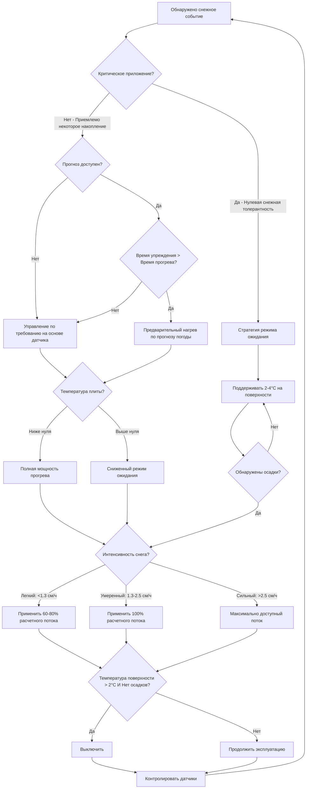

Выбор стратегии эксплуатации в фундаментальном плане определяет профиль потребления энергии и экономическую жизнеспособность систем таяния снега. Подход управления определяет, когда начинается подача тепла, с какой интенсивностью и на какую продолжительность, что прямо влияет как на годовые расходы на эксплуатацию, так и на эффективность системы. Три различные стратегии доминируют в текущей практике, каждая отражая различные приоритеты оптимизации и допусти устойчивость к рискам.

## Физическая основа выбора стратегии эксплуатации

Энергетический баланс для плиты таяния снега во время осадков устанавливает связь между тепловым вводом, потерями тепла в окружающую среду и емкостью плавления:

$$q_{total} = q_{snow} + q_{sensible} + q_{evap} + q_{conv} + q_{rad} + q_{cond}$$

Где:
- $q_{snow}$ = скрытая теплота плавления снега (152 кДж/кг при 0°C)
- $q_{sensible}$ = теплота для повышения температуры талой воды со льда до температуры поверхности
- $q_{evap}$ = потери на испарение с водяной пленки на поверхности плиты
- $q_{conv}$ = конвективный теплообмен с окружающим воздухом
- $q_{rad}$ = радиационный обмен с небом и окружением
- $q_{cond}$ = проводимость вниз через плиту и грунт

Стратегия эксплуатации определяет временное распределение этого теплового ввода. Системы по требованию минимизируют общую энергию путем работы только во время осадков, принимая период прогрева, во время которого температура плиты повышается от окружающей к эффективности плавления. Системы в режиме ожидания поддерживают повышенную температуру плиты непрерывно, устраняя штраф энергии на прогрев, но несут постоянные потери в режиме ожидания.

## Расчет энергии прогрева

Энергия, необходимая для повышения температуры плиты от окружающей до рабочих условий, определяет эффективность стратегий по требованию:

$$Q_{warmup} = A_s \cdot \rho_c \cdot c_c \cdot d \cdot (T_{op} - T_{amb}) + Q_{losses}$$

Где:
- $A_s$ = площадь плиты (м²)
- $\rho_c$ = плотность бетона (2320 кг/м³ типично)
- $c_c$ = удельная теплота бетона (0.92 кДж/кг·°C)
- $d$ = эффективная тепловая глубина (типично 0.10-0.15 м)
- $T_{op}$ = температура поверхности в режиме эксплуатации (типично 3-7°C)
- $T_{amb}$ = начальная температура окружающей среды плиты (°C)
- $Q_{losses}$ = потери тепла в период прогрева

Постоянная времени прогрева зависит от емкости теплового потока и тепловой массы:

$$\tau = \frac{\rho_c \cdot c_c \cdot d}{q_{applied} / \Delta T}$$

Для плиты толщиной 100 мм (0.10 м) с приложенным тепловым потоком 473 Вт/м² и повышением температуры 22°C:

$$\tau = \frac{2320 \times 920 \times 0.10}{473 / 22} = 2.8 \text{ часов до 63% от конечной температуры}$$

Эта тепловая задержка создает фундаментальный компромисс между потреблением энергии (благоприятствуя управлению по требованию) и немедленному отклику (благоприятствуя режиму ожидания).

## Дерево решений стратегии эксплуатации

## Сравнение режимов эксплуатации

| Стратегия | Годовые часы эксплуатации | Потребление энергии | Задержка прогрева | Риск накопления снега | Оптимальное применение |
|----------|----------------------|-------------------|---------------|----------------------|------------------|
| **Управление по требованию датчика** | 150-300 ч | **Базовое значение** (1.0x) | 30-90 мин | Среднее (3-8 см во время прогрева) | Жилые подъезды, некритичные пути |
| **Прогноз погоды** | 180-350 ч | 1.1-1.3x | 0-30 мин | Низкое (0-3 см во время прогрева) | Коммерческие объекты с персоналом наблюдения |
| **Режим ожидания (весь сезон)** | 2000-3000 ч | 5.0-12.0x | Нет | Минимальное (немедленный отклик) | Аварийный доступ в больницы, вертодромы |
| **Режим ожидания (только снежные дни)** | 400-800 ч | 1.8-3.5x | Нет | Минимальное | Высокоценный коммерческий объект, критические проходы |
| **Ручное управление** | Переменная | 1.2-2.0x | 30-120 мин | Высокое (зависит от оператора) | Обслуживаемые объекты с резервными процедурами |
| **Гибрид (Прогноз + Датчик)** | 200-400 ч | 1.15-1.4x | 15-60 мин | Низкое | Оптимальный баланс для большинства применений |

## Оптимизация годовых затрат на энергию

Общие годовые эксплуатационные расходы для системы таяния снега включают потребление энергии, работу вспомогательного оборудования и затраты на системы управления:

$$C_{annual} = C_{energy} + C_{pumping} + C_{controls} + C_{maintenance}$$

Компонент затрат на энергию зависит от стратегии эксплуатации:

**Стратегия по требованию:**

$$C_{energy,OD} = \sum_{i=1}^{n} \left[ q_{design} \cdot A_s \cdot t_{melt,i} + Q_{warmup,i} \right] \cdot \frac{1}{\eta_{sys}} \cdot c_{fuel}$$

Где:
- $n$ = количество снежных событий за сезон
- $t_{melt,i}$ = продолжительность таяния для события $i$ (часов)
- $Q_{warmup,i}$ = энергия прогрева для события $i$ (кДж)
- $\eta_{sys}$ = эффективность системы (0.85-0.95 для гидравлической, 1.0 для электрической)
- $c_{fuel}$ = стоимость топлива (руб./кДж или руб./кВт·ч)

**Стратегия режима ожидания:**

$$C_{energy,idle} = \left[ q_{idle} \cdot A_s \cdot t_{season} + \sum_{i=1}^{n} (q_{design} - q_{idle}) \cdot A_s \cdot t_{melt,i} \right] \cdot \frac{1}{\eta_{sys}} \cdot c_{fuel}$$

Где:
- $q_{idle}$ = тепловой поток в режиме ожидания (типично 63-126 Вт/м²)
- $t_{season}$ = общее время режима ожидания (типично 2000-3000 ч для северных климатов)

**Функция оптимизации:**

Экономически оптимальная стратегия минимизирует общие затраты, включая резервные услуги уборки снега:

$$\min \left[ C_{energy} + C_{maintenance} + (P_{failure} \cdot C_{removal}) \right]$$

Где $P_{failure}$ представляет вероятность неадекватного плавления, требующего механической уборки снега, а $C_{removal}$ является стоимостью резервных услуг уборки снега.

## Реализация управления на основе датчиков

Системы автоматического обнаружения снега используют несколько входов датчиков для определения состояния эксплуатации:

**Обнаружение влажности:** Датчики проводимости измеряют влажность поверхности, различая сухие, влажные и мокрые условия. Осадки должны присутствовать для активации системы.

**Обнаружение температуры:** Измерение температуры поверхности плиты определяет, будет ли влага замерзать. Типичный порог активации: температура поверхности ниже 3°C при наличии влаги.

**Температура окружающей среды:** Температура воздуха предоставляет предварительную информацию для инициации прогрева. Некоторые контроллеры начинают предварительный нагрев, когда температура воздуха падает ниже 2°C с прогнозом снега.

**Логика активации:**

$$\text{Система ВКЛ} = (\text{Влажность} = \text{МОКРО}) \land (T_{surface} < 3°C) \lor (\text{Прогноз} = \text{СНЕГ}) \land (T_{ambient} < 2°C)$$

$$\text{Система ВЫКЛ} = (T_{surface} > 4°C) \land (\text{Влажность} = \text{СУХО}) \land (\text{Время с последних осадков} > 2 \text{ ч})$$

Этот гистерезис предотвращает переключение и гарантирует полное высыхание перед выключением.

## Интеграция прогноза погоды

Продвинутые системы управления интегрируют данные числовых прогнозов погоды для оптимизации времени прогрева:

**Расчет времени упреждения:**

$$t_{lead} = t_{forecast} - \tau_{warmup} - \Delta t_{safety}$$

Где:
- $t_{forecast}$ = время до прогнозируемого начала осадков
- $\tau_{warmup}$ = постоянная времени прогрева системы (часов)
- $\Delta t_{safety}$ = коэффициент безопасности для неопределенности прогноза (типично 0.5-1.0 ч)

Когда $t_{lead} > 0$, система может достичь рабочей температуры до начала осадков, исключая накопление снега во время прогрева.

**Корректировка доверия к прогнозу:**

$$q_{applied} = q_{design} \cdot P_{snow}^{0.5}$$

Где $P_{snow}$ - это вероятность прогноза снега. Это снижает ненужную работу для маловероятных событий при сохранении возможности отклика.

## Стратегия предварительного прогрева перед штормом

Для систем с интеграцией прогноза предварительный прогрев обеспечивает энергоэффективность управления по требованию с немедленным откликом режима ожидания:

**Сравнение энергии (система 186 м², начальная температура -1°C, 2-часовой прогрев):**

Без предварительного прогрева:
- Накопление снега во время прогрева: 5 см (интенсивность осадков 2.5 см/ч)
- Энергия прогрева: $Q = 186 \times 2320 \times 920 \times 0.10 \times 11 = 4.39 \text{ ГДж}$
- Энергия таяния снега: $Q_{melt} = 186 \times 0.05 \times 914 \times 152 = 0.125 \text{ ГДж}$
- Итого: 4.515 ГДж

С 2-часовым предварительным прогревом:
- Накопление снега: Нет (плита при нужной температуре при начале снега)
- Энергия прогрева: 4.39 ГДж (то же самое)
- Энергия таяния снега: 0 ГДж
- Итого: 4.39 ГДж (3% сбережений)

Предварительный прогрев также устраняет эстетические проблемы и вопросы ответственности, связанные с временным накоплением снега.

## Гибридные стратегии эксплуатации

Оптимальное управление сочетает несколько подходов в зависимости от условий:

**Управление по зонам:** Критические области (входы в здания, аварийный доступ) работают в режиме ожидания, в то время как менее критичные зоны (парковки, вторичные проходы) используют управление по требованию.

**Режим ожидания с учетом времени:** Система находится в режиме ожидания в периоды высокой вероятности снега (например, в дневное время во время активных погодных систем) и переходит на управление по требованию в ночное время или при низкой вероятности.

**Режим ожидания с модификацией температуры:** Тепловой поток в режиме ожидания варьируется с температурой окружающей среды:

$$q_{idle}(T_{amb}) = q_{base} + k \cdot (T_{threshold} - T_{amb})$$

Где:
- $q_{base}$ = минимальный тепловой поток режима ожидания (47 Вт/м²)
- $k$ = температурный коэффициент (типично 0.5-1.0)
- $T_{threshold}$ = пороговая температура (типично 3°C)

Это увеличивает интенсивность режима ожидания по мере снижения температуры окружающей среды, сокращая время прогрева для событий осадков, происходящих в самые холодные периоды.

## Критерии экономического решения

**Выбор стратегии на основе годовых часов снега:**

- **< 100 часов/сезон:** Управление по требованию датчика (штраф за прогрев мал в сравнении со стоимостью режима ожидания)
- **100-300 часов/сезон:** Управление по требованию с интеграцией прогноза (оптимальный баланс)
- **300-500 часов/сезон:** Ограниченный режим ожидания во время штормов плюс управление по требованию
- **> 500 часов/сезон:** Режим ожидания весь сезон может быть экономически оправдан для критических приложений

**Анализ безубыточности:**

Режим ожидания становится конкурентоспособным по стоимости, когда:

$$\frac{n_{events} \cdot Q_{warmup}}{\eta_{sys}} \cdot c_{fuel} > q_{idle} \cdot A_s \cdot t_{season} \cdot \frac{c_{fuel}}{\eta_{sys}}$$

Решение для частоты событий в точке безубыточности:

$$n_{events} > \frac{q_{idle} \cdot A_s \cdot t_{season}}{Q_{warmup}}$$

Для типичных значений ($q_{idle}$ = 95 Вт/м², $t_{season}$ = 2000 ч, $Q_{warmup}$ = 52.5 МДж/событие для 93 м²):

$$n_{events} > \frac{95 \times 93 \times 2000}{52500} = 336 \text{ событий}$$

Это нереалистичное количество подтверждает, что управление по требованию сохраняет более низкие затраты на энергию для всех практических климатов. Обоснование режима ожидания основано на операционных требованиях (нулевая снежная толерантность), а не на энергетической экономике.

## Метрики производительности системы управления

**Индекс эффективности:**

$$\eta_{control} = \frac{\text{Часы с сухой поверхностью во время осадков}}{\text{Общее время осадков}}$$

Цель: > 0.95 для критических приложений, > 0.85 для общего использования

**Соотношение энергетической эффективности:**

$$\text{EER}_{control} = \frac{\text{Фактическая годовая энергия}}{\text{Теоретическая минимальная энергия}}$$

Теоретический минимум предполагает идеальное предсказание с нулевым временем прогрева. Значения 1.2-1.5 представляют отличную производительность управления для систем по требованию.

**Коэффициент ложной активации:**

$$\text{FAR} = \frac{\text{Часы эксплуатации без эффективных осадков}}{\text{Общее время эксплуатации}}$$

Цель: < 0.15 (указывает на хорошую точность датчика и логику управления)

Выбор стратегии эксплуатации представляет единственное наиболее влиятельное решение, влияющее на затраты в течение жизненного цикла системы таяния снега. Управление по требованию с интеграцией прогноза погоды обеспечивает оптимальную энергетическую производительность для большинства приложений, достигая 70-85% сбережения энергии в сравнении с непрерывным режимом ожидания при сохранении поверхностной эффективности выше 90% благодаря интеллектуальному времени прогрева.
