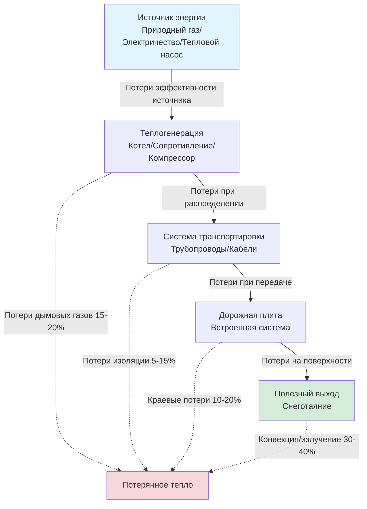

## Основные принципы эффективности

Эффективность системы снеготаяния определяет отношение полезной теплоты, подаваемой на поверхность дорожного покрытия, к общей потребляемой энергии у источника. Это соотношение включает несколько этапов преобразования, каждый из которых вызывает потери, накапливающиеся по всей системе.

Общую эффективность системы выражают следующим образом:

$$\eta_{\text{system}} = \eta_{\text{source}} \times \eta_{\text{distribution}} \times \eta_{\text{transfer}}$$

Где:
- $\eta_{\text{source}}$ = эффективность теплогенерации (котел, тепловой насос или электрическое сопротивление)
- $\eta_{\text{distribution}}$ = эффективность распределения через трубопроводы или кабели
- $\eta_{\text{transfer}}$ = эффективность теплопередачи на поверхность дорожного покрытия

## Потоки энергии и механизмы потерь

## Анализ эффективности конкретных систем

### Системы электрического сопротивления

Электрическое сопротивительное отопление обеспечивает 100% эффективность преобразования на самом нагревательном элементе:

$$\eta_{\text{electric}} = \frac{Q_{\text{delivered}}}{P_{\text{input}}} = 1.0 \text{ (в точке элемента)}$$

Однако общая эффективность системы учитывает потери при передаче и неэффективность генерации на электростанции. Эффективность от источника к потребителю составляет приблизительно 33% при учете генерации электроэнергии в электросети:

$$\eta_{\text{source-to-site}} = 0.33 \times 0.95 \times 0.98 = 0.31$$

Это представляет: 33% эффективность электростанции, 95% эффективность передачи, 98% эффективность местного распределения.

### Гидронные системы с котлом

Эффективность конденсационного котла составляет 90-98% в зависимости от температуры возвратной воды:

$$\eta_{\text{boiler}} = \frac{Q_{\text{output}}}{m_{\text{fuel}} \times LHV}$$

Где LHV — низшая теплотворная способность топлива. Полная эффективность системы включает потери при распределении через изолированные трубопроводы:

$$\eta_{\text{hydronic}} = \eta_{\text{boiler}} \times (1 - L_{\text{pipe}}) \times \eta_{\text{slab}}$$

Для хорошо спроектированной системы: $\eta_{\text{hydronic}} = 0.95 \times 0.90 \times 0.85 = 0.73$

### Системы тепловых насосов

Коэффициент производительности теплового насоса (COP) значительно варьируется в зависимости от наружной температуры:

$$\text{COP} = \frac{Q_{\text{delivered}}}{W_{\text{compressor}} + W_{\text{auxiliary}}}$$

COP снижается по мере снижения наружной температуры, что является проблематичным для приложений со снеготаянием:

$$\text{COP}(T_{\text{outdoor}}) = \text{COP}_{\text{rated}} - k(T_{\text{rated}} - T_{\text{outdoor}})$$

Где $k \approx 0.09$ на 1°C для типичных систем. При 0°C тепловой насос может достичь COP = 2.0-2.5, в то время как при −18°C COP падает до 1.5-2.0.

## Сравнение эффективности систем

| Тип системы | Эффективность источника | Эффективность распределения | Общая эффективность | Индекс рабочих затрат |
|-------------|-------------------------|------------------------------|-------------------|----------------------|
| **Электрическое сопротивление** | 100% (элемент) | 98% | 31% (источник-потребитель) | 1.00 (базовый уровень) |
| **Котел без конденсации** | 80-85% | 85-90% | 58-68% | 0.55 |
| **Конденсационный котел** | 90-98% | 85-90% | 69-79% | 0.45 |
| **Тепловой насос (0°C)** | COP 2.0-2.5 | 90-95% | 60-75% | 0.60 |
| **Тепловой насос (−18°C)** | COP 1.5-2.0 | 90-95% | 45-60% | 0.75 |

*Индекс рабочих затрат нормализован к электрическому сопротивлению = 1.00, при предположении цены природного газа 1.00 руб./кДж и электричества 0.12 руб./кВт·ч*

## Стратегии оптимизации эффективности

### Изоляция и сохранение тепла

Минимизируйте краевые потери путем установки вертикальной и горизонтальной краевой изоляции вокруг периметра нагреваемой плиты:

$$q_{\text{edge}} = \frac{P \times h \times k \times \Delta T}{d}$$

Где:
- $P$ = длина периметра
- $h$ = глубина плиты
- $k$ = теплопроводность грунта (2.6-7.8 Вт/м·K)
- $\Delta T$ = разница температур
- $d$ = толщина изоляции

Надлежащая изоляция снижает краевые потери с 20% до 5-8% от общего теплового выхода.

### Влияние системы управления

Интеллектуальные системы управления повышают сезонную эффективность на 30-50% путем:

1. **Управление по требованию**: Активация только во время осадков
2. **Модуляция температуры**: Снижение выходной температуры, когда полная мощность не требуется
3. **Оптимизация зон**: Обогрев только критических путей при слабых снегопадах

Сезонный коэффициент эффективности (SEF) учитывает работу при частичной нагрузке:

$$\text{SEF} = \frac{\sum Q_{\text{delivered,season}}}{\sum E_{\text{consumed,season}}}$$

Системы с передовыми элементами управления достигают значений SEF в 1.3-1.5 раза выше, чем постоянно работающие системы.

## Стандарты проектирования ASHRAE

Руководство ASHRAE по приложениям HVAC, глава 51, содержит рекомендации по эффективности:

- Минимальная эффективность котла: 85% для котлов без конденсации, 90% для конденсационных
- Максимальные потери при распределении: 10% для надлежащо изолированных систем
- Рекомендуемая краевая изоляция: RSI 1.76 (R-10) минимум для периметра, RSI 0.88 (R-5) для нижней части
- Кредит эффективности системы управления: До 40% снижения сезонного потребления энергии

Стандартный подход к проектированию использует годовую эффективность:

$$\text{AFUE} = \frac{\text{Сезонный тепловой выход}}{\text{Сезонный расход топлива}}$$

## Экономические аспекты эффективности

Анализ стоимости жизненного цикла должен уравновешивать стоимость установки в сравнении с операционной эффективностью:

$$\text{LCC} = C_{\text{install}} + \sum_{i=1}^{n} \frac{C_{\text{operate,i}}}{(1+r)^i}$$

Где $r$ — норма дисконтирования и $n$ — срок службы системы (как правило, 20-30 лет).

Системы с более высокой эффективностью требуют премии на установку 20-40%, но снижают эксплуатационные расходы на 30-55%, обеспечивая периоды окупаемости 4-8 лет в зависимости от климатической зоны и частоты использования.

## Выводы

Эффективность системы принципиально определяет как рабочие расходы, так и экологическое воздействие установок снеготаяния. Гидронные системы с конденсационным котлом обеспечивают оптимальное соотношение эффективности (70-79%) и надежности для большинства приложений. Тепловые насосы обеспечивают конкурентоспособную эффективность в умеренном климате (температура проектирования >−7°C), но страдают от снижения производительности в суровых условиях холода. Системы электрического сопротивления, хотя и просты и надежны, влекут наиболее высокие рабочие расходы из-за неэффективности от источника к потребителю, ограничивая их применение небольшими площадями или дополнительными зонами.

Надлежащее проектирование, обращающее внимание на изоляцию, потери при распределении и интеллектуальное управление, преобразует теоретическую эффективность компонентов в реализованную производительность системы, снижая потребление энергии на 40-60% в сравнении с базовыми установками.
