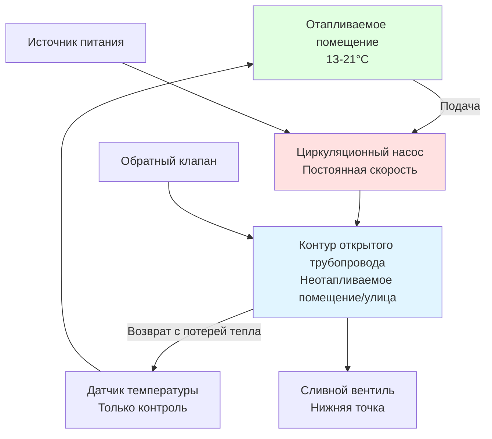
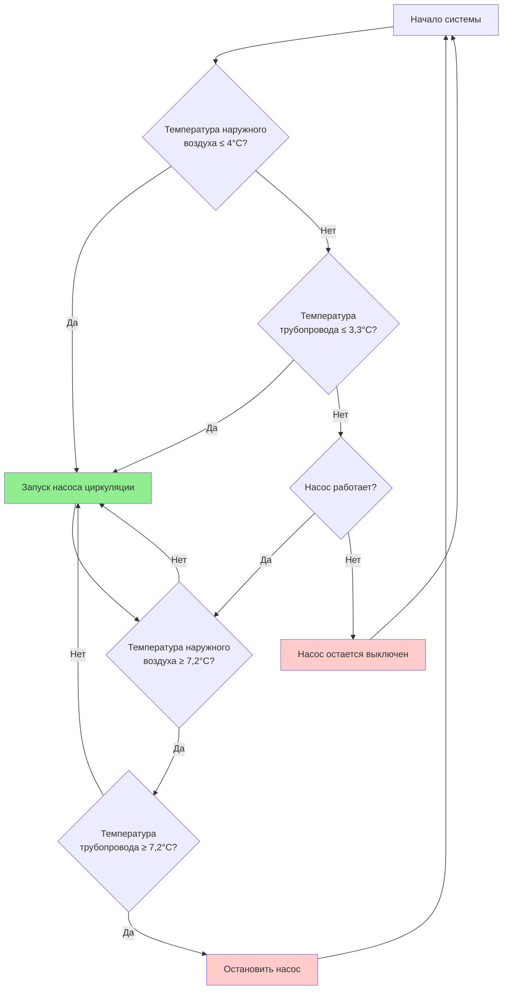

Защита от замерзания на основе циркуляции поддерживает скорость потока жидкости и вводит тепловую энергию из отапливаемых помещений для предотвращения образования льда в открытых трубопроводах. Этот метод обеспечивает надежную защиту при надлежащем проектировании, но требует особого внимания к гидромеханике, стратегиям управления, резервированию насосов и анализу энергопотребления. Фундаментальный принцип использует как конвективный теплообмен, так и физическую невозможность образования льда в потоке жидкости выше критических пороговых скоростей.

## Физические принципы защиты циркуляцией

Защита от замерзания посредством циркуляции работает на основе двух механизмов, действующих совместно:

**Конвективный теплообмен:**

Скорость доставки тепла к открытым трубопроводам посредством циркуляции определяется:

$$Q_{circ} = \dot{m} \cdot c_p \cdot \Delta T = \rho \cdot V \cdot A \cdot c_p \cdot \Delta T$$

Где:
- $Q_{circ}$ = скорость доставки тепла (кДж/ч или Вт)
- $\dot{m}$ = массовый расход (кг/с)
- $c_p$ = удельная теплоемкость жидкости (кДж/кг·К)
- $\rho$ = плотность жидкости (кг/м³)
- $V$ = скорость потока жидкости (м/с)
- $A$ = площадь поперечного сечения трубопровода (м²)
- $\Delta T$ = снижение температуры в открытом сечении (K)

**Подавление образования ледяных кристаллов:**

Текущая жидкость испытывает сдвиговые силы, которые нарушают молекулярное выравнивание, необходимое для образования ледяных кристаллов. Турбулентный поток (число Рейнольдса Re > 4000) обеспечивает дополнительное перемешивание, предотвращающее расслоение и локальные холодные зоны. Минимальная скорость предотвращения образования льда при турбулентных условиях:

$$V_{min} = \frac{Re_{crit} \cdot \nu}{D} = \frac{4000 \cdot \nu}{D}$$

Где:
- $Re_{crit}$ = критическое число Рейнольдса (4000 для порога турбулентности)
- $\nu$ = кинематическая вязкость (м²/с)
- $D$ = внутренний диаметр трубопровода (м)

Для воды при 1,7°C ($\nu$ ≈ 1,77×10⁻⁶ м²/с), минимальные скорости:

| Размер трубопровода | Внутренний диаметр | Минимальная скорость | Минимальный расход |
|-----------|----------------|------------------|------------------|
| 12,7 мм | 15,8 мм | 0,25 м/с | 3,2 л/мин |
| 19,1 мм | 20,9 мм | 0,19 м/с | 4,3 л/мин |
| 25,4 мм | 26,6 мм | 0,15 м/с | 5,6 л/мин |
| 31,8 мм | 35,1 мм | 0,11 м/с | 7,7 л/мин |
| 38,1 мм | 40,9 мм | 0,10 м/с | 9,0 л/мин |
| 50,8 мм | 52,5 мм | 0,076 м/с | 14,6 л/мин |

**Проектная практика использует коэффициенты безопасности 2-3× этих минимальных скоростей (0,15-0,46 м/с) для учета:**
- Износа насоса и снижения производительности со временем
- Частичных засорений от осадков или мусора
- Растворов гликоля с более высокой вязкостью при низких температурах
- Перебоев в электроснабжении, приводящих к временному прекращению потока

## Системы непрерывной циркуляции

Непрерывная циркуляция поддерживает постоянный поток через открытые трубопроводы при любых условиях окружающей среды, когда температура воздуха может привести к замерзанию. Этот подход обеспечивает максимальную надежность, но потребляет энергию, пропорциональную времени работы.

### Подбор насоса для непрерывной циркуляции

Циркуляционный насос должен преодолевать потери давления в системе при поддержании требуемой скорости потока. Расчет полного динамического напора (ПДН):

$$TDH = h_f + h_m + h_s$$

Где:
- $h_f$ = потери напора на трение в прямом трубопроводе
- $h_m$ = локальные потери в арматуре и клапанах
- $h_s$ = статический напор при перепаде высот

Потери напора на трение рассчитываются по уравнению Дарси-Вейсбаха:

$$h_f = f \cdot \frac{L}{D} \cdot \frac{V^2}{2g}$$

Где:
- $f$ = коэффициент трения (0,015-0,025 для турбулентного потока в коммерческих трубопроводах)
- $L$ = длина трубопровода (м)
- $D$ = диаметр трубопровода (м)
- $V$ = скорость потока (м/с)
- $g$ = ускорение свободного падения (9,81 м/с²)

Для типичного контура защиты от замерзания с 61 м трубопровода диаметром 25,4 мм при скорости 0,30 м/с:

$$h_f = 0,020 \cdot \frac{61}{0,0254} \cdot \frac{0,30^2}{2 \cdot 9,81} = 0,22 \text{ м}$$

Локальные потери обычно добавляют 30-50% к потерям на трение, что дает ПДН приблизительно 0,3-0,46 м для этой системы.

**Требуемая мощность насоса:**

$$P_{pump} = \frac{Q \cdot TDH \cdot \rho \cdot g}{1000 \cdot \eta}$$

Для водяных систем ($\rho$ = 1000 кг/м³) при Q = 3,8 л/мин (0,000063 м³/с), ПДН = 0,37 м, КПД $\eta$ = 0,30 (малые насосы):

$$P_{pump} = \frac{0,000063 \text{ м}^3\text{/с} \cdot 0,37 \text{ м} \cdot 1000 \text{ кг/м}^3 \cdot 9,81 \text{ м/с}^2}{1000 \cdot 0,30} = 7,6 \text{ Вт}$$

Годовое энергопотребление при непрерывной работе в течение 4-месячного отопительного сезона (2880 часов):

$$E_{annual} = 7,6 \text{ Вт} \cdot 2880 \text{ ч} = 21,9 \text{ кВт·ч}$$

### Схема системы непрерывной циркуляции

**Ключевые требования проектирования согласно разделу IPC 305.6:**

- Насос должен работать при температуре окружающей среды ниже 4°C
- Минимальный коэффициент безопасности 1,5× расчетного расхода
- Отдельная электрическая цепь с ручным отключением
- Обратный клапан предотвращает обратный сифонаж при отказе насоса
- Сливной вентиль в нижней точке для обслуживания системы
- Контроль температуры в самой удаленной/холодной точке от источника тепла

## Циркуляция с управлением по акватермостату

Управление циркуляцией, срабатывающее при температуре трубопровода, запускает насос только когда температура трубопровода приближается к замерзанию, что значительно снижает энергопотребление по сравнению с непрерывной циркуляцией. Стратегия управления использует либо датчик температуры поверхности трубопровода, либо температуру наружного воздуха как сигнал активации.

### Стратегия управления по температуре трубопровода

Прямое измерение температуры трубопровода обеспечивает наиболее точную защиту от замерзания с акватермостатом или электронным контроллером температуры, установленным на поверхности трубопровода:

**Логика управления:**
- Насос ВКЛ при температуре трубопровода ≤ 3,3°C (запас 1,1°C)
- Насос ВЫКЛ при температуре трубопровода ≥ 7,2°C (предотвращение частого цикличного включения)
- Гистерезис 3,9°C предотвращает быстрое чередование включений/выключений

Соображения по размещению датчиков:

- Установить в самой холодной точке (обычно на северной стене, обращенной наружу)
- Обеспечить тепловой контакт с трубопроводом с использованием теплопроводящей пасты
- Изолировать датчик от окружающего воздуха защитным кожухом
- Установить на нижнюю часть горизонтальных трубопроводов, где расслоение температуры создает самые холодные условия
- Использовать усредняющие датчики на трубопроводах большого диаметра (>101,6 мм)

Для установок с несколькими открытыми участками разместить датчики в следующих точках:
1. Самое северное открытое сечение
2. Самая высокая точка подъема (потери при расслоении тепла)
3. Сечение с максимальным ветровым воздействием
4. Любые незащищенные фитинги или скопления клапанов

Подключить датчики параллельно так, чтобы любой датчик, достигший уставки, включал насос.

### Внешний температурный блокиратор

Температура наружного воздуха обеспечивает предсказательную защиту от замерзания, активируя циркуляцию до того, как температура трубопровода упадет до критического уровня. Этот подход имеет несколько преимуществ:

**Преимущества:**
- Предвидит условия замерзания до того, как трубопровод достигнет 0°C
- Один датчик может защитить всю систему
- Менее сложная установка по сравнению с несколькими датчиками на трубопроводе
- Не требует проникновения или нарушения изоляции трубопровода

**Уставки управления:**
- Насос ВКЛ при температуре наружного воздуха ≤ 4°C
- Насос ВЫКЛ при температуре наружного воздуха ≥ 7,2°C
- Регулируемые уставки для оптимизации под локальный климат

Датчик температуры должен быть расположен в репрезентативном месте снаружи:
- Установка на северную стену, вдали от источников тепла здания
- Минимум 1,2 м от окон, вентиляционных отверстий или выпуска HVAC
- Защищен от прямого солнечного излучения
- Защищен от осадков водонепроницаемым кожухом

### Сравнение систем управления

| Метод управления | Экономия энергии | Стоимость установки | Надежность | Время отклика | Сложность |
|---------------|----------------|-------------------|-------------|---------------|------------|
| Непрерывная циркуляция | Базовая (0%) | Низкая | Отличная | Мгновенно | Минимальная |
| Акватермостат трубопровода | 60-80% | Средняя | Отличная | 5-15 мин | Низкая |
| Датчик наружной температуры | 50-70% | Низкая | Очень хорошая | 10-30 мин | Низкая |
| Комбинированная (трубопровод + наружная) | 50-70% | Высокая | Выдающаяся | 5-15 мин | Средняя |

**Комбинированная стратегия управления** использует датчик наружной температуры как первичную активацию с переопределением по температуре трубопровода:
- Датчик наружной температуры при 4°C предварительно запускает циркуляцию
- Датчик трубопровода при 3,3°C обеспечивает резервную активацию при отказе наружного управления
- Система не может быть отключена, пока оба датчика не указывают на безопасную температуру

Этот резервный подход обеспечивает оптимальный баланс энергоэффективности и надежности защиты от замерзания для критических приложений.

## Резервирование и резервный насос циркуляции

Для критических установок, где последствия повреждения от замерзания серьезны (системы пожарной защиты, технологические системы, магистрали питьевой воды), конфигурации с резервированием обеспечивают защиту при обслуживании или отказе насоса.

### Конфигурация двойного насоса (дуплекс)

Параллельные насосы с автоматическим чередованием обеспечивают резервирование без непрерывной работы обоих устройств:

**Принцип работы системы дуплекс:**
1. Первичный насос работает при нормальных циклах защиты от замерзания
2. Резервный насос остается в готовности с открытыми изоляционными клапанами
3. Контроллер чередует роли первичного/резервного еженедельно для выравнивания износа
4. При обнаружении отказа первичного насоса (датчик потока или датчик тока) резервный насос запускается немедленно
5. Сигнал тревоги указывает на отказ насоса для планирования обслуживания

Проверка потока гарантирует фактическую циркуляцию:
- Лопастные датчики потока обнаруживают поток выше минимального порога
- Датчики перепада давления на насосе подтверждают повышение давления
- Датчики тока проверяют, что двигатель насоса потребляет ожидаемый ток

### Деградация производительности насоса

Циркуляционные насосы испытывают снижение производительности со временем из-за:
- Износа рабочего колеса, снижающего напор на 10-20% за 5-10 лет
- Утечек в уплотнениях, позволяющих внутреннюю рециркуляцию
- Износа подшипников двигателя, увеличивающего потери на трение
- Накопления осадков в проходах рабочего колеса

**Проектные практики для учета деградации:**
- Подбирать насосы на 1,5× расчетный расход при первичной установке
- Планировать ежегодное тестирование производительности (измерение расхода и напора)
- Заменять насосы при снижении производительности ниже 1,2× расчетного расхода
- Указывать высококачественные насосы из бронзы или нержавеющей стали для долговечности

## Анализ энергопотребления и оптимизация

Циркуляционная защита от замерзания потребляет энергию для непрерывной или периодической работы насосов в течение отопительного сезона. Количественный анализ информирует выбор стратегии управления.

### Расчет годового энергопотребления

Общее сезонное энергопотребление зависит от мощности насоса и часов работы:

$$E_{season} = P_{pump} \cdot h_{operation} \cdot \frac{1}{\eta_{motor}}$$

Где:
- $E_{season}$ = сезонное энергопотребление (кВт·ч)
- $P_{pump}$ = гидравлическая мощность насоса (кВ)
- $h_{operation}$ = общее время работы в сезон (ч)
- $\eta_{motor}$ = КПД двигателя (0,30-0,60 для малых насосов)

Время работы варьируется значительно в зависимости от стратегии управления и климата:

| Климатическая зона | Непрерывная работа | Управление датчиком наружной температуры | Управление датчиком трубопровода |
|--------------|---------------------|----------------------|---------------------|
| Миннеаполис, МН | 4320 ч (ноя-март) | 1800 ч | 1200 ч |
| Чикаго, ИЛ | 3600 ч (ноя-март) | 1400 ч | 900 ч |
| Денвер, КО | 3000 ч (ноя-фев) | 1100 ч | 700 ч |
| Бостон, МА | 2880 ч (дек-март) | 1200 ч | 800 ч |

Для 10-ваттного насоса в климате Чикаго при $0,12/кВт·ч стоимость электроэнергии:

**Непрерывная работа:**
$$Стоимость = \frac{10 \text{ Вт} \cdot 3600 \text{ ч}}{1000} \cdot 0,12 = \$4,32/\text{сезон}$$

**Управление датчиком наружной температуры:**
$$Стоимость = \frac{10 \text{ Вт} \cdot 1400 \text{ ч}}{1000} \cdot 0,12 = \$1,68/\text{сезон}$$

**Экономия энергии = $2,64/сезон или 61% снижение**

Хотя абсолютные затраты остаются скромными для малых жилых систем, крупные коммерческие установки с несколькими контурами защиты от замерзания и насосами большей мощности оправдывают температурное управление активацией.

### Извлечение тепла из циркуляции

Системы циркуляции по природе транспортируют тепло из кондиционируемых помещений здания в открытые трубопроводы. Это представляет тепловую нагрузку, которую необходимо количественно определить:

$$Q_{loss} = \dot{m} \cdot c_p \cdot (T_{supply} - T_{return})$$

Для циркуляции 7,6 л/мин с понижением температуры на 8,3°C:

$$Q_{loss} = 7,6 \text{ л/мин} \cdot 1,0 \text{ кВт·мин/л·°C} \cdot 8,3°C = 63,1 \text{ кВт}$$

За сезон продолжительностью 1400 часов это извлекает 88 ГДж из системы отопления здания. При стоимости природного газа $15/ГДж и КПД котла 85%:

$$Стоимость_{отопления} = \frac{88 \text{ ГДж}}{0,85} \cdot \frac{\$15}{\text{ГДж}} = \$1550/\text{сезон}$$

**Эта тепловая нагрузка значительно превышает электрическое потребление насоса**, делая циркуляционную защиту от замерзания дорогостоящей для больших открытых трубопроводов по сравнению с альтернативами электрических нагревателей.

## Требования кодексов и стандартов

IPC и UPC устанавливают минимальные требования для систем циркуляционной защиты от замерзания:

**Раздел IPC 305.6 - Защита от замерзания:**
- Трубопроводы в помещениях, где температура может упасть ниже 0°C, должны быть защищены
- Системы циркуляции должны поддерживать минимальную скорость 0,15 м/с
- Автоматические системы управления необходимы для активации циркуляции при 4°C или ниже
- Требуется возможность ручного управления для испытаний и аварийной работы

**Раздел UPC 314.0 - Защита трубопроводов:**
- Водопроводные трубы, уязвимые к замерзанию, должны быть защищены одобренными методами
- Системы циркуляции, использующие тепло здания, требуют выделенного циркуляционного насоса
- Системы управления температурой должны быть установлены для предотвращения работы насоса при температурах выше 10°C (энергосбережение)
- Защита от обратного потока требуется, если циркуляция подключена к системе питьевой воды

**Стандарт ASHRAE 90.1 - Энергетический стандарт:**
- Раздел 6.5.4.3: Системы защиты от замерзания должны использовать автоматическое управление для работы только при необходимости защиты
- Непрерывная циркуляция запрещена, если только температурное управление не является невозможным
- Изоляция требуется согласно таблице 6.8.3 для минимизации потерь тепла циркуляции

## Лучшие практики установки

Надлежащая установка гарантирует надежную защиту от замерзания и эффективную работу:

**Конфигурация трубопровода:**
- Обеспечить непрерывный подъем от насоса к самой высокой точке (минимум 6,4 мм на метр)
- Установить воздухоотводчики во всех высоких точках для предотвращения воздушных пробок
- Подбирать размер трубопровода для диапазона скорости 0,3-0,9 м/с при расчетном расходе
- Избегать тупиков, где циркуляция не может достичь
- Установить балансировочные клапаны на параллельные ветви для обеспечения распределения потока

**Установка насоса:**
- Монтировать насос ниже уровня жидкости для обеспечения положительного напора на входе
- Обеспечить изоляционные клапаны для обслуживания без опорожнения системы
- Установить обратный клапан на выходе насоса для предотвращения обратного потока
- Использовать гибкие соединения для изоляции вибрации
- Обеспечить четкий доступ для проверки и обслуживания

**Проводка управления:**
- Использовать выделенную цепь с надлежащей защитой от перегрузки по току
- Применять методы проводки Класса 1 для силовых цепей согласно статье NEC 725
- Датчики температуры должны использовать экранированный кабель для предотвращения электромагнитных помех
- Четко обозначить все компоненты и цепи управления
- Установить переключатель ручного управления в доступном месте с индикаторной лампой

**Соображения по гликолю:**
Если контур циркуляции использует раствор гликоля для улучшенной защиты от замерзания:
- Подбирать насос на 1,5-2,0× напор из-за повышенной вязкости
- Проверить совместимость материалов (гликоль воздействует на некоторые уплотнения и прокладки)
- Установить портами заполнения/слива с соединениями шланга для обслуживания раствора
- Использовать ингибированный промышленный гликоль, никогда не используйте автомобильный антифриз
- Тестировать концентрацию и pH ежегодно

Надлежащим образом спроектированные и установленные системы циркуляционной защиты от замерзания обеспечивают надежную, энергоэффективную защиту открытых трубопроводов в климатических условиях, где замерзание происходит регулярно, но не непрерывно в течение всего зимнего периода.
