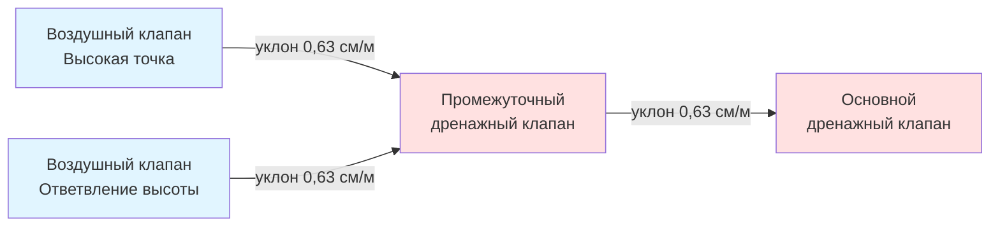
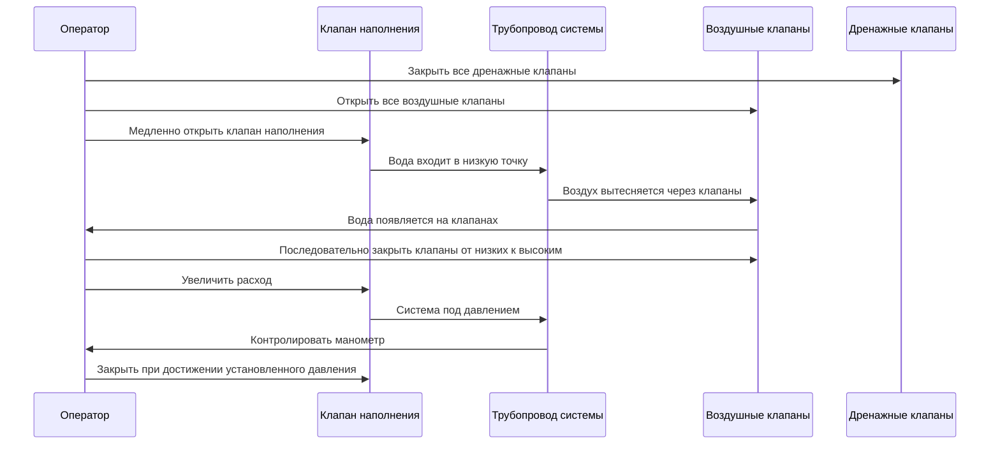

Системы опорожнения обеспечивают защиту от замерзания путем полного гравитационного слива трубопроводов в холодную погоду, исключая содержание воды, которая может замерзнуть и разорвать трубы. Этот пассивный подход требует нулевого энергопотребления при эксплуатации, но требует точной геометрии монтажа, надежных автоматических клапанов и надлежащего доступа воздуха для стабильного функционирования.

## Физика гравитационного опорожнения

Успешное опорожнение зависит от гравитационной потенциальной энергии, преодолевающей силы трения жидкости и поверхностного натяжения. Скорость дренажа в наклонной трубе вытекает из энергетического баланса:

$$V = \sqrt{\frac{2 g h}{1 + f \frac{L}{D}}}$$

Где:
- $V$ = скорость дренажа (м/с)
- $g$ = ускорение свободного падения (9,81 м/с²)
- $h$ = вертикальное падение высоты (м)
- $f$ = коэффициент трения Дарси (0,015-0,025 для гладких труб)
- $L$ = длина трубы (м)
- $D$ = диаметр трубы (м)

Для полного опорожнения скорость жидкости должна превышать порог удержания капилляром, который варьируется в зависимости от диаметра трубы и энергии поверхности материала. Минимальные требования к уклону обеспечивают это условие:

**Минимальный уклон = 0,63 см на метр длины (0,63%, угол 0,36°)**

Этот стандарт основан на эмпирических испытаниях, показывающих полное удаление воды из труб Schedule 40 из стали и меди при типичных условиях монтажа. Увеличение уклона до 1,27 см на метр сокращает время дренажа на 40-60% и обеспечивает допуск на незначительные отклонения при монтаже.

## Принцип работы автоматических дренажных клапанов

Автоматические дренажные клапаны (АДК) открываются при падении давления в системе ниже откалиброванного порога, позволяя воздуху поступать и осуществлять дренаж. Три механизма доминируют в коммерческих приложениях:

### Клапаны с пружинной диафрагмой

Принцип работы: Давление в системе сжимает откалиброванную пружину, удерживая диафрагму против дренажного отверстия. При падении давления ниже силы пружины диафрагма открывается, позволяя дренаж.

Диапазон давления открытия: 7-34 кПа (типичный)
Время отклика: 2-5 секунд
Размеры отверстия: 3-13 мм
Применение: Жилые системы и легкие коммерческие системы

**Соотношение давление-поток:**

$$Q = C_d A \sqrt{\frac{2 \Delta P}{\rho}}$$

Где:
- $Q$ = объемный расход (м³/с)
- $C_d$ = коэффициент расхода (0,60-0,75 для АДК)
- $A$ = площадь отверстия (м²)
- $\Delta P$ = перепад давления на клапане (Па)
- $\rho$ = плотность жидкости (998 кг/м³ для воды)

### Клапаны с поплавковым управлением

Поплавковый механизм поднимается с наличием воды, закрывая дренажное отверстие. При опорожнении поплавок опускается, сохраняя открытое положение до заполнения.

Преимущества:
- Положительный клапан независимо от давления в системе
- Видимый статус дренажа через прозрачную поплавковую камеру
- Самоочищающееся действие предотвращает засорение осадком

Недостатки:
- Большой физический размер (требуется высота 76-152 мм)
- Риск замерзания при неполном опорожнении
- Выше стоимость, чем конструкции с пружинной диафрагмой

### Электромагнитные дренажные клапаны

Электрически управляемые клапаны открываются при потере питания (надежная конструкция) или сигнале датчика температуры. Комбинируются с контроллерами защиты от замерзания для автоматической сезонной работы.

**Критерии выбора размера:**

| Размер трубы | Минимальное дренажное отверстие | Время дренажа (подъем 3 м) |
|-----------|-------------------------------|---------------------------|
| 13-19 мм | 3 мм | 45-60 секунд |
| 25-32 мм | 5 мм | 60-90 секунд |
| 38-40 мм | 6 мм | 90-120 секунд |
| 50-64 мм | 10 мм | 120-180 секунд |

Недостаточные по размеру дренажные клапаны создают чрезмерное время дренажа, повышая риск замерзания при быстром падении температуры. Проектировать на полный слив системы в течение 3-5 минут максимум.

## Расположение и размеры воздушных клапанов

Доступ воздуха предотвращает образование вакуума, который останавливает дренаж из-за накопления отрицательного давления. При эвакуации воды воздух должен заменить вакантный объем:

$$V_{воздух} = V_{вода} + V_{расширение}$$

Воздушные клапаны (вакуумные выключатели) должны располагаться:

1. **В высших точках системы:** На каждой вершине повышения в сети трубопроводов
2. **На ответвлениях приборов:** В конечных точках мертвых концов
3. **На концах горизонтальных участков:** На дальнем конце длинных горизонтальных участков перед изменением уклона

### Типы вакуумных выключателей

**Воздушные клапаны ручного управления:**
- Простые резьбовые отверстия с крышками
- Оператор открывает их во время цикла опорожнения
- Низшая стоимость, но требует ручного вмешательства
- Риск забывчивости перед заполнением

**Автоматические вакуумные выключатели:**
- Пружинные атмосферные клапаны (аналогичная конструкция АДК)
- Автоматически открываются при падении внутреннего давления ниже атмосферного
- Закрываются при восстановлении положительного давления во время заполнения
- Требуются для автоматических систем без присутствия персонала

**Поплавковые воздушные клапаны:**
- Поплавок герметизирует клапан при наличии воды
- Автоматический выпуск воздуха при дренаже
- Предотвращает распыление воды при нормальной работе
- Выше стоимость, но оптимально для установок в отапливаемых помещениях

### Размер дренажного клапана

Минимальный диаметр отверстия дренажного клапана следует из требуемого расхода воздуха:

$$d_{клапан} = \sqrt{\frac{4 Q_{дренаж}}{\pi V_{воздух} C_d}}$$

Для практического применения:

| Размер системной трубы | Минимальный размер клапана | Пропускная способность по воздуху |
|-----------------|------------------|------------------|
| 13-25 мм | 3 мм | 0,24 м³/ч |
| 32-50 мм | 6 мм | 0,95 м³/ч |
| 64-102 мм | 10 мм | 2,14 м³/ч |
| 152-203 мм | 13 мм | 3,81 м³/ч |

## Требования к уклону трубопроводов

Непрерывный однонаправленный уклон от воздушных клапанов к дренажным клапанам обязателен. Множественные дренажные точки снижают длину уклона, минимизируя требования к перепаду высоты.

### Методология расчета уклона

Для системы трубопровода с длиной $L$ и минимальным уклоном $S$:

$$h_{падение} = L \times S$$

Пример: горизонтальный участок трубы длиной 15 м с уклоном 0,63 см/м:

$$h_{падение} = 15 \text{ м} \times 0,0063 = 0,0945 \text{ м} = 9,45 \text{ см}$$

Это вертикальное падение должно быть достижимо в пределах геометрии здания. При недостаточности требуются промежуточные дренажные точки.

### Схема системы с несколькими дренажами

Каждый дренажный клапан обслуживает определенную зону дренажа. Клапаны изолируют участок при необходимости технического обслуживания, в то время как остальные остаются в рабочем состоянии.

## Процедуры заполнения

Заполнение системы после опорожнения требует контролируемого повторного введения воды для предотвращения воздушного замка, гидравлического удара и неполного заполнения.

### Стандартная последовательность заполнения

### Критические параметры заполнения

**Расход заполнения:** 7,6-19 л/мин для жилых систем, 38-76 л/мин для коммерческих установок. Чрезмерная скорость заполнения создает турбулентное захватывание воздуха и неполное вентилирование.

Максимальная рекомендуемая скорость заполнения:

$$V_{заполнение} = 0,305 \text{ м/с}$$

Это соответствует:

| Диаметр трубы | Максимальный расход наполнения |
|--------------|------------------|
| 13 мм | 7,1 л/мин |
| 19 мм | 16 л/мин |
| 25 мм | 28 л/мин |
| 32 мм | 44 л/мин |
| 38 мм | 64 л/мин |
| 50 мм | 114 л/мин |

**Время pressurization:** Выделите 15-30 минут для полного растворения воздуха после окончательного вентилирования. Спешка к полному давлению захватывает микропузырьки, которые снижают эффективность системы и вызывают шум потока.

## Проверка дренажа системы

После монтажа и ежегодно перед зимой проведите тестирование проверки дренажа:

1. **Закройте клапаны наполнения/подачи** для изоляции системы
2. **Откройте все дренажные клапаны** вручную или инициируйте автоматическую работу
3. **Откройте все воздушные клапаны** для допуска замещающего воздуха
4. **Измерьте время дренажа** от начала до прекращения последней капли
5. **Проверьте выход дренажного клапана** на полную эвакуацию воды
6. **Проверьте низкие точки** инспекционными портами на остаточную воду

Любое удержание воды указывает на недостаточный уклон, засоренные дренажи или воздушный замок. IPC Section 305.6.1 требует полной способности дренажа для соответствия требованиям защиты от замерзания.

### Критерии производительности дренажа

| Тип системы | Максимальное время дренажа | Объем остаточной воды |
|------------|---------------------|---------------------|
| Жилая (< 30 м) | 3 минуты | < 0,24 л |
| Легкая коммерческая (30-150 м) | 5 минут | < 0,95 л |
| Коммерческая (> 150 м) | 10 минут | < 3,78 л |

## Конструктивные ограничения

Системы опорожнения накладывают ограничения на расположение трубопроводов:

**Не может разместить:**
- Горизонтальные участки трубопровода без уклона
- Трубопровод ниже высоты дренажного клапана
- Конфигурации ловушек, которые удерживают воду
- Длинные вертикальные падения без промежуточных воздушных клапанов
- Приборы, требующие постоянного наличия воды

**Надлежащие приложения:**
- Сезонные системы (снеготаяние, орошение)
- Сезонные свойства с расширенными периодами неиспользования
- Наружные душевые удобства (бассейны, пляжи)
- Открытый трубопровод в неотапливаемых помещениях
- Аварийная защита от замерзания

## Сравнительный анализ: ручная и автоматическая работа

| Характеристика | Ручное опорожнение | Автоматическое опорожнение |
|---------|------------------|---------------------|
| Первоначальная стоимость | 1700-5400 руб. | 10200-27000 руб. |
| Эксплуатационная стоимость | 0 руб. | 0 руб. |
| Надежность | Зависит от прилежания оператора | 95-98% при надлежащем техническом обслуживании |
| Время отклика | Часы - дни | Минуты |
| Пригодность для занятых зданий | Плохая | Хорошая |
| Частота техническое обслуживание | Сезонная проверка | Ежегодное тестирование клапана |
| Риск замерзания | Умеренный (ошибка оператора) | Низкий |

Автоматические системы оправдывают свою более высокую первоначальную стоимость в зданиях без присутствия персонала, климате с быстрым замерзанием и приложениях, когда обучение оператора/присутствие не может быть гарантировано.

## Требования кодов

**IPC Section 305.6.1:** Трубопровод в зонах, подверженных замерзанию, должен быть защищен путем нагрева, изоляции, обоих нагрева и изоляции, или возможностью опорожнения.

**IPC Section 305.6.2:** Системы опорожнения должны обеспечивать полный дренаж с минимальным уклоном 0,63 см на метр, дренажными клапанами во всех низких точках и воздушными входами во всех высоких точках.

**UPC Section 314.1:** Аналогичные требования с дополнительным мандатом на доступные местоположения дренажных клапанов и четкую маркировку компонентов дренажа/вентиляции.

## Лучшие практики установки

- **Используйте объединения дренажного клапана** для легкого снятия и очистки
- **Установите фильтры перед** автоматическими клапанами для предотвращения засорения остатками
- **Предусмотрите расширения дренажного клапана** для завершения в доступных местах (не закопаны в стенах)
- **Обозначьте все дренажные и вентиляционные точки** постоянными защищенными от непогоды бирками
- **Проведите дренажный выпуск** в видимые места для проверки работы
- **Установите манометры** в высоких точках системы для проверки полного дренажа (нулевое давление)
- **Наклоняйте горизонтальные участки трубопровода** в одном направлении без изменений или провисания
- **Поддерживайте трубопровод** для сохранения уклона при полных и пустых условиях (учитывайте тепловое движение)

Системы опорожнения обеспечивают наиболее энергоэффективную защиту от замерзания при условиях проектирования, которые позволяют их конструктивные ограничения. Надлежащий выбор клапана, строгое соблюдение требований к уклону и надлежащая вентиляция воздуха обеспечивают надежную автоматическую работу на протяжении сезонных циклов замерзания-оттаивания.
