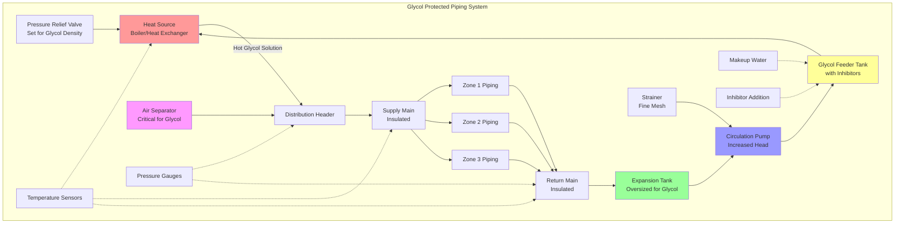

## Физические принципы защиты от замерзания гликоля

Растворы гликоля предотвращают замерзание путем модификации коллигативных свойств. Когда молекулы гликоля растворяются в воде, они нарушают образование кристаллов льда, препятствуя водородным связям между молекулами воды. Это молекулярное воздействие понижает точку замерзания ниже 0°C, при этом величина понижения пропорциональна концентрации гликоля.

Депрессия точки замерзания следует нелинейному соотношению. При низких концентрациях (10-30% по массе) точка замерзания снижается быстро. Свыше 50% концентрации темп понижения замедляется, и чистый гликоль (100%) фактически замерзает при более высокой температуре, чем оптимальные смеси. Евтектическая точка — достижимая самая низкая точка замерзания — составляет приблизительно 60% этиленгликоля (-48°C) и 55% пропиленгликоля (-51°C).

## Расчеты концентрации гликоля

Требуемая концентрация гликоля зависит от минимально ожидаемой температуры окружающей среды с соответствующими коэффициентами безопасности. Точка замерзания растворов гликоля рассчитывается с использованием эмпирических корреляций:

Для растворов этиленгликоля соотношение точки замерзания:

$$T_f = -0.00175C^2 - 0.545C$$

Для растворов пропиленгликоля:

$$T_f = -0.00195C^2 - 0.512C$$

где $T_f$ — точка замерзания в °C, а $C$ — концентрация гликоля по массе (%).

Требуемая концентрация для заданной температуры проектирования включает коэффициент безопасности:

$$C_{req} = f(T_{design} - T_{safety})$$

где $T_{safety}$ обычно составляет 5-10°C ниже минимально ожидаемой температуры.

Концентрация защиты от разрыва, которая предотвращает разрыв трубопровода даже при образовании слякоти раствором, ниже:

$$C_{burst} \approx 0.65 \times C_{freeze}$$

## Влияние на теплопередачу и гидравлические характеристики

Растворы гликоля значительно изменяют характеристики теплопередачи и насосирования по сравнению с чистой водой. Удельная теплоемкость уменьшается с увеличением концентрации гликоля:

$$c_p = c_{p,water}(1 - 0.0045C)$$

Теплопроводность аналогично уменьшается:

$$k = k_{water}(1 - 0.0052C)$$

Эти снижения требуют увеличения расходов для поддержания эквивалентной емкости теплопередачи:

$$\dot{Q} = \dot{m} c_p \Delta T$$

Для 30% раствора пропиленгликоля при 10°C удельная теплоемкость снижается до приблизительно 3,93 кДж/(кг·К) по сравнению с 4,19 кДж/(кг·К) для воды, требуя примерно 7% более высокого расхода для эквивалентной теплопередачи.

Вязкость значительно увеличивается с концентрацией гликоля и уменьшается с повышением температуры. Для пропиленгликоля при 0°C и 30% концентрации динамическая вязкость достигает приблизительно 4,5 мПа·с по сравнению с 1,8 мПа·с воды при той же температуре. Это увеличение вязкости прямо влияет на мощность насоса:

$$\Delta P \propto \mu$$

Требования напора насоса увеличиваются на 20-50% для типичных концентраций гликоля по сравнению с системами на воде.

## Соображения при проектировании системы

### Расчет расширительного бака

Растворы гликоля имеют более высокие коэффициенты термического расширения, чем вода. Расширительный бак должен вмещать увеличенное изменение объема:

$$V_{tank} = V_{system} \times \beta \times \Delta T \times SF$$

где $\beta$ — коэффициент объемного расширения (приблизительно 0,00075/°C для 30% пропиленгликоля против 0,00021/°C для воды), и $SF$ — коэффициент безопасности 1,25-1,5.

### Совместимость материалов

Этиленгликоль и пропиленгликоль различаются по коррозионным характеристикам. Неингибированные гликоли окисляются с образованием кислых соединений (гликолевая кислота, муравьиная кислота), которые атакуют черные металлы и медные сплавы. Пакеты ингибиторов коррозии являются обязательными и обычно содержат:

- Нитрит натрия или бензоат натрия (защита черных металлов)
- Молибдат натрия (защита медных сплавов)
- Буферы pH (поддержание pH 8,5-10,5)
- Поверхностно-активные вещества (предотвращение пены)

Истощение ингибитора требует ежегодного тестирования и пополнения. ASTM D1384 и D4340 определяют протоколы испытания коррозии для растворов гликоля.

### Экологические и факторы безопасности

Пропиленгликоль нетоксичен и предпочтителен для применений с потенциальным контактом с людьми, пищевых производств или экологической чувствительности. Этиленгликоль обеспечивает превосходные характеристики теплопередачи, но представляет опасность токсичности, требуя тщательного обращения и локализации разливов. Местные коды могут требовать пропиленгликоля в конкретных приложениях.

## Сравнение методов защиты от замерзания

| Метод защиты | Капитальные затраты | Эксплуатационные затраты | Надежность | Диапазон температур | Техническое обслуживание |
|-------------------|--------------|----------------|-------------|-------------------|-------------|
| Пропиленгликоль | Среднее | Низкое | Высокая | -51°C до 120°C | Ежегодное тестирование |
| Этиленгликоль | Низкое | Низкое | Высокая | -48°C до 120°C | Ежегодное тестирование |
| Электрический нагревательный кабель | Высокое | Высокое | Среднее | Неограниченно | Калибровка датчика |
| Паровой нагревательный кабель | Высокое | Очень высокое | Среднее | Неограниченно | Техническое обслуживание ловушки |
| Циркуляция с нагревом | Среднее | Среднее | Высокая | Ограничено проектом | Обслуживание насоса |
| Системы слива | Низкое | Низкое | Низкая | N/A | Эксплуатация клапана |

## Архитектура системы распределения гликоля

## Стандарты и требования кодов

ASHRAE Standard 15 рассматривает растворы гликоля в системах механического охлаждения. ASTM D1177 определяет охлаждающие жидкости на основе этиленгликоля для двигателей (применимо к замкнутым HVAC системам). ASTM D6210 охватывает теплоносители на основе пропиленгликоля. Международный механический кодекс (IMC) раздел 1404 требует защиты от обратного потока для систем с гликолем, подключенных к питьевой воде.

Концентрация гликоля должна быть проверена при вводе в эксплуатацию и ежегодно впоследствии с использованием рефрактометрии или гидрометрии. Документация должна включать процент концентрации, уровни ингибиторов, pH и проверку точки замерзания. Растворы гликоля требуют замены при истощении ингибиторов, загрязнении или термической деградации, обычно каждые 3-5 лет в замкнутых системах при надлежащем обслуживании.

## Оперативный мониторинг

Критические параметры мониторинга включают:

**Температурный перепад**: Чрезмерный ΔT указывает на недостаточный расход из-за увеличенной вязкости или деградации насоса

**Перепад давления**: Увеличивающийся перепад давления предполагает образование продуктов деградации гликоля в виде шлама или отложений

**Уровень pH**: Снижение ниже 8,0 указывает на истощение ингибиторов и начало коррозии

**Резервная щелочность**: Измеряет оставшуюся нейтрализующую способность против кислых продуктов окисления

**Проверка точки замерзания**: Прямое измерение подтверждает адекватность концентрации для защиты

Автоматические системы должны выдавать сигналы тревоги при превышениях температуры, отклонениях давления и отказе насоса, чтобы предотвратить ледяной урон при неконтролируемой работе.
