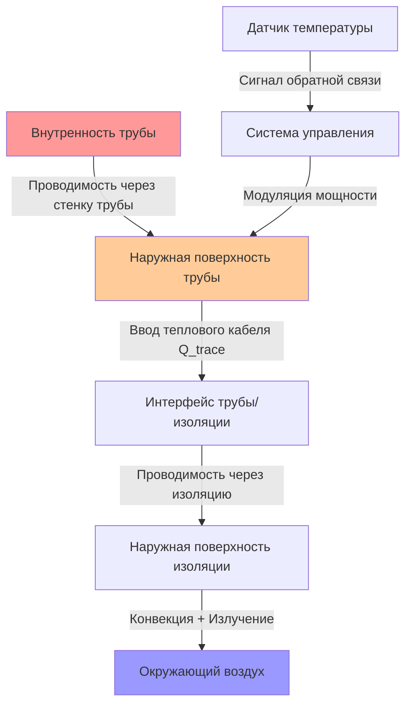
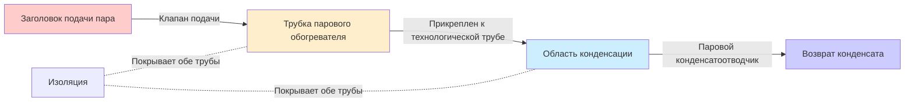
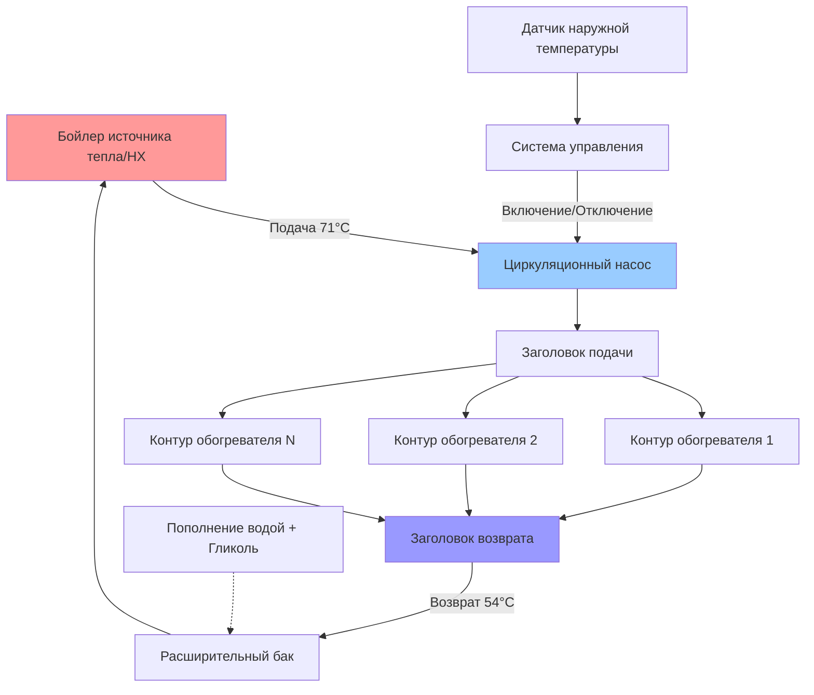

Системы теплового кабеля поддерживают температуру труб выше точки замерзания путем непрерывного или управляемого ввода тепловой энергии. Три основных метода доминируют в промышленных и коммерческих приложениях: электрическое сопротивленческое отопление, паровой обогрев и циркуляция горячей воды. Выбор зависит от доступных коммунальных услуг, требований температуры, классификации опасных зон и анализа стоимости жизненного цикла.

## Физические принципы теплового кабеля

Тепловой кабель компенсирует потерю тепловой энергии через стенки труб и изоляцию в окружающую среду. Уравнение теплового баланса в установившемся режиме управляет всем проектированием теплового кабеля:

$$Q_{trace} \geq Q_{loss} = \frac{2\pi k L (T_{pipe} - T_{ambient})}{\ln(r_{outer}/r_{inner})} + Q_{convection} + Q_{radiation}$$

Где:
- $Q_{trace}$ = мощность ввода теплового кабеля (Вт)
- $Q_{loss}$ = общие тепловые потери (Вт)
- $k$ = коэффициент теплопроводности изоляции (Вт/м·К)
- $L$ = длина трубы (м)
- $T_{pipe}$ = поддерживаемая температура трубы (К)
- $T_{ambient}$ = минимальная температура окружающей среды (К)
- $r_{outer}$, $r_{inner}$ = наружный и внутренний радиусы изоляции (м)

Для практических расчетов с изолированными трубами упрощенная форма достаточна:

$$Q_{loss} = \frac{\Delta T \times L}{R_{total}}$$

Где $R_{total}$ представляет комбинированное тепловое сопротивление изоляции, стенки трубы, внутреннего слоя жидкости и внешнего конвективного пограничного слоя.

## Системы электрического теплового кабеля

Электрический тепловой кабель преобразует электрическую энергию в тепловую энергию путем резистивного нагрева. Статья NEC 427 и стандарт IEEE 515 устанавливают требования к проектированию, установке и техническому обслуживанию.

### Саморегулирующийся кабель теплового кабеля

Саморегулирующиеся кабели содержат проводящий полимерный сердечник между двумя параллельными шинами. Полимер проявляет поведение с положительным температурным коэффициентом (PTC) — электрическое сопротивление экспоненциально возрастает с температурой согласно:

$$R(T) = R_0 \times e^{\beta(T - T_0)}$$

Где:
- $R(T)$ = сопротивление при температуре $T$ (Ом/фут)
- $R_0$ = эталонное сопротивление (Ом/фут)
- $\beta$ = температурный коэффициент (обычно 0,03–0,08 К⁻¹)
- $T_0$ = эталонная температура (К)

Этот физический механизм обеспечивает собственное ограничение температуры — по мере увеличения температуры трубы локальное сопротивление увеличивается, ток уменьшается и выходная мощность снижается. Кабель автоматически регулирует выходную мощность по своей длине на основе локальных условий температуры.

**Характеристики производительности:**
- Выходная мощность: 3–50 Вт/м при 4,4°C в зависимости от номинала кабеля
- Выходная мощность уменьшается на 50–70% с 4,4°C до 65,6°C
- Не может перегреться при перекрытии или скоплении
- Максимальная температура воздействия: 85–102°C (в зависимости от продукта)
- Длина цепи: 30–90 м при 120В, 60–180 м при 240В
- Пусковой ток: 2–3× установившегося тока при холодном пуске

### Кабель теплового кабеля с постоянной мощностью

Кабели с постоянной мощностью поддерживают фиксированную выходную мощность независимо от температуры. Существует две конфигурации:

**Кабель с серийным сопротивлением:**
- Единственный непрерывный нагревательный элемент
- Фиксированная общая мощность для всей цепи
- Невозможно обрезать по длине в поле
- При разделении вся цепь выходит из строя
- Используется для приложений точного контроля температуры

**Кабель с параллельным сопротивлением:**
- Нагревательные элементы подключены параллельно между шинами
- Может быть обрезан в поле до требуемой длины
- Выход из строя одного элемента не влияет на другие
- Выходная мощность: 3–25 Вт/м постоянно
- Требует управления термостатом для предотвращения перегрева

Соотношение выходной мощности:

$$P = \frac{V^2}{R} = I^2 R$$

Где $V$ = напряжение питания, $R$ = сопротивление кабеля, $I$ = ток. Поскольку сопротивление остается постоянным, выходная мощность не варьируется в зависимости от температуры окружающей среды или трубы — внешнее управление является обязательным.

### Таблица выбора кабеля теплового кабеля

| Приложение | Температура трубы | Тип кабеля | Плотность мощности | Метод управления | Класс NEC |
|-------------|-----------|------------|---------------|----------------|-----------|
| Защита от замерзания | 4–10°C | Саморег | 16–49 Вт/м | Датчик окружающей среды | Класс 1 |
| Поддержание процесса | 10–65°C | Саморег или постоянная | 33–98 Вт/м | Датчик трубы + термостат | Класс 2 |
| Высокая температура | 65–150°C | Минеральная изоляция | 66–197 Вт/м | RTD + контроллер | Класс 3 |
| Конденсат пара | 93–204°C | MI кабель | 98–262 Вт/м | Контроллер температуры | Класс 4 |
| Опасные зоны | Различная | Взрывозащищенный | По продукту | Собственно безопасный | Отдел 1/2 |

### Методология расчета тепловых потерь

Рассчитайте требования теплового кабеля, используя следующую процедуру:

**Этап 1: Определите температуры проектирования**
- Минимальная температура окружающей среды (99,6% проектный день по ASHRAE)
- Температура технического обслуживания (обычно 4–10°C для защиты от замерзания)
- Максимальная температура воздействия (летние условия)

**Этап 2: Рассчитайте потери тепла открытой трубы**

$$Q_{bare} = \frac{\pi D L (T_{pipe} - T_{ambient})}{R_{convection} + R_{radiation}}$$

Для горизонтальных труб в неподвижном воздухе при типичных условиях:

$$Q_{bare} \approx 1,2 \times D \times L \times \Delta T \text{ (Вт, для D в см, L в м, ΔT в °C)}$$

**Этап 3: Применить эффект изоляции**

$$Q_{insulated} = \frac{Q_{bare}}{1 + \frac{k_{pipe} t_{ins}}{k_{ins} r_{pipe}}}$$

Где:
- $t_{ins}$ = толщина изоляции
- $k_{ins}$ = коэффициент теплопроводности изоляции (0,04–0,06 Вт/м·К для стекловолокна)
- $k_{pipe}$ = коэффициент теплопроводности трубы

**Этап 4: Добавить потери тепловых мостиков**

Клапаны, фланцы и опоры действуют как тепловые мосты, проводящие тепло от трубы:

$$Q_{fittings} = N_{valves} \times 10W + N_{flanges} \times 8W + N_{supports} \times 5W$$

**Этап 5: Применить коэффициенты безопасности**

- Воздействие ветра (на открытом воздухе): умножьте на 1,3–1,5
- Пусковой обогрев: умножьте на 1,5–2,0
- Коэффициент материала трубы: 1,15 для меди, 1,0 для стали
- Общая проектная мощность теплового кабеля: $Q_{total} = Q_{insulated} \times$ (коэффициенты безопасности)

### Пример расчета

**Дано:**
- Стальная труба 5 см, длина 30 м
- Изоляция из стекловолокна 3,8 см
- Поддерживать 10°C, проектная температура окружающей среды -12°C
- Наружное воздействие с ветром
- 3 задвижки, 4 фланцевых соединения

**Решение:**

Базовые потери тепла с изоляцией:
$$Q_{base} = \frac{22°C \times 30м}{R_{value}} = \frac{660}{4,5} = 147 \text{ Вт} = 4,9 \text{ Вт/м}$$

Тепловые мосты:
$$Q_{fittings} = 3(10W) + 4(8W) = 62 \text{ Вт} = 2,1 \text{ Вт/м в среднем}$$

Коэффициент ветра: $1,4$
Коэффициент стали: $1,0$

$$Q_{design} = (4,9 + 2,1) \times 1,4 = 9,8 \text{ Вт/м}$$

**Выбрать:** саморегулирующийся кабель 10 Вт/м с питанием 240В

## Системы парового обогрева

Паровой обогрев использует конденсирующийся пар в трубке малого диаметра, прикрепленной к технологической трубе. Скрытая теплота парообразования обеспечивает высокие коэффициенты теплопередачи при минимальном температурном напоре.

### Принципы проектирования паровых систем обогрева

Теплопередача от парового обогревателя происходит через три механизма:

1. **Конденсация внутри трубки:**
$$h_{condensation} = 0,725 \left[\frac{g \rho_L (\rho_L - \rho_V) k_L^3 h_{fg}}{\mu_L D_{tracer} \Delta T}\right]^{0.25}$$

2. **Проводимость через стенку трубки и контактное сопротивление**

3. **Проводимость через стенку технологической трубы к жидкости**

Типичные характеристики парового обогревателя:

| Давление пара | Температура насыщения | Выходная мощность на трубку | Размер трубки | Производство конденсата |
|----------------|-----------------|----------------------|------------------|-----------------|
| 103 кПа | 121°C | 126–189 кДж/ч·м | 6–9,5 мм | 1,8–2,7 кг/ч на 30 м |
| 206 кПа | 134°C | 158–237 кДж/ч·м | 9,5–12,7 мм | 2,3–3,6 кг/ч на 30 м |
| 344 кПа | 147°C | 205–300 кДж/ч·м | 12,7–19 мм | 3,2–4,5 кг/ч на 30 м |
| 689 кПа | 170°C | 284–410 кДж/ч·м | 19–25,4 мм | 4,5–6,4 кг/ч на 30 м |

### Конфигурация парового обогревателя

**Требования к установке:**

- Трубка обогревателя непрерывно сварена или закреплена скобами к дну технологической трубы для гравитационного дренажа
- Наклон трубки обогревателя 1,3 см на 3 м в сторону точки сбора конденсата
- Установить паровой конденсатоотводчик в конце каждого участка обогревателя (не в промежуточных точках)
- Размер конденсатоотводчика: 2–3× расчетная нагрузка конденсата
- Подавать пар через верхнее соединение, удалять конденсат из нижней части
- Изоляция покрывает технологическую трубу и обогреватель как единую сборку
- Максимальная длина обогревателя: 90–150 м в зависимости от размера трубы и потерь тепла

### Выбор парового конденсатоотводчика для обогревателей

Надлежащая работа конденсатоотводчика обеспечивает непрерывное удаление конденсата без потери пара:

**Термостатические конденсатоотводчики:** Открываются при падении температуры, подходят для модулирующих нагрузок
**Поплавковые и термостатические конденсатоотводчики:** Обрабатывают переменные нагрузки конденсата, предпочтительны для длинных обогревателей
**Перевернутые ковшовые конденсатоотводчики:** Надежны, но разряжают периодически, вызывая колебания температуры
**Термодинамические конденсатоотводчики:** Простые и компактные, приемлемы для малых обогревателей

Пропускная способность конденсатоотводчика должна превышать пиковую скорость конденсата при самых холодных условиях в 2–3 раза для компенсации скачков при запуске.

## Системы теплового кабеля с горячей водой

Циркуляция горячей воды через рубашечную трубу или параллельную трубку обеспечивает равномерный нагрев без высоких температур и проблем с давлением пара. Распространена в приложениях защиты от замерзания, где критичны точный контроль температуры и низкое техническое обслуживание.

### Проектирование обогревателя горячей воды

Выходная мощность от циркулирующего обогревателя горячей воды:

$$Q = \dot{m} c_p (T_{in} - T_{out}) = UA \Delta T_{lm}$$

Где:
- $\dot{m}$ = расход воды (кг/ч)
- $c_p$ = удельная теплоемкость воды (4,19 кДж/кг·К)
- $UA$ = общий коэффициент теплопередачи × площадь
- $\Delta T_{lm}$ = логарифмическая средняя разность температур

Логарифмическая средняя разность температур учитывает падение температуры по длине обогревателя:

$$\Delta T_{lm} = \frac{(T_{in} - T_{ambient}) - (T_{out} - T_{ambient})}{\ln\left(\frac{T_{in} - T_{ambient}}{T_{out} - T_{ambient}}\right)}$$

**Типичные параметры обогревателя горячей воды:**

- Температура подачи: 60–82°C
- Температура возврата: 49–60°C
- Скорость потока: 0,6–1,2 м/с минимум для предотвращения осаждения
- Размер трубки: 12,7–25,4 мм медь или CPVC
- Выходная мощность: 47–126 кДж/ч·м в зависимости от ΔT
- Напор насоса: 3–9 м на 30 м обогревателя
- Добавка гликоля: 30–40% по объему для защиты обогревателя от замерзания

### Компоненты системы горячей воды

**Соображения при проектировании:**

- Размер источника тепла для одновременного работы всех обогревателей при проектной температуре окружающей среды
- Предусмотреть выделенный циркуляционный насос с резервным
- Установить фильтр перед насосом для предотвращения накопления дебриса
- Используйте пропиленгликоль (30–40%) для защиты трубок обогревателя от замерзания
- Включить циркуляцию при наружной температуре 3,3–4,4°C
- Контролировать температуру возврата — чрезмерное падение указывает на недостаточный поток
- Годовое тестирование гликоля и мониторинг pH обязательны

## Требования соответствия NEC и IEEE 515

### Статья NEC 427: Стационарное оборудование электрического нагрева для трубопроводов и сосудов

**427.10 - Общие положения:** Системы теплового кабеля должны быть идентифицированы как подходящие для конкретного применения, включая химическое воздействие, влажность и температуру.

**427.13 - Идентификация:** Каждый заводской тепловой кабель должен иметь постоянную идентификацию каждые 0,9 м с указанием производителя, номера по каталогу и номинальных параметров.

**427.18 - Источник питания:** Ответвления цепи должны быть рассчитаны минимум на 125% от общей подключенной нагрузки теплового кабеля для непрерывного режима.

**427.19 - Средства отключения:** Каждая цепь теплового кабеля требует доступного отключения в пределах видимости контроллера или запираемого в открытом положении.

**427.22 - Защита оборудования:**
- Защита от замыканий на землю класса A (5 мА) требуется для общих приложений
- Защита оборудования GFPE (30 мА) требуется для больших систем
- Защита от перегрузки скоординирована с пусковым током холодного кабеля (2–3× номинальный)

**427.23 - Металлическое покрытие:** Металлические оплетки кабеля и оболочки должны быть заземлены согласно статье 250.

**427.28 - Тепловая защита:** Кабели с постоянной мощностью требуют термостата или устройства ограничения температуры для предотвращения перегрева.

### Стандарт IEEE 515: Стандарт тестирования, проектирования, установки и технического обслуживания электрического сопротивленческого теплового кабеля для промышленных приложений

**Требования к проектированию:**
- Расчеты тепловых потерь с минимальным запасом безопасности 10%
- Расчеты пускового обогрева для восстановления замороженной трубы (опционально, но рекомендуется)
- Расчеты длины цепи на основе падения напряжения и спецификаций кабеля
- Ограничения плотности мощности на основе классификации температуры трубы

**Требования к установке:**
- Кабель закреплен каждые 30–40 см клейкой лентой или стеклотканевой лентой
- Минимальный радиус изгиба: 6× толщина кабеля для саморег, 10× для MI кабеля
- Избежать повреждения кабеля во время установки изоляции
- Герметичные клеммы и наборы для сращивания, внесенные в список для приложения
- Проверка установки перед нанесением изоляции

**Требования к тестированию:**
- Предварительный тест сопротивления изоляции: минимум 20 МОм при 500В постоянного тока
- Тест целостности для проверки целостности цепи
- Функциональный тест устройства защиты от замыканий на землю
- Обследование термографией через 30 дней после введения в эксплуатацию

**Требования к техническому обслуживанию:**
- Годовое обследование термографией для выявления горячих точек и отказов
- Тестирование устройства защиты от замыканий на землю ежеквартально
- Тестирование сопротивления изоляции каждые 3 года
- Документирование всех ремонтов и модификаций

## Стратегии управления системами теплового кабеля

Эффективное управление балансирует надежность защиты от замерзания с энергоэффективностью.

### Управление температурой окружающей среды

Простейший метод управления — энергизирует тепловой кабель при падении наружной температуры ниже уставки (обычно 3–4°C):

**Преимущества:**
- Низкая стоимость и простая установка
- Подходит для саморегулирующегося кабеля
- Упреждает условия замерзания до падения температуры трубы

**Недостатки:**
- Не реагирует на локальные холодные пятна или воздействие ветра
- Может чрезмерно циклировать при колебаниях температуры около уставки
- Не может выявить отказы теплового кабеля

### Управление температурой трубы

Термостат датчика, прикрепленный непосредственно к поверхности трубы, циклирует тепловой кабель для поддержания уставки:

**Преимущества:**
- Прямое измерение параметра, представляющего интерес (температура трубы)
- Энергоэффективно — работает только при необходимости
- Может использовать кабель с постоянной мощностью более низкой стоимости с управлением статом

**Недостатки:**
- Расположение датчика критично — может пропустить холодные пятна
- Требует низковольтной управляющей проводки к каждой зоне
- Калибровка статома влияет на точность

### Пропорциональное управление

Электронный контроллер модулирует мощность теплового кабеля на основе наружной температуры:

$$P_{output} = P_{max} \times \frac{T_{setpoint} - T_{outdoor}}{T_{setpoint} - T_{design}}$$

Обеспечивает переменную выходную мощность теплового кабеля пропорционально спросу на отопление, оптимизируя использование энергии для саморегулирующихся кабелей, которые естественно модулируют с температурой трубы.

### Мониторинг и сигналы системы

Продвинутые системы предоставляют:
- Контроль тока для выявления отказов кабеля (разомкнутая цепь или замыкание на землю)
- Индикация замыкания на землю с идентификацией отдельных цепей
- Мониторинг температуры трубы в критических местах
- Тренд наружной температуры
- Отслеживание энергопотребления
- Удаленное оповещение об аварии

## Сравнение методов теплового кабеля

| Параметр | Электрический саморег | Электрический постоянный | Паровой обогрев | Горячая вода |
|-----------|------------------|-------------------|---------------|-----------|
| Начальная стоимость | Средняя | Низкая | Высокая | Средняя-Высокая |
| Стоимость работы | Низкая-Средняя | Средняя-Высокая | Средняя | Низкая-Средняя |
| Диапазон температуры | 4–150°C | 4–260°C | 93–204°C | 4–93°C |
| Время отклика | Быстрое (5–15 мин) | Быстрое (5–15 мин) | Среднее (15–30 мин) | Медленное (30–60 мин) |
| Техническое обслуживание | Низкое | Среднее | Высокое | Среднее |
| Опасные зоны | Подходит с одобрением | Подходит с одобрением | Предпочтительно | Подходит |
| Регулировка | Отличная (автоматическая) | Плохая (требует управления) | Хорошая | Хорошая |
| Равномерность | Отличная | Отличная | Справедливая | Хорошая |
| Восстановление при замерзании | Быстрое | Быстрое | Очень быстрое | Медленное |

## Лучшие практики установки

**Маршрутизация кабеля:**
- Установить на дно горизонтальной трубы для гравитационного дренажа конденсата
- Спиральное обертывание с шагом 15–30 см на вертикальных стояках высотой более 6 м
- Увеличить расстояние между кабелями до 10 см рядом с высокотемпературным оборудованием
- Пересечь контуры расширения под прямым углом, предусмотреть служебный контур
- Маркировать все цепи через каждые 15 м номером цепи

**Электрические соединения:**
- Использовать исключительно наборы соединений и сращивания производственного изготовления
- Следовать спецификациям момента затяжки производителя для винтов клеммы
- Применить термоусаживаемую трубку и самофплавящуюся ленту согласно инструкциям по установке
- Установить распределительные ящики с номинальной степенью защиты NEMA 4X минимум для влажных мест
- Проверить полярность для кабелей, требующих конкретного подключения фазы

**Установка изоляции:**
- Применить изоляцию непосредственно над установленным и протестированным тепловым кабелем
- Герметизировать все соединения герметиком, стойким к рабочей температуре
- Установить с паровым барьером, обращенным наружу
- Поддерживать изоляцию на подвесах для предотвращения сжатия
- Использовать алюминиевую или PVC оболочку на открытом воздухе для защиты от погоды
- Маркировать "Электрический тепловой кабель — не удалять изоляцию" через каждые 3 м

**Проверка качества:**
- Измерить и записать сопротивление изоляции перед энергизацией (>20 МОм типично)
- Сфотографировать установку перед изоляцией для документов as-built
- Выполнить обследование термографией через 1–3 дня после начального энергизирования
- Документировать все местоположения автоматических выключателей и GFCI
- Предоставить руководство по эксплуатации и техническому обслуживанию учреждению

Системы теплового кабеля обеспечивают надежную защиту от замерзания при надлежащем проектировании, установке и техническом обслуживании. Выбор требует тщательного инженерного анализа тепловых требований, доступных коммунальных услуг, операционных ограничений и стоимости жизненного цикла. Электрический саморегулирующийся кабель обеспечивает оптимальную производительность для большинства коммерческих приложений защиты от замерзания, в то время как паровой и водяной обогрев остаются предпочтительными для высокотемпературного процессного обслуживания и учреждений с существующей паровой инфраструктурой.
