## Физические принципы теплоизоляции саморегулирующихся нагревательных кабелей

Теплоизоляция в системах с саморегулирующимися нагревательными кабелями служит двойной цели: снижение теплопотерь из трубопровода и защита нагревательного кабеля от механических повреждений и воздействия окружающей среды. В отличие от стандартной технологической изоляции, теплоизоляция для нагревательных кабелей должна сбалансировать тепловое сопротивление с мощностью электрического нагревательного кабеля.

Основная проблема заключается в поддержании температуры трубопровода выше точки замерзания при минимизации энергопотребления. Это требует точного определения теплопотерь через изоляцию и выбора материалов, обеспечивающих адекватное тепловое сопротивление без превышения предельной линейной мощности нагревательного кабеля.

## Расчет теплопотерь и толщины теплоизоляции

Стационарные теплопотери из изолированного трубопровода описываются уравнением радиального теплопередачи:

$$Q = \frac{2\pi L(T_p - T_a)}{\frac{\ln(r_2/r_1)}{k_{ins}} + \frac{1}{r_2 h_o}}$$

Где:
- $Q$ = скорость теплопотерь (Вт)
- $L$ = длина трубопровода (м)
- $T_p$ = поддерживаемая температура трубопровода (°C)
- $T_a$ = температура окружающей среды (°C)
- $r_1$ = внешний радиус трубопровода (м)
- $r_2$ = внешний радиус теплоизоляции (м)
- $k_{ins}$ = теплопроводность теплоизоляции (Вт/(м·K))
- $h_o$ = коэффициент теплоотдачи внешней поверхности (Вт/(м²·K))

Нагревательный кабель должен обеспечивать достаточную мощность для преодоления этих теплопотерь плюс коэффициент безопасности. Для защиты от замерзания поддерживаемая температура обычно находится в диапазоне от 4°C до 10°C.

## Требуемая линейная мощность нагревательного кабеля

Линейная плотность мощности, требуемая от нагревательного кабеля:

$$q_{trace} = \frac{Q}{L} \cdot SF$$

Где $SF$ — коэффициент безопасности (обычно 1.3–1.5), учитывающий:
- Колебания напряжения
- Эффекты старения кабеля
- Условия прерывистого потока жидкости
- Переходные процессы при пуске

Выбранный нагревательный кабель должен иметь достаточную линейную мощность при температуре конструктивного поддержания. Саморегулирующиеся кабели снижают мощность по мере увеличения температуры трубопровода, обеспечивая встроенную защиту от перегрева.

## Концепция критического радиуса

Для трубопроводов малого диаметра добавление теплоизоляции может парадоксально увеличить теплопотери, если толщина изоляции ниже критического радиуса:

$$r_{crit} = \frac{k_{ins}}{h_o}$$

Это происходит потому, что увеличенная поверхность для конвекции перевешивает добавленное тепловое сопротивление. Для типичных материалов теплоизоляции ($k_{ins}$ = 0.035–0.045 Вт/(м·K)) и наружных условий ($h_o$ = 15–25 Вт/(м²·K)) критический радиус находится в диапазоне от 1.4 до 3.0 мм — значительно ниже практических толщин теплоизоляции.

## Выбор материала теплоизоляции для нагревательных кабелей

Выбор материала зависит от температурного рейтинга, сопротивления влаге, прочности на сжатие и совместимости с максимальной температурой воздействия нагревательного кабеля.

| Тип теплоизоляции | Теплопроводность (Вт/(м·K)) | Макс. температура (°C) | Сопротивление влаге | Прочность на сжатие | Коэффициент стоимости |
|-------------------|------------------------------|------------------------|---------------------|---------------------|----------------------|
| Минеральная вата (цилиндр) | 0.038–0.042 | 650 | Низкое (требуется защитная оболочка) | Среднее | 1.0 |
| Полиизоциануратная (PIR) | 0.023–0.026 | 150 | Хорошее | Высокая | 1.4 |
| Ячеистое стекло | 0.038–0.045 | 430 | Отличное | Очень высокая | 2.1 |
| Эластомерная пена | 0.036–0.040 | 105 | Отличное | Низкая | 1.2 |
| Фенольная пена | 0.018–0.021 | 120 | Хорошее | Среднее | 1.6 |
| Одеяло из аэрогеля | 0.012–0.015 | 200 | Хорошее | Низкая | 4.5 |

Для приложений защиты от замерзания с саморегулирующимися нагревательными кабелями (типичные температуры воздействия 65–85°C) наиболее распространены минеральная вата, эластомерная пена и PIR. Ячеистое стекло отлично зарекомендовало себя в суровых наружных условиях благодаря превосходному сопротивлению влаге и устойчивости к вредителям.

## Конфигурация установки нагревательного кабеля и теплоизоляции

```mermaid
graph TD
    subgraph "Поперечное сечение"
        A[Стенка трубопровода] --> B[Нагревательный кабель]
        B --> C[Алюминиевый скотч]
        C --> D[Слой теплоизоляции]
        D --> E[Пароизоляционная оболочка]
        E --> F[Защита от атмосферы]
    end

    subgraph "Продольная установка"
        G[Трубопровод] --> H{Позиция кабеля}
        H -->|Один кабель| I[Снизу позиция 4-5 часов]
        H -->|Два кабеля| J[Снизу позиции 4 и 8 часов]
        H -->|Спиральная обмотка| K[Геликоидальная схема]
    end

    subgraph "Тепловые характеристики"
        L[Подвод тепла] --> M[Проводимость через стенку трубопровода]
        M --> N[Окружное распределение]
        N --> O[Теплопотери через теплоизоляцию]
        O --> P{Тепловой баланс}
        P -->|Стабильный| Q[Поддерживаемая температура]
        P -->|Недостаточный| R[Риск замерзания]
    end
```

## Лучшие практики установки

**Позиционирование кабеля**: Устанавливайте нагревательный кабель в нижнем квадранте горизонтальных трубопроводов (позиция 4–5 часов при взгляде вниз по потоку), чтобы обеспечить прямой контакт с конденсатом или застойной жидкостью. На вертикальных трубопроводах спиральная обмотка улучшает равномерность температуры, но увеличивает длину и стоимость кабеля.

**Крепление**: Используйте алюминиевый скотч или стеклопластиковый скотч для непрерывного крепления кабеля к поверхности трубопровода. Это обеспечивает тесный тепловой контакт и предотвращает движение кабеля во время установки теплоизоляции. Никогда не используйте пластиковый скотч, который может расплавиться при рабочих условиях.

**Непрерывность теплоизоляции**: Исключите тепловые мосты на опорах, фланцах и клапанах. Используйте предварительно отформованные отводы теплоизоляции или тщательно изготовленные секции для поддержания непрерывного теплового сопротивления. Каждый тепловой мост может увеличить местные теплопотери на 50–200%.

**Целостность пароизоляции**: Герметизируйте все продольные и окружные стыки пароизоляционной оболочки с помощью мастики или специализированных лент. Инфильтрация влаги снижает тепловые характеристики теплоизоляции и может вызвать коррозию под теплоизоляцией (CUI).

## Проектные стандарты и требования норм

**IEEE 515**: Стандарт IEEE по испытаниям, проектированию, установке и обслуживанию электрических резистивных нагревательных кабелей для промышленных приложений содержит подробное руководство по проектированию систем с нагревательными кабелями, включая спецификации теплоизоляции.

**ASTM C534**: Стандартная спецификация для предварительно отформованной гибкой эластомерной ячеистой тепловой теплоизоляции устанавливает свойства материалов и методы испытаний для эластомерной теплоизоляции, обычно используемой в защите от замерзания.

**ASTM C547**: Стандартная спецификация для минеральной волокнистой теплоизоляции трубопроводов определяет требования для продуктов из минеральной ваты, включая температурные рейтинги и теплопроводность.

Местные механические нормы могут указывать минимальную толщину теплоизоляции для наружных трубопроводов в зависимости от климатической зоны и применения. Международный кодекс энергосбережения (IECC) требует теплоизоляции для определенных систем трубопроводов, но не рассматривает конкретно приложения с нагревательными кабелями.

## Пример расчета

Для стального трубопровода диаметром 2 дюйма (внешний диаметр 60.3 мм) с нагревательным кабелем, поддерживающим 7°C при температуре окружающей среды −20°C:

Предположим, что теплоизоляция из минеральной ваты толщиной 25 мм ($k$ = 0.040 Вт/(м·K)) и коэффициент теплоотдачи наружной поверхности $h_o$ = 20 Вт/(м²·K).

Расчет:
- $r_1$ = 0.0302 м
- $r_2$ = 0.0552 м
- Разность температур = 27 K

Теплопотери на единицу длины:

$$q = \frac{2\pi \cdot 27}{\frac{\ln(0.0552/0.0302)}{0.040} + \frac{1}{0.0552 \cdot 20}} = \frac{169.6}{14.44 + 0.906} = 11.0 \text{ Вт/м}$$

Требуемая мощность нагревательного кабеля с SF = 1.4:

$$q_{trace} = 11.0 \times 1.4 = 15.4 \text{ Вт/м}$$

Выберите саморегулирующийся нагревательный кабель с номинальной мощностью не менее 15.4 Вт/м при температуре поддержания 7°C. Проверьте, что температурный рейтинг теплоизоляции превышает максимальную температуру воздействия кабеля (обычно 85°C для стандартных саморегулирующихся типов).

Такой инженерный подход обеспечивает надежную защиту от замерзания при оптимизации энергопотребления и общих затрат на жизненный цикл системы.
