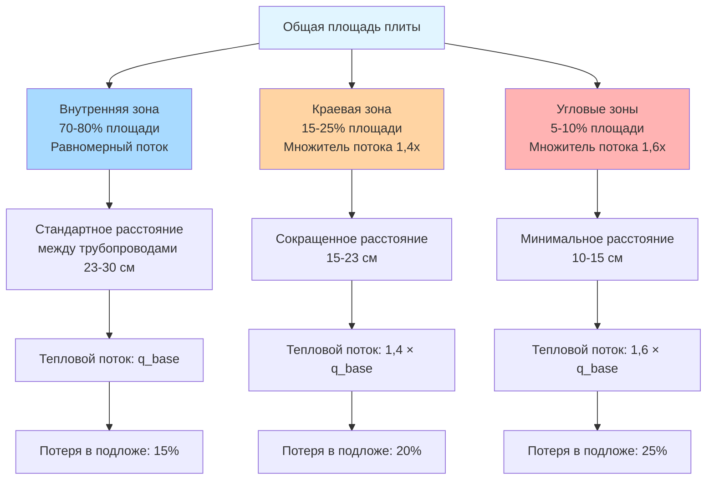

## Физические принципы потерь тепла, зависящих от площади

Производительность системы снеготаяния критически зависит от геометрического соотношения между нагреваемой площадью и условиями на тепловых границах. Передача тепла происходит через три отчетливых механизма: кондуктивные потери в подложку и грунт, конвективные потери в окружающий воздух на открытых поверхностях и лучистый обмен с небом. Полная тепловая нагрузка масштабируется пропорционально площади поверхности, но краевые эффекты вводят неоднородности, требующие специального проектного решения.

Фундаментальный тепловой баланс для плиты снеготаяния:

$$Q_{total} = Q_{snow} + Q_{conv} + Q_{rad} + Q_{edge} + Q_{ground}$$

Где потери в краевых зонах составляют 15-40% от полной тепловой нагрузки в зависимости от геометрии плиты и конфигурации изоляции.

## Расчет общей площади плиты

Валовая нагреваемая площадь определяет первичную тепловую нагрузку и требования к длине трубопровода/кабеля. Для прямоугольных плит:

$$A_{slab} = L \times W$$

Для неправильных геометрий разложите на правильные секции:

$$A_{total} = \sum_{i=1}^{n} A_i$$

Где $A_i$ представляет каждую многоугольную секцию. Используйте средства измерения САПР или координатную геометрию для сложных форм:

$$A_{polygon} = \frac{1}{2} \left| \sum_{i=0}^{n-1} (x_i y_{i+1} - x_{i+1} y_i) \right|$$

**Критическое замечание:** общая площадь непосредственно определяет:
- Требуемую мощность отопления (кДж/ч)
- Длину трубопровода/кабеля (метры)
- Размер циркуляционного насоса (л/мин расход)
- Емкость электроснабжения (кВт)

## Коэффициент свободной площади к общей площади

Коэффициент свободной площади (FAR) учитывает препятствия, водостоки и неотапливаемые зоны в пределах периметра плиты:

$$FAR = \frac{A_{free}}{A_{total}} = \frac{A_{total} - A_{obstructions}}{A_{total}}$$

Типичные значения FAR по назначению:

| Тип применения | Коэффициент свободной площади | Влияние на проектирование |
|-----------------|------------------------------|---------------------------|
| Открытые подъезды | 0,92 - 0,98 | Минимальные вычеты |
| Погрузочные доки | 0,85 - 0,92 | Дверные ниши, водостоки |
| Пешеходные дорожки с деревьями | 0,75 - 0,85 | Скважины под деревьями, клумбы |
| Комплексные площади | 0,65 - 0,80 | Множественные препятствия |

Расчеты теплового потока используют свободную площадь для определения емкости:

$$q_{design} = \frac{Q_{total}}{A_{free}}$$

Такой подход предотвращает недостаточный обогрев из-за препятствий, снижающих эффективную нагреваемую поверхность.

## Длина краевого периметра и тепловое воздействие

Краевые зоны испытывают повышенные потери тепла из-за трехмерных путей теплового потока и сниженной эффективности изоляции. Отношение периметра к площади определяет величину краевого эффекта:

$$R_{PA} = \frac{P}{A_{slab}}$$

Более высокие коэффициенты указывают на большие относительные потери в краевых зонах. Для прямоугольных плит:

$$P = 2(L + W)$$

$$R_{PA} = \frac{2(L + W)}{L \times W}$$

**Характеристики краевой зоны:**

- Ширина: типично 0,3-0,6 м от открытого края
- Множитель теплового потока: 1,3-1,6× во внутренних зонах
- Требование изоляции: RSI-1,76 до RSI-3,52 вертикальная краевая изоляция

Коэффициент потерь тепла в краевой зоне увеличивается обратно пропорционально размеру плиты. Малые плиты ($A < 18,6$ м²) демонстрируют поведение, доминируемое краевыми эффектами, в то время как большие плиты ($A > 92,9$ м²) приближаются к характеристикам, доминируемым внутренней частью.

## Классификация площади по стандартам ASHRAE

ASHRAE классифицирует площади снеготаяния на основе операционного приоритета и критериев проектирования:

| Классификация | Описание | Коэффициент площади | Проектный тепловой поток |
|---|---|---|---|
| Класс I - Критические | Больницы, пожарные депо | 1,0 (полное покрытие) | 2127-2658 кДж/ч·м² |
| Класс II - Коммерческие | Розничная торговля, офисы | 0,8-1,0 | 1595-2127 кДж/ч·м² |
| Класс III - Жилые | Подъезды, дорожки | 0,5-0,8 | 1063-1595 кДж/ч·м² |

Коэффициент площади представляет долю доступного пространства, требующую активного отопления. Системы класса I нагревают 100% критических поверхностей, в то время как класс III может использовать выборочное отопление только полос движения.

## Паттерны распределения теплового потока

Доставка тепла варьируется по пространству плиты из-за расстояния между трубопроводами, краевых эффектов и термической диффузии через бетон:

## Расчет эффективной нагреваемой площади

Термически эффективная площадь учитывает распределение тепла через тепловую проводимость бетона. Для встроенных трубопроводных систем:

$$A_{eff} = n \times L_{tube} \times W_{eff}$$

Где:
- $n$ = количество трубопроводных контуров
- $L_{tube}$ = длина контура (м)
- $W_{eff}$ = эффективная ширина отопления на трубопровод

Эффективная ширина зависит от глубины трубопровода и расстояния между ними:

$$W_{eff} = S \times \eta_{spread}$$

Где $S$ - расстояние между осями трубопроводов, а $\eta_{spread}$ - коэффициент эффективности теплового распределения (0,85-0,95 для правильно спроектированных систем).

Для $S = 30$ см и $\eta_{spread} = 0,90$:

$$W_{eff} = 30 \times 0,90 = 27 \text{ см}$$

## Методология проектирования для определения площади

**Этап 1:** Измерить размеры валовой плиты
- Использовать чертежи "как построено" или полевые измерения
- Включить все нагреваемые поверхности

**Этап 2:** Выявить и количественно определить препятствия
- Рассчитать площади препятствий
- Определить коэффициент свободной площади

**Этап 3:** Рассчитать длину периметра
- Включить все открытые края
- Исключить края, прилегающие к нагреваемым конструкциям

**Этап 4:** Классифицировать краевые зоны
- Отметить полосы краевой зоны 0,3-0,6 м
- Рассчитать процент краевой площади

**Этап 5:** Применить классификацию ASHRAE
- Определить операционные требования
- Выбрать соответствующий коэффициент площади

**Этап 6:** Рассчитать эффективную нагреваемую площадь
- Применить коэффициент свободной площади
- Учесть тепловое распределение

Результирующая эффективная площадь определяет все последующие расчеты, включая требования теплового потока, макет трубопровода и размер системной емкости.

## Практические соображения по площади

**Тепловые мосты:** Структурные проходы, встроенные металлы и строительные швы создают локализованные высокопотерьные области, требующие дополнительной мощности отопления. Добавьте 5-10% к рассчитанной площади для компенсации тепловых мостов.

**Уклоны для дренажа:** Плиты со значительным уклоном (>2%) демонстрируют асимметричные паттерны накопления снега. Ориентируйте трубопровод перпендикулярно направлению уклона для равномерной производительности таяния.

**Прилегающие конструкции:** Неотапливаемые стены и конструкции в пределах 0,9 м от края плиты увеличивают конвективные потери на 20-30%. Расширьте нагреваемую площадь или увеличьте поток в краевой зоне соответственно.

**Будущее расширение:** Спроектируйте трубопроводные коллекторы и источники тепла для 20-30% расширения будущей площади, чтобы обеспечить развитие объекта без полной замены системы.

Точное определение площади является основой надежного проектирования системы снеготаяния. Краевые эффекты, препятствия и тепловое распределение должны все учитываться в расчетах эффективной площади для обеспечения адекватной мощности отопления во всех зонах плиты.
