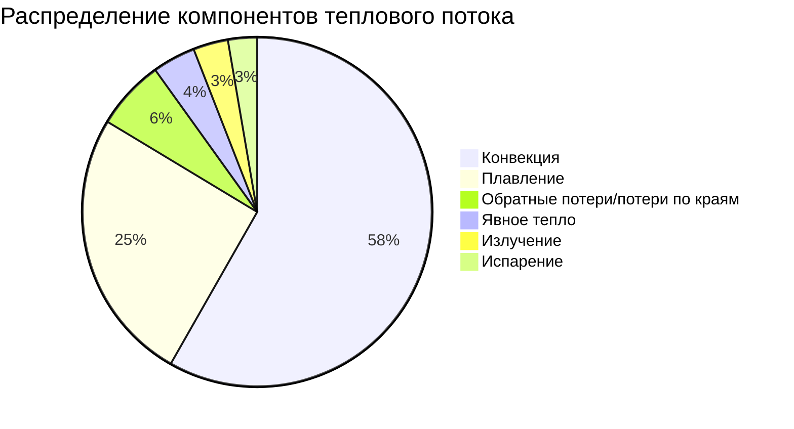

Методология расчета тепловой нагрузки ASHRAE для систем снеготаяния определяет общий тепловой поток, необходимый для плавления снега с заданной скоростью при одновременном преодолении всех потерь тепла. Этот основанный на физике подход учитывает несколько механизмов передачи энергии и обеспечивает основу для точного определения размеров систем во всех климатических зонах.

## Основные компоненты передачи тепла

Общий требуемый тепловой поток представляет собой сумму шести отдельных тепловых нагрузок, каждая из которых подчиняется определенным физическим принципам:

$$q_{total} = q_{sensible} + q_{fusion} + q_{evap} + q_{conv} + q_{rad} + q_{back}$$

Где все величины выражены в Вт/м² (или Btu/hr·ft² в единицах IP). Каждый компонент отражает определенный механизм передачи энергии, необходимый для сохранения свободной ото льда поверхности.

## Явное тепло для повышения температуры снега

Снег поступает на поверхность покрытия при температуре окружающего воздуха, которая варьируется от -20°C до 0°C во время осадков. Явное тепло повышает температуру снега от температуры воздуха до 0°C, точки плавления.

Требование явного тепла следует фундаментальному соотношению:

$$q_{sensible} = \dot{m}_{snow} \cdot c_{p,snow} \cdot \Delta T$$

Для практических расчетов снеготаяния:

$$q_{sensible} = s \cdot \rho_{snow} \cdot c_{p,snow} \cdot (0 - T_{air})$$

Где:
- $s$ = интенсивность снегопада (м/ч или см/ч)
- $\rho_{snow}$ = плотность снега (50–150 кг/м³)
- $c_{p,snow}$ = удельная теплоемкость снега (2,09 кДж/кг·К)
- $T_{air}$ = температура окружающего воздуха (°C)

**Пример расчета:**

Для расчетных условий: $s$ = 25 мм/ч, $\rho_{snow}$ = 100 кг/м³, $T_{air}$ = -10°C

$$q_{sensible} = 0,025 \text{ м/ч} \times 100 \text{ кг/м}^3 \times 2,09 \text{ кДж/кг·К} \times 10 \text{ К}$$
$$q_{sensible} = 52,25 \text{ кДж/ч·м}^2 = 14,5 \text{ Вт/м}^2 \text{ (4,6 Btu/hr·ft}^2\text{)}$$

Компонент явного тепла обычно составляет 5–10 % общих требований теплового потока в умеренных условиях, но значительно увеличивается при экстремальных холодах.

## Скрытая теплота плавления для фазового перехода

Скрытая теплота плавления составляет преобладающую тепловую нагрузку, представляя энергию, необходимую для преобразования льда при 0°C в жидкую воду при 0°C без изменения температуры. Этот фазовый переход требует 334 кДж/кг, значительно больше энергии, чем компонент явного нагревания.

Требование тепла плавления линейно масштабируется с интенсивностью снегопада:

$$q_{fusion} = s \cdot \rho_{snow} \cdot h_{fg}$$

Где:
- $h_{fg}$ = скрытая теплота плавления = 334 кДж/кг

**Стандартные значения проектирования:**

| Интенсивность снегопада | Плотность снега | Массовый поток | Тепловой поток плавления |
|-------------------------|-----------------|----------------|--------------------------|
| 12,7 мм/ч | 100 кг/м³ | 1,27 кг/ч·м² | 118 Вт/м² (37 Btu/hr·ft²) |
| 25,4 мм/ч | 100 кг/м³ | 2,54 кг/ч·м² | 236 Вт/м² (75 Btu/hr·ft²) |
| 38,1 мм/ч | 100 кг/м³ | 3,81 кг/ч·м² | 354 Вт/м² (112 Btu/hr·ft²) |
| 50,8 мм/ч | 100 кг/м³ | 5,08 кг/ч·м² | 471 Вт/м² (150 Btu/hr·ft²) |

ASHRAE рекомендует 25,4 мм/ч в качестве стандартной расчетной интенсивности снегопада для умеренных климатов, 38,1 мм/ч для регионов с обильными снегопадами и 50,8 мм/ч для экстремальных условий. Этот компонент отдельно составляет 40–60 % общей мощности системы.

## Потери тепла на испарение

После таяния снега жидкая вода на поверхности покрытия испаряется в воздушный поток, потребляя значительное количество скрытого тепла. Скорость испарения зависит от температуры поверхности, температуры воздуха, относительной влажности и скорости ветра.

ASHRAE предоставляет эмпирическую корреляцию для теплового потока испарения:

$$q_{evap} = h_{fg,water} \cdot \dot{m}_{evap}$$

Массовая скорость испарения следует:

$$\dot{m}_{evap} = h_{m} \cdot A \cdot (P_{sat,surface} - P_{vapor,air})$$

Где:
- $h_{m}$ = коэффициент массопередачи (функция скорости ветра)
- $P_{sat,surface}$ = давление насыщенного пара при температуре поверхности
- $P_{vapor,air}$ = парциальное давление водяного пара в воздухе

Для практического проектирования ASHRAE рекомендует упрощенный подход:

$$q_{evap} = 0,0013 \cdot V_{wind} \cdot (P_{sat} - P_{air})$$

Где $V_{wind}$ в миль/ч и давления в дюймах ртутного столба, выдавая $q_{evap}$ в Btu/hr·ft².

**Типичные значения проектирования:**

При температуре поверхности 2°C, температуре воздуха 0°C, относительной влажности 80 % и скорости ветра 6,7 м/с:
- $P_{sat}$ = 0,225 в Hg
- $P_{air}$ = 0,80 × 0,181 = 0,145 в Hg
- $q_{evap}$ = 0,0013 × 6,7 м/с × (0,225 - 0,145) = 0,0016 Btu/hr·ft² на м/с·в Hg
- Общий поток испарения: 20–40 Вт/м² (6–13 Btu/hr·ft²)

Этот компонент составляет 8–15 % общего теплового потока и значительно возрастает с увеличением скорости ветра и низкой влажности.

## Конвективные потери тепла

Вынужденная конвекция от потока ветра через поверхность покрытия передает тепло от теплой поверхности к холодному окружающему воздуху. Это представляет наибольшие непрерывные потери тепла во время работы системы.

Скорость конвективной передачи тепла следует закону охлаждения Ньютона:

$$q_{conv} = h_{conv} \cdot (T_{surface} - T_{air})$$

Коэффициент конвективной передачи тепла сильно зависит от скорости ветра:

$$h_{conv} = 5,7 + 3,8 \cdot V_{wind}$$

В единицах СИ (Вт/м²·К при $V_{wind}$ в м/с):

$$h_{conv} = 32,4 + 6,7 \cdot V_{wind}$$

**Пример расчета:**

Для $T_{surface}$ = 2°C, $T_{air}$ = -5°C, $V_{wind}$ = 6,7 м/с:

$$h_{conv} = 32,4 + 6,7 \times 6,7 = 77,3 \text{ Вт/м}^2\text{·К}$$
$$q_{conv} = 77,3 \times (2 - (-5)) = 541 \text{ Вт/м}^2 \text{ (172 Btu/hr·ft}^2\text{)}$$

Скорость ветра оказывает наибольшее влияние на общие требования теплового потока. Каждое увеличение скорости ветра на 1 м/с повышает тепловой поток примерно на 45–50 Вт/м² (14–16 Btu/hr·ft²).

## Радиационные потери тепла

Тепловое излучение от поверхности покрытия в небо представляет вторичный, но значительный механизм потерь тепла, особенно в ясные ночи, когда эффективная температура неба значительно ниже температуры воздуха.

Радиационная передача тепла следует закону Стефана–Больцмана:

$$q_{rad} = \epsilon \cdot \sigma \cdot F_{view} \cdot (T_{surface}^4 - T_{sky}^4)$$

Где:
- $\epsilon$ = коэффициент излучательности поверхности (0,85–0,95 для бетона/асфальта)
- $\sigma$ = постоянная Стефана–Больцмана (5,67 × 10⁻⁸ Вт/м²·К⁴)
- $F_{view}$ = угловой коэффициент на небо (0,5–1,0 в зависимости от окружения)
- Температуры в абсолютных единицах (К)

Для малых разностей температур это линеаризуется в:

$$q_{rad} = h_{rad} \cdot (T_{surface} - T_{sky})$$

Где $h_{rad}$ = 4·$\epsilon$·$\sigma$·$T_{mean}^3$ ≈ 5–7 Вт/м²·К для типичных условий.

**Подход к проектированию:**

ASHRAE рекомендует использовать эффективную температуру неба:

$$T_{sky} = T_{air} - \Delta T_{sky}$$

Где $\Delta T_{sky}$ = 3–6°C для ясного неба, 0–2°C для облачных условий.

При типичных расчетных условиях (ясное небо, облачно во время снегопада):
$$q_{rad} = 20-40 \text{ Вт/м}^2 \text{ (6-13 Btu/hr·ft}^2\text{)}$$

Это составляет 5–10 % общего теплового потока при стандартных расчетных условиях.

## Выбор расчетной интенсивности снегопада

Расчетная интенсивность снегопада определяет мощность системы снеготаяния и напрямую влияет как на капитальные, так и на эксплуатационные затраты. ASHRAE предоставляет рекомендации для конкретного климата на основе анализа метеорологических данных.

**Критерии проектирования ASHRAE:**

| Классификация климата | Снегопад 99 % | Снегопад 95 % | Рекомендуемое проектирование |
|----------------------|---------------|---------------|------------------------------|
| Регионы с легким снегом | 7,6 мм/ч | 12,7 мм/ч | 12,7 мм/ч |
| Регионы с умеренным снегом | 17,8 мм/ч | 25,4 мм/ч | 25,4 мм/ч |
| Регионы с обильным снегом | 30,5 мм/ч | 38,1 мм/ч | 38,1 мм/ч |
| Регионы с экстремальным снегом | 38,1 мм/ч | 50,8 мм/ч | 50,8 мм/ч |

Интенсивность снегопада 99 % указывает, что только 1 % зарегистрированных снежных событий превышает эту интенсивность. Системы, спроектированные по этому критерию, обеспечивают свободную ото льда работу во время 99 % событий, но могут проявлять временное накопление снега во время наиболее суровых 1 % бурь.

## Комплексный пример расчета нагрузки

**Расчетные условия:**
- Место: Чикаго, Иллинойс (регион с умеренным снегом)
- Интенсивность снегопада: 25,4 мм/ч
- Плотность снега: 100 кг/м³
- Температура воздуха: -5°C
- Скорость ветра: 6,7 м/с
- Относительная влажность: 80 %
- Температура поверхности: 2°C
- Облачность: облачно

**Расчеты компонентов:**

1. Явное тепло:
   - $q_{sensible}$ = 0,0254 × 100 × 2,09 × 7 = 37,1 Вт/м² (11,8 Btu/hr·ft²)

2. Скрытая теплота плавления:
   - $q_{fusion}$ = 0,0254 × 100 × 334 = 236 Вт/м² (74,8 Btu/hr·ft²)

3. Испарение:
   - $q_{evap}$ = 25 Вт/м² (7,9 Btu/hr·ft²) из эмпирической корреляции

4. Конвекция:
   - $h_{conv}$ = 32,4 + 6,7 × 6,7 = 77,3 Вт/м²·К
   - $q_{conv}$ = 77,3 × 7 = 541 Вт/м² (171,5 Btu/hr·ft²)

5. Излучение:
   - $T_{sky}$ = -5 - 1 = -6°C (облачно, небольшая поправка)
   - $q_{rad}$ = 30 Вт/м² (9,5 Btu/hr·ft²)

6. Обратные потери/потери по краям (10 % поверхностных потерь):
   - $q_{back}$ = 60 Вт/м² (19,0 Btu/hr·ft²)

**Общий требуемый тепловой поток:**
$$q_{total} = 37 + 236 + 25 + 541 + 30 + 60 = 929 \text{ Вт/м}^2 \text{ (294 Btu/hr·ft}^2\text{)}$$

Это находится в диапазоне ASHRAE Class III (тяжелой нагрузки), подходящем для критических участков доступа в этом климате.

## Обратные потери и потери по краям

Помимо поверхностных потерь, плиты снеготаяния испытывают нисходящую проводимость через конструкцию покрытия и боковую проводимость на неотапливаемые периферийные зоны.

**Нисходящие потери:**

$$q_{back} = \frac{T_{surface} - T_{ground}}{R_{total}}$$

Где $R_{total}$ включает тепловые сопротивления покрытия и грунта. Изоляция под плитой (RSI-1,76 минимум, RSI-2,65 предпочтительно) снижает эту потерю с 80–100 Вт/м² до 20–30 Вт/м² (25–32 до 6–10 Btu/hr·ft²).

**Потери по краям:**

Периферийные зоны теряют тепло боком на соседние неотапливаемые поверхности. ASHRAE рекомендует увеличивать тепловой поток краевой зоны на 25–50 % от внутренних зон, что достигается путем:
- Уменьшенного расстояния между трубками/кабелями (67–75 % от расстояния внутренних зон)
- Повышенной температуры жидкости (+5–10°C)
- Вертикальной краевой изоляции, расширяющейся на 0,6 м ниже поверхности земли

## Справочные стандарты

Полные процедуры проектирования и данные для конкретного климата представлены в:
- **ASHRAE Handbook—HVAC Applications, Chapter 51: Snow Melting and Freeze Protection**
- **ASHRAE Snow Melting Design Guide** (предоставляет разработанные примеры и рабочие таблицы расчета нагрузки)

Эти справочники включают подробные психрометрические соотношения, корреляции скорости ветра и региональные данные об интенсивности снегопада, необходимые для точного определения размеров систем во всех климатических зонах Северной Америки.
