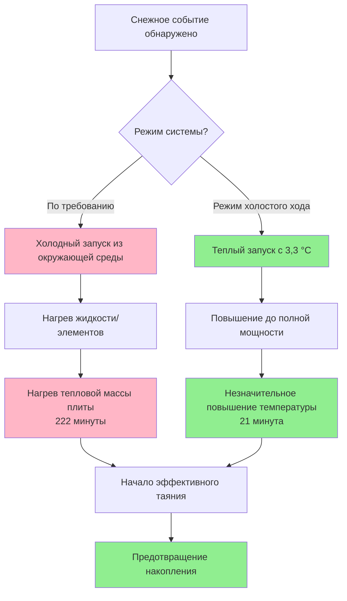
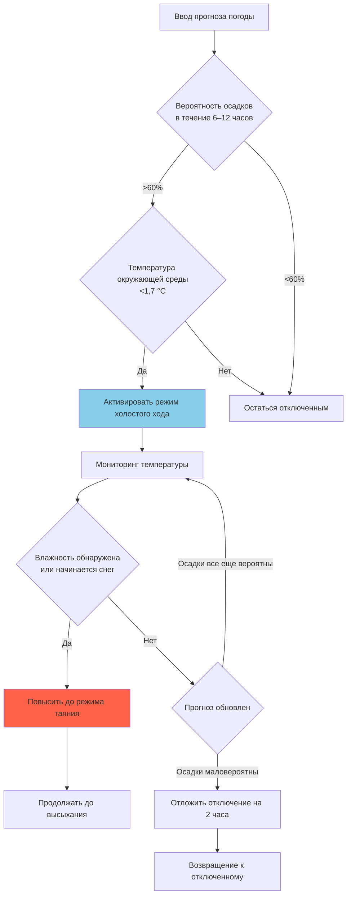
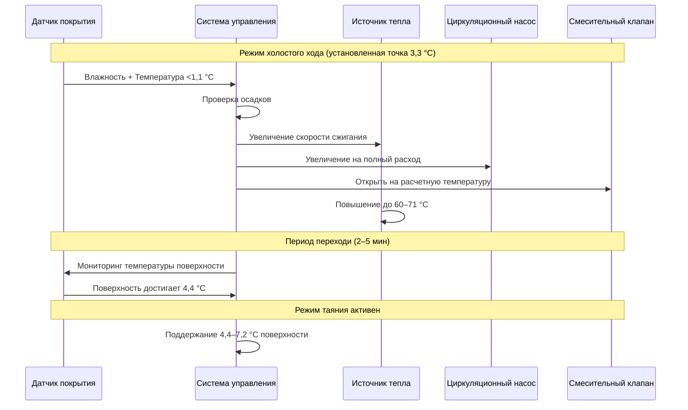

Режим холостого хода представляет собой состояние работы с пониженной мощностью, при котором системы снеготаяния поддерживают температуру плиты выше точки замерзания для обеспечения быстрого отклика при начале осадков. Эта стратегия обменивает непрерывное потребление энергии на низком уровне на значительно улучшенную производительность системы и сокращенное время задержки между началом погодного события и эффективной очисткой снега.

## Основные принципы работы в режиме холостого хода

Режим холостого хода поддерживает температуру покрытия плиты немного выше точки замерзания воды, обычно 2–4 °C. Эта предварительная подготовка служит двум критическим функциям: предотвращению образования льда между падающим снегом и поверхностью покрытия, а также снижению тепловой инертности, которую необходимо преодолеть при переходе в режим полного таяния.

Физика работы в режиме холостого хода сосредоточена на поддержании положительного температурного градиента от поверхности плиты к окружающей среде при минимизации требуемого теплового потока. Баланс тепла в установившемся состоянии для режима холостого хода:

$$q_{idle} = h_c(T_s - T_a) + h_r(T_s - T_{sky}) + q_{ground}$$

Где:
- $q_{idle}$ = тепловой поток в режиме холостого хода (кДж/ч·м²)
- $h_c$ = коэффициент конвективной теплопередачи (кДж/ч·м²·°C)
- $T_s$ = температура поверхности плиты (°C)
- $T_a$ = температура окружающего воздуха (°C)
- $h_r$ = коэффициент лучистой теплопередачи (кДж/ч·м²·°C)
- $T_{sky}$ = эффективная температура неба (°C)
- $q_{ground}$ = потери тепла через кондукцию вниз (кДж/ч·м²)

Для типичных зимних условий с скоростью ветра 16–24 км/ч объединенный коэффициент конвективной и лучистой теплопередачи приближается к 28–45 кДж/ч·м²·°C, что дает требуемый тепловой поток в режиме холостого хода 63–158 кДж/ч·м² в зависимости от температуры окружающей среды.

## Требования к тепловому потоку в режиме холостого хода

Тепловой поток в режиме холостого хода варьируется в зависимости от климатических условий и желаемой температуры ожидания. Связь следует упрощенной форме:

$$q_{idle} = U_{eff}(T_{idle} - T_{design})$$

Где:
- $U_{eff}$ = эффективный коэффициент потерь тепла (кДж/ч·м²·°C)
- $T_{idle}$ = целевая температура холостого хода (обычно 3,3 °C)
- $T_{design}$ = расчетная температура окружающей среды (°C)

Для практических целей проектирования требования к тепловому потоку в режиме холостого хода по климатическим зонам:

| Климатическая зона | Расчетная температура (°C) | Тепловой поток (кДж/ч·м²) | % от полной нагрузки |
|-------------------|---------------------------|--------------------------|----------------------|
| Мягкий (-3–0 °C) | -2,2 | 63–95 | 20–25% |
| Умеренный (-7–-4 °C) | -6,7 | 95–126 | 25–30% |
| Холодный (-9–-7 °C) | -12,2 | 126–158 | 30–35% |
| Экстремальный (<-18 °C) | -20,6 | 158–190 | 35–40% |

Процент требуемой полнолюдной мощности для холостого хода увеличивается в более холодном климате, потому что температурный перепад между установленной точкой холостого хода и условиями окружающей среды становится больше. Однако абсолютный тепловой поток в режиме холостого хода остается относительно скромным по сравнению с требованиями режима таяния 474–1264 кДж/ч·м².

## Преимущества времени отклика

Основное преимущество режима холостого хода — драматическое сокращение времени отклика системы при начале снегопада. Время отклика состоит из двух компонентов: тепловой задержки при нагреве встроенной жидкости или электрических элементов и эффекта тепловой массы при повышении температуры плиты от окружающей среды до эффективных условий таяния.

**Расчет времени повышения температуры**

Для гидронных систем время, необходимое для перехода из режима холостого хода в режим полного таяния:

$$t_{response} = \frac{m_{slab}c_{concrete}(T_{melt} - T_{idle})}{q_{available} \cdot A}$$

Где:
- $t_{response}$ = время достижения режима таяния (часы)
- $m_{slab}$ = масса плиты на единицу площади (кг/м²)
- $c_{concrete}$ = удельная теплоемкость бетона (1,05 кДж/кг·°C)
- $T_{melt}$ = целевая температура таяния (обычно 4,4–7,2 °C)
- $T_{idle}$ = начальная температура холостого хода (3,3 °C)
- $q_{available}$ = доступная тепловая мощность (кДж/ч·м²)
- $A$ = площадь плиты (м²)

Для плиты толщиной 10 см (243 кг/м²):

**Без режима холостого хода (начиная с -6,7 °C):**
$$t_{response} = \frac{243 \times 1,05 \times (4,4-(-6,7))}{790} = 3,7 \text{ часа (3 часа 42 минуты)}$$

**С режимом холостого хода (начиная с 3,3 °C):**
$$t_{response} = \frac{243 \times 1,05 \times (4,4-3,3)}{790} = 0,36 \text{ часа (21 минута)}$$

Этот расчет демонстрирует, что режим холостого хода сокращает время отклика примерно на 90%, позволяя системе предотвратить накопление снега, а не пытаться растопить уже выпавший снег.

## Анализ потребления энергии

Потребление энергии в режиме холостого хода зависит от трех факторов: теплового потока холостого хода, продолжительности работы и частоты событий таяния. Комплексный анализ энергии должен учитывать как периоды холостого хода, так и сниженную энергию, требуемую при переходе в режим таяния, благодаря предварительной подготовке.

**Сравнение сезонной энергии**

Общее сезонное потребление энергии состоит из энергии холостого хода плюс энергия таяния:

$$E_{total} = q_{idle} \cdot A \cdot t_{idle} + q_{melt} \cdot A \cdot t_{melt}$$

Где:
- $E_{total}$ = общее сезонное энергопотребление (кДж)
- $t_{idle}$ = кумулятивные часы холостого хода (часы)
- $t_{melt}$ = кумулятивные часы таяния (часы)

Для умеренной климатической зоны (Миннеаполис, МН):
- Потенциальные часы холостого хода за сезон: 2200 часов (ноябрь–март)
- Фактические часы таяния за сезон: 150 часов
- Средний тепловой поток холостого хода: 111 кДж/ч·м²
- Средний тепловой поток таяния: 711 кДж/ч·м²

**Энергия стратегии холостого хода:**
$$E_{idle} = 111 \times 2200 = 244 000 \text{ кДж/м²}$$
$$E_{melt} = 711 \times 150 = 106 650 \text{ кДж/м²}$$
$$E_{total} = 350 650 \text{ кДж/м²}$$

**Энергия стратегии по требованию:**
Расширенный прогрев требует более высокой энергии и более длительных периодов таяния:
$$E_{melt} = 711 \times 185 = 131 535 \text{ кДж/м²}$$

Подход по требованию экономит примерно 244 000 кДж/м² в энергии холостого хода, но требует дополнительных 24 885 кДж/м² в расширенном времени таяния и менее эффективном управлении снегом, что приводит к чистой экономии 219 115 кДж/м², но существенно скомпрометированной производительности.

**Экономический анализ**

Для системы площадью 93 м² на природном газе при стоимости 2,50 грн./ГДж (эквивалент) с КПД котла 85%:

- **Стоимость холостого хода:** $\frac{244 000 \times 93}{1 000 000 \times 0,85} = 26,6$ грн. за сезон
- **Преимущество производительности:** Предотвращение накопления, снижение ответственности, снижение ручной очистки снега

Экономическое решение зависит от стоимости, придаваемой немедленной очистке снега, по сравнению со стоимостью энергии. Системы класса III (больницы, пожарные станции, критические учреждения) повсеместно используют режим холостого хода. Системы класса II используют избирательный холостой ход на основе прогноза погоды. Системы класса I обычно работают только по требованию.

## Стратегии управления режимом холостого хода

Эффективное управление режимом холостого хода требует алгоритмов прогнозирования погоды и активации на основе температуры для минимизации ненужной работы при обеспечении готовности при необходимости.

### Активация холостого хода на основе прогноза

Передовые системы управления активируют режим холостого хода на основе метеорологических прогнозов, указывающих на вероятность осадков в течение определенного временного горизонта:

**Логика активации на основе прогноза:**

Эта стратегия снижает ненужные часы холостого хода на 30–50% по сравнению с активацией только по температуре, сохраняя при этом способность быстрого отклика.

### Обслуживание температуры плиты

Точное управление температурой во время холостого хода предотвращает как чрезмерное потребление энергии, так и неадекватную предварительную подготовку. Пропорционально-интегральное (ПИ) управление поддерживает стабильную температуру плиты:

$$\dot{Q}(t) = K_p(T_{setpoint} - T_{slab}) + K_i \int_0^t (T_{setpoint} - T_{slab}) \, d\tau$$

Где:
- $\dot{Q}(t)$ = выходная тепловая мощность (кДж/ч)
- $K_p$ = коэффициент пропорционального усиления
- $K_i$ = коэффициент интегрального усиления
- $T_{setpoint}$ = целевая температура холостого хода (3,3 °C)
- $T_{slab}$ = измеренная температура плиты (°C)

Типичные параметры настройки ПИ для снеготаяния:
- $K_p$ = 264–528 кДж/ч на 1 °C отклонения
- $K_i$ = 52,8–132 кДж/ч на 1 °C·час

Правильно настроенное ПИ управление поддерживает температуру плиты в пределах ±0,56 °C от установленной точки, предотвращая температурные колебания, которые тратят энергию на повторяющиеся циклы нагрева и охлаждения.

### Избирательный холостой ход на основе зон

Крупные установки получают выгоду от холостого хода на основе зон, который приоритизирует критические области доступа, отодвигая менее существенные зоны на режим работы по требованию:

| Приоритетная зона | Описание | Стратегия холостого хода | Целевой отклик |
|------------------|---------|------------------------|-----------------|
| Зона 1 | Критический доступ (экстренный вход) | Непрерывный холостой ход | <5 минут |
| Зона 2 | Высокий трафик (основной вход) | Холостой ход на основе прогноза | <15 минут |
| Зона 3 | Умеренный трафик (вторичные пути) | По требованию | <45 минут |
| Зона 4 | Низкий приоритет (удаленные области) | Ручная активация | Переменная |

Этот многоуровневый подход снижает общую энергию холостого хода на 40–60%, сохраняя при этом быстрый отклик там, где это наиболее критично. Система управления активирует зоны последовательно на основе приоритета при наличии условий прогноза.

## Эффекты тепловой массы и проектирование плиты

Тепловая масса бетона значительно влияет на требования к потреблению энергии в режиме холостого хода и характеристики отклика. Более толстые плиты хранят больше тепловой энергии, но требуют большего теплового ввода для поддержания температуры.

**Расчет тепловой массы**

Объемная тепловая масса на единицу площади:

$$M_{thermal} = \rho_{concrete} \cdot t_{slab} \cdot c_{concrete}$$

Где:
- $\rho_{concrete}$ = плотность бетона (2323 кг/м³)
- $t_{slab}$ = толщина плиты (м)
- $c_{concrete}$ = удельная теплоемкость (1,05 кДж/кг·°C)

| Толщина плиты | Тепловая масса (кДж/м²·°C) | Стабильность холостого хода | Время отклика |
|--------------|---------------------------|---------------------------|--------------|
| 7,6 см | 178 | Низкая (±1,1 °C вариация) | Быстрое (3–4 мин) |
| 10,2 см | 237 | Умеренная (±0,83 °C) | Умеренное (5–6 мин) |
| 12,7 см | 296 | Хорошая (±0,56 °C) | Умеренное (7–8 мин) |
| 15,2 см | 355 | Отличная (±0,28 °C) | Более медленное (10–12 мин) |

Оптимальная толщина плиты для приложений холостого хода балансирует тепловую стабильность с временем отклика. Диапазон 10–13 см обеспечивает адекватную тепловую буферизацию без чрезмерной тепловой инертности. Более толстые плиты (15+ см) подходят для установок класса III, где стабильность перевешивает скорость отклика.

**Изоляция под плитой**

Изоляция под плитой резко снижает потребление энергии холостого хода, минимизируя потери тепла вниз. Снижение теплового потока холостого хода при изоляции:

$$q_{idle,insulated} = q_{idle,uninsulated} - \frac{T_{idle} - T_{ground}}{R_{insulation}}$$

Для двухдюймовой жесткой изоляции XPS (RSI 1,76) при температуре грунта 4,4 °C:

$$\Delta q = \frac{3,3-4,4}{1,76} = -0,62 \text{ кДж/ч·м²}$$

Однако основное преимущество наблюдается во время режима таяния. Во время холостого хода температура грунта часто приближается к температуре плиты, минимизируя выгоду. Экономическое обоснование изоляции вытекает в первую очередь из экономии энергии в режиме таяния в размере 15–25%.

## Переход из режима холостого хода в режим таяния

Последовательность управления для переходов между режимами работы должна выполняться плавно, чтобы предотвратить перепады температуры, циклирование оборудования или задержанный отклик.

**Стандартная последовательность перехода:**

**Расчет усиливающего тепла**

Дополнительное тепло, необходимое для быстрого перехода из режима холостого хода в режим таяния:

$$Q_{boost} = m_{slab} \cdot c_{concrete} \cdot (T_{melt} - T_{idle}) + q_{melt} \cdot A \cdot t_{transition}$$

Это представляет собой сумму явного тепла для повышения температуры плиты плюс тепло, необходимое для поддержания условий поверхности во время переходного периода. Для системы площадью 93 м² с плитой толщиной 10 см:

$$Q_{boost} = (243 \times 93) \times 1,05 \times (4,4-3,3) + 711 \times 93 \times 0,133 = 126 300 \text{ кДж}$$

Оборудование источника тепла должно обеспечивать номинальную мощность плюс это требование усиления для достижения расчетного времени отклика. Для гидронных систем мощность котла должна быть:

$$Q_{boiler} \geq q_{melt} \cdot A + \frac{Q_{boost}}{t_{response,target}}$$

Где $t_{response,target}$ — желаемое время переходи (обычно 5–10 минут = 0,083–0,167 часа).

## Стратегии оптимизации производительности

Несколько стратегий проектирования и эксплуатации оптимизируют производительность режима холостого хода при управлении потреблением энергии.

**Переменная температура холостого хода**

Вместо поддержания постоянной температуры холостого хода, передовые системы модулируют установленную точку на основе вероятности прогноза и времени до события:

$$T_{idle,variable} = T_{ambient} + \Delta T_{buffer}$$

Где $\Delta T_{buffer}$ увеличивается с 1,1 °C (минимальный холостой ход) до 5,6 °C (полная предварительная подготовка) по мере увеличения вероятности снега и приближения события. Это снижает среднюю энергию холостого хода на 20–30%, сохраняя при этом способность отклика при необходимости.

**Сброс температуры жидкости**

Гидронные системы используют сброс наружного воздуха во время холостого хода для минимизации потерь распределения:

$$T_{fluid,idle} = T_{slab,target} + \Delta T_{required}$$

Где $\Delta T_{required}$ — минимальный требуемый температурный перепад для доставки теплового потока холостого хода, обычно 5,6–11,1 °C. Более низкие температуры жидкости снижают потери тепла в трубопроводах на 30–50% в периодах расширенного холостого хода.

**Активация на основе заселения**

Для коммерческих установок с предсказуемыми моделями трафика расписания заселения переопределяют активацию на основе погоды для обеспечения очищенных поверхностей во время деловых часов:

- Ночное снижение: Минимальный холостой ход (0,56 °C) или отключение в 22:00–5:00
- Предварительный прогрев перед заселением: Полная активация холостого хода за 2 часа до открытия
- Деловые часы: Холостой ход на основе прогноза с переопределением приоритета
- После заселения: Продолжение работы 1 час после закрытия, затем только на основе погоды

Этот подход снижает общие часы холостого хода на 15–25% для типичных коммерческих расписаний, обеспечивая при этом очищенный доступ во время рабочих периодов.

## Рекомендации по применению по классам систем

Выбор стратегии холостого хода в основном зависит от классификации системы и приоритетов эксплуатации:

**Системы класса I (жилые)**
- Рекомендация: Только работа по требованию
- Обоснование: Стоимость энергии перевешивает преимущество удобства
- Исключение: Пожилые люди или люди с ограниченной мобильностью могут оправдать холостой ход на основе прогноза

**Системы класса II (коммерческие)**
- Рекомендация: Избирательный холостой ход на основе прогноза
- Обоснование: Баланс стоимости энергии с ответственностью и эксплуатационными потребностями
- Стратегия: Активировать холостой ход за 3–6 часов до прогнозируемых осадков

**Системы класса III (критический доступ)**
- Рекомендация: Непрерывный или минимально модулируемый холостой ход
- Обоснование: Требования к доступности в эксплуатации превалируют над соображениями энергии
- Стратегия: Поддерживать температуру плиты 2–4 °C в течение всего зимнего сезона

## Руководство по проектированию ASHRAE

Справочник ASHRAE — Приложение HVAC, Глава 51 содержит ограниченные конкретные рекомендации по режиму холостого хода, сосредотачиваясь вместо этого на требованиях полной нагрузки таяния. Однако основные принципы теплопередачи и рекомендации по управлению применяются непосредственно к работе в режиме холостого хода.

Ключевые принципы ASHRAE, относящиеся к холостому ходу:
- Температура поверхности должна оставаться выше точки росы, чтобы предотвратить образование инея
- Системы управления должны предотвращать короткие циклы (минимум 15-минутные циклы работы)
- Датчики температуры требуют калибровочную точность ±1,1 °C для эффективного управления холостым ходом
- Упреждающее управление улучшает производительность по сравнению с работой только реактивного типа

Уравнения теплового потока, предусмотренные в главе 51 ASHRAE, могут быть непосредственно применены к режиму холостого хода путем подстановки уменьшенных температурных перепадов и учета отсутствия компонентов нагрузки таяния.

## Заключение

Работа в режиме холостого хода представляет собой выбор проектирования, который обменивает непрерывное потребление энергии на низком уровне на значительно улучшенное время отклика системы и эффективность управления снегом. Решение о внедрении холостого хода зависит от классификации системы, суровости климата, стоимости энергии и стоимости, придаваемой немедленной очистке снега, в сравнении с рабочей экономией.

Правильно спроектированные и контролируемые системы холостого хода сокращают время отклика на 85–95% по сравнению с работой по требованию, обеспечивая предотвращение накопления снега вместо реактивного таяния. Энергетический штраф в размере 221 000–284 000 кДж/м² за сезон должен быть взвешен против улучшенной безопасности, снижения риска ответственности и исключения ручной очистки снега в критическую первую фазу погодных событий.

Передовые стратегии управления, включая активацию на основе прогноза погоды, переменную температуру холостого хода и приоритизацию на основе зон, могут снизить энергию холостого хода на 30–60%, сохраняя при этом основное преимущество быстрого отклика.
