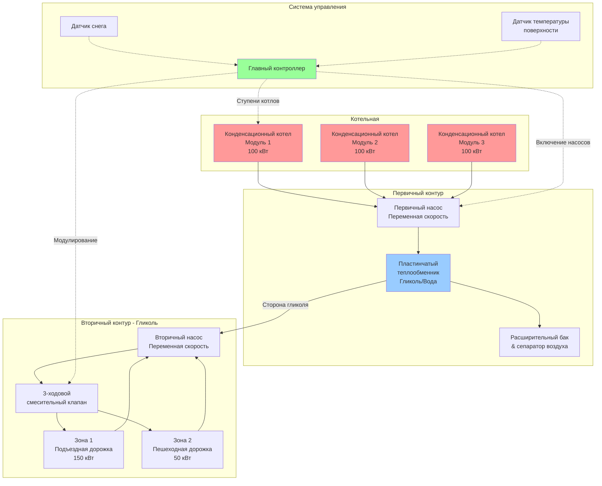

Котлы служат основным источником тепла в большинстве гидравлических систем таяния снега, преобразуя энергию топлива в тепловую энергию, циркулирующую через встроенные трубопроводные сети. Выбор и расчет котельного оборудования напрямую влияют на производительность системы, стоимость эксплуатации и надежность во время критических снежных событий.

## Фундаментальные принципы теплопередачи

Таяние снега представляет собой динамическую задачу теплопередачи, включающую три одновременно действующих режима:

**Теплопроводность** через плиту доставляет тепло от встроенных труб на поверхность. Скорость следует закону Фурье, где теплопроводность бетона (1,4–1,7 Вт/м·К) и глубина укладки труб определяют необходимый градиент температуры.

**Конвекция** с поверхности передает тепло окружающему воздуху и падающему снегу. Коэффициент конвективной теплопередачи варьируется в зависимости от скорости ветра, обычно находясь в диапазоне 15–50 Вт/м²·К для наружных условий. Ветер значительно усиливает теплопотери.

**Испарение** талого снега и стоячей воды потребляет значительное количество энергии. Скрытая теплота парообразования (2257 кДж/кг при 0°C) означает, что потери на испарение часто превышают требования на чувствительное нагревание во время активного таяния.

**Излучение** происходит между поверхностью покрытия и небом, землей и окружающими конструкциями. Чистое излучение может быть отрицательным (потеря тепла) при ясном небе или положительным при облачном покрытии.

## Расчет производительности котла

Требуемая производительность котла для применения таяния снега превышает стандартные нагрузки на отопление помещений в 5–10 раз. Точный расчет требует детальных расчетов нагрузки в соответствии со стандартами ASHRAE.

### Требуемый тепловой поток на поверхности

Фундаментальное уравнение для требуемого поверхностного теплового потока:

$$q_s = q_o + A_R \cdot q_m$$

Где:
- $q_s$ = общий требуемый поверхностный тепловой поток (Вт/м²)
- $q_o$ = тепловой поток для содержания открытого покрытия (режим ожидания)
- $A_R$ = коэффициент площади (доля поверхности без снега, обычно 1,0 для полного таяния)
- $q_m$ = дополнительный тепловой поток для активного таяния снега

### Расчет нагрузки на таяние снега по ASHRAE

Полное уравнение теплового баланса учитывает все режимы передачи:

$$q_{total} = q_{sensible} + q_{latent} + q_{radiation} + q_{back}$$

**Чувствительное тепло** для таяния снега:

$$q_{sensible} = s \cdot c_p \cdot (T_f - T_a)$$

Где:
- $s$ = интенсивность снегопада (кг/м²·ч)
- $c_p$ = удельная теплоемкость снега/льда (2,1 кДж/кг·К)
- $T_f$ = пленочная температура на поверхности (обычно 0–2°C)
- $T_a$ = температура окружающего воздуха (°C)

**Скрытое тепло** для таяния и испарения:

$$q_{latent} = s \cdot (h_{fusion} + h_{evap})$$

Где:
- $h_{fusion}$ = теплота плавления (334 кДж/кг)
- $h_{evap}$ = теплота парообразования (2257 кДж/кг)

**Конвективные потери тепла** в воздух:

$$q_{conv} = h_c \cdot (T_s - T_a)$$

Где:
- $h_c$ = коэффициент конвективной теплопередачи (функция скорости ветра)

**Потери через основание** через плиту:

$$q_{back} = U \cdot (T_f - T_g)$$

Где:
- $U$ = общий коэффициент теплопередачи через изоляцию
- $T_g$ = температура грунта под плитой

### Общее требуемое производство котла

$$Q_{boiler} = \frac{A \cdot q_{total}}{\eta_{sys}}$$

Где:
- $A$ = площадь таяния снега (м²)
- $\eta_{sys}$ = общая эффективность системы (0,85–0,95)

**Пример расчета:** для подъездной дорожки площадью 500 м² в климате с расчетной интенсивностью снегопада 25 мм/ч:

- Расчетный тепловой поток: 400 Вт/м² (типично для умеренного климата)
- Общая тепловая нагрузка: 500 м² × 400 Вт/м² = 200 кВт
- Требуемая производительность котла (эффективность системы 85%): 200 кВт / 0,85 = 235 кВт (803 МДж/ч)

## Типы котлов для таяния снега

| Тип котла | Тепловая эффективность | Коэффициент модулирования | Совместимость с гликолем | Стоимость капитала | Оптимальное применение |
|-----------|------------------------|--------------------------|-------------------------|-------------------|----------------------|
| Конденсационный газовый | 95–98% | 10:1 до 20:1 | Отличная | Высокая | Новые установки, низкие обратные температуры |
| Неконденсационный газовый | 80–85% | 4:1 до 5:1 | Хорошая | Средняя | Реконструкция, более высокие обратные температуры |
| На жидком топливе | 82–87% | 3:1 до 4:1 | Хорошая | Средняя | Районы без газоснабжения |
| Электрическое сопротивление | 99%+ | Бесконечное | Отличная | Низкая | Малые площади, удаленные расположения |
| Модульный конденсационный | 95–98% | 20:1+ (ступенчатое) | Отличная | Высокая | Большие площади, переменные нагрузки |

## Выделенная и совместная котельная установка

**Выделенные котлы для таяния снега** работают независимо от систем отопления здания. Эта конфигурация обеспечивает несколько преимуществ:

- Независимое управление температурой (таяние снега требует 40–60°C подачи vs 70–85°C для отопления помещений)
- Упрощенная защита от гликоля (системы здания обычно используют воду)
- Исключает риск перекрестного загрязнения
- Позволяет оптимально выбрать котел для прерывистого режима с высокой нагрузкой

**Совместные котельные установки** обслуживают как нагрузки таяния снега, так и отопления помещений через надлежащее гидравлическое разделение:

- Меньшая стоимость капитала (единственная котельная)
- Лучшее использование оборудования в переходные сезоны
- Требует теплообменника для разделения контуров гликоля и воды
- Требует сложного управления для приоритизации конфликтующих требований
- Может требовать увеличенного котла для обработки суммарных пиковых нагрузок

## Конфигурация системы

## Управление модулирующей горелкой

Современные конденсационные котлы оснащены модулирующими горелками, которые регулируют мощность горения в соответствии с мгновенной нагрузкой. Эта возможность является критической для применения таяния снега, где нагрузка варьируется значительно:

**Фаза холодного запуска** требует максимальной мощности для прогрева массы плиты. Тепловая инерция бетонных плит (объемная теплоемкость ≈ 2,4 МДж/м³·К) означает значительное накопление энергии.

**Фаза активного таяния** поддерживает стабильный выход для балансирования тепловых потерь и таяния входящего снега на расчетной скорости.

**Фаза ожидания** обеспечивает минимальный ввод тепла для предотвращения повторного замерзания поверхности между снежными событиями. Типичные нагрузки ожидания составляют 15–25% пиковой проектной мощности.

Коэффициент модулирования определяет диапазон между минимальной и максимальной мощностью горения. Коэффициент модулирования 10:1 позволяет котлу мощностью 300 кВт снизить мощность до 30 кВт, улучшая эффективность при частичных нагрузках.

## Преимущества конденсационных котлов

Конденсационные котлы извлекают скрытое тепло из дымовых газов, охлаждая выхлоп ниже точки росы водяного пара (≈54°C для природного газа). Этот процесс восстанавливает приблизительно на 10% больше энергии по сравнению с неконденсационными конструкциями.

Для применения таяния снега конденсационная работа надежно происходит, потому что температуры обратной воды остаются низкими (35–45°C) на протяжении большей части цикла работы. Температура подачи редко превышает 60°C, обеспечивая постоянный режим конденсации.

**Прирост эффективности** означает сокращение расхода топлива на 15–20% по сравнению с обычными котлами. Для системы с 2000 часов годовой работы и средней нагрузкой 150 кВт это представляет 45 000–60 000 кВт·ч экономии за сезон.

## Вопросы совместимости с гликолем

Все котлы для таяния снега должны вмещать смеси гликоля с водой для защиты от замерзания. Ключевые конструктивные соображения:

**Материалы теплообменника** должны выдерживать коррозию от гликоля. Нержавеющая сталь, сплавы медь-никель и надлежащо обработанная углеродистая сталь являются приемлемыми. Одобрение производителя для использования гликоля является обязательным.

**Коэффициенты снижения мощности** учитывают пониженную теплопередачу. Пропиленгликоль при концентрации 30% снижает коэффициент теплопередачи приблизительно на 15% и требует на 15–20% более высоких расходов для достижения эквивалентной теплопередачи.

**Ограничения по температуре** ограничивают растворы гликоля. Максимальная рабочая температура не должна превышать 120°C во избежание термического разложения. Большинство систем таяния снега работают значительно ниже этого порога.

**Мониторинг pH** предотвращает коррозию. Растворы гликоля требуют пакеты ингибиторов и периодическое тестирование для поддержания pH между 8,5–10,5.

## Пиковая нагрузка и резервирование

Системы таяния снега работают в двоичных условиях: полная нагрузка во время событий или отсутствие нагрузки между событиями. Этот режим работы принципиально отличается от модулирующих нагрузок отопления помещений.

**Соображения резервирования** признают, что отказ системы во время снежных событий создает риски для безопасности. Варианты включают:

- Модульные массивы котлов, где потеря одного устройства снижает производительность, но сохраняет частичную работу
- Резервный котел размером 50–75% от нагрузки для поддержания критических путей доступа
- Положения для подключения временных арендуемых котлов
- Двойное топливо (газ первичный, нефть резервная)

**Разнесение нагрузок** редко применяется для таяния снега. В отличие от систем здания, где одновременные пиковые нагрузки маловероятны, все зоны таяния снега активируются одновременно во время штормовых событий. Расчеты проектирования должны предполагать 100% совпадающую эксплуатацию.

## Оптимизация эффективности котла

Максимизация сезонной эффективности требует внимания как к стационарной эффективности сгорания, так и к потерям при циклировании:

**Управление с наружным датчиком** регулирует температуру подачи на основе условий окружающей среды. При мягкой погоде или легком снегопаде сниженная температура подачи улучшает эффективность конденсации, при этом сохраняя надлежащую производительность таяния.

**Минимизация постпродувки** снижает потери в режиме ожидания. Традиционные котлы продувают камеры сгорания после остановки, выпуская нагретый воздух. Современное управление оптимизирует циклы продувки до минимальных требований норм.

**Давление в системе** влияет на эффективность котла через мощность потребления насоса. Надлежащее размерное сечение трубопроводов, теплообменники с низким перепадом давления и насосы переменной скорости минимизируют паразитные потери.

**Управление тепловой массой** эксплуатирует накопление тепла в плите. В периоды сниженных тарифов на электроэнергию система может заряжать тепловую массу со сниженной стоимостью, затем функционировать на накопленном тепле в часы пиковых тарифов при поддержании температуры поверхности.

## Стандарты проектирования и соответствие нормам

Установки котлов для таяния снега должны соответствовать:

- **ASHRAE Handbook - HVAC Applications**, глава 51: Snow Melting and Freeze Protection
- **ASME CSD-1**: Controls and Safety Devices for Automatically Fired Boilers
- **NFPA 54**: National Fuel Gas Code (для газового оборудования)
- **NFPA 31**: Installation of Oil-Burning Equipment
- **Местные строительные нормы** для котельных, вентиляции и воздуха для горения

Надлежащее применение этих стандартов обеспечивает безопасную, эффективную и надежную работу системы таяния снега на протяжении всего срока службы.
