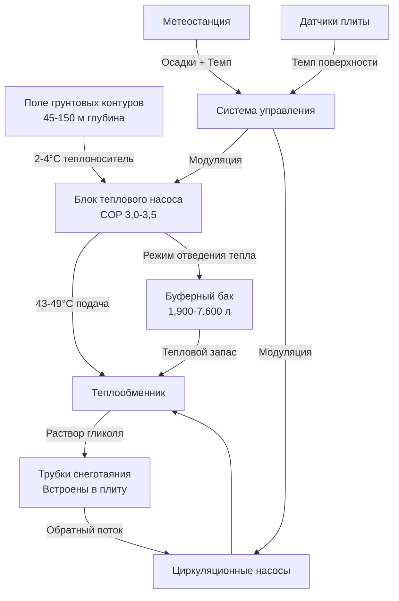

Геотермальные системы извлекают тепловую энергию из земли для обеспечения отопления при снеготаянии. В отличие от обычных источников тепла, которые сжигают топливо или преобразуют электричество непосредственно в тепло, тепловые насосы с источником грунта (GSHP) передают тепло из подземных слоёв, достигая коэффициентов производительности (COP) между 3,0 и 4,5. Это фундаментальное термодинамическое преимущество делает геотермальные системы высокоэффективными для снеготаяния несмотря на значительные капитальные затраты.

## Физические принципы теплообмена с грунтом

Земля поддерживает относительно постоянные температуры ниже линии промерзания, обычно 7-13°C на глубинах 3-6 м в зависимости от географического расположения. Этот стабильный тепловой резервуар обеспечивает устойчивое извлечение тепла на протяжении всей зимы. Теплопередача от грунта к теплоносителю происходит тремя механизмами:

**Теплопроводность** доминирует в непосредственной близости от трубки теплообменника. Теплопроводность окружающего грунта или горной породы (обычно 1,7-4,3 Вт/(м·К)) определяет скорость теплового потока согласно закону Фурье:

$$q = -k A \frac{dT}{dx}$$

где $q$ — скорость теплопередачи, $k$ — теплопроводность, $A$ — площадь поверхности, и $\frac{dT}{dx}$ — температурный градиент.

**Температуропроводность** определяет, насколько быстро профиль температуры грунта реагирует на извлечение тепла. Определяется как:

$$\alpha = \frac{k}{\rho c_p}$$

где $\rho$ — плотность и $c_p$ — удельная теплоемкость. Материалы с высокой температуропроводностью (скала, насыщенный грунт) восстанавливаются быстрее между циклами отопления.

**Движение грунтовых вод** обеспечивает конвективный теплообмен в насыщенных слоях, значительно улучшая емкость теплообмена и позволяя использовать меньшие поля грунтовых контуров.

## Размеры теплового насоса с источником грунта

Мощность GSHP должна удовлетворять как мгновенной нагрузке на снеготаяние, так и учитывать понижение температуры грунта в течение сезона отопления. Требуемая тепловая мощность теплового насоса:

$$Q_{hp} = \frac{Q_{sm}}{1 - \frac{1}{COP}}$$

где $Q_{sm}$ — расчетная нагрузка на снеготаяние (кДж/ч) и $COP$ — коэффициент производительности при расчетных условиях. Для снеготаяния с расчетными нагрузками 473-630 кДж/(ч·м²), температурой поступающей воды 2-4°C, типичные значения COP находятся в диапазоне 3,0-3,5.

Грунтовый контур должен извлекать тепло со скоростью:

$$Q_{ground} = Q_{sm} - \frac{Q_{sm}}{COP} = Q_{sm}\left(1 - \frac{1}{COP}\right)$$

При COP 3,5 грунт должен обеспечить 71% подведенной теплоемкости отопления, остальные 29% обеспечиваются электрическим вводом.

## Варианты конфигурации грунтовых контуров

**Системы с вертикальными скважинами** проникают на глубину 45-150 м с U-образными трубками из полиэтилена высокой плотности, залитыми в отверстия диаметром 10-15 см. Скорости теплоизвлечения зависят от геологии:

| Тип грунта | Скорость извлечения | Теплопроводность |
|-----------|------------------|-----------------|
| Сухой песок/гравий | 63-94 кДж/(ч·м) | 1,7-2,6 Вт/(м·К) |
| Насыщенный песок/гравий | 110-158 кДж/(ч·м) | 2,6-3,5 Вт/(м·К) |
| Скальная основа (гранит) | 158-220 кДж/(ч·м) | 3,5-4,3 Вт/(м·К) |
| Насыщенная глина | 79-126 кДж/(ч·м) | 2,1-3,1 Вт/(м·К) |

Требуемая общая длина скважины:

$$L_{total} = \frac{Q_{ground}}{q_{extract}}$$

где $q_{extract}$ — скорость извлечения на единицу длины. Нагрузка на снеготаяние 1,467 ГДж/ч с COP = 3,5 требует:

$$L_{total} = \frac{1,042 \text{ ГДж/ч}}{142 \text{ кДж/(ч·м)}} = 7,340 \text{ м буровой скважины}$$

Это соответствует примерно 24 скважинам на глубине 90 м, требующим адекватной площади участка и расстояния между скважинами (минимум 4,5-6 м) для предотвращения тепловых помех.

**Горизонтальные грунтовые контуры** прокладываются в траншеях глубиной 1,8-3 м ниже линии промерзания. Требования к площади теплопередачи значительно больше из-за меньшей глубины и большего сезонного изменения температуры. Типичные скорости извлечения 32-48 кДж/(ч·м²) площади грунта делают горизонтальные системы непрактичными для большинства применений при снеготаянии, если только не доступна значительная площадь земли.

**Скважины открытого столба** циркулируют воду непосредственно через скальные образования в открытых или экранированных скважинах. Эти системы достигают 472-788 кДж/(ч·м) скорости извлечения при благоприятной геологии с достаточным потоком грунтовых вод, что резко снижает требуемую длину скважины. Качество воды и нормативные требования к разрешениям являются критически важными факторами.

## Интеграция системы и управление

Теплообменник изолирует закрытый грунтовый контур (вода или водно-гликолевый раствор) от системы распределения для снеготаяния (обычно 25-30% пропиленгликоля). Это предотвращает загрязнение грунтового контура и позволяет независимое управление давлением.

Буферные баки (1,900-7,600 л) обеспечивают тепловую массу, которая снижает циклирование теплового насоса и позволяет системе реагировать на быстрые изменения нагрузки без короткого цикла компрессоров. Емкость бака должна хранить тепловую энергию на 15-30 минут расчетной нагрузки:

$$V_{tank} = \frac{Q_{sm} \times t}{1,864 \times \Delta T}$$

где $V_{tank}$ в литрах, $t$ — время хранения в часах, и $\Delta T$ — используемая разность температур (обычно 5,6-8,3°C).

## Сравнение производительности: Геотермальная vs Обычные системы

| Параметр | Геотермальный GSHP | Газовый котел | Электрическое сопротивление |
|---------|------------------|--------------|---------------------------|
| Эффективность (COP) | 3,0-4,5 | 0,85-0,95 | 1,0 |
| Стоимость эксплуатации (относительная) | 1,0× | 1,8-2,5× | 3,5-4,5× |
| Капитальная стоимость (относительная) | 2,5-3,5× | 1,0× | 0,8-1,0× |
| Частота обслуживания | Низкая | Средняя | Очень низкая |
| Срок службы (грунтовый контур) | 50+ лет | 20-25 лет | 25-30 лет |
| Углеродный след | Очень низкий | Средний | Высокий (зависит от сети) |
| Требования к пространству | Высокие (поле скважин) | Низкие | Низкие |

## Стандарты проектирования и лучшие практики

Стандарт ASHRAE 90.1 требует, чтобы системы снеготаяния включали автоматические средства управления, которые обнаруживают осадки и температуру дорожного покрытия, предотвращая ненужную работу. Для геотермальных систем эта стратегия управления особенно важна, потому что ограниченная тепловая емкость грунтового контура может быть истощена при непрерывной работе.

Рекомендации по проектированию IGSHPA (Международная ассоциация тепловых насосов с источником грунта) указывают:

- Минимальное расстояние 4,5 м между вертикальными скважинами для жилых приложений
- Расстояние 6 м для коммерческого снеготаяния с продленными часами работы
- Максимальное понижение температуры 27,8°C в грунтовых контурах при непрерывной работе
- Тестирование теплопроводности грунтов для систем, превышающих 176 кВт мощности

Скорость циркуляции теплоносителя должна поддерживать турбулентное течение (число Рейнольдса > 4000) для максимизации теплопередачи и предотвращения стратификации:

$$Re = \frac{\rho v D}{\mu}$$

где $v$ — скорость теплоносителя, $D$ — диаметр трубки, и $\mu$ — динамическая вязкость. Для трубки 25-мм HDPE с 30% гликоля при 4°C минимальная скорость составляет примерно 0,61 м/с.

## Экономические соображения

Геотермальные системы снеготаяния требуют в 2,5-3,5 раза больше капитальных инвестиций, чем обычные котельные системы, но предлагают экономию эксплуатационных затрат на 40-60%. Простые периоды окупаемости обычно составляют 10-18 лет в зависимости от местных тарифов на электроэнергию и частоты удаления снега. Однако при интеграции с нагрузками на отопление и охлаждение здания общая инфраструктура грунтовых контуров может снизить дополнительные затраты на 50-70%, что значительно улучшает экономику.

Тепловая стабильность грунтовых контуров и минимальные требования к обслуживанию приводят к затратам жизненного цикла в пользу геотермальных систем для приложений с горизонтом планирования 20+ лет, особенно для учреждений и коммерческих объектов, привержённых целям устойчивого развития.
