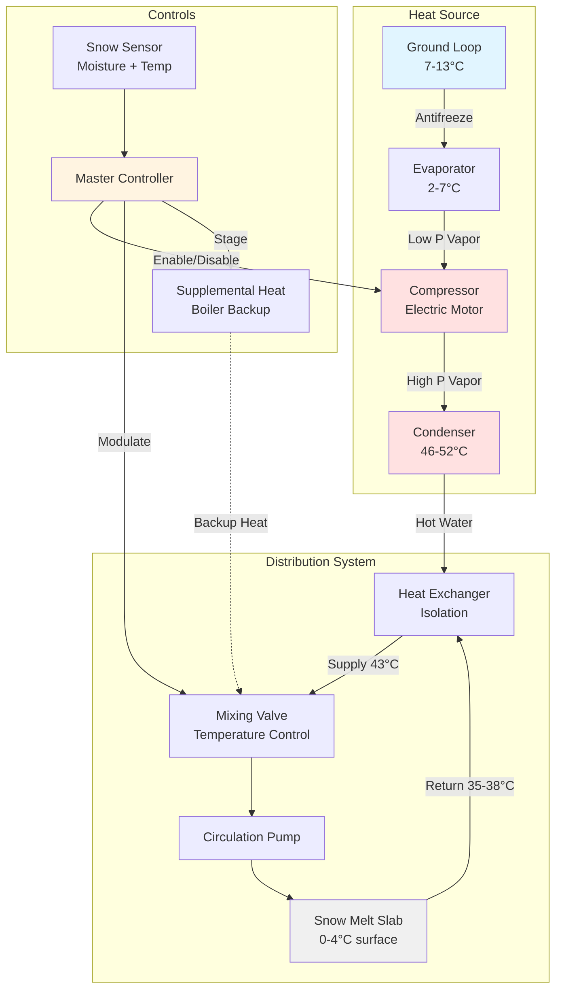

Тепловые насосы передают тепловую энергию от источников с более низкой температурой к приемникам с более высокой температурой, используя механическую работу. Хотя теоретически они привлекательны для применения в системах таяния снега благодаря возможности достижения COP, превышающих единицу, практические ограничения возникают из-за термодинамических ограничений, наложенных низкими наружными температурами, совпадающими с событиями снегопада.

## Основы термодинамики

Производительность теплового насоса принципиально зависит от разницы температур между источником и приемником. COP Карно устанавливает теоретическую максимальную эффективность:

$$\text{COP}_{\text{Carnot}} = \frac{T_{\text{cond}}}{T_{\text{cond}} - T_{\text{evap}}}$$

Где температуры являются абсолютными (Кельвин). Реальные тепловые насосы достигают 40-60% эффективности Карно из-за необратимостей, включая:

- Неэффективность компрессора и потери на трение
- Перепады давления через теплообменники
- Неидеальное поведение хладагента
- Ограничения теплопередачи, требующие разницы температур

Для таяния снега, требующего подачи воды при 43 °C (316 К) из источника окружающей среды при 0 °C (273 К), COP Карно равен 7,3. Реальные системы достигают COP 2,0–2,5 в этих условиях, что представляет 27–34% от теоретического максимума.

## Коэффициент производительности в приложениях таяния снега

Мгновенный COP для тепловых насосов таяния снега следует:

$$\text{COP} = \frac{Q_{\text{delivered}}}{W_{\text{compressor}} + W_{\text{pumps}} + W_{\text{controls}}}$$

Где:
- $Q_{\text{delivered}}$ = тепловая способность, подаваемая в контур таяния снега (кДж/ч)
- $W_{\text{compressor}}$ = электрический ввод компрессора (кДж/ч)
- $W_{\text{pumps}}$ = работа циркуляционного насоса (кДж/ч)
- $W_{\text{controls}}$ = мощность вспомогательного оборудования (кДж/ч)

Для воздушных тепловых насосов эмпирическое снижение COP с температурой наружного воздуха приблизительно следует:

$$\text{COP}(T_{\text{OD}}) = \text{COP}_{8} \times \left(0.6 + 0.031 \times T_{\text{OD}}\right)$$

Где $T_{\text{OD}}$ — температура сухого термометра наружного воздуха (°C) и $\text{COP}_{8}$ — номинальный COP при температуре наружного воздуха 8 °C.

## Воздушные тепловые насосы

Воздушные тепловые насосы извлекают тепловую энергию из наружного воздуха, используя змеевики испарителя с хладагентом. Производительность значительно снижается во время снежных событий, когда тепло наиболее необходимо.

**Снижение емкости и эффективности:**

При температуре наружного воздуха 0 °C воздушные тепловые насосы испытывают:
- Тепловую способность, сниженную до 60–70% от номинальной способности при 8 °C
- COP, уменьшенный с 3,2–3,8 до 2,0–2,5
- Образование инея на наружных змеевиках, требующее циклов оттаивания
- Ограничение температуры подачи воды максимум 43–49 °C

**Влияние цикла оттаивания:**

Когда температура наружного змеевика падает ниже 0 °C и относительная влажность превышает 70%, на поверхностях теплообменника образуется иней. Циклы оттаивания меняют на обратное направление потока хладагента каждые 30–90 минут, прерывая подачу тепла на 5–15 минут. Во время оттаивания:

$$Q_{\text{defrost}} = m_{\text{coil}} \times (h_{\text{ice}} + c_{\text{p,ice}} \times \Delta T)$$

Эта энергия поступает из нагрузки здания или дополнительного электрического сопротивления, эффективно снижая COP системы на 15–25% во время снежных событий.

**Критические ограничения:**

1. **Работа при низких наружных температурах:** Ниже −4 °C большинство воздушных тепловых насосов требуют дополнительного электрического сопротивления, исключая преимущества в эффективности
2. **Сниженная емкость при расчетных условиях:** Когда пиковая нагрузка таяния снега достигает своего максимума, емкость воздушного теплового насоса достигает минимума
3. **Ограничения температуры подачи воды:** Низкие температуры конденсации ограничивают доступную плотность теплового потока
4. **Проблемы надежности:** Накопление льда, перегрузка компрессора и сложность управления увеличивают риск отказа

Воздушные тепловые насосы в целом не пригодны в качестве первичного источника тепла для таяния снега в климатах, требующих активной системы управления снегом. Они могут служить в качестве дополнительного тепла в мягких климатах (климатические зоны ASHRAE 3–4) с редкими снежными событиями.

## Грунтовые тепловые насосы

Грунтовые (геотермальные) тепловые насосы извлекают тепловую энергию из земли, используя стабильные подземные температуры 7–13 °C в течение года на глубине более 5–6 метров.

**Характеристики производительности:**

Грунтовые тепловые насосы поддерживают постоянную производительность независимо от температуры наружного воздуха:
- Диапазон COP: 3,0–4,5 в течение отопительного сезона
- Тепловая способность остается постоянной независимо от снежного события
- Отсутствие циклов оттаивания исключает прерывания производительности
- Более высокие температуры подачи воды (49–54 °C) достижимы
- Срок службы оборудования 20–30 лет превышает 12–15 лет воздушных тепловых насосов

**Теплопередача грунтовой скважины:**

Вертикальные замкнутые системы извлекают тепло через трубопровод U-образной формы в скважинах. Скорость теплопередачи на единицу длины:

$$q_{\text{ground}} = \frac{2\pi k_{\text{soil}} (T_{\text{ground}} - T_{\text{fluid}})}{\ln(r_{\text{b}}/r_{\text{pipe}}) + R_{\text{pipe}} + R_{\text{grout}}}$$

Где:
- $k_{\text{soil}}$ = теплопроводность грунта (кДж/ч·м·°C), обычно 4,3–9,0
- $T_{\text{ground}}$ = невозмущенная температура грунта (°C)
- $T_{\text{fluid}}$ = температура циркулирующей жидкости (°C)
- $r_{\text{b}}$ = радиус скважины (м)
- $r_{\text{pipe}}$ = наружный радиус трубопровода (м)
- $R_{\text{pipe}}$, $R_{\text{grout}}$ = тепловые сопротивления

**Требования к подбору размера:**

Подбор размера грунтовой скважины должен предотвращать прогрессивное снижение температуры грунта в течение нескольких отопительных сезонов. Для приложений таяния снега скорости извлечения 45–60 метров вертикальной скважины на кВт (3,517 кВт) типичны — значительно более консервативны, чем 30–45 метров на кВт, используемые только для отопления зданий.

Общая глубина скважины:

$$L_{\text{total}} = \frac{Q_{\text{peak}} \times (R_{\text{eff}} + R_{\text{borehole}})}{T_{\text{ground}} - T_{\text{EWT,min}}}$$

Где:
- $L_{\text{total}}$ = требуемая общая длина скважины (м)
- $Q_{\text{peak}}$ = пиковая скорость извлечения тепла (кДж/ч)
- $R_{\text{eff}}$ = эффективное тепловое сопротивление грунта (ч·м·°C/кДж)
- $R_{\text{borehole}}$ = тепловое сопротивление скважины (ч·м·°C/кДж)
- $T_{\text{EWT,min}}$ = минимальная входящая температура воды (°C)

**Экономические соображения:**

Установленные затраты на грунтовые тепловые насосы варьируются от 8 000–13 000 руб. за кВт, включая установку грунтовой скважины — в 2,5–4 раза выше, чем обычные котлы. Экономическая целесообразность зависит от:

1. **Коэффициент использования:** Годовые рабочие часы определяют простой период возврата инвестиций
2. **Соотношение стоимости электричества к топливу:** Преимущество COP, умноженное на дифференциал ставок
3. **Срок службы системы:** Амортизация грунтовой скважины на 25+ лет высоких начальных инвестиций
4. **Расходы на техническое обслуживание:** Ниже, чем для оборудования сгорания (нет горелки, дымохода или системы воздуха горения)

Для систем таяния снега, работающих 300–800 часов в год в северных климатах, простой период возврата инвестиций обычно составляет 12–20 лет в зависимости от тарифов на электричество и природный газ.

## Конфигурация системы

Теплообменник изолирует контур конденсации хладагента от системы распределения таяния снега, предотвращая загрязнение хладагента гликолем и позволяя независимый контроль давления.

## Сравнение: воздушные и грунтовые тепловые насосы

| Параметр | Воздушный тепловой насос | Грунтовый тепловой насос |
|-----------|---------------------|------------------------|
| **Отопительный COP при 0 °C** | 2,0–2,5 | 3,5–4,5 |
| **Отопительный COP при −8 °C** | 1,5–2,0 (с оттаиванием) | 3,5–4,5 (стабильно) |
| **Емкость при −8 °C** | 55–65% от номинала | 100% от номинала |
| **Температура подачи воды** | 43–46 °C макс. | 49–54 °C |
| **Циклы оттаивания** | Требуются каждые 30–90 мин | Отсутствуют |
| **Установленная стоимость (руб./кВт)** | 4 000–6 000 | 8 000–13 000 |
| **Коэффициент операционной стоимости** | 1,0× (базовая) | 0,6–0,7× |
| **Срок службы оборудования** | 12–15 лет | 20–25 лет (25+ для скважины) |
| **Интенсивность обслуживания** | Высокая (наружный змеевик, оттаивание) | Низкая (только внутреннее оборудование) |
| **Дополнительное тепло** | Требуется < −4 °C | Только резервное |
| **Деградация производительности** | Серьезная во время снежных событий | Минимальная сезонная вариация |
| **Подходящие климаты** | Только зоны 3–4 | Все климаты |
| **Типичное применение** | Мягкий климат, дополнение | Первичный источник тепла |

## Рекомендации по проектированию систем таяния снега с тепловыми насосами

**Подбор размера емкости:**

Емкость теплового насоса должна удовлетворять пиковую нагрузку при минимальной ожидаемой наружной температуре без дополнительного тепла (GSHP) или с определенным вкладом дополнительного тепла (ASHP). Подбор размера с использованием:

$$Q_{\text{HP}} = \frac{A \times q_{\text{design}} + Q_{\text{piping loss}}}{\text{COP}_{\text{design}}} \times 1,15$$

Коэффициент 1,15 учитывает снижение емкости компрессора и неэффективности системы управления.

**Интеграция буферного резервуара:**

Буферный резервуар между тепловым насосом и контуром таяния снега обеспечивает:
- Тепловую массу, предотвращающую короткие циклы
- Гидравлическое разделение для независимых расходов
- Стратификацию температуры, улучшающую эффективность
- Емкость для обработки переходных скачков нагрузки

Минимальный объем буферного резервуара:

$$V_{\text{buffer}} = \frac{Q_{\text{HP}} \times t_{\text{min cycle}}}{1860 \times \Delta T_{\text{tank}}}$$

Где $t_{\text{min cycle}}$ — 10 минут минимум и $\Delta T_{\text{tank}}$ — 5–8 °C.

**Поэтапное дополнительное тепло:**

Для гибридных систем с резервными котлами расстанавливайте источники тепла в порядке операционной стоимости:

1. **Ступень 1:** Грунтовый тепловой насос работает на максимальную емкость
2. **Ступень 2:** Дополнительный котел включается, когда наружная температура падает ниже точки установки или тепловой насос не может поддерживать температуру подачи
3. **Аварийное состояние:** Котел обеспечивает полную емкость в случае отказа теплового насоса

Управление блокирует источники тепла, предотвращая одновременную работу, если обе не требуются для пиковой нагрузки.

**Обнаружение снега и режим холостого хода:**

Два режима работы оптимизируют потребление энергии:

**Режим холостого хода:**
- Поддерживает температуру плиты на 2–3 °C
- Снижает время отклика с 60–90 минут до 15–30 минут
- Тепловой насос работает периодически при низкой нагрузке
- Рекомендуется для приложений высокого приоритета

**Режим по требованию:**
- Плита охлаждается до температуры окружающей среды между событиями
- Полная емкость теплового насоса применяется при обнаружении снега
- Более низкое потребление энергии, но более медленный отклик
- Приемлемо для некритичных приложений

## Стандарты и справочники по проектированию

ASHRAE Handbook—HVAC Applications, глава 52 устанавливает требования к тепловому потоку в диапазоне 473–787 кДж/ч·м² в зависимости от интенсивности снегопада, скорости ветра и температуры окружающей среды. Подбор размера теплового насоса должен учитывать вариацию COP в этих расчетных условиях.

Для грунтовых систем руководящие принципы IGSHPA (Международная ассоциация грунтовых тепловых насосов) определяют методологию проектирования грунтовой скважины, включая тестирование теплопроводности, концентрацию антифриза и минимальные расстояния разделения скважин.

Стандарт ARI 330 определяет тестирование производительности теплового насоса и условия номинальной мощности. Оборудование, выбранное для таяния снега, должно демонстрировать емкость и эффективность при более низких температурах воды (2–7 °C испарителя, 43–49 °C конденсатора), чем стандартные приложения отопления.

## Практические пределы применения

Тепловые насосы остаются жизнеспособными для таяния снега при определенных условиях:

**Грунтовые тепловые насосы подходят, когда:**
- Стоимость электричества < 2,5× стоимость природного газа (на основе эквивалента ГДж)
- Использование системы превышает 400 часов в год
- Условия грунта благоприятны (адекватная теплопроводность, влажность грунта)
- Экологические соображения благоприятствуют электрическим системам
- Долгосрочная собственность оправдывает капитальные инвестиции

**Воздушные тепловые насосы подходят, когда:**
- Климатическая зона 3–4 с редкими снежными событиями (< 10 событий/год)
- Дополнительное электрическое сопротивление приемлемо
- Ограничения начальной стоимости исключают грунтовые или котельные системы
- Система используется в основном для охлаждения с вторичной функцией таяния снега

**Обе технологии неподходящи, когда:**
- Чрезвычайно низкие температуры окружающей среды (< −18 °C расчетные условия)
- Высокая интенсивность снегопада, требующая теплового потока > 787 кДж/ч·м²
- Критичное время быстрого отклика (< 30 минут для очистки поверхности)
- Тарифы на электричество превышают экономический порог для данного COP

Для большинства коммерческих и учреждений систем таяния снега в северных климатах (климатические зоны ASHRAE 5–7) обычные газовые котлы остаются наиболее экономичным и надежным первичным источником тепла, с грунтовыми тепловыми насосами, зарезервированными для приложений, приоритизирующих снижение операционной стоимости над начальными инвестициями.
