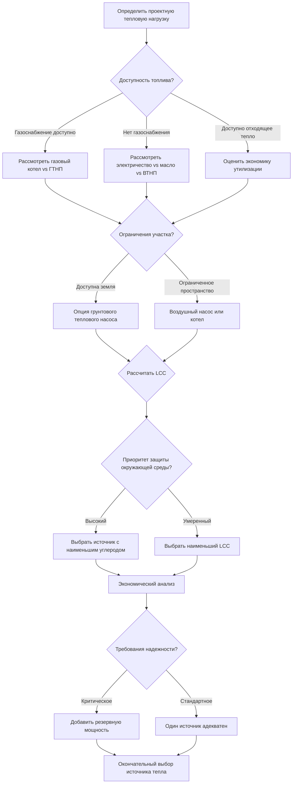

## Методология выбора источника тепла

Выбор источника тепла для систем снеготаяния требует тщательного анализа термодинамической эффективности, экономической целесообразности, наличия топлива и эксплуатационной надежности. Процесс выбора уравновешивает начальные капитальные инвестиции против долгосрочных эксплуатационных расходов, обеспечивая при этом адекватную тепловую мощность во время расчетных условий шторма.

## Фундаментальные требования теплопередачи

Системы снеготаяния должны обеспечивать достаточное количество тепловой энергии для удовлетворения трех одновременно действующих механизмов теплопередачи:

1. **Поток явного тепла** для повышения температуры снега с уровня окружающей среды до 0°C
2. **Скрытая теплота плавления** для преобразования твердого льда в жидкую воду (334 кДж/кг)
3. **Конвективные и радиационные потери** в окружающую среду

Общий требуемый тепловой поток составляет:

$$q_{total} = q_{sensible} + q_{latent} + q_{conv} + q_{rad}$$

Где поток явного тепла при таянии снега:

$$q_{sensible} = \dot{m}_{snow} \cdot c_p \cdot (T_{melt} - T_{air})$$

И требуемое количество скрытого тепла:

$$q_{latent} = \dot{m}_{snow} \cdot h_{fg}$$

Для типичных условий расчета (интенсивность осадков 25 мм/час, температура окружающей среды -18°C), требуемый тепловой поток составляет 1490–2480 Вт/м². Выбор источника тепла должен обеспечивать эту мощность с адекватным запасом безопасности.

## Матрица сравнения источников тепла

| Источник тепла | Тепловая эффективность | Капитальные затраты ($/кВ) | Затраты на эксплуатацию ($/ГДж) | Диапазон регулирования | Время отклика | Срок службы (лет) |
|-------------|-------------------|---------------------|--------------------------|----------------|---------------|------------------|
| Газовый котел | 82-98% | $262-492 | $283-425 | 5:1 до 10:1 | 5-15 мин | 15-25 |
| Электрический котел | 99% | $131-262 | $885-1240 | 10:1 | 2-5 мин | 20-30 |
| Воздушный тепловой насос | COP 1,5-3,0 | $656-1312 | $425-638 | 3:1 | 10-20 мин | 15-20 |
| Грунтовый тепловой насос | COP 3,0-4,5 | $1312-2625 | $283-532 | 4:1 | 10-20 мин | 20-30 |
| Масляный котел | 80-88% | $295-590 | $532-781 | 4:1 | 8-20 мин | 15-20 |
| Утилизация отходящего тепла | 60-90% | $492-1640 | $0-177 | 2:1 | Переменное | 15-25 |
| Солнечная тепловая система | 40-70% | $985-1968 | $0 | N/A | Часы | 15-25 |

## Рамки экономического анализа

Стоимость жизненного цикла источника тепла объединяет капитальные затраты с текущей стоимостью эксплуатационных расходов в течение срока службы системы:

$$LCC = C_{capital} + \sum_{i=1}^{n} \frac{C_{operating,i}}{(1+r)^i}$$

Где:
- $LCC$ = Стоимость жизненного цикла ($)
- $C_{capital}$ = Начальная капитальная стоимость, включая установку ($)
- $C_{operating,i}$ = Годовые эксплуатационные расходы в году $i$ ($/год)
- $r$ = Ставка дисконтирования (десятичная дробь)
- $n$ = Период анализа (лет)

Годовые эксплуатационные расходы включают расход топлива и эффективность:

$$C_{operating} = \frac{Q_{annual}}{\eta_{source}} \cdot C_{fuel}$$

Где:
- $Q_{annual}$ = Годовое требуемое количество тепловой энергии (ГДж/год)
- $\eta_{source}$ = Эффективность источника (десятичная дробь)
- $C_{fuel}$ = Удельная стоимость топлива ($/ГДж)

Для тепловых насосов эффективность выражается как COP (Коэффициент производительности):

$$C_{operating,HP} = \frac{Q_{annual}}{COP \cdot 3.412} \cdot C_{electric}$$

Коэффициент 3.412 конвертирует кДж/Вт·ч для установления эквивалентного потребления электроэнергии.

## Критерии выбора источника тепла

## Пример сравнительного экономического анализа

Рассмотрим систему снеготаяния площадью 929 м² с требуемой пиковой мощностью 580 кВ и годовым потреблением 580 ГДж:

**Газовый котел:**
- Капитальные затраты: $25 000
- Эксплуатационные: 580 ГДж ÷ 0,90 эффективности × $355/ГДж = $2 280/год
- 20-летний LCC при дисконте 4%: $25 000 + $30 860 = $55 860

**Грунтовый тепловой насос:**
- Капитальные затраты: $85 000
- Эксплуатационные: 580 ГДж ÷ (3,5 × 3,412) × $0,12/кВ·ч = $5 800/год
- 20-летний LCC при дисконте 4%: $85 000 + $78 500 = $163 500

**Электрический резистивный котел:**
- Капитальные затраты: $15 000
- Эксплуатационные: 580 ГДж ÷ (1,0 × 3,412) × $0,12/кВ·ч = $20 400/год
- 20-летний LCC при дисконте 4%: $15 000 + $276 400 = $291 400

Этот анализ демонстрирует, что несмотря на более высокие капитальные затраты, газовые котлы обычно предлагают наименьшую стоимость жизненного цикла в регионах с газоснабжением, в то время как электрическое сопротивление несет запретительные эксплуатационные расходы несмотря на низкие начальные инвестиции.

## Критические факторы выбора

**Запас тепловой мощности**

Источники тепла должны обеспечивать 115–125% расчетной нагрузки для учета:
- Потерь тепла в распределительной системе (10–15%)
- Снижения производительности при экстремальных условиях окружающей среды
- Требований для будущего расширения

**Модуляция и диапазон регулирования**

Снеготаяние работает прерывисто. Источники тепла с высоким диапазоном регулирования (10:1) поддерживают эффективность при частичных нагрузках, которые представляют 70–80% часов работы.

**Время отклика**

Быстрое развитие шторма требует источников тепла, способных достичь полной мощности в течение 15–30 минут. Электрическое и газовое оборудование реагирует быстрее, чем тепловые насосы, циклирующие из режима ожидания.

**Надежность топливоснабжения**

Критические приложения (аварийный доступ в больницы, площадки пожарных станций) требуют либо двухтопливной способности, либо хранилища топлива на месте для обеспечения работы во время перебоев в коммунальных услугах.

## Соображения по охране окружающей среды

Интенсивность углерода значительно варьируется в зависимости от источников тепла:

- **Природный газ:** 53 кг CO₂/ГДж
- **Электричество (среднее по сети):** 68–91 кг CO₂/ГДж эквивалента
- **Тепловой насос (электрический):** 18–32 кг CO₂/ГДж эквивалента
- **Масло:** 73 кг CO₂/ГДж
- **Утилизация отходящего тепла:** 0–9 кг CO₂/ГДж

Регионы с электросетями, основанными на возобновляемых источниках (гидроэнергия, ветер, солнце), отдают предпочтение решениям с тепловыми насосами как с точки зрения затрат, так и с точки зрения углерода.

## Стратегии гибридных систем

Оптимальная экономика часто достигается за счет гибридных конфигураций:

1. **Базовая нагрузка теплового насоса + пиковый котел:** Минимизирует эксплуатационные расходы при обеспечении мощности
2. **Солнечная тепловая система + вспомогательный котел:** Снижает годовое потребление топлива на 30–50%
3. **Утилизация отходящего тепла + резервное электричество:** Использует бесплатную энергию с гарантированной поддержкой

Гибридные системы требуют сложного управления для оптимизации этапности источника на основе эффективности в реальном времени и стоимости топлива.

## Заключение

Выбор источника тепла для систем снеготаяния требует комплексного анализа, интегрирующего термодинамические принципы, экономическое моделирование и эксплуатационные требования. Газовые котлы обеспечивают доказанную надежность и благоприятную экономику в большинстве приложений, в то время как тепловые насосы предлагают превосходную эффективность в мягком климате или регионах с возобновляемой энергией. Критические установки получают выгоду от резервных или двухтопливных конфигураций, которые гарантируют тепловую доступность независимо от внешних условий.
