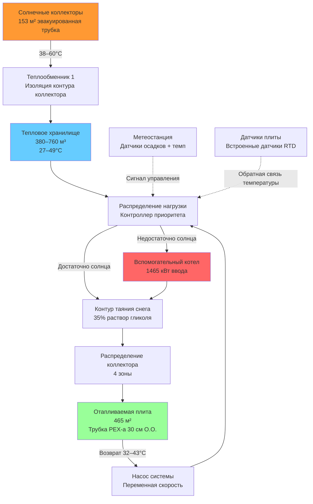

Солнечные тепловые системы для таяния снега сталкиваются с фундаментальной проблемой—пиковый спрос на тепло возникает именно в момент минимальной солнечной радиации. Снежные события обычно совпадают с облачными условиями, ночью или низкими солнечными углами, которые серьёзно ограничивают потенциал сбора. Несмотря на это временное несовпадение, интеграция солнечной тепловой энергии предоставляет ценность через предварительное нагревание, режим холостого хода и системы теплового хранилища, которые перемещают собранную энергию во времени.

## Фундаментальный энергетический баланс

Солнечные тепловые коллекторы захватывают радиацию и преобразуют её в чувствительное тепло в жидкой среде. Мгновенная скорость сбора энергии следует следующему уравнению:

$$Q_{collect} = A_c \times G_t \times \eta_{coll} \times \tau \times \alpha$$

Где:
- $Q_{collect}$ = собранная тепловая энергия (кДж/ч)
- $A_c$ = валовая площадь коллектора (м²)
- $G_t$ = общая падающая солнечная радиация (кДж/ч·м²)
- $\eta_{coll}$ = эффективность коллектора (безразмерная)
- $\tau$ = пропускание остекления
- $\alpha$ = поглощаемость пластины абсорбера

Эффективность коллектора снижается с температурным дифференциалом между жидкостью и окружающей средой:

$$\eta_{coll} = \eta_0 - \frac{U_L \times (T_f - T_a)}{G_t}$$

Где:
- $\eta_0$ = оптическая эффективность (0,65–0,75 плоский коллектор, 0,70–0,80 эвакуированная трубка)
- $U_L$ = общий коэффициент теплопотерь (кДж/ч·м²·°C)
- $T_f$ = средняя температура жидкости (°C)
- $T_a$ = температура окружающей среды (°C)

Зависящая от температуры эффективность показывает, почему эвакуированные трубчатые коллекторы превосходят плоские конструкции при зимней эксплуатации—их превосходная изоляция (вакуум) снижает $U_L$ с 4,5–6,8 кДж/ч·м²·°C до 1,1–2,3 кДж/ч·м²·°C.

## Технологии коллекторов

**Плоские коллекторы:**
- Медная пластина абсорбера с селективным покрытием (α = 0,95, ε = 0,10)
- Одинарное или двойное остекление (стекло или полимер)
- Изолированная спина и края (RSI 1,8–3,5)
- Валовая эффективность: 40–60% при типичных условиях эксплуатации
- Выход: 63–95 МДж/день на 9,3 м² площади коллектора
- Более низкая стоимость, но худшая производительность в холодную погоду
- Эффективны в климатах с умеренными зимними температурами

**Эвакуированные трубчатые коллекторы:**
- Отдельные стеклянные трубки с вакуумом между внутренней и внешней стенками
- Пластина абсорбера или теплопроводящая трубка в вакуумированном пространстве
- Прямой поток или тепловой трубопровод для теплопередачи
- Валовая эффективность: 50–70% при типичных условиях эксплуатации
- Выход: 95–127 МДж/день на 9,3 м² площади коллектора
- Превосходная производительность при высоких температурных дифференциалах
- Сохраняет эффективность в холодных ветреных условиях
- Премиум-цена оправдана для применения таяния снега

Сертификация производительности следует стандарту SRCC Standard 100 (Solar Rating and Certification Corporation), который устанавливает кривые эффективности коллектора посредством стандартизированного тестирования.

## Стратегии интеграции системы

Солнечные тепловые системы для таяния снега работают в трёх основных режимах:

**Предварительный нагрев режима холостого хода:**
Поддерживает раствор антифриза выше температуры замерзания между снежными событиями. Требуемая нагрузка отопления:

$$Q_{idle} = \frac{A_{slab} \times U_{slab} \times (T_{slab} - T_a)}{1000}$$

Типичные требования холостого хода: 47–79 кДж/ч·м² при температурах наружного воздуха −7–0°C и целевой температуре плиты 2–4°C. Солнечные коллекторы могут удовлетворить эту скромную нагрузку в светлое время суток, снижая потребление вспомогательной энергии на 40–60% в солнечном климате.

**Активное таяние снега:**
Во время осадков тепловой поток таяния снега достигает 473–787 кДж/ч·м² согласно процедурам проектирования ASHRAE. Солнечный вклад при активном таянии остаётся незначительным—облачные условия снижают падающую радиацию до 158–316 кДж/ч·м², что даёт выход коллектора 63–189 кДж/ч·м² при температурах жидкости, необходимых для таяния (38–49°C). Вспомогательное отопление обеспечивает остаток.

**Восстановление после бури:**
После прекращения снегопада солнечная радиация часто увеличивается по мере прояснения неба. Коллекторы, работающие с эффективностью 60–70%, могут ускорить окончательное таяние и восстановить тепловую ёмкость массы плиты.

## Интеграция теплового хранилища

Сезонное тепловое хранилище резко улучшает солнечную долю, разделяя сбор и спрос. Хранилище на водной основе обеспечивает высокую удельную теплоёмкость (4,18 кДж/кг·°C) и низкую стоимость.

Определение размера объёма хранилища:

$$V_{storage} = \frac{Q_{seasonal} \times SF}{\rho \times c_p \times \Delta T \times \eta_{storage}}$$

Где:
- $V_{storage}$ = объём резервуара хранилища (л)
- $Q_{seasonal}$ = общее сезонное требование по отоплению (кДж)
- $SF$ = целевая солнечная доля (0,30–0,50 реалистично)
- $\rho$ = плотность воды (1000 кг/м³)
- $c_p$ = удельная теплоёмкость воды (4,18 кДж/кг·°C)
- $\Delta T$ = качание температуры хранилища (22–33°C типично)
- $\eta_{storage}$ = эффективность хранилища с учётом потерь в режиме ожидания (0,85–0,95)

Практическая реализация требует 1900–5700 л хранилища на 93 м² отапливаемой площади. Изоляция (RSI 3,5 минимум) снижает потери в режиме ожидания менее 2% в сутки при −1°C окружающей температуре.

## Расчёт солнечной доли

Солнечная доля представляет долю годовой нагрузки отопления, обеспеченную солнечным сбором:

$$SF = \frac{Q_{solar,delivered}}{Q_{load,annual}} = 1 - \frac{Q_{auxiliary}}{Q_{load,annual}}$$

Методы оценки:

**Метод F-Chart:**
Эмпирическая корреляция, разработанная для систем солнечного отопления, требует месячных данных радиации и нагрузок отопления. Входные параметры включают площадь коллектора, эффективность, ориентацию, объём хранилища и профиль нагрузки. Производит оценки месячной и годовой солнечной доли с точностью ±10%.

**Упрощённое приближение:**
Для предварительного расчёта без детального моделирования:

$$SF \approx 0,15 \times \frac{A_c \times 95}{Q_{seasonal}}$$

Где 95 МДж/день представляет среднее зимнее сбор на 9,3 м² эвакуированного трубчатого коллектора при благоприятной ориентации (южная сторона, угол наклона = широта + 15°).

Реалистичная солнечная доля для применения таяния снега:
- Без хранилища: 10–20%
- С оптимизированным хранилищем: 30–50%
- Гибридный геотермальный-солнечный: 40–60%

## Определение размера массива коллектора

Процедура расчёта для дополнительного солнечного отопления:

1. Определите общее сезонное требование по отоплению из расчётов таяния снега ASHRAE
2. Установите целевую солнечную долю (необходима экономическая оптимизация)
3. Выберите тип коллектора на основе климата и рабочих температур
4. Рассчитайте требуемую площадь коллектора:

$$A_c = \frac{Q_{seasonal} \times SF}{\eta_{avg} \times H_{seasonal}}$$

Где:
- $\eta_{avg}$ = средняя сезонная эффективность коллектора (0,40–0,50)
- $H_{seasonal}$ = общая сезонная солнечная радиация на плоскости коллектора (МДж/м²)

5. Убедитесь в пиковой мощности сбора по сравнению с требованиями холостого хода
6. Определите размер теплового хранилища, если требуется временной сдвиг нагрузки

Пример расчёта для площади 465 м²:
- Сезонная нагрузка: 190 ГДж (рассчитана методом ASHRAE)
- Целевая солнечная доля: 35%
- Эвакуированные трубчатые коллекторы, η_avg = 0,45
- Сезонная радиация (южная сторона, наклон 45°): 895 МДж/м²
- Требуемая площадь коллектора: (190 × 0,35) / (0,45 × 895) = 153 м²
- Объём хранилища (качание 33°C): (190 × 0,35) / (1000 × 4,18 × 33 × 0,90) = 530 м³

Это большое требование хранилища иллюстрирует экономическую проблему—капитальные затраты обычно превышают пороги простой окупаемости, если коллекторы не служат двойным целям (горячее водоснабжение, отопление здания).

## Гибридный проектный дизайн

## Сравнение производительности

| Параметр | Только солнечное | Солнце + хранилище | Гибрид солнце + котел | Обычный котел |
|-----------|-------------------|-----------------|----------------------|---------------------|
| Солнечная доля | 10–20% | 30–50% | 30–50% | 0% |
| Площадь коллектора (на 93 м²) | 28–37 м² | 28–37 м² | 23–33 м² | 0 м² |
| Объём хранилища | Нет | 380–1140 м³ | 38–190 м³ | Нет |
| Начальная стоимость (465 м²) | €64 000 | €109 000 | €79 000 | €26 000 |
| Годовая стоимость эксплуатации | €1 050 | €600 | €675 | €1 650 |
| Время отклика | Недостаточно | Медленно (2–4 часа) | Быстро (20–40 мин) | Быстро (15–30 мин) |
| Надёжность | Плохая (зависит от погоды) | Умеренная | Отличная | Отличная |
| Техническое обслуживание | Умеренное | Умеренно-высокое | Умеренно-высокое | Низко-умеренное |
| Выбросы CO₂ (кг/год) | 1 270 | 725 | 815 | 3 850 |

Предположения: природный газ €0,88/м³, электричество €0,10/кВч, эффективность котла 85%, сезонная нагрузка 190 ГДж.

## Стандарты проектирования и руководящие принципы

**ASHRAE Handbook—HVAC Applications, Chapter 52:**
- Расчёты теплового потока таяния снега
- Уровни проектного снегопада и условия окружающей среды
- Стратегии управления системой

**ASHRAE Standard 90.1:**
- Требования минимальной эффективности для вспомогательного отопительного оборудования
- Положения управления и расписания отключения

**SRCC Standard 100:**
- Процедуры испытания и рейтинга солнечного коллектора
- Сертификация кривой эффективности
- Испытание долговечности и надёжности

**IGSHPA Design Standards:**
- Руководящие принципы интеграции для гибридных систем солнце-геотермия
- Проектирование теплового хранилища скважины

**Местные нормативы:**
- Требования сосудов под давлением для теплового хранилища
- Концентрация гликоля и предотвращение обратного потока
- Разрешения электричества и сантехники для солнечных систем

## Экономические соображения

Системы солнечного теплового таяния снега сталкиваются с серьёзными экономическими препятствиями:

**Капитальные затраты:**
- Коллекторы: €30–52/м² смонтировано (эвакуированная трубка)
- Тепловое хранилище: €1,50–3,75/л смонтировано
- Элементы управления и интеграция: €6 000–11 000
- Полная премия системы: €45 000–82 000 выше обычной для применения 465 м²

**Сбережения при эксплуатации:**
- Снижение стоимости топлива: €600–1 200 в год (30–50% солнечная доля)
- Техническое обслуживание: Аналогично обычным системам
- Простая окупаемость: 40–75 лет (только таяние снега)

**Улучшенная экономика:**
Использование в течение всего года резко улучшает жизнеспособность. Системы двойного назначения, служащие таянию снега плюс горячему водоснабжению, подогреву бассейна или отоплению помещения здания, достигают периодов окупаемости 8–15 лет с доступными стимулами.

Федеральные налоговые вычеты (26% жилой, 10% коммерческий по состоянию на 2024 год) и скидки штата/коммунальных служб снижают эффективную первоначальную стоимость на 20–40% во многих юрисдикциях.

## Соображения по установке

**Ориентация коллектора:**
- Азимут: Направление на юг оптимально (±15° приемлемо)
- Угол наклона: Широта + 15° максимизирует зимний сбор
- Анализ затенения критичен—10% затенение снижает выход на 30–40%

**Защита от замерзания:**
- Раствор пропиленгликоля (35–50% концентрация) в контуре коллектора
- Тепловой трос для открытых трубопроводов в экстремальном климате
- Системы слива исключают гликоль, но увеличивают сложность

**Защита системы:**
- Предохранительные клапаны (207 кПа типично контур коллектора)
- Ограничители высокой температуры предотвращают повреждение застоя (>177°C)
- Обратные клапаны предотвращают термосифонирование ночью
- Расширительные баки размещают изменения объёма жидкости

**Конструкционные требования:**
- Коллекторы на крыше: 0,19–0,29 кПа собственный вес плюс сопротивление поднятию ветра
- Наземные массивы: Бетонные опоры или спиральные анкеры
- Соображения сброса снега для наклона коллектора и расстояния

Солнечные тепловые системы представляют возобновляемый опцион отопления для применения таяния снега, но редко достигают автономной жизнеспособности. Интеграция с тепловым хранилищем и вспомогательными источниками отопления в сочетании с использованием в течение всего года обеспечивает наиболее практичный путь реализации. Географическое местоположение, доступный солнечный ресурс и стоимость топлива определяют экономическую целесообразность на основе проекта.
