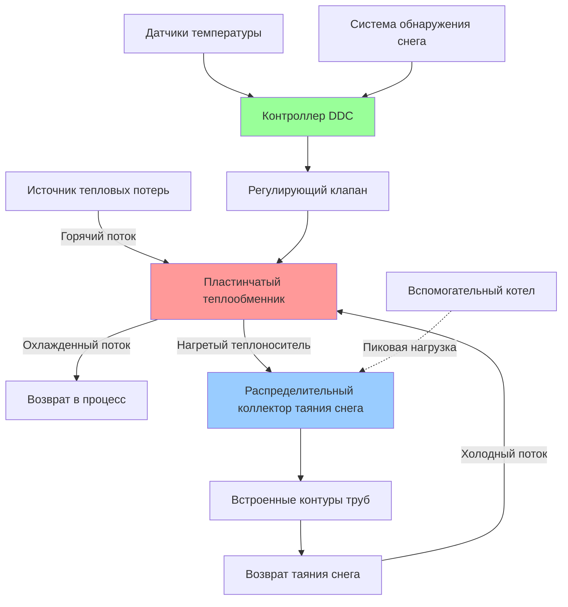

## Основные принципы утилизации тепловых потерь для таяния снега

Утилизация тепловых потерь для таяния снега представляет оптимальное применение низкопотенциальной тепловой энергии, которая в противном случае отводилась бы в атмосферу. Периодический характер нагрузок на таяние снега хорошо согласуется с непрерывным промышленным отводом тепла, создавая экономически целесообразное использование тепловых потоков, типично находящихся в диапазоне от 40°C до 95°C.

Фундаментальный принцип включает захват явного или скрытого тепла из технологических потоков и его передачу в теплоносителю контура таяния снега через теплообменники. Термодинамическая эффективность зависит от поддержания температурного перепада, эффективности теплообменника и гидравлического проектирования системы.

## Категории источников тепловых потерь

### Отвод тепла из промышленных технологических процессов

Производственные предприятия, электростанции и объекты химической обработки непрерывно отводят тепло через системы охлаждающей воды, конденсаторные контуры и выхлопные потоки. Ключевой параметр конструирования — это согласованность доступности теплоты относительно спроса на таяние снега.

**Доступная тепловая мощность из технологического потока:**

$$Q_{доступное} = \dot{m} \cdot c_p \cdot (T_{вх} - T_{вых})$$

Где:
- $Q_{доступное}$ = доступная тепловая мощность (Вт)
- $\dot{m}$ = массовый расход потока тепловых потерь (кг/с)
- $c_p$ = удельная теплоёмкость (Дж/кг·К)
- $T_{вх}$ = температура входа потока тепловых потерь (К)
- $T_{вых}$ = минимально допустимая температура на выходе (К)

### Тепловой отвод центров обработки данных

Центры обработки данных обеспечивают исключительный источник тепловых потерь благодаря круглогодичной работе и предсказуемому тепловыделению. Системы охлаждения серверов типично отводят тепло при 30°C до 45°C через блоки CRAC (кондиционирование воздуха в компьютерном помещении) или контуры прямого жидкостного охлаждения.

Для центра обработки данных с ИТ-нагрузкой $P_{ИТ}$ и коэффициентом эффективности использования энергии (PUE) общий отвод тепла:

$$Q_{отвод} = P_{ИТ} \cdot PUE$$

Доля, подлежащая утилизации для таяния снега, зависит от конструирования теплообменника и требований по повышению температуры для системы таяния снега.

### Системы теплоэлектроцентралей (ТЭЦ)

Установки ТЭЦ отводят значительное количество тепла через охлаждение рубашки двигателя, утилизацию тепла выхлопа и охлаждение генератора. Эти источники работают непрерывно, обеспечивая базовую тепловую энергию для таяния снега с пиковым дополнением от вспомогательных котлов.

Охлаждение рубашки двигателя типично обеспечивает воду при 85°C до 95°C, идеально подходящую для прямой интеграции с системой таяния снега с минимальным снижением температуры.

## Конструкционные соображения теплообменников

Эффективность утилизации тепловых потерь критически зависит от выбора и расчёта теплообменника. Для приложений таяния снега пластинчатые теплообменники доминируют благодаря компактным размерам и высокой эффективности.

**Эффективность теплообменника:**

$$\varepsilon = \frac{Q_{фактическое}}{Q_{макс}} = \frac{C_{мин}(T_{г,вх} - T_{г,вых})}{C_{мин}(T_{г,вх} - T_{х,вх})}$$

Где:
- $\varepsilon$ = эффективность теплообменника (безразмерная)
- $C_{мин}$ = минимальная тепловая мощность между горячим и холодным потоками (Вт/К)
- $T_{г,вх}$, $T_{г,вых}$ = температуры входа и выхода горячего потока (К)
- $T_{х,вх}$ = температура входа холодного потока (К)

Целевая эффективность для систем утилизации тепла при таянии снега: 0,70 до 0,85.

**Требуемая площадь теплообменника методом NTU:**

$$NTU = \frac{UA}{C_{мин}}$$

$$\varepsilon = \frac{1 - e^{-NTU(1-C_r)}}{1 - C_r \cdot e^{-NTU(1-C_r)}}$$

Где $C_r = C_{мин}/C_{макс}$ — коэффициент тепловой мощности.

## Сравнение источников тепловых потерь

| Тип источника | Диапазон температур | Доступность | Тип теплообменника | Сложность интеграции |
|---------------|-------------------|------------|-------------------|----------------------|
| CRAC центра данных | 30°C - 45°C | Непрерывно | Пластинчатый ТО | Низкая |
| Вода рубашки ТЭЦ | 85°C - 95°C | Непрерывно | Пластинчатый ТО | Средняя |
| Охлаждающая вода промышленности | 40°C - 70°C | Непрерывно | Кожухотрубный / Пластинчатый | Средняя |
| Конденсатор холодильной машины | 35°C - 50°C | Непрерывно | Паяный пластинчатый ТО | Низкая |
| Экономайзер котла | 90°C - 150°C | Сезонно | Кожухотрубный | Высокая |
| Технологический конденсат | 60°C - 100°C | Переменно | Пластинчатый ТО | Средняя |

## Архитектура интеграции системы

## Оценка экономической целесообразности

Экономическая целесообразность утилизации тепловых потерь для таяния снега зависит от:

1. **Избежанная стоимость энергии**: Стоимость топлива или электроэнергии, замещаемой утилизацией тепловых потерь
2. **Дифференциал капитальных затрат**: Дополнительная стоимость теплообменника и трубопровода по сравнению с отдельным котлом
3. **Часы эксплуатации**: Годовые часы спроса на таяние снега
4. **Близость источника тепла**: Расстояние трубопровода влияет на капитальные и насосные затраты

**Расчёт простого периода окупаемости:**

$$PB = \frac{C_{капитал,доп}}{E_{годовое} \cdot c_{энергия}}$$

Где:
- $PB$ = простой период окупаемости (лет)
- $C_{капитал,доп}$ = дополнительные капитальные затраты на утилизацию тепловых потерь ($)
- $E_{годовое}$ = годовая утилизированная энергия (кВт·ч/год)
- $c_{энергия}$ = стоимость энергии ($/кВт·ч)

Типичные периоды окупаемости: 2 до 6 лет в зависимости от температуры источника тепловых потерь и его близости.

## Проектные стандарты и рекомендации

- **Справочник ASHRAE - HVAC приложения**: Глава по системам таяния снега и защиты от замерзания включает соображения по утилизации тепловых потерь
- **Стандарты проектирования IDSA**: Определяют минимальные подходовые температуры и критерии расчёта теплообменников
- **ASME раздел VIII**: Код сосудов под давлением для теплообменников в высокотемпературных приложениях
- **Стандарт AHRI 400**: Оценка характеристик жидкостных теплообменников

## Оптимизация стратегии управления

Системы утилизации тепловых потерь требуют передовых средств управления для регулирования переменной доступности тепловых потерь против периодического спроса на таяние снега:

1. **Приоритетное секвенирование**: Тепловые потери как первичный источник, вспомогательный котел как вторичный
2. **Сброс температуры**: Модулирование температуры подачи для таяния снега на основе интенсивности осадков
3. **Тепловое накопление**: Резервуары теплового аккумулирования сглаживают несоответствие между доступностью тепловых потерь и спросом на таяние снега
4. **Управление байпасом**: Предотвращение чрезмерного охлаждения потока тепловых потерь ниже требований процесса

Логика управления должна поддерживать минимальную температуру возврата потока тепловых потерь, чтобы предотвратить нарушение процесса, максимизируя при этом утилизацию тепловой энергии.

## Интеграция теплового аккумулирования

Когда доступность тепловых потерь превышает мгновенный спрос на таяние снега, тепловое аккумулирование расширяет полезность системы:

**Требуемый объём резервуара для операции с временным смещением:**

$$V_{аккум} = \frac{Q_{избыток} \cdot t_{аккум}}{\rho \cdot c_p \cdot \Delta T}$$

Где:
- $V_{аккум}$ = объём резервуара аккумулирования (м³)
- $Q_{избыток}$ = избыточная тепловая мощность (Вт)
- $t_{аккум}$ = длительность аккумулирования (с)
- $\rho$ = плотность теплоносителя (кг/м³)
- $\Delta T$ = допустимый температурный перепад в аккумуляции (К)

Стратифицированные резервуары с температурным дифференциалом 15°C до 25°C обеспечивают оптимальное функционирование для приложений таяния снега.

---

**Инженерный вывод**: Утилизация тепловых потерь для таяния снега превращает операционные расходы (отвод тепла) в активы (свободная тепловая энергия) с периодами окупаемости, которые обосновывают реализацию в большинстве промышленных, учреждческих и коммерческих приложений с подходящими источниками тепловых потерь в пределах 100 метров от зон таяния снега.
